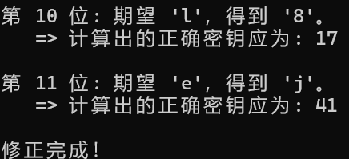
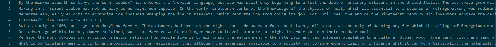
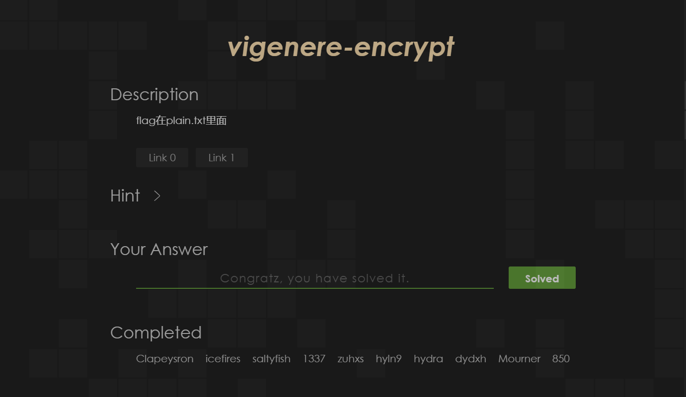
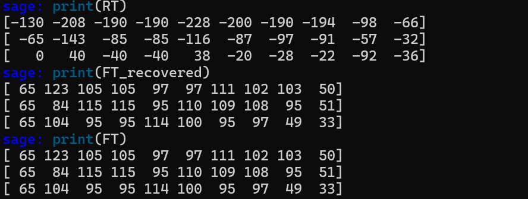
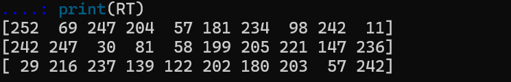
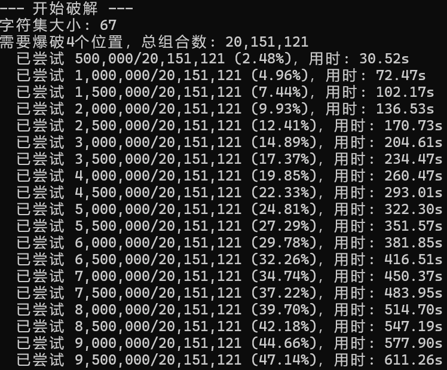
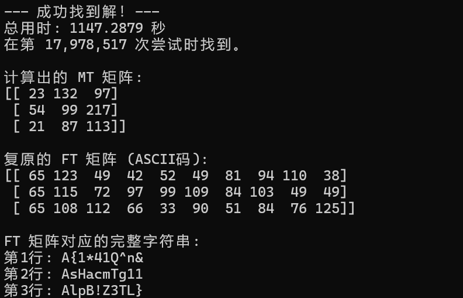

# Crypto Lab1：消息加密和数字签名

# 1 Task Vigenere

尝试先爆破密钥长度，即重复字母相隔固定长度的更有可能是密钥长度，由于枚举范围是有限的，所以这步得到密钥长度还是相对简单的，附件包含`declen.py`​

```python
    for length in range(min_len, max_len + 1):
        coincidences = 0
        for i in range(len(cipher_text) - length):
            if cipher_text[i] == cipher_text[i + length]:
                coincidences += 1        
        coincidence_counts[length] = coincidences
        print(f"测试长度 {length}: 发现 {coincidences} 次重合")
    if not coincidence_counts:
        print("\n分析完成，但没有找到任何重合。")
        return
    most_likely_length = max(coincidence_counts, key=coincidence_counts.get)
    max_coincidences = coincidence_counts[most_likely_length]
```


第二步爆破密钥，这里假设明文中最高频的字母是`e`​，同时每隔29位枚举每位最高频的密文，来推断出初步的密文，得到初版密文`[12, 14, 28, 90, 91, 43, 17, 82, 48, 70, 71, 95, 89, 94, 60, 80, 58, 72, 30, 43, 21, 50, 37, 6, 36, 39, 48, 52, 65]`​，附件包含`deckey.py`​


第三步对密钥做出调整，用初步的密钥考虑解密文本，这里把输出结果1-29位为一排，且用不同颜色标注，这样可以比较直观地看出哪一位的密钥出了问题，考虑到我们上步中因为把每位的最高频字母都假设`e`​，结果也是初具人形但不多


好在还是找到了一些线索，比如注意到`6-9`​位应该是正确的，对于处在其中的单词`peop8j`​容易推出原文是`people`​，为减轻工作量又写了一个脚本`invert.py`​，它的职责是帮我们找出正确的密钥

```python
def find_correct_key(wrong_key, wrong_decrypted_char, correct_plain_char):
    wrong_decrypted_index = text_list.find(wrong_decrypted_char)
    correct_plain_index = text_list.find(correct_plain_char)
    cipher_index = (wrong_decrypted_index * wrong_key) % MODULUS
    correct_key = -1
    for k_candidate in range(1, MODULUS):
        if (correct_plain_index * k_candidate) % MODULUS == cipher_index:
            correct_key = k_candidate
            break            
    return correct_key
```

它的输出大概是这样的，由此我们一位位地进行修正，得到了最终版本的密钥`[51, 14, 22, 90, 67, 43, 17, 82, 48, 17, 41, 33, 89, 94, 60, 80, 13, 72, 79, 18, 65, 50, 20, 6, 36, 39, 56, 7, 65]`​，附件包含`invert.py`​



最后具有人形的文本是这样的（TOEFl），得到最终flag`AAA{i_like_T0ef1_v3ry_M3uh!!!}`​，附件包含`decrypted_plain.txt`​




通过截图如下



# 2 Challenges&bonus

## 2.1 HSC

随机生成MT矩阵，并求其逆矩阵

```python
R = QQ # 定义环
MT = None
while True:
    temp_MT = random_matrix(R, 3, 3)
    if temp_MT.is_invertible():
        MT = temp_MT
        break
MT_inv = MT.inverse()
print(MT)
print(MT_inv)
```


随机设置flag生成FT，计算RT，再通过RT和MT求出FT的值，和原FT进行比对

```python
R=QQ
flag = "AAA{This_is_a_random_flag_123!}"
FT = matrix(R, 3, 10)
for i in range(3):
    for j in range(10):
        FT[i, j] = ord(flag[i + j * 3])
RT=MT*FT
FT_recovered = MT_inv * RT
print(RT)
print(FT_recovered)
print(FT)
```



前置任务结束，开始入手题目，先把RT矩阵还原出来

```python
R = Zmod(256)
result_bytes = b'\xfc\xf2\x1dE\xf7\xd8\xf7\x1e\xed\xccQ\x8b9:z\xb5\xc7\xca\xea\xcd\xb4b\xdd\xcb\xf2\x939\x0b\xec\xf2'
byte_values = [byte for byte in result_bytes]

RT = matrix(R, 3, 10)
k = 0
for j in range(10):
    for i in range(3):
        RT[i, j] = byte_values[k]
        k += 1
print(RT)
```



注意到对于$FT$我们实际上有5个已知位置，25个未知位置，同时对于$MT$y有9个未知位置，即34个未知数，但只有30个标量方程，因此不能直接得到唯一解。但是，考虑到flag的特性，每个位置的字符候选是有限的，为破解提供了可能性，想法是缩减讨论的可能到暴力破解可能的程度。

继续分析，我们已知 `FT`​ 的第1列是完整的。为了求解 `MT`​，我们还需要两个完整的、且与 `ft_1`​ 线性无关的列向量。`FT`​ 的第2列（`ft_2`​）已知一个元素，未知两个。`FT`​ 的第10列（`ft_10`​）也已知一个元素，未知两个，因此只需要爆破这4个未知字符。因此设计这样的爆破流程:

- 遍历 `FT(2,2)`​ 和 `FT(3,2)`​ 的所有可能字符组合；遍历 `FT(1,10)`​ 和 `FT(2,10)`​ 的所有可能字符组合。

- 对于每一种组合，我们现在都有了完整的 `ft_1`​, `ft_2`​, `ft_10`​。构建 3$\times$3 矩阵$FT_{sub}=[ft_1|ft_2|ft_{10}]$​。

- 计算 $FT_{sub}$​​ 在模256下的逆矩阵 $(FT)^{-1}$​。如果不可逆（即其行列式为偶数），则说明这个组合是错的，跳过。
- 提取 `RT`​ 对应的列 $RT_{sub}=[rt_1|rt_2|rt_{10}]$，计算候选矩阵$MT_{cand}=RT_{sub}\cdot(FT_{sub})^{-1}pmod 256$

- 计算候选 `MT`​ 的逆矩阵 $(MT_{cand})^{-1}$。如果不可逆，则该 `MT`​ 无效，跳过。
- 计算完整的候选$FT_{cand}=(MT_{cand})^{-1}\cdot RT pmod 256$。
-  a. 检查计算出的 FT\_cand 在5个已知位置上的值是否与我们一开始就知道的值完全相符。

  b. 检查计算出的 FT\_cand 中所有其他25个位置的值，是否都在给定的字符集的ASCII范围内。

爆破预计时间在可以控制的范围内，可行



暴力破解成功得到flag`AAA{sl1Hp*aB4c!1mZQT3^gTn1L&1}`​



题目通过截图


‍
