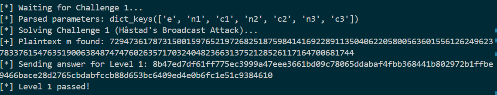
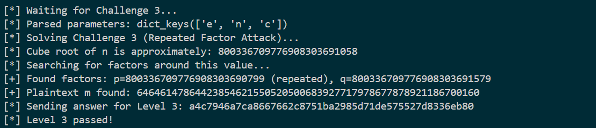
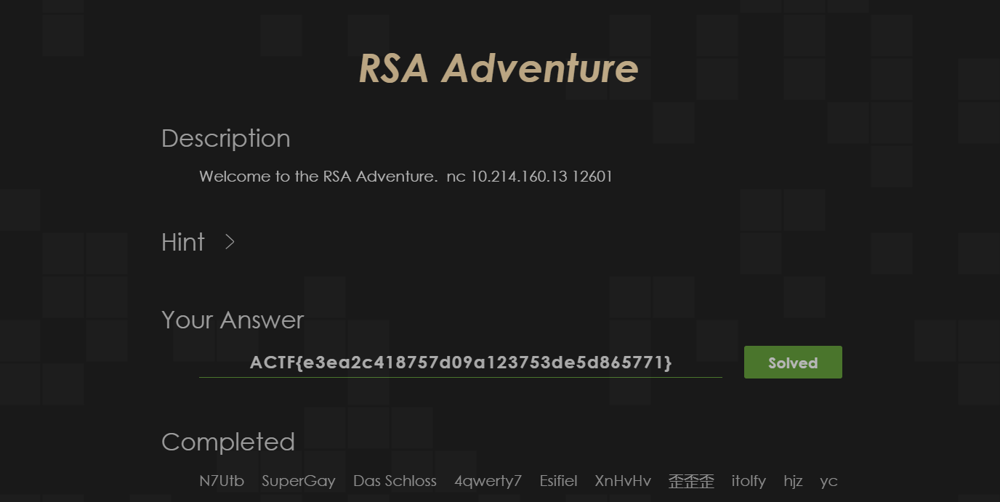
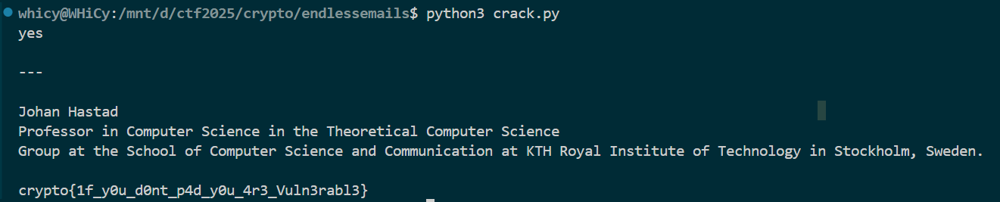
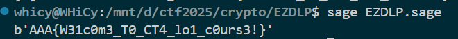
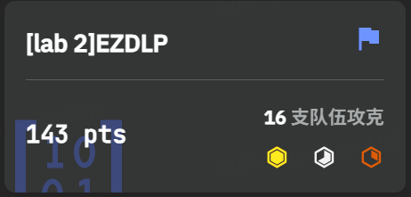

# Crypto Lab2：公钥密码学

# 1 RSA部分

## 1.1 RSAadventure

选择RSAadventure，一共是5个challenge（工作量证明不做赘述）。其中1-4由脚本自动攻击实现，5查询后进行了本地求解提交得到flag。把每个challenge的攻击思路阐述一下，要求不能用`factordb.com`​已经避免了

### Challenge 1

标准的`Håstad's Broadcast Attack`​，使用CRT计算得到$m^3 \equiv C \bmod N$，其中$N=\prod_{i=1}^3 n_i$，开立方根即得$m$  

```python
def solve_challenge_1(params):
    print("[*] Solving Challenge 1 (Håstad's Broadcast Attack)...")
    e, ns, cs = params['e'], [params['n1'], params['n2'], params['n3']], [params['c1'], params['c2'], params['c3']]
    m_cubed = solve_crt(cs, ns)
    m, is_perfect_cube = gmpy2.iroot(m_cubed, e)
    if is_perfect_cube:
        print(f"[+] Plaintext m found: {m}")
        return m
    else:
        raise ValueError("Challenge 1 failed: CRT result is not a perfect cube.")
```



### Challenge 2

公钥指数 `e`​ 是一个很小且为合数的6，由于知道了 `n`​ 的质因数 `p`​ 和 `q`​，我们可以将这个问题分解。根据中国剩余定理，求解 m6≡c(modn) 等价于求解以下方程组：$m^6≡c \mod p$，$m^6≡c\mod q$

令 $s$​$=$​$m^3$，那么原方程就变成了 $s^2≡c\mod p$。 整个破解流程就变为求解 $s^2≡c\mod p$ 和$s2≡c\mod q$，得到 `s`​ 的所有可能解。

对于每一个 `s`​ 的解，再求解 $m^3≡s\mod p$ 和 $m^3≡s\mod q$，得到 `m`​ 的所有可能解，最后，将模 `p`​ 和模 `q`​ 下 `m`​ 的解通过中国剩余定理组合，得到模 `n`​ 下的最终候选解，再通过 `m_bits`​ 筛选出正确答案。

```python
def solve_challenge_2(params):
    print("[*] Solving Challenge 2 (e=6 Attack)...")
    p, q, e, c, m_bits = params['p'], params['q'], params['e'], params['c'], params['m_bits']
    print("[+] Step 1: Dynamically finding modular square roots...")
    s_p_roots = set()
    if p % 4 == 3: s_p = pow(c, (p + 1) // 4, p); s_p_roots = {s_p, p - s_p}
    else: s_p_roots = set(nthroot_mod(c, 2, p, all_roots=True))
    s_q_roots = set()
    if q % 4 == 3: s_q = pow(c, (q + 1) // 4, q); s_q_roots = {s_q, q - s_q}
    else: s_q_roots = set(nthroot_mod(c, 2, q, all_roots=True))
    print("[+] Step 2: Dynamically finding modular cube roots...")
    m_p_roots, m_q_roots = set(), set()
    for s_p in s_p_roots:
        if (p - 1) % 3 == 0: m_p_roots.update(nthroot_mod(s_p, 3, p, all_roots=True))
        else: d3_p = inverse(3, p - 1); m_p_roots.add(pow(s_p, d3_p, p))
    for s_q in s_q_roots:
        if (q - 1) % 3 == 0: m_q_roots.update(nthroot_mod(s_q, 3, q, all_roots=True))
        else: d3_q = inverse(3, q - 1); m_q_roots.add(pow(s_q, d3_q, q))
    print("[+] Step 3: Combining all roots using CRT...")
    candidates = [solve_crt([r_p, r_q], [p, q]) for r_p in m_p_roots for r_q in m_q_roots]
    print(f"[+] Step 4: Filtering for {m_bits}-bit candidate...")
    for m_candidate in candidates:
        if m_candidate.bit_length() == m_bits:
            print(f"[+] Plaintext m found: {m_candidate}")
            return m_candidate
    raise ValueError(f"Challenge 2 failed: No candidate with {m_bits} bits was found.")
```


### Challenge 3

考点相对来说平常，对于n不能分解为两个质因数的情况，欧拉函数的构造变为`ϕ(n)=p(p−1)(q−1)`​，同时在进行正常分解后得到p，q相对接近，考虑使用n的立方根进行搜索加快攻击效率

```python
def factor_p_squared_q(n, search_limit=100000):
    a = gmpy2.iroot(n, 3)[0] 
    print(f"[*] Cube root of n is approximately: {a}")
    print(f"[*] Searching for factors around this value...")
    for i in range(1, search_limit):
        for sign in [-1, 1]:
            candidate = a + (i * sign)
            if n % candidate == 0:
                p_found = candidate
                n_rem = n // p_found
                if n_rem % p_found == 0:
                    q_found = n_rem // p_found
                    return p_found, q_found
    raise ValueError(f"Failed to find factors within search limit.")


def solve_challenge_3(params):
    print("[*] Solving Challenge 3 (Repeated Factor Attack)...")
    n, e, c = params['n'], params['e'], params['c'] 
    p, q = factor_p_squared_q(n)
    print(f"[+] Found factors: p={p} (repeated), q={q}")
    phi = p * (p - 1) * (q - 1)
    d = inverse(e, phi)
    m = pow(c, d, n)
    print(f"[+] Plaintext m found: {m}")
    return m
```



### Challenge 4

标准的dp泄露攻击，核心式子是$e⋅dp−1=k(p−1)$，由于`k`​是通常是一个相当小的值，直接进行小范围暴力搜索，从而快速找到`p`​进行后续求解

```python
def solve_challenge_4(params):
    print("[*] Solving Challenge 4 (Optimized dp Leakage Attack)...")
    n, e, c, dp = params['n'], params['e'], params['c'], params['dp']
    X = e * dp - 1
    print(f"[*] Calculated X = e * dp - 1. Now searching for a small k...")

    k_limit = e + 100000 
    p_found = None
    found_k = -1

    for k in range(1, k_limit):
        if X % k == 0:
            p_minus_1_candidate = X // k
            p_candidate = p_minus_1_candidate + 1
            if isprime(p_candidate) and n % p_candidate == 0:
                p_found = p_candidate
                found_k = k
                break
    
    if p_found is None:
        raise ValueError(f"Challenge 4 failed: Could not find prime factor p within k_limit={k_limit}.")
    
    print(f"\n[+] Success! Found p with k = {found_k}")
    p = p_found
    q = n // p

    if not isprime(q):
        raise ValueError("Challenge 4 failed: n/p is not prime.")
    
    print(f"[+] Found factors: p={p}, q={q}")
    phi = (p - 1) * (q - 1)
    d = inverse(e, phi)
    m = pow(c, d, n)
    
    print(f"[+] Plaintext m found: {m}")
    return m
```


### Chllenge 5

两次分别发送`k=1`​和`k=2`​得到两个方程

$C_1=m^2+m\mod n$，$C_2=(m^2+2m)^2\mod n$，整理得到

$C_2\equiv (C_1^2+C_1)+2(C_1-1)m\mod n$  

最终求解`m`​的公式为

$$
m\equiv (C_2-C_1^2-C_1)\cdot(2C_1-1)^{-1}\mod n
$$

本地构造了脚本进行求解


```python
n = 0xb3eaacc65bf88213e2a641130ae0c382fb2682794e62385f9944f9ff7356bbe2b057226747f38e177cb758888297c7f843f95dda1f5831d2e8ce48256604d11b45fc9010cbd183ee646bf6c687792284bbf029b7abc9e53b87d66a9ef15dd982ac7fa73d99fdd6baaf512bd735b64e2fb2ca29d2bc2e250ae2f9322ece30424b
C1 = 0x56379b3fcd3d6d2e2d7e3f31c6887d5469d1295c4d16d2dfd9124011081e3219d690c562d8e91aa23385020ecf8902c5e6f6acfc3352955156a17ed8d964422ac828bf9e85c9840ea89efd6f552d6ef882240a22f4621f94b0288c42a85a79be1728f77f8a5a586da8b526d1be07090d2deaf90091798400796d556700a8b719
C2 = 0x92a6cb7736dabd521a3df6e8f06f620a0307329bf2d115a0b66f7bbde127a170b8eb16390c18ce6242af1dedf7290b4cc6fce89c570061309fb5d2977ab0350a8a3032c0b5834301dc11bf626c32eb84cdff94954662b6ff4a6a79c822addac2d26f5f59e14ed24538664f5c3f82f2989d67923cd76e3e8ed41b33d5ff1cd26f
R = IntegerModRing(n)
C1_mod = R(C1)
C2_mod = R(C2)
m_mod = (C2_mod - C1_mod^2 - C1_mod) * (2*C1_mod - 1)^(-1)
m_int = int(m_mod)
print(hex(m_int))
```

通过5个challenge后，得到完整flag`ACTF{e3ea2c418757d09a123753de5d865771}`​


题目通过截图，附件包含`RSAadventure.py`​



## 1.2 CryptoHack

三道题目通过截图


### 1.2.1 Crossed Wires

加密的过程理解为使用一个组合公钥指数$E_{total}=e_1e_2e_3e_4e_5$对于明文进行了一次加密，由于已知 `e = 0x10001`​ 和泄露的 `d`​，计算 $e * d - 1$​应该是 $ϕ(N)$ 的整数倍，那么对于$E_{total}$关于它的模求逆元，即可得到总的解密密钥

核心部分脚本如下

```python
E_total=1
for e_friend in friend_keys:
    E_total*=e_friend
e= 0x10001
mult_phi=e*d-1
D_total=inverse(E_total, mult_phi)
decrypted_long=pow(cipher, D_total, N)
flag_bytes=long_to_bytes(decrypted_long)
print(flag_bytes.decode('utf-8'))
```

得到完整flag`crypto{3ncrypt_y0ur_s3cr3t_w1th_y0ur_fr1end5_publ1c_k3y}`​附件包含`CW.py`​


### 1.2.2 Everything is Still Big

程序的核心漏洞在于私钥 `d`​ 的长度只有512位过短，考虑采用维纳攻击计算出私钥 `d`​，攻击策略如下：

1. 计算 $\frac eN$的连分数展开
2. 依次求出其收敛项 $\frac {k′}{d′}$​
3. 将每个分母 `d'`​  尝试解密密文 `c`​，如果解密出的明文看起来是有效的 flag 格式，即成功找到了正确的私钥 `d`​

核心部分脚本如下

```python
def wiener_attack(e, n):
    a0 = e // n
    a_i = a0
    p_prev, q_prev = 1, 0
    p_curr, q_curr = a0, 1

    remainder = e % n
    while remainder != 0:
        yield (p_curr, q_curr)

        a_i = n // remainder
        n, remainder = remainder, n % remainder

        p_next = a_i * p_curr + p_prev
        q_next = a_i * q_curr + q_prev
        
        p_prev, q_prev = p_curr, q_curr
        p_curr, q_curr = p_next, q_next
```

得到完整flag`crypto{bon3h5_4tt4ck_i5_sr0ng3r_th4n_w13n3r5}`​附件包含`ESB.py`​


### 1.2.3 Endless Emails

由于题目给出了七组独立的参数，且使用其对同一条flag进行了重复加密，考虑建立一个关于 $x$​$=$​$m^3$的线性同余方程组，CRT 告诉我们，只要模数 $N1,N2,…,Nk$两两互素，那么上述方程组在模$N_{product}$的意义下，有且仅有一个唯一解 $X=m^3$​

遍历所有从 7 组数据中选取 3 组的组合，对每个组合尝试使用 CRT 求解。一旦找到一个组合，其 CRT 解 `X`​ 是一个完美的立方数，那么它的立方根就是我们的目标明文 `m`​

核心部分脚本如下

```python
def solve_crt(remainders, moduli):
    N_product = 1
    for n in moduli:
        N_product *= n   
    result = 0
    for r_i, n_i in zip(remainders, moduli):
        N_i = N_product // n_i
        inv_N_i = inverse(N_i, n_i)
        result += r_i * N_i * inv_N_i
        
    return result % N_product

all_data = load_data_from_file()
E = all_data[0]['e']

for combo in combinations(all_data, E):
    moduli = [d['n'] for d in combo]
    remainders = [d['c'] for d in combo]
        
    try:
        m_cubed = solve_crt(remainders, moduli)
    except ValueError:
        continue

    m_long, is_perfect = gmpy2.iroot(m_cubed, E)
        
    if is_perfect:
        recovered_message = long_to_bytes(m_long)
        print(recovered_message.decode('utf-8'))
        break
```

得到完整flag`crypto{1f_y0u_d0nt_p4d_y0u_4r3_Vuln3rabl3}`​附件包含`EE.py`​



# 2 DLP部分

## 2.1 EZDLP

题目的hint给的很清晰了，是一个标准的DLP场景：大素数 `p`​、生成元`g`​、公钥 `c`​以及一段AES加密的密文 `ct`​，并且提到了课上讲过的Pohlig-Hellman算法，该算法的假设群的阶`p−1`​应该是一个光滑数，开始编写的脚本基于这样的假设尝试分解 `p−1 `​并依次解决所有子问题，脚本出现了一点意外，把过程调出来之后发现`p-1`​并不光滑

```
...
[✓] SOLVED: x ≡ ... (mod 8580...)
--- Solving for x mod 1119326809698249181662206673457 (prime q=..., power a=1) ---
```

脚本在成功解决了所有小因子的子问题后，遇到了一个巨大的素因子 `q = 1119326809698249181662206673457`​，估算一下计算量是不可解的，表明题目并非典型的Pohlig-Hellman问题。查看已经进行的分解，`p-1`​实际上是部分光滑的结构，它由一个非常光滑的部分（$2^{518}$）和上述的粗糙素因子组成，于是考虑求解$xp\mod 2^{518}$

修改了攻击脚本，使其只执行Pohlig-Hellman算法中针对 $2^{518}$的部分，然后直接用得到的结果作为私钥进行解密

```python
from Crypto.Cipher import AES
from hashlib import md5

p = Integer(960494008017250155494739990397196249930200062145145133132556398221074529657304218221253517153928380265486339083177542201148993799925721673833333778621388110957986908045712612233794551809)
g = Integer(3)
c = Integer(505527904713564983625416248872210831215228354175257237841602581321675204643681129570897695080321118656513647239718859773976453054734892142640867733520305568808093022238369199760987416665)
ct = b'qBS\x84\xfc"\xee$\xb2d\xba\xeb\x00\xf7\xf4\xa4\x91\x90<N\x1a\xb0\xa5>\xdc^\xe3I\xc3\xecc\x1e'

R = Integers(p)

q_factor = 2
a_factor = 518
modulus = q_factor**a_factor
order = p - 1

g_q = power_mod(g, order // q_factor, p)
x = 0
c_i = c

for i in range(a_factor):
    h = power_mod(c_i, order // (q_factor**(i + 1)), p)
    d_i = R(h).log(R(g_q))
    x+= d_i * (q_factor**i)
    if d_i == 1:
        inv_update = power_mod(g, -(q_factor**i), p)
        c_i = (c_i * inv_update) % p


key = md5(str(x).encode()).digest()
cipher = AES.new(key, AES.MODE_ECB)
flag_padded = cipher.decrypt(ct)
flag = flag_padded.rstrip(b'\x00')
print(flag)
```

得到最终完整flag：`AAA{W31c0m3_T0_CT4_lo1_c0urs3!}`​

​题目通过截图，附件包含`EZDLP.sage`​



# 3 Bonus

---

## 3.1 故障注入攻击

攻击者通过对正在进行密码学计算的设备（如智能卡、HSM）施加物理干扰，诱使其出错，并利用这个错误输出来获取密钥信息。

- **攻击目标**: 使用 CRT (中国剩余定理) 进行加速的 RSA 私钥操作。
- **核心原理**: 为了加速签名或解密，RSA 实现通常会使用 CRT。私钥持有者不直接计算 m\=cd(modn)，而是分别计算：

  - mp\=cdp(modp) (其中 dp\=d(modp−1))
  - mq\=cdq(modq) (其中 dq\=d(modq−1)) 然后通过 CRT 将 mp 和 mq 合并得到最终的 `m`​。

  攻击流程如下：

  1. 攻击者让设备对一个已知的密文 `c`​（或由攻击者选择的`c`​）进行解密。
  2. 在设备计算 $m_p$ 和$m_q$的过程中，攻击者通过物理手段（如瞬时电压尖峰、激光脉冲、电磁干扰）精确地只干扰其中一个计算，例如，让$m_q$ 的计算出错，得到一个错误的结果 $m_q$​$~$，而 mp 的计算是正确的。
  3. 设备继续使用正确的 $m_p$ 和错误的$mq$​$~$ 进行 CRT 合并，最终输出一个错误的明文 $m$​$~$。
  4. 这个错误的明文 $m$​$~$ 具有一个非常特殊的性质：

      - $m$​$~$≡mp(modp) （模 p 是正确的）
      - $m$​$~$≡mq(modq) （模 q 是错误的）
  5. 攻击者拥有原始密文 `c`​ 和错误的解密结果 $m$​$~$。他可以计算 $m$​$~$^e(modn)，得到一个“错误的密文” $c$​$~$。这个$c$​$~$ 也具有特殊性质：

      - $c$​$~$≡c(modp)
      - $c$​$~$≡c(modq)
  6. 这意味着 $c$​$~$−c 是 `p`​ 的倍数，但不是 `q`​ 的倍数。
  7. 因此，攻击者只需计算 gcd($c$​$~$−c,n)，就能直接得到质因数 `p`​。一旦 `p`​ 被分解出来，`q`​ 也随之可知，整个 RSA 密钥体系被攻破。

---

## 3.2 无效曲线攻击

针对椭圆曲线密码学 (ECC) 实现的攻击，属于一种“错误输入”攻击，利用了服务器在进行椭圆曲线点乘运算前，未充分验证接收到的点是否在指定的曲线上。

- **攻击目标**: 未对输入点进行合法性校验的 ECDH (椭圆曲线密钥交换) 或其他 ECC 协议的实现。
- **核心原理**: 在 ECDH 密钥交换中，Alice 和 Bob 共享一个基点 `G`​ 和一条公共曲线 `E`​。Alice 生成私钥 `a`​，计算公钥 A\=aG 并发送给 Bob。Bob 也做类似操作。 攻击者 想要获取 Bob 的私钥 `b`​。  
  攻击流程如下：

  1. 攻击者截获 Alice 发给 Bob 的公钥 `A`​。
  2. 攻击者不直接转发 `A`​，而是精心构造一个**无效的点** P′。这个点 P′ **不在**原定的大素数阶的曲线上，而是在另一条阶数很小（例如，阶为 `h`​，`h`​ 是一个很小的数）的“扭曲”曲线上。
  3. 攻击者将这个恶意点 P′ 发送给 Bob，伪装成是 Alice 的公钥。
  4. Bob 的服务器（如果实现有缺陷）不会验证 P′ 是否真的在曲线 `E`​上，而是直接用自己的私钥 `b`​ 去计算共享密钥：K\=bP′。
  5. 由于 P′ 所在的曲线阶数为 `h`​，这意味着 hP′\=O (无穷远点，即单位元)。因此，共享密钥 `K`​ 的取值空间也非常小，只有 `h`​ 种可能。
  6. 更重要的是，计算结果 K 泄露了关于 Bob 私钥 `b`​ 的信息，具体来说是 bmodh 的值。例如，如果 Bob 返回 K\=(bP′), 攻击者可以尝试所有可能的 `b mod h`​ 的值（例如从 1 到 h），计算 k′P′ 直到结果等于 `K`​，从而得知 b≡k′(modh)。
  7. 攻击者可以构造多个来自不同小阶数曲线的无效点，重复此过程，每次都能得到一个关于 `b`​ 的同余方程。最后，利用中国剩余定理 (CRT)，将这些同余方程组合起来，就可以完全恢复出 Bob 的私钥 `b`​。

‍
