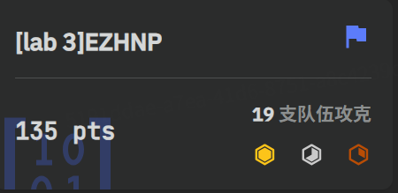

# Crypto Lab3：格密码

# 1 格基规约 EZHNP

漏洞在于 `k = getPrime(240)`​ 这一行。标准的 ECDSA 要求临时密钥`k`​ 是一个与曲线的阶 `n`​（在这里是256位）长度相近的随机数。然而，这里的 `k`​ 是一个 240位 的素数，它远小于 `n`​。当 `k`​ 的高位部分比特为0（或者说，`k`​ 的值远小于 `n`​）时，签名方程会泄露关于私钥 `sk`​ 的信息，考虑将这个问题建模为HNP，并使用格理论中的 LLL 算法来解决。

ECDSA 的签名方程是：$s≡k^{−1}(h+r⋅sk)\mod n$

考虑将其变形为以下形式

$s⋅k≡h+r⋅sk\mod n$  

$k≡s^{−1}(h+r⋅sk)\mod n$  

$k≡(s^{−1}r)⋅sk+(s^{−1}h)\mod n$  

这就完美地符合了 HNP 形式：`kᵢ ≡ aᵢ⋅x + bᵢ (mod p)`​因为拥有 `t=18`​ 组签名数据，可以构造一个 `(t+2) x (t+2)`​ 的格，也就是 `20 x 20`​ 的矩阵 `L`​。根据 HNP 的标准解法，我们寻找的短向量 `u`​ 存在于由 `L`​ 的行向量张成的格空间中。

这个目标短向量 `u`​ 的形式为$u$​$=$​$(k_1,k_2,…,k_t,C_1⋅sk,C_2)$  

其中 `C₁`​ 和 `C₂`​ 是我们设置的平衡参数。为了让 LLL 算法能够找到这个短向量，需要让向量 `u`​ 的所有分量大小接近。已知 `kᵢ`​ 的数量级约为 `2^240`​，因此，设置 `C₂ ≈ 2^240`​。对于 `C₁ ⋅ sk`​，猜测 `sk`​ 的大小和 `k`​ 接近，所以选择最简单的 `C₁ = 1`​。

最终，我们构造的格矩阵 `L`​ 如下：

$$
L = \begin{bmatrix} n & 0 & \cdots & 0 & 0 & 0 \\ 0 & n & \cdots & 0 & 0 & 0 \\ \vdots & \vdots & \ddots & \vdots & \vdots & \vdots \\ 0 & 0 & \cdots & n & 0 & 0 \\ a_1 & a_2 & \cdots & a_t & C_1 & 0 \\ b_1 & b_2 & \cdots & b_t & 0 & C_2 \end{bmatrix}
$$

对L运行 LLL 算法后，会得到一组约化基。其中最短的那个向量很可能就是目标向量`u`​  通过检查该向量的最后两个分量，就可以恢复出 `sk`​，核心脚本如下：

```python
R = [92705350765778841632114367661243049080875495918767706384653826548283605282492, 101128161731935354829406778189020065995357916969723338289581033795136570437725, 69391971244493157660578265124818646972471547715834930612176117138431901619579, 46581339179933763823514448169214029827507740378358646756240141586406557647539, 11292358212498846728313652818188528164218866810974870037654054338090840780987, 87393596652133876707154092178105908487472542626668863919284385364215590241768, 26956740194937370699776722535694495675002816799189907042258230581256395008856, 29879144033005975330121324531572433108543597089574928756621320396465192493249, 21977941806848404813230614593205358651945949359571359719286369996346525139866, 21125882325399543668073791805650000819647312639482914194375869323663786233289, 82540493716493610801774479295997218161655722504785916638343487464318706046524, 62772264886498259877823231667024943202243004476547317288455702457886046962285, 96211694474136377645916377492447723010398039576822563032105420540047175361033, 106137236095275427065857219670003691886358887445014492938407244294897008204463, 16542603951215458332350373763254912045187007454910660902129659908704749540950, 47274807239875287222071507637976852936446959870327119537734186585861083354938, 37760382346891693577542143362789732867364070241541028707687876963159872106910, 36889439151878175681246425585604728618622205217381113578099772837049256680304]
S = [41484633708682823881850764316797339826214355309557921432246286443663392047837, 78864208094501840377450875267896406100790818914982250587504769251658455860020, 68509100433721953789020121208189197871431864037916363324275919920518914481415, 45002720423042634705145321937975191216651240607040211130306538772625214919223, 48962158874490668346693228021922618352548141240455647453441800202439071077091, 65073297166309428874094315945265005871891768668049485117263104613350469042193, 86509855737933214047368192818874836121954100083761128442578670445421163907453, 31383420867119659409884515406401694813865549028776962376960701467872647982913, 67707411194070538908821098160755898603685635648422561194473292066453201440105, 82889576258915608292579865463492613989812394203192988486345174030219276343889, 48786694677233049302686004985829960612015230907007769467354401283022465023415, 58547440225719906889141913866526237659330267992917337244996455608611546339349, 75140142119326853235158532332612469078792900007756289654811440909745217886896, 29381196982072695397109159109415399068519717892832995400225148993442696594782, 24574324360496507614469348176564897890046342271328513150159391026483913802833, 45325921353628923184814149391782997567731326702429043651663623437721106736507, 52199172481686507960119191545250164944656947065414853690845942402898997426730, 12445861255229256251879393896948384691817664665425109409591748684825060264221]
n = 0xFFFFFFFFFFFFFFFFFFFFFFFFFFFFFFFEBAAEDCE6AF48A03BBFD25E8CD0364141
msg = b"message_to_sign"
t = 18

h = bytes_to_long(sha256(msg).digest())

A = []
B = []
for i in range(t):
    s_inv = inverse_mod(S[i], n)
    a_i = (R[i] * s_inv) % n
    b_i = (h * s_inv) % n
    A.append(a_i)
    B.append(b_i)

dim = t + 2
L = Matrix(ZZ, dim, dim)

C1 = 1  
C2 = 2^240 

for i in range(t):
    L[i, i] = n

for i in range(t):
    L[t, i] = A[i]
    L[t+1, i] = B[i]

L[t, t] = C1
L[t+1, t+1] = C2

B_reduced = L.LLL()


sk_found = 0
for row in B_reduced:
    if abs(row[dim-1]) == C2:
        sk_candidate = abs(row[dim-2]) / C1
        sk_found = int(sk_candidate)
        break
```

得到完整flag`AAA{DSA_c4n_b4_Att4ck_by_HNP}`​，附件包含`EZHNP.sage`​，题目通过截图



# 2 Coppersmith EZCopper

由费马小定理，$c_1 \equiv m^p \mod N \Rightarrow c_1\equiv m^p\mod p\Rightarrow m\equiv c_1 \mod p$，$c_2 \equiv m^q \mod N \Rightarrow c_2\equiv m^q\mod q\Rightarrow m\equiv c_2 \mod q$

由此的到一个关于`m`​的模`N`​同余方程$（m-c_1）(m-c_2)\equiv 0 \mod N$，由此$m^2-(c_1+c_2)m+c_1c_2\equiv 0\mod N$，`m`​由此为多项式$F(x)=x^2−(c_1+c_2)x+c_1c_2$在模`N`​下的一个根。

考虑检验是否满足CopperSmith方法的应用条件，其应用上界为$N^{\frac 1 d}\approx 2^{512}$，而最终的flag大小上限为$2^{480}$，满足边界条件，编写脚本进行求解。

使用的`small_roots`​函数依赖于几个关键参数决定所构造格的维度和性质，参数`beta`​定义了根大小相对于模数的比例，满足$beta>\frac {480}{1024}$，选择$beta=0.5$，参数`epsilon`​影响格的维度，经过多次微调至0.01可以找到所需根，核心脚本如下：

```python
N = 82026098918018048601194427731265610598223143352871384484378934781046426470457579869232011486393874476186567625229332611565234003485853019792322430103277676424566512296566435084827135288544968265487309622073434095546441271535068838054181929434974538632566184260907608065199111062758256040088180223324312299521
c1 = 78503948254615594047841187530965836154632787302768366632905121918314810223128105309641358695950697599583708248054782780095462351919922323260220861647550036312494475737008242958470205866004114155607402483934916420785113923454730105142298778088992828889793793717895774511556825375972210918015083059093162818541
c2 = 75091246193148131303260170510260975611473539420282599051834536707253450049850812089631209934399750953992686331190657768055844747861862355060627611276305156746537479184911696938445168043449670586668792029452049248247572227027801974529674890256309603329146410829505466430516915677054283639183184264639627097887

P.<x> = PolynomialRing(Zmod(N))
f = (x - c1) * (x - c2)
X = 2**480

beta = 0.5
epsilon = 0.01
roots = f.small_roots(X=X, beta=beta, epsilon=epsilon)

if roots:
    m = int(roots[0])
    flag_bytes = m.to_bytes(60, 'big')
    flag = flag_bytes.decode('utf-8')
    print(f"\n{flag}")
```

得到最终flag`AAA{Ccccccooooo0pp3rsm1th_14_v3ry_1mp0rt4nttttt}`​，附件包含`EZCopper.sage`​


题目通过截图


# Bonus

​`cuso`​ 是一个实现了 Coppersmith 攻击和相关格攻击的 SageMath 脚本。其核心思想是，当一个或多个多项式方程在一个模 `N`​ 下有小整数解时，可以通过格技术找到这些解。`cuso`​ 需要设置三个核心参数：**​`polynomials`​**​  **(多项式列表)、**​**​`modulus`​**​  **(模数N)、**​**​`bounds`​**​  **(上界)**

找到了这样一道题

```python
from enc import flag
from Crypto.Util.number import *
 
 
m = bytes_to_long(flag)
p = getPrime(512)
q = getPrime(512)
r = getPrime(700)
t = getPrime(800)
tmp = getPrime(10)
e = 65537
n = p*q
print(f"c = {pow(m,e,n)}")
print(f"leak = {p*r+q*t+tmp}")
print(f"r = {r}")
print(f"t = {t}")
 
'''
c = 30075387915048470863070050827629191303436443913395824732907226821054460652219815718226645166341618100700084925720992983286419204902032573926790086035422540879196867669665497753447829812026327367178333296715527968448124126434045869420695221514125724904849358819864918062875310272203931927234053359553779163755
leak = 52407066630998720273731758848751180003129908965730006096464345923549459617438414126937562326106182853585345246472838907532807236677219886418149723311118855918338387062301958904467478605422673207935942348215552655035846974843053690523359908921489934306458440759517598485452824210146131626776354968352617955744704892906092826257342911994753745093428990023111339468228443855826492957321799005181961
r = 4515378990844403115229704433484433833022655205121974667074150580454343643752811757675793959795169040704894972951300994535151410073321406165168737850534934347874731893617893819762340858239387281147345869706971753
t = 6006929234728180950140499814342609393927042935104177663404375056306287820676434237439964941788093406713118055152122129530273026459457066165368157449726903765601586482566299501860863052052121811433466409338266730837645652741024637475218039773
'''
```

漏洞在于 `leak`​ 这个等式，它在两个大未知数 `p`​, `q`​ 和一个小未知数 `tmp`​ 之间建立了一个线性的整数关系。这个关系约束性极强，考虑利用格攻击来恢复这些未知数，将此问题转化为一个模 `leak`​ 下求解多项式小根的问题

$p⋅r+q⋅t+tmp≡0\mod leak$  

方程中还有第三个未知数 `tmp`​。直接进行三元求解会非常复杂。但注意到 `tmp`​ 是一个 10 位的小素数，这意味着它的取值范围非常小，因此可以对 `tmp`​ 的所有可能值进行暴力破解。在每次循环中，将 `tmp`​ 视作一个已知常数，问题就降维成了一个关于 `(p, q)`​ 的二元多项式求解问题。对于每一个猜测的 `tmp`​ 值，构造多项式 `f(p, q) = p*r + q*t + tmp_guess`​，然后调用 `cuso`​ 库来寻找它在模 `leak`​ 下的根。

核心攻击脚本如下，得到`[p,q]=[(10107036304221590140315537220898906759095811790937615837692120715006548746019505046230668048672611600884439559253340540831445253603270525554564368273932957, 8724435494930578791898201381855906261499199490201926298013879508413402076594452143243163216133538607634050021589040517038447172885148196774972396508093843)]`​

```python

import cuso

leak = 52407066630998720273731758848751180003129908965730006096464345923549459617438414126937562326106182853585345246472838907532807236677219886418149723311118855918338387062301958904467478605422673207935942348215552655035846974843053690523359908921489934306458440759517598485452824210146131626776354968352617955744704892906092826257342911994753745093428990023111339468228443855826492957321799005181961
r = 4515378990844403115229704433484433833022655205121974667074150580454343643752811757675793959795169040704894972951300994535151410073321406165168737850534934347874731893617893819762340858239387281147345869706971753
t = 6006929234728180950140499814342609393927042935104177663404375056306287820676434237439964941788093406713118055152122129530273026459457066165368157449726903765601586482566299501860863052052121811433466409338266730837645652741024637475218039773

bounds = (2^512, 2^512)

possible_tmps = prime_range(2^9, 2^10)
solution_found = False
m_val = 2
d_val = 3


for tmp_guess in possible_tmps:
    P.<p, q> = Zmod(leak)[]
    f = p * r + q * t + tmp_guess
    sols = cuso.coppersmith([f], modulus=leak, bounds=bounds, m=m_val, d=d_val, debug=False)

    if sols:
        solution = sols[0]
        p_sol = solution[p]
        q_sol = solution[q]
        print(f"p = {p_sol}")
        print(f"q = {q_sol}")
        print(f"tmp = {tmp_guess}")
        
        n_recovered = p_sol * q_sol
        print(f"\n n = {n_recovered}")
        
        solution_found = True
        break

```
