# Lab 0：基础知识及技能

# 1 Prerequisite

## 1.1 Challenge 1 Linux 环境的搭建与简单使用

#### 一.shell命令的学习

##### 1.cd命令

- ##### `cd …/…` 切换到绝对路径目录下


- ##### `cd ./…`打开当前目录下

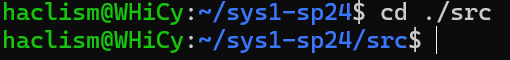

- ##### `cd ..`返回上级目录

  
- ##### `cd ~`打开home目录

  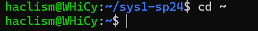

##### 2.ls命令

- ##### `ls -a`列出所有文件和目录，包括隐藏文件

  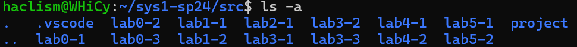
- ##### `ls -l`列出详细信息

  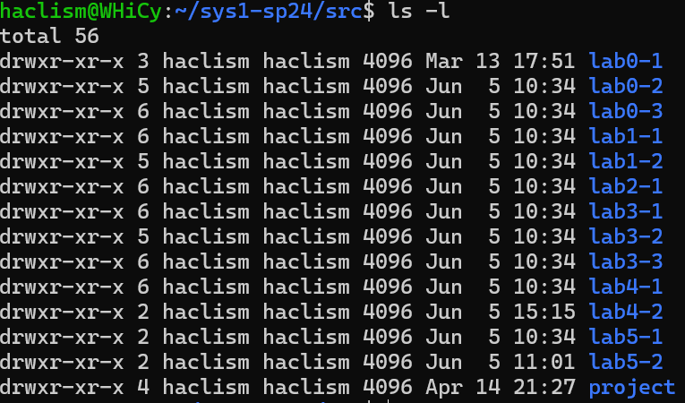

##### 3.git命令

- ##### `git log`查看历史修改情况

  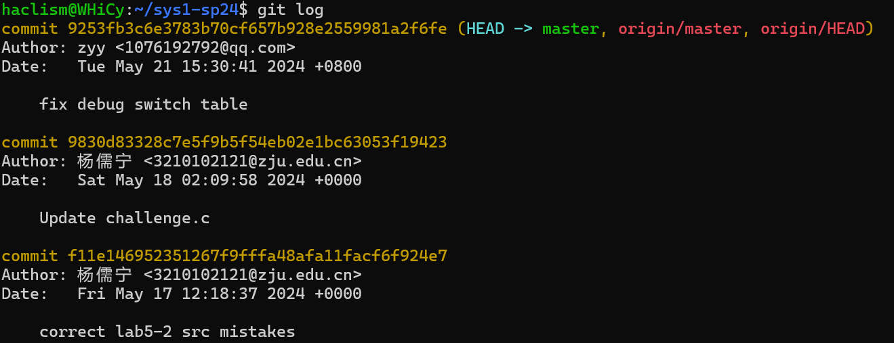
- ##### `git reset --hard`回退到之前的版本

  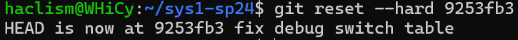
- ##### `git reflog`查看之前版本

  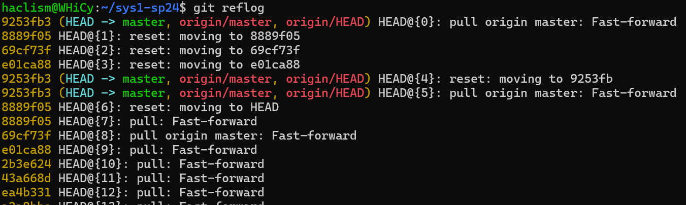
- ##### `git pull (origin master)`取回远程主机分支更新并与本地分支合并

  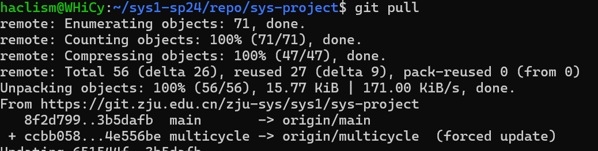

##### 4.pwd命令

- ##### `pwd`获取当前路径

  

#### 二."Saint John":What's wrting to this log file?

​`ps -A`​查看所有进程——`ps -aux`​查看详细信息——`kill 581(进程号)`​杀死对应进程——通过测试

通过截图如下


## 1.2 Challenge 2 基础的 Python 编程

#### 一.简单Python程序的功能解释

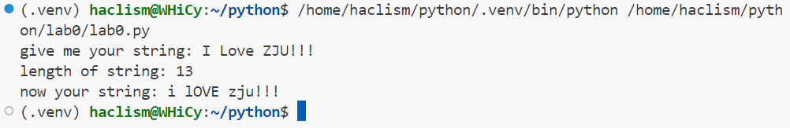

上图显示该Python程序运行结果，其功能为：对于输入的字符串，输出其长度；同时对于字符串的字母进行大小写互换，其他字符保持不变并再次输出

#### 二.简单Python编程

```Python
from pwn import *
host=remote('10.214.160.13',11002)
host.recvlines(7)
cnt=0
while cnt<10:
    cnt+=1
    exs = host.recvuntil('=')
    exr = bytes.decode(exs)
    exr=exr[:-2]
    result = eval(exr)
    ext =str.encode(str(result))
    host.sendline(ext)
    host.recvlines(3)
flag=host.recvline()
print(flag)
```

终端显示结果，flag`AAA{melody_loves_doing _calculus_qq_qun_386796080}`​

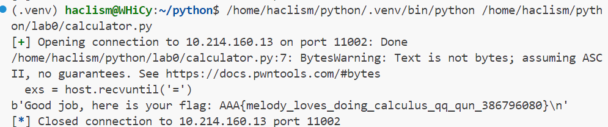

#### 成功解决截图


附件包含`calculator.py`​

# 2 Web

## 2.1 Challenge 1 pumpk1n

view-source看一下源码


尝试一下大概是一个重复访问得到token并循环直至得到flag的过程，需要重复1337次，最后flag`flag{56297ad00e70449a16700a77bf24b071}`​

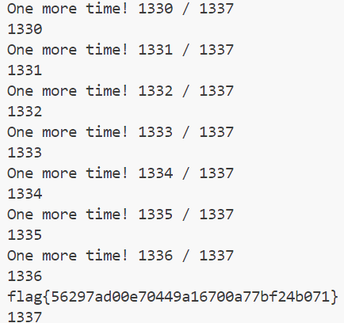

附件包含`pumpk1n.py`​

## 2.2 Challenge 2

大概是这样一个界面


尝试一下输入1，2有特殊结果


输入其他字符会返回bool（false），猜测使用了bool盲注

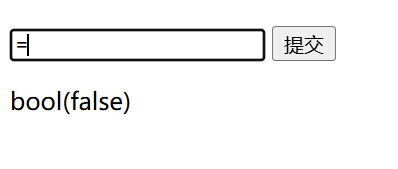

通过布尔盲注的脚本得到最后flag


题目通过截图


附件包含`hackworld.py`​

# 3 Pwn

## 3.1 BUG

BUG1 size小于sizeof时，无符号数发生减法会导致读取入超过预期的长度

BUG2 real_size<size时会发生堆上缓冲区泄露

BUG3 err未初始化造成的返回值问题

BUG4 地址p未释放造成内存泄漏

## 3.2 漏洞触发截图


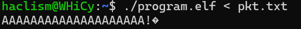


附件包含`nobug_program.c`​

# 4 Reverse

## 4.1 crackme

IDA大法，找到关键的main函数以及verify函数，click F5进行反汇编

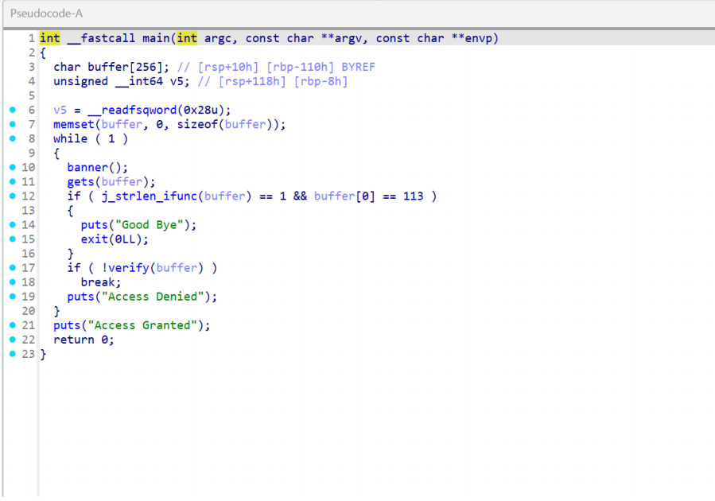

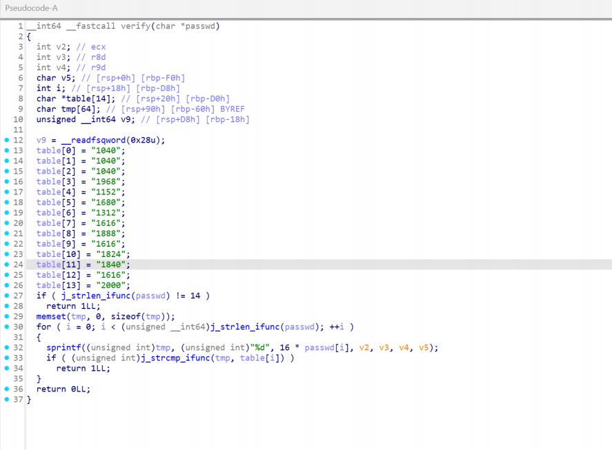

分析一下verify函数，即可得到对应flag：AAA{HiReverse}

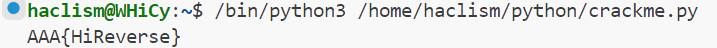

程序通过及题目通过截图

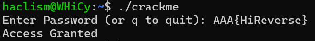

附件包含`decode.py`​

# 5 Misc

## 5.1 Challenge 1

对于所给字符串依次采用Base85,Base64,Base32进行解码，得到flag`AAA{wELc0m3_t0_Ctf_5umMEr_c0UrsE_2025}`​


## 5.2 Challenge 2

对于所给图片查看文件内容，得到flag后半段`P1@y_m1SC_TOG3Th3R}`​

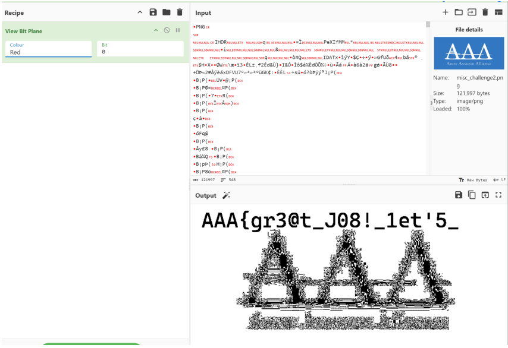

进行LSB隐写解码，得到flag前半段`AAA{gr3@t_J08!_1et'5_`​


完整flag`AAA{gr3@t_J08!_1et'5_P1@y_m1SC_TOG3Th3R}`​

# 6 Crypto

## 6.1 Challenge 1


考虑将不同符号用不同字母进行指代，转化后版本为

```
ABCDEFA GAFHC IDJJ HKKDLG FGKG MJGHNG JOKG FDP AB AFG HQHCRBCGR IHKGFBONG CGHK AFG MBJDSG NAHADBC IFGKG AFG MKBTGNNDBCHJ HNNHNNDC KGGNG FDKGR IDJJ GJDPDCHAG FDP ABPBKKBI NFG IDJJ EB AB AFG IHKGFBONG HCR QGSBPG AFG TDKNA MGKNBC AB RDNSBLGK FDN SBKMNG IDAF H NAKBCE HJDQD AFGNG MBJDSG BTTDSGKN HQNBJOAGJE SHC CBA HKKGNA FGK
```

这里我们推测点号为空格，同时对于翻译过程中的高频字母进行推测G=E A=T H=A,作为线索输入分析网站


最优分析结果即为明文，调整后如下

```
Tonight Ethan will arrive here.今晚伊森将到达这里。
Please lure him to the abandoned warehouse near the police station where the professional assassin Reese hired will eliminate him.请引诱他到警察局附近的废弃仓库，里斯雇佣的职业杀手将在那里杀死他。
Tomorrow she will go to the warehouse and become the first person to discover his corpse with a strong alibi.明天她将去仓库，成为第一个发现他的尸体的人，并提供强有力的不在场证明。
These police officers absolutely can not arrest her.这些警察绝对不会逮捕她。
```

## 6.2 Challenge 2 RSA算法初步

考虑引入sympy包并使用其中的`mod_inverse`​函数求模的逆元,对应Python代码如下

```Python
from sympy import mod_inverse
p = 0x848cc7edca3d2feef44961881e358cbe924df5bc0f1e7178089ad6dc23fa1eec7b0f1a8c6932b870dd53faf35b22f35c8a7a0d130f69e53a91d0330c0af2c5ab
q = 0xa0ac7bcd3b1e826fdbd1ee907e592c163dea4a1a94eb03fd4d3ce58c2362100ec20d96ad858f1a21e8c38e1978d27cd3ab833ee344d8618065c003d8ffd0b1cb
e = 0x10001 
c = 0x39f68bd43d1433e4fcbbe8fc0063661c97639324d63e67dedb6f4ed4501268571f128858b2f97ee7ce0407f24320a922787adf4d0233514934bbd7e81e4b4d07b423949c85ae3cc172ea5bcded917b5f67f18c2c6cd1b2dd98d7db941697ececdfc90507893579081f7e3d5ddeb9145a715abc20c4a938d32131013966bea539
phi_n = (p - 1) * (q - 1)
d = mod_inverse(e, phi_n)
m =pow(c,d,p*q)
print('%#x'%m)
```

终端运行结果如下,求得`m=0x4141417b4163655f4174746f726e65795f69735f766572795f66756e5f50686f656e69785f577269676874264d696c65735f45646765776f7274687d`​


进行一下简单转换得到flag：`AAA{Ace_Attorney_is_very_fun_Phoenix_Wright&Miles_Edgeworth}`​

附件包含`rsa.py`​

‍
