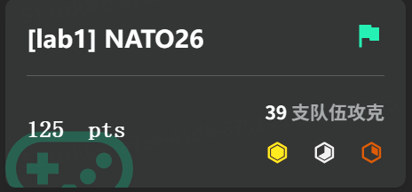
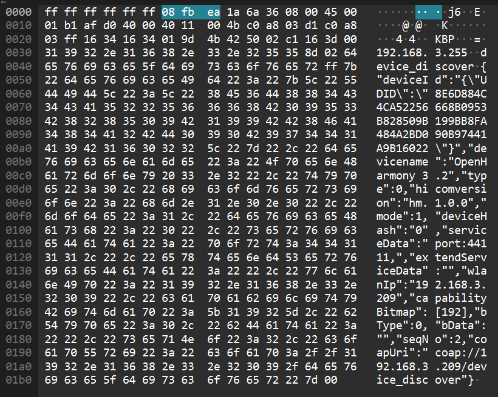
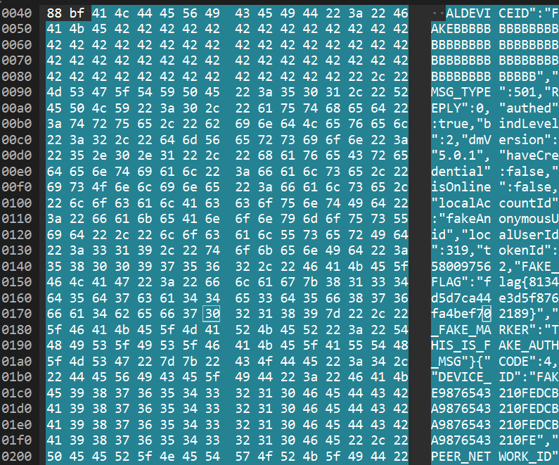
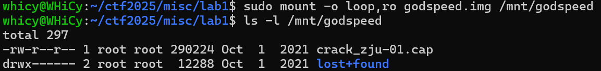
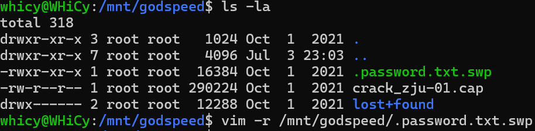
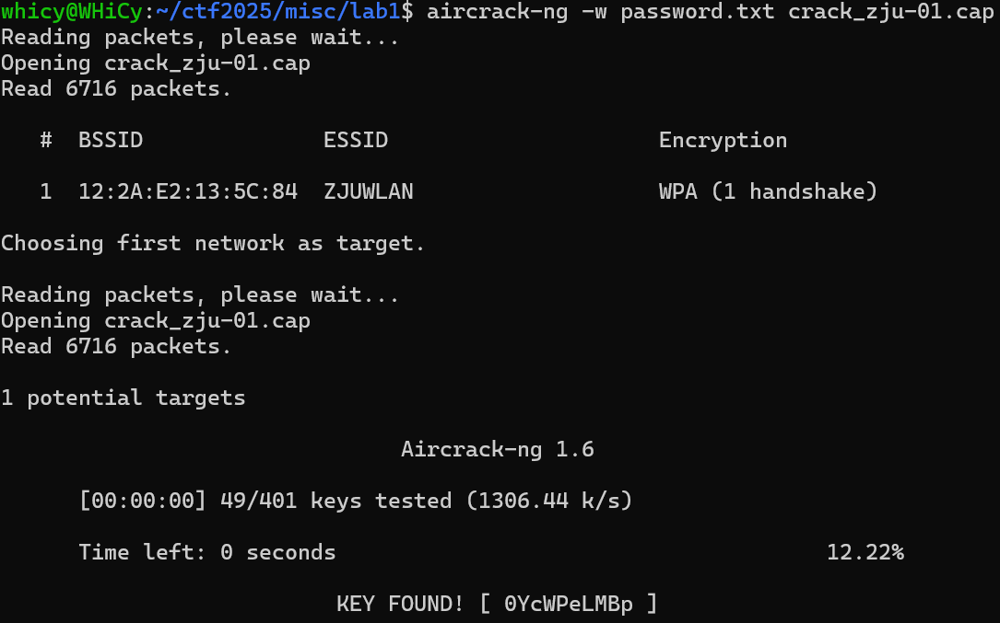

# Misc Lab1：编解码及 OSINT

# 1 Task 1.2

经过一些尝试和判断，乱码用UTF-8解码了GBK编码的文本产生，进行修复

```bash
请输入需要处理的乱码字符串: 鍘熺悊绫讳技璐濇柉浜斿崄鍏﷿鐨璐濇柉浜屽崄鍏﷿紪鐮佸叾鍐呭﷿涓哄枬褰╁０甯曞笗鍒╅┈榄佸寳鍏嬪洖闊虫煡鐞嗗潎鍖€甯曞笗鍥為煶绁栭瞾浜虹嫄姝ユ帰鎴堝﷿鎷夊潎鍖€鏈变附鍙舵湵涓藉彾榄佸寳鍏嬪痉灏斿﷿绁栭瞾浜哄▉澹﷿繉楂樺皵澶﷿悆楂樺皵澶﷿悆鍩冨厠鏂﷿皠绾垮枬褰╁０濂ユ柉鍗″焹鍏嬫柉灏勭嚎绁栭瞾浜洪害鍏嬪洖闊冲潎鍖€绁栭瞾浜哄﷿鎷夊痉灏斿﷿閰掑簵鑳滃埄鑰呴珮灏斿か鐞冨叕鏂よ儨鍒╄€呴害鍏嬪崄涓€鏈堝洖闊宠儨鍒╄€呭▉澹﷿繉濉炴媺鍏﷿枻寰峰皵濉斿叕鏂ゅ嵃搴︽煡鐞嗛害鍏嬮樋灏旀硶鍗板害鍧囧寑濂ユ柉鍗″枬褰╁０

--- 处理结果 ---
原始乱码: 鍘熺悊绫讳技璐濇柉浜斿崄鍏﷿鐨璐濇柉浜屽崄鍏﷿紪鐮佸叾鍐呭﷿涓哄枬褰╁０甯曞笗鍒╅┈榄佸寳鍏嬪洖闊虫煡鐞嗗潎鍖€甯曞笗鍥為煶绁栭瞾浜虹嫄姝ユ帰鎴堝﷿鎷夊潎鍖€鏈变附鍙舵湵涓藉彾榄佸寳鍏嬪痉灏斿﷿绁栭瞾浜哄▉澹﷿繉楂樺皵澶﷿悆楂樺皵澶﷿悆鍩冨厠鏂﷿皠绾垮枬褰╁０濂ユ柉鍗″焹鍏嬫柉灏勭嚎绁栭瞾浜洪害鍏嬪洖闊冲潎鍖€绁栭瞾浜哄﷿鎷夊痉灏斿﷿閰掑簵鑳滃埄鑰呴珮灏斿か鐞冨叕鏂よ儨鍒╄€呴害鍏嬪崄涓€鏈堝洖闊寵儨鍒╄€呭▉澹﷿繉濉炴媺鍏﷿枻寰峰皵濉斿叕鏂ゅ嵃搴︽煡鐞嗛害鍏嬮樋灏旀硶鍗板害鍧囧寑濂ユ柉鍗″枬褰╁０
修复之后: 原理类似贝斯五十八的贝斯二十六编码，其内容为喝彩声帕帕利马魁北克回音查理均匀帕帕回音祖鲁人狐步探戈拉均匀朱丽叶朱丽叶儒北克德尔塔祖鲁人威士忌高尔夫球高尔夫球艾克斯射线喝彩声奥斯卡艾克斯射线祖鲁人麦克回音均匀祖鲁人拉德尔塔酒店胜利者高尔夫球公斤胜利者麦克十一月回音胜利者威士忌塞拉利昂德尔塔公斤印度查理麦克阿尔法印度均匀奥斯卡喝彩声
```

先处理后面用NATO26加密的文字，翻译成原文应该是`BPLQECUPEZFTUJJQDZWGGXBOXZMEUZDHVGKVMNEVWSDKICMAIUOB`​。根据提示对照base58的原理，推测base26同样是对26取模，写一个脚本，转换得到完整flag`ZJUCTF{Y0u_rE@lLy_Kn0W_encODIng}`​通过截图，附件包含`nato26.py`​



# 2 Challenge 1

## 2.1 GB系列编码

1. **GB 2312**

GB 2312 使用一个二维的编码表来表示字符。它将编码空间划分为 94 个区和 94 个位。字节结构为 `字节1 (高字节) + 字节2 (低字节)`​每个字节的最高位（bit 7）都为 1，以区别于标准的 7 位 ASCII 码（最高位为 0）。

2.  **GBK**

GBK 完全兼容 GB 2312。它保留了 GB 2312 的所有编码位置和字符。但是它扩展了高字节和低字节的取值范围，从而获得更多的编码空间。其中高字节（字节1）：**0x81 - 0xFE**低字节（字节2）：**0x40 - 0xFE** （不包括 0x7F）

3. **GB 18030**

编码方式： 变长编码，包含单字节、双字节和四字节三种形式。编码规则上，单字节 与 ASCII 完全一致（0x00 - 0x7F）。双字节 完全兼容 GBK 的双字节编码范围（高字节 0x81-0xFE，低字节 0x40-0xFE）。四字节 用于表示 GBK 未包含的字符。其结构为：`字节1 (0x81-0xFE) + 字节2 (0x30-0x39) + 字节3 (0x81-0xFE) + 字节4 (0x30-0x39)`​。

其兼容性实现方式如下：

1. **GBK 对 GB 2312 的兼容：**

    - **码位继承：**  GBK 直接继承了 GB 2312 的所有码位。任何一个在 GB 2312 中定义的字符，在 GBK 中的编码值（两个字节）是完全相同的。
    - **范围扩展：**  GB 2312 的高字节范围是 `0xA1-0xF7`​（实际使用），低字节是 `0xA1-0xFE`​。GBK 将高字节范围扩展到了 `0x81-0xFE`​，低字节范围扩展到了 `0x40-0xFE`​。由于 GB 2312 的编码范围是 GBK 编码范围的一个**真子集**，因此任何一个 GB 2312 的双字节码流，在 GBK 解码器看来都是一个合法的、有明确定义的字符。解码器只需按 GBK 的规则处理即可。
2. **GB 18030 对 GBK (及 GB 2312) 的兼容：**

    - **单字节兼容 ASCII：**  GB 18030 的单字节部分（0x00-0x7F）与 ASCII 完全一致。
    - **双字节兼容 GBK：**  GB 18030 标准规定，所有符合 GBK 编码规则的双字节序列（高字节 `0x81-0xFE`​，低字节 `0x40-0xFE`​）所表示的字符，与 GBK 中定义的完全相同。换句话说，GB 18030 将整个 GBK 编码表原封不动地“搬”了进来。
    - **利用保留空间实现扩展：**  GBK 的双字节编码并没有用尽所有 `高字节(0x81-0xFE) x 低字节(0x00-0xFF)`​ 的组合。GB 18030 正是利用了这些 GBK 未定义的编码空间来引入四字节编码。具体来说，当解码器读到一个 `0x81-0xFE`​ 的高字节后，会检查第二个字节：

      - 如果第二个字节在 `0x40-0xFE`​ 范围内，那么这就是一个**双字节编码**，按 GBK 的规则解码。
      - 如果第二个字节在 `0x30-0x39`​（即数字 '0'-'9'）范围内，那么解码器就知道这是一个**四字节编码**的开始，会接着读取第三和第四个字节来共同确定一个字符。

## 2.2 字

根据hint搜索了一下，查到了这些字作为康熙部首出现，判断隐写以是否带有康熙部首存储信息，进行转换，附件包含`crack.py`​

```python
try:
    with open(filename, 'rt', encoding='utf-8') as source_file:
        source_content = source_file.read()

        for char in source_content:
            if char in kangxi:
                # 如果字符在特殊部首区，记录 '1'
                output_string += '1'
                cnt += 1
            elif char in normal:
                # 如果字符是常规部首，记录 '0'
                output_string += '0'
                cnt += 1
            # 如果字符不是部首，则不做任何事，直接跳过

    # 打印由 '0' 和 '1' 组成的最终结果字符串
    print(output_string)
    # 打印找到的部首总数
    print(f"共找到 {cnt} 个部首字符。")
```


可以看到共找到374个部首字符，这也与hint相符，考虑对得到的01字符串进行转换

注意到，按14位切割时，出现了头七位均为`0000011`​的循环加上偏移量后想到这对应了GB系列的`A3`​区，其中包括了完整的全角字母表，也符合要找的flag的格式，那么接下来就是进行对应转换，附件包含`invert.py`​

```python
    try:
        # --- 转换过程 ---
        # 1. 将7位二进制字符串转换为整数
        val1 = int(chunk1, 2)
        val2 = int(chunk2, 2)

        # 2. 加上GBK区位码的偏移量 0xA0 (160)
        # 原始逻辑是 + 0b10100000
        byte1 = val1 + 160
        byte2 = val2 + 160

        # 3. 检查转换后的值是否在有效的字节范围 (0-255) 内
        if not (0 <= byte1 <= 255 and 0 <= byte2 <= 255):
            # 如果值无效，手动引发一个错误，由下面的except捕获
            raise ValueError("Byte value out of range 0-255")

        # 4. 将两个字节组合起来
        char_bytes = bytes([byte1, byte2])

        # 5. 使用 'gbk' 解码，如果无法解码则会引发 UnicodeDecodeError
        character = char_bytes.decode("gbk", errors='strict')
        # --- 输出成功结果 ---
        print(f"'{character}' -> {fourteen_bits}")
        successful_chars.append(character)
```

得到最终转换结果及flag`ＡＡＡ｛Ｕ＿ｒＥ４１ＩＹ＿ｋＮ０ｗ＿ＧＢ｝`​


题目通过截图


# 3 Challenge 2

1. 已知两个设备的名字是相同的，它们的名字是什么？（如果设备名中有空格则用\_替代，例如Name 1.0写为Name\_1.0)

    搜索`device`​找到`OpenHarmony 3.2`​

    ​​​

2. ​`suspicious_traffic.pcap`​流量所对应的应用程序是什么？（英文名词单词，如application)

    搜索`appname`​，可以找到对应数据包，在host字段找到完整的应用包名，取最后一个单词也就是应用程序名`calculator`​

    
3. 目标设备的分布式设备管理组件版本号是什么？(如1.1.1)

    搜索`dmversion`​找到对应字段`5.0.1`​

    
4. 通信过程使用的软总线版本号是多少？(如999)

    搜索`busversion`​，可以看到对应的软总线版本号`101`​

    

对于`OpenHarmony_3.2_calculator_5.0.1_101`​，进行md5转换得到完整flag`flag{ 9cbba4ca92014908452e64de19e3e7ad}`​


# 4 Bonus Challenge

根据得到的磁盘镜像文件，破解思路先是从中提取握手包再进行破解，先进行挂载。



挂载完成后找到握手包`crack_zju-01.cap`​，根据hint肯定是使用aircrack-ng进行破解，问题的关键是字典文件，一开始的想法用了已有的字典暴力破解，但没有得到结果。


稍微想一下就知道这样的暴力破解效果肯定很差，题目中没有提示信息，只能自己找，好在找到了。



这个`password.txt.swp`​的恢复文件，查看一下内容不难推断这是字典，打开后另存为`password.txt`​，再次破解得到最终密码。



完整flag:`AAA{0YcWPeLMBp}`​，校巴通过截图


# 5 Suggestion Bonus

感觉今年的misc方向还是削减了部分比较有意思的内容，比如~~旅行照片~~，或许是为了后续选方向上人数均衡以及misc入手门槛梯度的考虑，但还是感觉有点遗憾。授课内容上老师还是相当认真负责的，内容量还是合适的，讲课速度会略有点快，有些操作还是需要课后自己扒智云。

‍

‍
