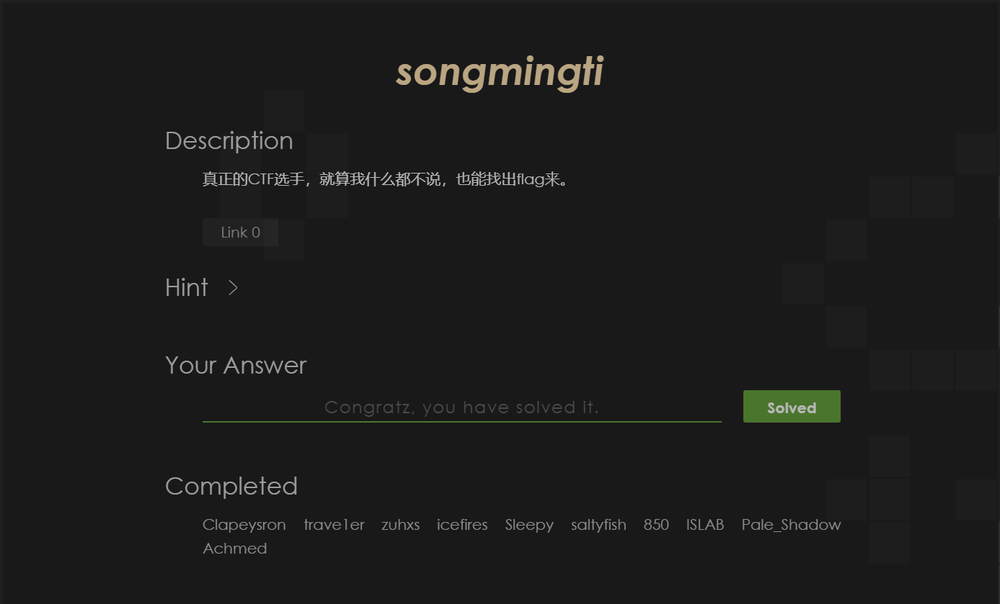
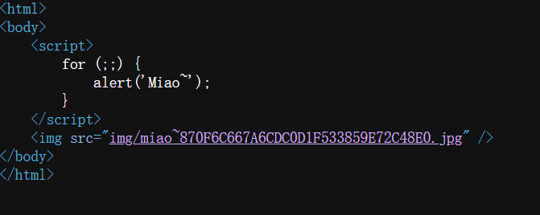
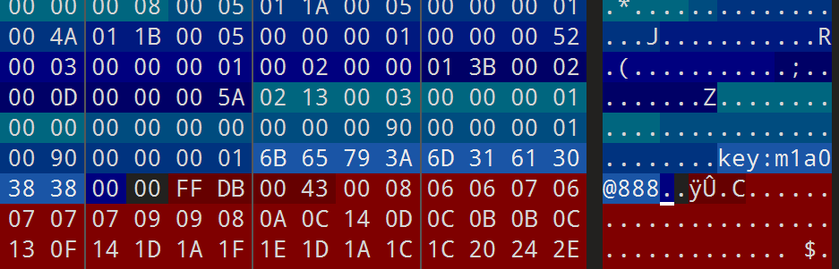
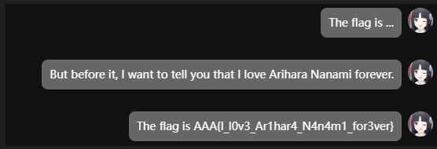
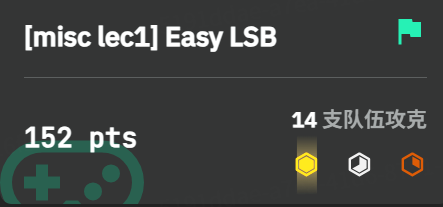
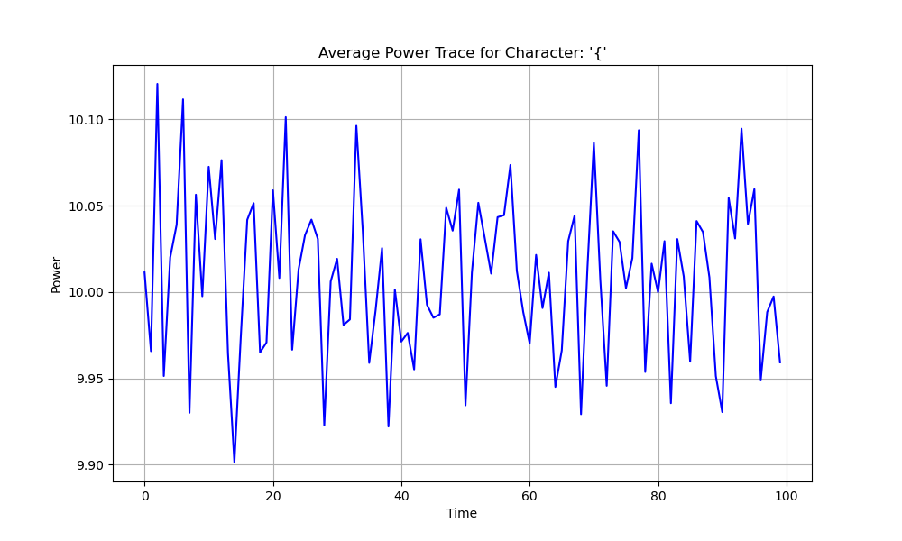
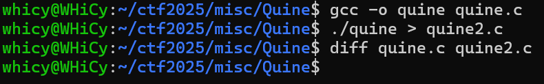

# Misc Lab 2 ：隐写与其他misc

# 1 Challenge 1:songmingti

所得图片用010Editor打开，发现图片在`EOI`​标志后还有一大块没有显示的内容，观察到`FF D8 FF`​推测是加了一张图片进去，接下来就是把这张图片分离提出来


得到图片及flag`AAA{the_true_fans_fans_nmb_-1s!}`​


通过截图：



# 2 Challenge 2:miaomiaomiao

一点点把戏，view-source看一下源码，下载到图片




放进010Editor，exif中观察到一串密码`m1a0@888`​



猜测大概率为工具题，用steghide提取一下隐藏文件，得到`secret_file.txt`​


```
010000010100000101000001011110110100010000110000010111110101100100110000011101010101111101001100001100010110101101100101010111110101001101110100011001010011100101001000001100010110010001100101010111110100110100110001011000010011000001111101
```

每8位二进制转成对应ASCII码，得到对应flag：`AAA{D0_Y0u_L1ke_Ste9H1de_M1a0}`​

通过截图：


# 3 Challenge 3:easy LSB

把图片放进StegSolve，凭借直觉在三个通道0处上发现不对劲，看下数据格式符合我们的直觉，把它提取出来


得到的图片只有一半，于是扔进010Editor，修改一下图片高度由此得到完整图片



获得对应flag`AAA{I_l0v3_Ar1har4_N4n4m1_for3ver}`​通过截图



# 4 Challenge A: Palette Stego

反正zsteg是万能的，放进去操作一下，提出隐写前的flag`AAA{gOoD_joB_P4lEtTE_M0D3_c@N_al$0_57E9o!}`​


虽然要求不能直接用工具，但是为我们提供了思路，根据最终提取出flag的信息，需要遍历图像中每个像素并查出其在palette中的对应颜色，然后获取绿色分量，提取LSB即可重建flag，具体实现如下

```python
from PIL import Image
import sys

def extract_flag(image_path):
    img = Image.open(image_path)
    palette = img.getpalette()
    width, height = img.size   
    bits = []
    
    #逐行遍历所有像素
    for y in range(height):
        for x in range(width):
            # 获取像素对应的调色板索引
            palette_index = img.getpixel((x, y))
            
            # 从调色板中找到该索引对应的绿色值
            green_value = palette[palette_index * 3 + 1]
            
            # 提取其最低有效位 (LSB)
            bits.append(str(green_value & 1))

    byte_stream = "".join(bits)   
    message = ""
    for i in range(0, len(byte_stream), 8):
        byte = byte_stream[i:i+8]
        if len(byte) < 8:
            break
        message += chr(int(byte, 2))   
    return message

if __name__ == "__main__":
    image_file = sys.argv[1]
    flag = extract_flag(image_file)
    print(flag)
```

得到flag是相同的，题目通过截图，附件包含`crack.py`​


# 6 Challenge C：Time&Power

根据hint找了一下`Power Trajectory Diagram`​，加上有这方面的学习，大概理解题目背景，先通过脚本尝试可视化数据，最开始的版本把所有字符处理在了一起，可视化效果很差，而后考虑把每个字符分开并计算了功率曲线的平均值，生成效果示意如下


明确知道最终flag以`0ops{`​开头，先把这几张图调出来




观察发现大概的意思是在对应位对应的字符本应出现的峰值会消失，尝试一个个比对图像，由此得到完整flag`0ops{power_1s_a11_y0u_n55d}`​，题目通过截图，附件包含`analyze.py`​以及各个字符图像


# 8 Challenge E:PPC

## 8.1 polyglot

核心思想是通过两种语言不同的语法屏蔽机制去实现，对于python而言`#`​作为注释会被自动忽略，而对于c而言通过`#if`​可以注释掉python段落，从而达到相同的输出flag的目的，附件包含`polyglot.cpp`​

```python
#if 0
import sys
try:
    with open('flag.txt', 'r') as f:
        sys.stdout.write(f.read())
except FileNotFoundError:
    pass

exit()

#endif
'''
    #include <iostream>
    #include <fstream>
    #include <string>
    int main() {
        std::ifstream file("flag.txt");
        if (file.is_open()) {
        std::string line;
        while (std::getline(file, line)) {
            std::cout << line << std::endl;
        }
        file.close();p
    } 
        return 0;
    }
'''
```

## 8.2 Quine

核心思想是将程序分为两部分：数据部分包含一个字符串，它精确地存储了程序中逻辑部分的源代码。逻辑部分则是一段代码，它的任务是打印出数据部分的字符串内容。然后，利用这个字符串作为数据，再次打印出字符串自身（包括定义它的引号、分号等所有语法结构）。

```c
#include <stdio.h>
char*s="#include <stdio.h>%cchar*s=%c%s%c;%cint main(){printf(s,10,34,s,34,10);return 0;}%c";
int main(){printf(s,10,34,s,34,10);return 0;}
```

验证通过截图，附件包含`quine.c`​


