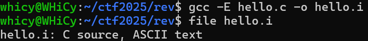
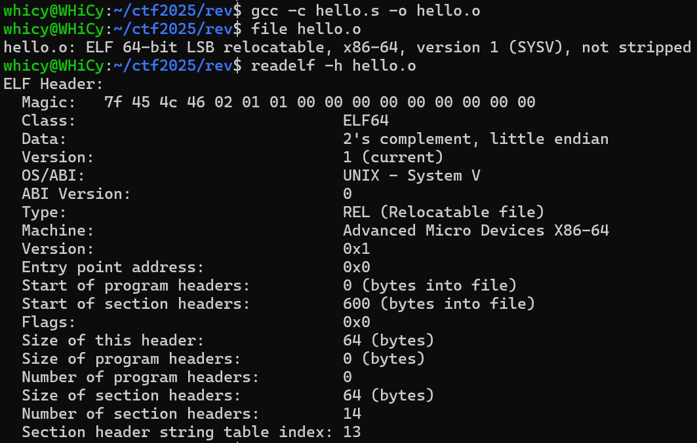
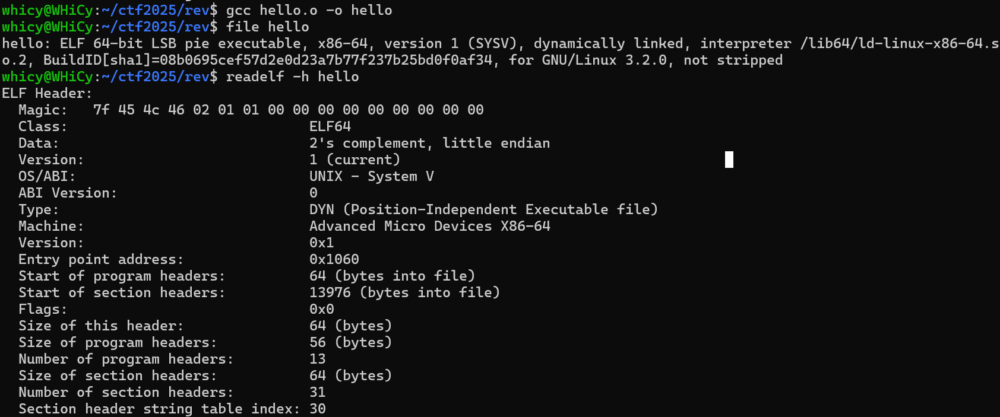
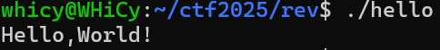
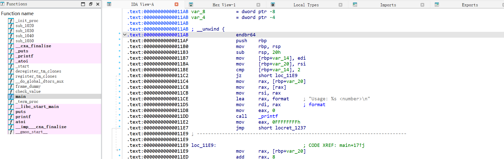
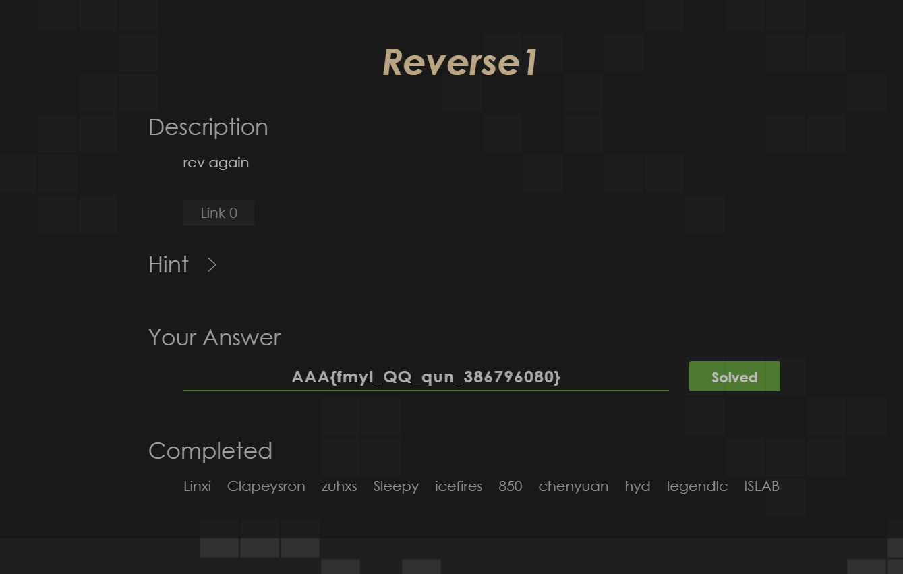

# Rev Lab1：Rev基础

# 1 Task 1：编译流程

复现课上 hello.c 的编译执行流程，并撰写操作报告

- 需要体现预处理、编译、汇编、链接的流程
- 可以使用课上所说的 file / readelf 命令行工具查看文件信息并记录

我们准备简单的`hello.c`​

**步骤 1：预处理** 

预处理阶段主要处理源代码中以 `#`​ 开头的指令，例如 `#include`​ 和 `#define`​。它会把头文件的内容插入到源文件中，并替换所有宏定义。

- 操作命令：

  ```bash
  gcc -E hello.c -o hello.i
  ```
- 文件分析：  
  hello.i 是一个扩展后的 C 源码文件。我们可以查看它的文件类型。

  ```bash
  file hello.i
  ```

  

  ​`file`​ 命令确认了 `hello.i`​ 文件仍然是一个 C 源代码文件。用文本编辑器打开后发现 `stdio.h`​ 的内容已经被完整地包含进来了

**步骤 2：编译**

编译阶段将预处理后的 `hello.i`​ 文件翻译成汇编代码

- 操作命令：  

  ```bash
  gcc -S hello.i -o hello.s
  ```
- 文件分析：  
  ​

  ​`file`​ 命令告诉我们 `hello.s`​ 是一个汇编源文件。它是一个文本文件，用编辑器打开查看内容是 `x86-64`​ 架构的汇编指令。

**步骤 3：汇编** 

汇编阶段使用汇编器将汇编代码 `hello.s`​ 转换成机器语言指令，并将这些指令打包成一种称为可重定位目标程序的格式。

- 操作命令：

  ```bash
  gcc -c hello.s -o hello.o
  ```
- 文件分析：

    
  ​`hello.o`​是一个二进制文件，包含了可以直接在处理器上执行的机器码。 `file`​ 命令显示 `hello.o`​ 是一个 `ELF 64-bit`​ 格式的可重定位文件（`relocatable`​）。使用 readelf 查看 ELF 头信息，输出清晰地表明了文件类型为 `REL`​（可重定位文件），这与我们的预期相符。它还包含了文件的架构（`X86-64`​）等重要信息。

**步骤 4：链接**

链接阶段是将 `hello.o`​ 这样的目标文件与程序所需的库文件（例如，`printf`​ 函数所在的 C 标准库）合并，最终创建一个可以被加载和执行的 可执行目标文件。

- 操作命令：  
  我们直接将 hello.o 文件传递给 gcc 进行链接。

  ```bash
  gcc hello.o -o hello
  ```
- 文件分析：

    
  ​`file`​ 命令显示 `hello`​ 是一个 `ELF 64-bit`​ 的可执行文件（`executable`​）。`dynamically linked`​ 表示它在运行时需要动态链接器（`/lib64/ld-linux-x86-64.so.2`​）来加载共享库。这次 `readelf`​ 显示文件类型为 `EXEC`​（可执行文件），并且给出了程序的入口点地址（`Entry point address`​），这是操作系统开始执行程序代码的位置。

**步骤 5：执行程序**



# 2 Task 2：工具使用

熟悉静态分析工具 IDA 的操作，并撰写操作报告

- 可以用课上的程序示例
- 报告中可以体现的是 IDA 的常见功能、某些快捷键的使用过程以及你觉得对你未来使用 IDA 有帮助的小技巧或者笔记

编写了一个简单的示例程序`auth.c`​

```C
#include <stdio.h>
#include <stdlib.h> // For atoi
#include <string.h>

int check_value(int val) {
    if (val == 1337) {
        return 1; // Success
    } else {
        return 0; // Failure
    }
}

int main(int argc, char* argv[]) {
    if (argc != 2) {
        printf("Usage: %s <number>\n", argv[0]);
        return -1;
    }

    int input_val = atoi(argv[1]);
    int result = check_value(input_val);

    if (result == 1) {
        printf("Access Granted.\n");
    } else {
        printf("Access Denied.\n");
    }
    return 0;
}
```

1. **函数窗口 (Functions Window)** ：在界面左侧的函数窗口中，可以看到 IDA 识别出的所有函数列表。滚动找到 `main`​ 函数。
2. **跳转到函数**：双击 `main`​ 函数，中间的反汇编视图会立刻跳转到 `main`​ 函数的起始地址。

    
3. **图形视图**：在反汇编视图中，按一下**​`空格键`​**​  代码会从文本形式切换为流程图形式。代码块由方框表示，执行流由箭头表示。在 `main`​ 函数的图形视图中，我们可以清晰地看到 `if (argc!= 2)`​ 和 `if (result == 1)`​ 对应的条件分支结构。

    

    - **绿色箭头**：条件为真 (True) 时的跳转。
    - **红色箭头**：条件为假 (False) 时的跳转。
    - **蓝色箭头**：无条件跳转。

**交叉引用** 

交叉引用可以帮助我们快速找到一个函数在何处被调用，或者一个数据（如字符串）在何处被使用。

1. 在 `main`​ 的代码中，我们看到一个 `call check_value`​ 的指令。
2. 单击选中 `check_value`​ 这个名称，然后按下 **​`X`​**​ **键**。
3. IDA 会弹出一个交叉引用列表，显示所有调用 `check_value`​ 的位置。在本例中，它会显示 `main+59`​，表示 `main`​ 函数调用了它。双击列表项即可跳转过去。

    
4. 同样，我们可以在反汇编视图中找到字符串 `"Access Granted."`​。选中它并按 **​`X`​**​ **键**，IDA 会告诉我们这个字符串在 `main`​ 函数的 `printf`​ 调用中被引用。

**重命名与注释**

为了使分析过程更易于理解和回溯，IDA 允许我们重命名变量、函数，并添加注释。

1. **重命名** ：IDA 自动识别的 `check_value`​ 函数可能被命名为 `sub_11B5`​ 之类的默认名称。可以选中函数名，按下 **​`N`​**​ **键**，在弹出的对话框中输入一个更有意义的名称，如 `check_value`​。这会更新整个反汇编数据库中所有对该函数的引用。
2. **添加注释**：在一个复杂的逻辑块旁边，我们可以添加注释来解释它的功能。将光标定位到某一行代码，按下  **​`:`​** ​ **键** 。这会弹出一个可重复注释的输入框，非常适合为代码块写下详细解释。如果只是想添加一个简单的单行注释，可以使用  **​`;`​** ​ **键**。

|快捷键|功能|使用场景与技巧|
| --------| -------------------| --------------------------------------------------------------------------------|
|​**​`Spacebar`​**​|切换文本/图形视图|在图形视图下宏观把握逻辑，在文本视图下查看细节。是分析流程中最常用的快捷键。|
|​**​`X`​**​|查看交叉引用|用于追踪函数调用链和数据流向。|
|​**​`N`​**​|重命名|给函数、变量、地址起个有意义的名字，能极大提升分析效率，让冰冷的代码变得可读。|
|​ **​`:`​** ​ **/**​ **​`;`​** ​|添加注释||
|​**​`G`​**​|跳转到地址/函数|快速导航。|
|​**​`Esc`​**​|后退|IDA 会记录你的跳转历史，按`Esc`​可以像浏览器返回上一页一样，回到之前的位置。|
|​**​`F5`​**​|反编译为伪代码|能将汇编代码一键转换为可读性极高的 C 语言伪代码。|

**笔记与心得：**

1. 对于大多数程序，分析 `main`​ 函数是最佳起点。理解了主逻辑后，再深入到被调用的各个子函数中。

1. 当遇到一个陌生的函数调用时，不要急着深入分析它。先看看它的交叉引用，了解它在整个程序中的作用和调用上下文，可以判断其重要性。
2. 在分析一个新函数时，第一眼先看图形视图。它可以让你在几秒钟内了解函数的基本结构：是否有循环？有多少个条件分支？复杂度如何？
3. 花时间重命名和注释，不是浪费时间，而是对未来自己（或同事）的投资。一个标记清晰的 IDA 数据库，价值远超一个原始的数据库。

了解动态调试工具 GDB 的操作，并撰写操作报告

- GDB 课上演示的内容较少，希望大家能够查阅资料自己学习常见的 gdb 调试命令
- 原版的 GDB 使用较为麻烦，这里推荐 pwndbg/gef 等 gdb 插件
- 报告中可以体现的是 gdb 的常见命令、插件的使用过程等等

‍

断点告诉 GDB 在程序的特定位置暂停执行。`break <位置>`​ 或 `b <位置>`​我们希望程序在 `main`​ 函数开始时停下来`b main`​。Pwndbg 会确认断点已在 `auth.c`​ 的第 12 行设置，也可以直接通过行号设置断点，例如 `b 18`​ 会在调用 `check_value`​ 函数的那一行设置断点。

设置好断点后，就可以开始运行程序， `run`​ 或 `r`​。如果程序需要命令行参数，直接跟在 `run`​ 命令后面。程序开始执行，并在我们设置的 `main`​ 函数断点处暂停。此时，Pwndbg 的上下文窗口会更新，显示程序在 `main`​ 函数第一行暂停时的状态。

​`next`​ 或 `n`​: **步过 (Step Over)** 。执行当前行。如果当前行是函数调用，它会执行整个函数，然后停在下一行，**不会进入**函数内部。

​`step`​ 或 `s`​: **步入**。执行当前行。如果当前行是函数调用，它会暂停在被调用函数的**第一行**。

​`continue`​ 或 `c`​: **继续**。继续执行程序，直到遇到下一个断点或程序结束。

​`finish`​: **完成函数**。继续执行，直到当前函数返回，并暂停在函数返回后的下一条指令。

**打印变量**: `print <变量名>`​ 或 `p <变量名>`​连续按 `n`​ 几次，让程序执行到 `int result = check_value(input_val);`​ 之后。然后可以查看 `result`​ 和 `input_val`​ 的值。

```bash
p input_val
p result
```

输出将会是 `$1 = 123`​ 和 `$2 = 0`​，证明程序逻辑正确。

**内存查看** : Pwndbg 提供 `telescope`​ 命令来查看内存。例如，可以查看栈顶的内存数据：`telescope $rsp`​这会显示栈上的内容，并自动解析指针指向的数据。

**演示一个完整的调试场景：**

1. ​`gdb ./auth`​
2. ​`b check_value`​  (在 `check_value`​ 函数入口下断点)
3. ​`r 1337`​  (使用正确的 "密码" 运行)
4. 程序在 `check_value`​ 函数停下。Pwndbg 上下文显示我们已进入该函数。
5. ​`p val`​  (检查传入的参数 `val`​)

    - 输出: `$1 = 1337`​。参数正确。
6. ​`n`​  (执行 `if`​ 判断)
7. ​`finish`​  (执行完 `check_value`​ 函数并返回)
8. 此时程序回到 `main`​ 函数调用 `check_value`​ 的下一行。
9. ​`p result`​ (检查 `check_value`​ 的返回值)

    - 输出: `$2 = 1`​。返回值正确。
10. ​`c`​ (继续执行)
11. 程序打印 "Access Granted." 并正常退出。

### 常用命令h汇总

1. **设置断点**​`break main`​

2. **启动程序**​`run`​

3. **继续执行程序**​`continue`​

4. **单步执行程序，跳过函数调用**​`next`​

5. **单步执行程序，进入函数调用**：`step`​

6. **显示函数调用栈**​`backtrace`​

7. **显示内存中的内容**​`x/16x \$rsp`​

8. **设置变量的值**​`set \$rax \= 0xdeadbeef`​

9. **显示当前上下文信息**​`context`​

10. **显示堆信息**​`heap`​

11. **显示一段内存区域的内容**​`telescope`​

12. **显示二进制文件中可用的 ROP gadget**​`ropgadget`​

13. **在内存中搜索指定的字符串或模式**​`search "hello"`​

14. **将汇编指令转换成机器码**​`asm`​

15. **显示断点信息**​`breakpoints`​

16. **显示进程的虚拟内存映射**​`vmmap`​

17. **生成用于缓冲区溢出的模式字符串**​`pattern`​

# 3 Task 3：例题复现

## 3.1 Reverse1

将可执行文件拖进IDA，反汇编得到以下结果

```c
int __cdecl __noreturn main(int argc, const char **argv, const char **envp)
{
  _BYTE v3[30]; // [esp+14h] [ebp-3Ch] BYREF
  _BYTE v4[26]; // [esp+32h] [ebp-1Eh] BYREF
  unsigned int i; // [esp+4Ch] [ebp-4h]

  qmemcpy(v4, "MMMwjau`S]]S}ybS?4:;5:<4<q", sizeof(v4));
  printf("Please input flag: ");
  scanf("%s", v3);
  for ( i = 0; i < 0x1A; ++i )
  {
    if ( (v3[i] ^ 0xC) != v4[i] )
    {
      printf("Your flag is not right.");
      exit(0);
    }
  }
  printf("You are right!");
  exit(0);
}
```

程序的基本逻辑是加载一个 26 字节的加密字符串 `v4`​，对于用户输入的flag，取用户输入的第 `i`​ 个字符（`v3[i]`​），与十六进制数 `0xC`​ 进行异或运算，然后将结果与`v4[i]`​进行比较。由于异或运算的性质，我们只要重复这个过程即可获得`flag`​写一个简单的脚本

```python
secret = "MMMwjau`S]]S}ybS?4:;5:<4<q"
key = 0xC
flag = ""
for char in secret:
  decrypted_char = chr(ord(char) ^ key)
  flag += decrypted_char
print(flag)
```

得到对应flag`AAA{fmyl_QQ_qun_386796080}`​Reverse1通过截图，附件包含`crack.py`​



## 3.2 simple_RE

相似的流程，关键的两个函数核心的思想是将输入字符串进行base64加密后与指定字符串进行比较，唯一需要注意的是加密非标码，而是进行了相应替换

```C
int __fastcall main(int argc, const char **argv, const char **envp)
{
  int v4; // [rsp+24h] [rbp-44h] BYREF
  void *Buf1; // [rsp+28h] [rbp-40h] BYREF
  char v6[56]; // [rsp+30h] [rbp-38h] BYREF

  sub_401770(argc, argv, envp);
  printf("please input the flag:");
  scanf("%s", v6);
  Buf1 = 0LL;
  sub_401570(v6, &Buf1, &v4);
  if ( !memcmp(Buf1, a5mc58bphliax7j, v4) )
    printf("\nsuccess!");
  else
    printf("\nfailed!");
  if ( Buf1 )
    free(Buf1);
  return 0;
}
```

写一个类似的脚本，得到对应flag`NSSCTF{a8d4347722800e72e34e1aba3fe914ae}`​，附件包含`exploit.py`​

```C
import base64
def decode_with_maketrans():
    c1 = "qvEJAfHmUYjBac+u8Ph5n9Od17FrICL/X0gVtM4Qk6T2z3wNSsyoebilxWKGZpRD" 
    c2 = "ABCDEFGHIJKLMNOPQRSTUVWXYZabcdefghijklmnopqrstuvwxyz0123456789+/" 
    enc = "5Mc58bPHLiAx7J8ocJIlaVUxaJvMcoYMaoPMaOfg15c475tscHfM/8=="
    translation_table = str.maketrans(c1, c2)
    standard_b64_str = enc.translate(translation_table)
    decoded_bytes = base64.b64decode(standard_b64_str)
    return decoded_bytes
result = decode_with_maketrans()
print(result)
```

‍
