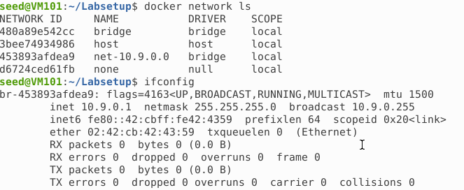

# Lab 1 数据包嗅探和伪造实验

Course: 网络安全原理与实践
Lesson Date: 2026年3月5日
Status: Complete
Type: Lab

---

# 实验任务集 1：使用Scapy嗅探和伪造数据包

我们首先参照实验环境设置部分来获得正确的接口，分别执行`ifconfig`和`docker network ls` ，得到的正确接口名称是一致的为`br-453893afdea9`



这里我们附上一张网络结构图方便后续理解

```verilog
Attacker (VM)        10.9.0.1
        │
        │
docker bridge (br-453893afdea9)
        │
 ┌──────┴──────┐
 │             │
hostA       hostB
10.9.0.5    10.9.0.6
```

## 任务 1.1：嗅探包

### 任务 1.1A

我们在容器中根据正确的接口补充得到嗅探代码如下，命名为`sniffer.py`

```python
#!/usr/bin/env python3
from scapy.all import *
def print_pkt(pkt):
  pkt.show()
pkt = sniff(iface='br-453893afdea9', filter='icmp', prn=print_pkt)
```

执行`chmod a+x sniffer.py` 赋予程序可执行权限，并在root权限下运行`sniffer.py` 此时在宿主机执行`ping 10.9.0.5` 操作可以看到成功捕获到包


我们切换到seed账号，再次运行程序，发现嗅探失败，这是因为数据包嗅探需要访问呢网卡的raw socket，而其需要root权限，普通用户没有该权限


### 任务 1.1B

1. 只捕获ICMP包
    
    保持原代码不变即可`pkt = sniff(iface='br-453893afdea9', filter='icmp', prn=print_pkt)` ，这次我们采用两个容器之间通信，正常捕获到包
    
    
    
2. 捕获来自某个特定 IP 地址并且目标端口号为 23 的 TCP 包
    
    修改代码为`pkt=sniff(iface='br-453893afdea9',filter='src host 10.9.0.5 and tcp dst port 23',prn=print_pkt)` ，再次进行嗅探，我们让其中一台容器通过telnet通信尝试连接另一台容器即可捕获到包`telnet 10.9.0.6`
    
    
    
3. 捕获来自或去往某个特定网络的包
    
    修改代码为`pkt=sniff(iface='br-453893afdea9', filter='net=128.230.0.0/16',prn=print_pkt)` ，再次进行嗅探，我们让其中一台容器尝试`ping 128.230.0.1`即可捕获到包
    
    
    

## 任务 1.2：伪造ICMP包

我们构造如下的代码`spoofer.py` ，从而伪造源IP，在攻击者机器上进行运行

```python
#!/usr/bin/env python3
from scapy.all import *
a = IP()
a.src = "10.9.0.6"
a.dst = "10.9.0.5"
b = ICMP() 
pkt = a/b # 操作符被 IP 类重载，因此它不再表示除法，而是意味着将b作为a的负载字段并相应地修改a的字段
send(pkt)
```

我们打开wireshark选择相应接口，并进行icmp过滤，可以看到捕获到了我们伪造的请求包以及相应的响应包


## 任务 1.3：实现Traceroute

我们考虑两种方法，一种是重复上面的发包过程进行试探直到收到响应来估测距离，关键代码是这样的

```python
a = IP(dst="8.8.8.8", ttl=k)
b = ICMP()
send(a/b)
```

另一种考虑完成一个自动化脚本进行traceroute，我们的脚本`traceroute.py`是这样的：

```python
#!/usr/bin/env python3
from scapy.all import *
import sys
target = sys.argv[1]
print("Traceroute to", target)
for ttl in range(1, 30):
    pkt = IP(dst=target, ttl=ttl) / ICMP()
    reply = sr1(pkt, verbose=0, timeout=2)
    if reply is None:
        print(f"{ttl}\t*")
    else:
        print(f"{ttl}\t{reply.src}")
        if reply.type == 0:
            print("Destination reached.")
            break
```

运行时可以通过指定目标地址来测探距离，我们以`10.10.0.21` 为例，如下图，证明距离为4


这里补充一下如果选择`8.8.8.8`这样的地址结果可能是这样的，这是由于很多大型互联网服务的服务器或其前端防护设备会禁止直接响应 ICMP Echo Request或者限制 ICMP 的速率；因此traceroute包最终到达服务器时，服务器不会返回 ICMP Echo Reply


## 任务 1.4：嗅探和伪造结合

我们构造的核心代码如下`sniff_spoof.py`

```python
#!/usr/bin/env python3
from scapy.all import *
def spoof_pkt(pkt):
    if ICMP in pkt and pkt[ICMP].type == 8:   # Echo Request
        ip = IP(src=pkt[IP].dst, dst=pkt[IP].src)
        icmp = ICMP(type=0, id=pkt[ICMP].id, seq=pkt[ICMP].seq)
        data = pkt[Raw].load if Raw in pkt else b''
        reply = ip/icmp/data
        send(reply, verbose=0)
        print("Spoofed reply to", pkt[IP].src)
sniff(iface='br-453893afdea9',filter="icmp", prn=spoof_pkt)
```

我们在用户容器上分别ping以下三个IP地址

1. `ping 1.2.3.4`
    
    如图，虽然真实主机不存在，但是由于脚本嗅探到并伪造了回复，所以ping被欺骗
    
    
    
2. `ping 10.9.0.99` 
    
    如图，不会收到回复，这是由于`10.9.0.99` 来自子网内部，不经过网关，然而系统在使用ARP获取目标MAC时没有主机响应，所以请求没有被发出，攻击程序也就抓不到包无法伪造
    
    
    
    这里补充一下如果是子网内存在的主机，这时候会看到两个reply（Duplicated），得到的结论是当目标在同一局域网时，必须先成功完成 ARP 才会发送 ICMP
    
    
    
3. `ping 8.8.8.8` 
    
    此时看到两个reply，一个reply来自真实主机，一个则是我们伪造的，符合我们的预计
    
    