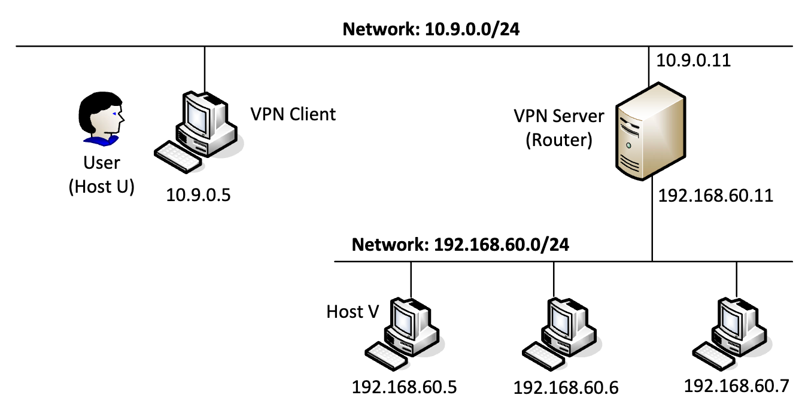

# Lab 5 VPN隧道实验

Course: 网络安全原理与实践
Lesson Date: 2026年4月12日
Status: Complete
Type: Lab

---

# 任务1：设置网络

我们对于容器的shell名进行修改来便于展示



对照上图，我们需要保证以下配置正常

- 主机U可以与VPN Server通信
    
    
    
- VPN Server可以与主机V通信
    
    
    
- 主机U不能与主机V通信
    
    
    
- 在路由器上运行 tcpdump，并嗅探每个网络上的流量以测试你是否可以捕获数据包
    
    我们在路由器端运行ifconfig，查看其两张网卡的配置，分别与10.9.0.0/24网段和192.168.60.0/24网段通信
    
    
    
    那么分别运行`tcpdump -i eth0 -n`和`tcpdump -i eth1 -n`并通过ping指令在对应容器上发包进行嗅探
    
    
    
    
    

# 任务2：创建和配置TUN接口

我们使用的程序如下`tun.py`

```python
#!/usr/bin/env python3

import fcntl
import struct
import os
import time
from scapy.all import *

TUNSETIFF = 0x400454ca
IFF_TUN   = 0x0001
IFF_TAP   = 0x0002
IFF_NO_PI = 0x1000

# 创建一个tun接口
tun = os.open("/dev/net/tun", os.O_RDWR)
ifr = struct.pack('16sH', b'tun%d', IFF_TUN | IFF_NO_PI)
ifname_bytes  = fcntl.ioctl(tun, TUNSETIFF, ifr)

# 获取接口的名称
ifname = ifname_bytes.decode('UTF-8')[:16].strip("\x00")
print("Interface Name: {}".format(ifname))

while True:
   time.sleep(10)
```

## 任务2.A：接口名称

我们在主机U上运行tun.py程序，并切换至另一终端执行`ip address` 打印网络接口，出现`tun0` 


为了改变接口名称，我们只需要对这一行代码进行修改`ifr = struct.pack('16sH', b'tun%d', IFF_TUN | IFF_NO_PI)` ，我们将接口名称改为自己的姓`ifr = struct.pack('16sH', b'song%d', IFF_TUN | IFF_NO_PI)` 重新运行并查看，可以看到重命名的端口已经被创建


## 任务2.B：设置TUN接口

我们在程序中加入

```markup
os.system("ip addr add 192.168.53.99/24 dev {}".format(ifname))
os.system("ip link set dev {} up".format(ifname))
```

从而由程序自动配置接口ip地址并打开该接口，我们再次运行脚本并执行ip address


可以观察到接口被启用（UP）并有了ip地址，可以用于数据包收发

## 任务2.C：从TUN接口读取数据包

我们对tun.py中的程序段做以下修改

```markup
while True:
  # 从tun接口获取一个数据包
  packet = os.read(tun, 2048)
  if packet:
    ip = IP(packet)
    print(ip.summary())
```

运行修改后的程序，我们在主机U上ping 192.168.53.1，打印出了接收到的数据包，这是因为给TUN配置了192.168.53.99/24，内核认为来自该网段的包会被路由到tun口，从而被程序打印


而尝试ping 192.168.60.1则不会有输出，这是因为该网段匹配路由后会走eth1网卡从而不经过tun，也不会被打印内容

## 任务2.D：将数据包写入TUN接口

我们对于程序进行修改使得TUN接口在受到ICMP echo request包后可以伪造对应的echo reply包，核心部分修改如下

```c
while True:
    packet = os.read(tun, 2048)
    if not packet:
        continue

    ip = IP(packet)
    print(ip.summary())

    # 判断是否是 ICMP echo request
    if ip.haslayer(ICMP) and ip[ICMP].type == 8:
        print(">>> ICMP Echo Request received!")

        # 构造 Echo Reply
        newip = IP(src=ip.dst, dst=ip.src)
        newicmp = ICMP(type=0, id=ip[ICMP].id, seq=ip[ICMP].seq)
        newpkt = newip / newicmp / ip[ICMP].payload

        # 发送回 TUN
        os.write(tun, bytes(newpkt))

        print("<<< ICMP Echo Reply sent!")
```

运行代码，观察到tun.py成功进行了reply发包，而ping的结果也成功了


# 任务3：通过隧道将IP数据包发送到VPN服务器

我们将在VPN Server上运行 tun_server.py 程序。这个程序只是一个标准的UDP服务器程序。它监听端口 9090 并打印出接收到的任何内容。程序假设UDP有效负载字段中的数据是一个IP数据包，因此它将有效负载转换为Scapy IP 对象，并打印出这个IP数据包的源IP地址和目标IP地址

```python
#!/usr/bin/env python3

from scapy.all import *

IP_A = "0.0.0.0"
PORT = 9090

sock = socket.socket(socket.AF_INET, socket.SOCK_DGRAM)
sock.bind((IP_A, PORT))

while True:
   data, (ip, port) = sock.recvfrom(2048)
   print("{}:{} --> {}:{}".format(ip, port, IP_A, PORT))
   pkt = IP(data)
   print("   Inside: {} --> {}".format(pkt.src, pkt.dst))
```

我们对于上面tun.py进行修改，重命名为 tun_client.py，并在主机U上运行

```c
#!/usr/bin/env python3

import fcntl
import struct
import os
import socket
from scapy.all import *

TUNSETIFF = 0x400454ca
IFF_TUN   = 0x0001
IFF_NO_PI = 0x1000

tun = os.open("/dev/net/tun", os.O_RDWR)
ifr = struct.pack('16sH', b'song%d', IFF_TUN | IFF_NO_PI)
ifname_bytes = fcntl.ioctl(tun, TUNSETIFF, ifr)

ifname = ifname_bytes.decode('UTF-8')[:16].strip("\x00")
print("Interface Name:", ifname)

os.system("ip addr add 192.168.53.99/24 dev {}".format(ifname))
os.system("ip link set dev {} up".format(ifname))

sock = socket.socket(socket.AF_INET, socket.SOCK_DGRAM)
SERVER_IP = "10.9.0.11"
SERVER_PORT = 9090

while True:
    packet = os.read(tun, 2048)
    if packet:
        ip = IP(packet)
        print("Send:", ip.src, "->", ip.dst)
        sock.sendto(packet, (SERVER_IP, SERVER_PORT))
```

运行后可以看到服务器端打印下面内容，因为主机U ping产生了一个ICMP包并被TUN捕获封装进UDP，发送到服务器并被解析成IP


这是因为路由表中没有对应网段的配置，默认走eth0网卡，只要添加路由项使去往该网段的流量走tun即可`ip route add 192.168.60.0/24 dev song0` 重新进行ping，可以看到客户端输出，证明数据包已经通过UDP隧道到达服务器


# 任务4：设置VPN服务器

我们对于`tun_server.py`进行修改，使其将接收到的数据包由内核路由到最终目的地。修改后的可以执行以下操作：创建一个TUN接口并对其进行配置；从 socket 接口获取数据，将接收到的数据视为IP数据包；将数据包写入 TUN 接口。为了成功运行，我们需要打开IP forwarding来使vpn服务器起到网关的作用。修改后的代码如下

```python
#!/usr/bin/env python3

import fcntl
import struct
import os
import socket
from scapy.all import *

TUNSETIFF = 0x400454ca
IFF_TUN   = 0x0001
IFF_NO_PI = 0x1000

IP_A = "0.0.0.0"
PORT = 9090

tun = os.open("/dev/net/tun", os.O_RDWR)
ifr = struct.pack('16sH', b'server%d', IFF_TUN | IFF_NO_PI)
ifname_bytes = fcntl.ioctl(tun, TUNSETIFF, ifr)

ifname = ifname_bytes.decode('UTF-8')[:16].strip("\x00")
print("Interface Name:", ifname)

os.system("ip addr add 192.168.53.1/24 dev {}".format(ifname))
os.system("ip link set dev {} up".format(ifname))

sock = socket.socket(socket.AF_INET, socket.SOCK_DGRAM)
sock.bind((IP_A, PORT))

while True:
    data, (ip, port) = sock.recvfrom(2048)

    print("{}:{} --> {}:{}".format(ip, port, IP_A, PORT))

    pkt = IP(data)
    print("   Inside: {} --> {}".format(pkt.src, pkt.dst))

    os.write(tun, data)
```

我们在客户端和服务器端运行代码，特别地，我们在vpn server上运行`tcpdump -i eth1 -n` 通过嗅探展示结果。如下，证明ICMP数据包成功到达主机V


# 任务5：处理双向流量

我们对于两者的while循环分别进行修改使其能处理双向的流量，现在的代码分别如下：`tun_client.py`  `tun_server.py` ，注意运行前要检查自己的路由表观察是否有对应网段路由项，没有需要进行添加`ip route add 192.168.60.0/24 dev song0`

```python
#!/usr/bin/env python3
import fcntl
import struct
import os
import socket
import select
from scapy.all import *
TUNSETIFF = 0x400454ca
IFF_TUN   = 0x0001
IFF_NO_PI = 0x1000
tun = os.open("/dev/net/tun", os.O_RDWR)
ifr = struct.pack('16sH', b'song%d', IFF_TUN | IFF_NO_PI)
ifname_bytes = fcntl.ioctl(tun, TUNSETIFF, ifr)
ifname = ifname_bytes.decode('UTF-8')[:16].strip("\x00")
print("Interface Name:", ifname)
os.system("ip addr add 192.168.53.99/24 dev {}".format(ifname))
os.system("ip link set dev {} up".format(ifname))
sock = socket.socket(socket.AF_INET, socket.SOCK_DGRAM)
SERVER_IP = "10.9.0.11"
SERVER_PORT = 9090

while True:
    ready, _, _ = select.select([sock, tun], [], [])
    for fd in ready:
        if fd == sock:
            data, (ip, port) = sock.recvfrom(2048)
            pkt = IP(data)
            print("From socket <==:", pkt.src, "->", pkt.dst)
            os.write(tun, data)
        if fd == tun:
            packet = os.read(tun, 2048)
            pkt = IP(packet)
            print("From tun    ==>", pkt.src, "->", pkt.dst)
            sock.sendto(packet, (SERVER_IP, SERVER_PORT))
```

```python
#!/usr/bin/env python3
import fcntl
import struct
import os
import socket
import select
from scapy.all import *

TUNSETIFF = 0x400454ca
IFF_TUN   = 0x0001
IFF_NO_PI = 0x1000

IP_A = "0.0.0.0"
PORT = 9090
tun = os.open("/dev/net/tun", os.O_RDWR)
ifr = struct.pack('16sH', b'server%d', IFF_TUN | IFF_NO_PI)
ifname_bytes = fcntl.ioctl(tun, TUNSETIFF, ifr)
ifname = ifname_bytes.decode('UTF-8')[:16].strip("\x00")
print("Interface Name:", ifname)
os.system("ip addr add 192.168.53.1/24 dev {}".format(ifname))
os.system("ip link set dev {} up".format(ifname))
sock = socket.socket(socket.AF_INET, socket.SOCK_DGRAM)
sock.bind((IP_A, PORT))
client_addr=None
while True:
    ready, _, _ = select.select([sock, tun], [], [])
    for fd in ready:
        if fd == sock:
            data, (ip, port) = sock.recvfrom(2048)
            pkt = IP(data)
            print("From socket <==:", pkt.src, "->", pkt.dst)
            os.write(tun, data)
            client_addr = (ip, port)
        if fd == tun:
            packet = os.read(tun, 2048)
            pkt = IP(packet)
            print("From tun    ==>", pkt.src, "->", pkt.dst)
	          if client_addr:
	            sock.sendto(packet, client_addr)
```

我们重新运行代码，在主机U上分别ping和telnet连接主机V，可以看到都是成功的


我们打开wireshark，可以看到U和VPN server通信的UDP包以及从192.168.53.99和192.168.60.5通信的包


我们来梳理一下整个数据包的流动，它由主机U发出ping 192.168.60.5，经过路由走song0，被tun_client.py封装为UDP包发送给VPN Server，server接受并解封装，写入server的TUN接口交给内核，并由内核进行自动转发到达主机V；回包由V生成ICMP reply发送到VPN Server，查路由走tun后又tun_server.py封装成UDP包发送给client，client将其写回tun并交给内核，内核交给ping程序显示echo reply

# 任务6：隧道中断实验

我们在保持telnet连接的情况下，选择中断其中一方的tun程序，会发现无法回显，窗口没有响应被卡住，这是因为TCP数据包无法发出，此时TCP连接并没有断开，而是不停重传试图发送；如果在短时间内重新建立连接，可以看到之前输入的数据被成功发送，连接继续正常工作（太长有可能超时放弃链接）

这是因为 TCP 是一种可靠传输协议，具有重传机制。当网络暂时中断时，TCP 会持续重传未确认的数据包。一旦网络恢复，这些数据包可以成功到达目的地，从而维持连接。如果重传次数超过限制，TCP 将认为连接不可用并终止连接。

# 任务7：主机V上的路由实验

在我们的设置中，主机 V 的路由表有一个默认设置：去往任何目的地的数据包，除了 192.168.60.0/24 网络，将被自动路由到VPN服务器；但在现实世界中，主机 V 可能距离VPN服务器有多跳，默认路由条目可能无法保证将返回的数据包路由回VPN服务器。我们必须正确设置专用网络内的路由表，以确保将去往隧道另一端的数据包路由到VPN服务

为了模拟这种情况，我们从主机V中删除默认条目`ip route del default`然后在路由表中添加一个更具体的条目，以便可以将返回的数据包路由回VPN服务器`ip route add 192.168.53.0/24 via 192.168.60.11` 重新执行上述操作是成功的

# 任务8：专用网络之间的VPN

我们进行新的实验配置，通过docker-compose2.yml构建新的容器设置，新的拓扑图如下


由于连接本质上还是一对一的客户服务器流量转发，所以我们的代码实际上并不需要更改（甚至是server ip）我们只需要保证两边的路由正确：在vpn_client上执行`ip route add 192.168.60.0/24 dev song0` ，在vpn_server上执行`ip route add 192.168.50.0/24 dev server0`

运行代码后在Host U尝试ping和telnet Host V都成功了


我们在wireshark中查看一下包来证明数据包通过了隧道，其中UDP包在两个router之间通信。tcp包证明了两台主机之间的通信


我们再来梳理一下这个流程（这里仅展示从Host U去Host V的过程，返程同理）

```python
HostU (192.168.50.5)
        ↓
默认网关 → VPN_Client (192.168.50.12)
        ↓
路由：192.168.60.0 → TUN
        ↓
tun_client.py
        ↓
UDP 封装
        ↓
互联网（10.9.0.12 → 10.9.0.11）
        ↓
tun_server.py
        ↓
写入 TUN
        ↓
Router 内核
        ↓
转发到 192.168.60.5
        ↓
HostV
```

# 任务9：用TAP接口实验

我们在第二个实验环境稍微修改代码使其支持tap接口

```python
#!/usr/bin/env python3
import fcntl, struct, os, socket, select
from scapy.all import *

TUNSETIFF = 0x400454ca
IFF_TAP   = 0x0002   # ✅ 改这里
IFF_NO_PI = 0x1000

# 创建 TAP
tap = os.open("/dev/net/tun", os.O_RDWR)
ifr = struct.pack('16sH', b'song%d', IFF_TAP | IFF_NO_PI)
ifname_bytes = fcntl.ioctl(tap, TUNSETIFF, ifr)

ifname = ifname_bytes.decode()[:16].strip("\x00")
print("Interface Name:", ifname)

# 配置
os.system(f"ip addr add 192.168.53.99/24 dev {ifname}")
os.system(f"ip link set dev {ifname} up")

sock = socket.socket(socket.AF_INET, socket.SOCK_DGRAM)
SERVER_IP = "10.9.0.11"
SERVER_PORT = 9090

while True:
    ready, _, _ = select.select([sock, tap], [], [])

    for fd in ready:

        # 从服务器收到
        if fd == sock:
            data, _ = sock.recvfrom(2048)
            ether = Ether(data)
            print("From socket <==:", ether.summary())

            os.write(tap, data)

        # 从 TAP 收到
        if fd == tap:
            packet = os.read(tap, 2048)
            ether = Ether(packet)
            print("From tap    ==>", ether.summary())

            sock.sendto(packet, (SERVER_IP, SERVER_PORT))
```

```python
#!/usr/bin/env python3
import fcntl, struct, os, socket, select
from scapy.all import *

TUNSETIFF = 0x400454ca
IFF_TAP   = 0x0002   # ✅ 改这里
IFF_NO_PI = 0x1000

IP_A = "0.0.0.0"
PORT = 9090

# 创建 TAP
tap = os.open("/dev/net/tun", os.O_RDWR)
ifr = struct.pack('16sH', b'server%d', IFF_TAP | IFF_NO_PI)
ifname_bytes = fcntl.ioctl(tap, TUNSETIFF, ifr)

ifname = ifname_bytes.decode()[:16].strip("\x00")
print("Interface Name:", ifname)

os.system(f"ip addr add 192.168.53.1/24 dev {ifname}")
os.system(f"ip link set dev {ifname} up")

sock = socket.socket(socket.AF_INET, socket.SOCK_DGRAM)
sock.bind((IP_A, PORT))

client_addr = None

while True:
    ready, _, _ = select.select([sock, tap], [], [])

    for fd in ready:

        # 来自 client
        if fd == sock:
            data, (ip, port) = sock.recvfrom(2048)
            ether = Ether(data)
            print("From socket <==:", ether.summary())

            os.write(tap, data)
            client_addr = (ip, port)

        # 来自 TAP
        if fd == tap:
            packet = os.read(tap, 2048)
            ether = Ether(packet)
            print("From tap    ==>", ether.summary())

            # 🔥 ARP spoof 示例（可选）
            if ARP in ether and ether[ARP].op == 1:
                FAKE_MAC = "aa:bb:cc:dd:ee:ff"
                arp = ether[ARP]

                newpkt = Ether(dst=ether.src, src=FAKE_MAC) / ARP(
                    op=2,
                    psrc=arp.pdst,
                    pdst=arp.psrc,
                    hwsrc=FAKE_MAC,
                    hwdst=ether.src
                )

                print("***** Fake ARP:", newpkt.summary())
                os.write(tap, bytes(newpkt))

            if client_addr:
                sock.sendto(packet, client_addr)
```

我们尝试`ping 192.168.53.1` ，得到现象如下，也就是看得到发送ICMP之前的ARP请求；它在TUN中没有出现是因为TUN在IP层只能看到IP/ICMP，但是TAP工作在链路层可以看到ARP流量


我们对任意IP地址进行arping，注意需要通过我们创建的接口`arping -I song0 1.2.3.4` ，如下，在client端显示timeout但在server端则有结果


我们来解释一下原因，这是因为ARP是链路层协议，仅在本地网络上通过广播方式传播，虽然 TAP 接口可以传输以太网帧，但当前实现仅通过 UDP 转发帧，并未构建真正的二层广播域。因此客户端发送的 ARP 请求无法像在本地网络中那样被正确处理。相比之下，服务器上的 ARP 请求和伪造回复在同一 TAP 接口内完成，因此能够成功