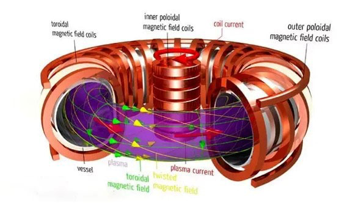
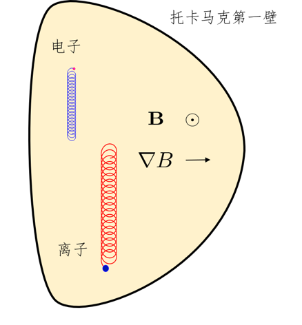
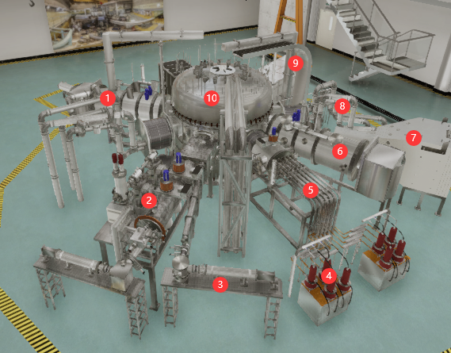
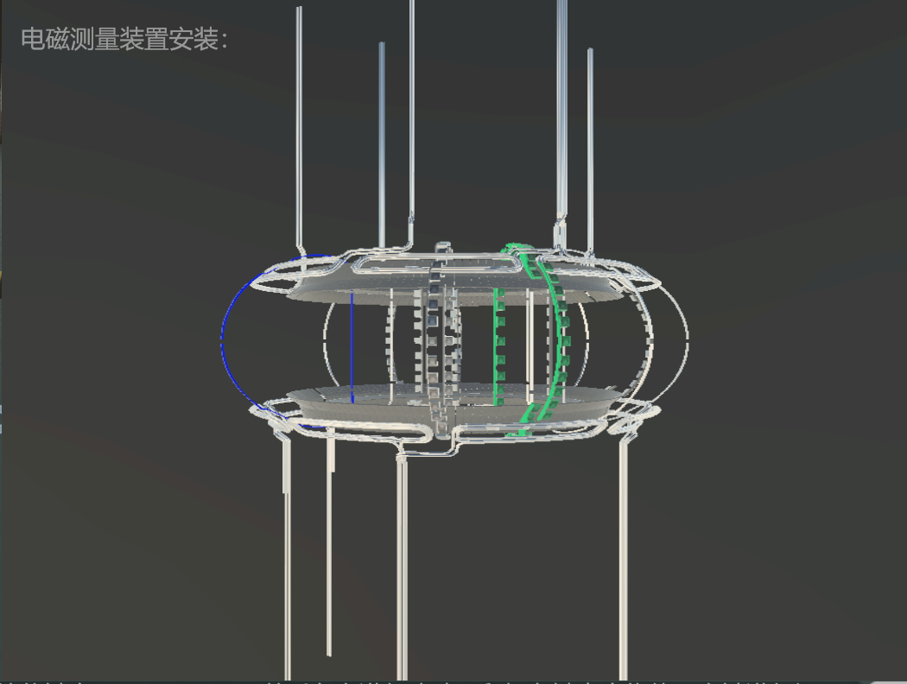
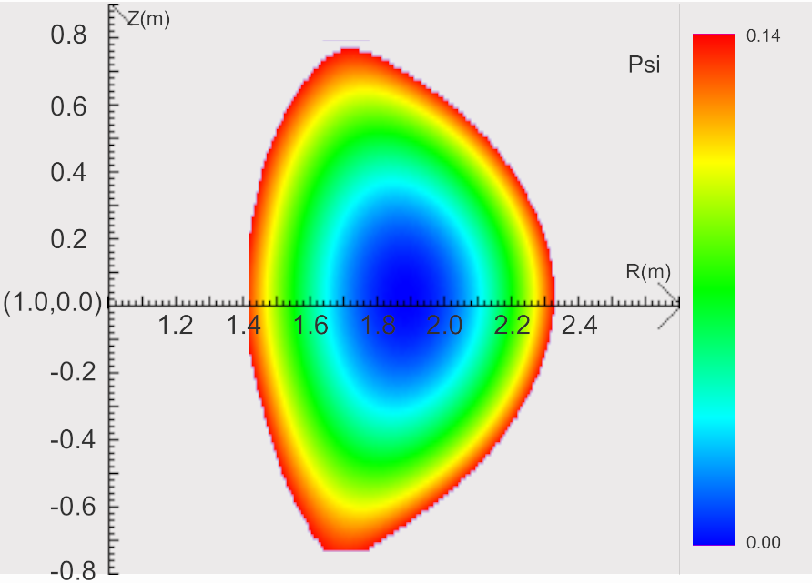
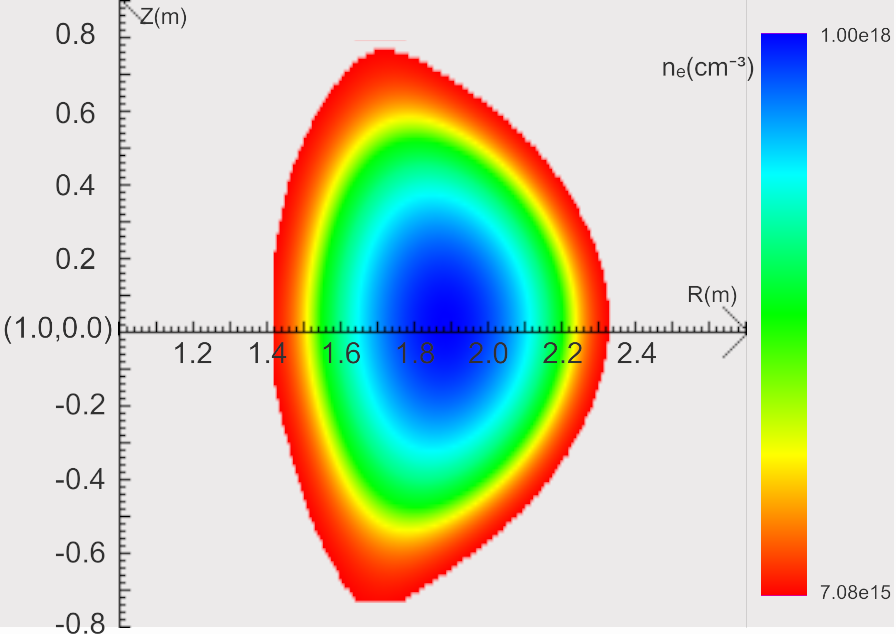

# 托卡马克等离子体物理虚拟仿真实验

2024/9/18

# 一、实验综述

## 1、实验目的

1. 辨识托卡马克等离子体装置主要构成部分与功能；
2. 认知并阐明磁约束超高温等离子体脉冲放电稳定运行和能量增益条件；
3. 从带电粒子在复杂磁场位形的运动轨迹规律中理解等离子体“约束”的条件与调控方案。

## 2、实验背景

核聚变能在大规模商业应用之前需要解决两大关键问题：一个是**<u>实现核聚变反应的持续进行，并获得聚变能量增益</u>**；另一个是**<u>聚变反应产生的能量转化为可实际应用的热能，并能产生出足够的氚保证聚变反应自持</u>**。本实验主要关注第一个问题托卡马克等离子体物理过程。

托卡马克主要是**<u>由外部线圈产生的环形磁场约束等离子体的一种磁约束核聚变研究装置</u>**。在等离子体实验中，首先通过中心螺线管的电磁线圈在装置中产生环向电场击穿并加热等离子体，同时利用外部的高功率射频波、中性束等加热手段产生高温高压等离子体。托卡马克等离子体的约束不仅仅只靠环形磁场，还必须同时使用**<u>极向磁场来实现等离子体的压力和磁力的平衡</u>**。托卡马克中的极向磁场主要是由环形等离子体电流自身产生。环向磁场和极向磁场共同形成了一个沿着装置环形的螺旋型磁场。

托卡马克高温等离子体真空室中，面向等离子体的部件通畅称为第一壁部件。第一壁部件会受到来自等离子体的高能粒子轰击和热负荷冲击，早期托卡马克采用圆形截面，并使用限制器来确定等离子体边界，限制器的表面位置决定了等离子体的**最外闭合磁面（last closed flux surface，LCFS）** ,限制器的主要作用是避免来自等离子体的高能粒子对其他第一壁材料的损伤。但是由于限制器与等离子体直接接触，其表面产生的杂质和气体会污染等离子体，且热负荷会导致限制器表面材料腐蚀乃至熔化而产生杂质污染等离子体。20 世纪 50 年代开始发展 D 形截面托卡马克，通过磁场控制改变等离子体拉长比与三角形变，并采用“偏滤器”。等离子体电流与外部同向的极向场线圈电流共同产生了极向磁场为零的点，磁力线通过该点的面称为分界面，即 LCFS。在 LCFS 内部的磁面是闭合的，而位于其外侧的侧面是开口的，称为**刮削层(scrape-off layer, SOL)** 。从芯部等离子体跨越磁力线的高能粒子通过 LCFS 进入刮削层，沿着磁力线流向偏滤器靶板，偏滤器材料表面释放的杂质会被电离并受等离子体流冲刷回到偏滤器材料表面，从而实现过滤杂质、排出粒子的功能。

## 3、实验原理

### 1. **核聚变反应**

   **<u>核聚变反应是指两个较轻的原子核在一定条件下结合成一个较重的原子核，并伴随着大量能量释放的过程。</u>**

   最容易发生的核聚变反应是氢元素的同位素氘和氚，在一亿度的高温下聚变生成一个氦核和一个中子的反应，同时放出 17.6 $MeV$ 的能量

   $\ce{^2_1H +^3_1H-> ^4_2 He(3.52MeV) + ^1_0n(14.06MeV)}$

   原料中的氘在海水中大量存在；而氚的半衰期为 12 年，无法在自然界存在，但可以通过中子与锂元素的核反应制备

   $\ce{^6_3Li +^1_0n->^3_1H +^4_2He}$

   以上反应的原料丰富，聚变产物清洁无辐射。因此，聚变能源被认为是人类社会发展能源需求的最终解决方案。
### 2. **磁约束原理**

   **<u>磁约束核聚变的原理是根据带电粒子无法横越磁场运动的性质，利用磁场来约束高温的等离子体，维持其高温</u>**

    **<u>（~10</u>** **<u>$KeV$**</u>​ **<u>，约一亿度）、高密度（</u>**​**<u>$-10^{20}m^{-3}$**</u>​ **<u>）的状态</u>**，从而达到核聚变反应以及能量增益的条件——劳逊判据（“聚变三乘积”）

   $n\tau_ET>3\times10^{21}m^{-3}\cdot s \cdot KeV$

   其中，$n$ 是**等离子体密度**，密度越大，燃料离子发生聚变反应的概率越大；$\tau_E$ 是**能量约束时间**，表征装置的约束性能；$T$ 是**等离子体温度**，温度越高，原子核穿越库仑势垒发生聚变反应的概率越大。劳逊判据表征了由聚变反应产生的阿尔法粒子对等离子体自加热，维持等离子体自持燃烧的条件。

   目前领先的磁约束聚变装置是托卡马克，其中约束磁场的拓扑结构类似于轮胎的形状，其平衡磁场由环向场线圈产生的环向磁场和环向等离子体电流产生的极向磁场共同构成，形成了嵌套的磁面，并将等离子体约束于其中。装置的磁面即对应了等离子体的等压面。**<u>等离子体的力学平衡由磁压力与等离子体热压力相平衡</u>**得到，

   $\bigtriangledown P=J\times B/C$

   其中，$P,J,B$ 分别为**等离子体压强**，**电流**和**磁场**。在环形装置中以上磁流体力学平衡并可由 *Grad-Shafranov* 方程（GSE）描述。**<u>GSE 是磁约束聚变装置设计的基础；改变等离子体的电流、磁场分布，其约束等离子体的径向压强分布也会相应的改变，共同构成了磁约束等离子体的平衡分布。</u>**

   

### 3. 磁约束中的带电粒子轨道

   在磁约束装置中具有复杂的磁场位型，相应的带电粒子的运动轨迹也非常复杂，可以分解为沿着磁力线的自由运动、绕磁力线的快速拉莫回旋运动以及横越磁场的缓慢 “漂移“运动。带电粒子沿着磁力线方向不受力，而在垂直于磁场方向由于受到洛伦兹力的作用而围绕磁力线做快速的回旋运动。当在非均匀磁场中以及存在电磁扰动时，粒子回旋运动的“导心”会有一些集体的漂移运动；如当磁场具有曲率时，带电粒子沿着弯曲的磁力线运动时会受到离心力的影响，从而会产生额外的“曲率漂移”，其方向垂直于磁场和曲率方向；而当磁场非均匀时，带电粒子的拉莫回旋半径在各点不同，使得带电粒子的导心产生磁场梯度漂移，其方向垂直于磁场和其梯度方向。粒子的磁场曲率漂移和梯度漂移（合称**磁漂移**）表示为

   $v_B=\frac{m(v^2_{\perp}+2v^2_\parallel)}{2q}\frac{B\times \triangledown B}{B^3}$

   可以看到，其速度与其能量呈正相关，垂直于磁场及其曲率方向，并与电荷符号有关。因此，**<u>不同的粒子成分，其运动特征具有很大的差别。</u>** 例如，电子和热离子由于其电荷符号相反，磁漂移方向相反，会引起电荷分离，此过程产生的电场会导致电子和离子共同向外的电漂移（$v_E=cE\times B/B^2$,其中 $E$ 是电荷分离产生的电场）损失，并引起放电失败。这也是**<u>托卡马克装置中必须引入等离子体电流来产生极向磁场的原因</u>**。由于极向场引起的磁场螺旋，使得粒子沿着磁力线的快速自由运动抵消缓慢的磁漂移引起的电荷分离。又例如，聚变产生的阿尔法粒子，具有​ $3.52MeV$ 的高能量，其轨道半径要显著大于离子的轨道。

   

   此外，当带电粒子沿着磁力线运动时，由于磁矩($v\equiv v^2_{\perp}$)守恒，粒子沿着磁力线运动到磁场较强区域时，其垂直磁场方向能量增加，相应地，平行于磁场的速度减小，这叫做 **“磁镜”效应**。该效应会导致初始时垂直速度较大的粒子的平行速度可能会变为零从而被沿着磁力线“反弹”，并被“捕获”在弱场侧，这类粒子叫做**磁“捕获粒子”或者“香蕉粒子”** ；而初始时垂直速度较小的粒子的平行速度受影响较小，可以沿着磁力线运动，覆盖整个磁面，这些粒子叫做 **“通行粒子”** 。单个带电粒子的轨道由其磁漂移运动和沿着磁力线的运动共同决定，形成“香蕉轨道”或“通行轨道”，其偏离磁面的距离与粒子速度成正比。**<u>对于同样的能量和质量，捕获粒子偏离磁面的距离更大。</u>**

   

   （真空室内环向截面上的磁场分布三维示意图，颜色表示磁场数值大小，红色表示磁场强，绿色表示磁场弱，磁场方向由箭头所示）

   燃烧等离子体一般可以分为高能粒子和背景等离子体两种成分。“捕获粒子”与“通行”高能粒子对应的特征频率不一样，因此与背景等离子体的相互作用就很不一样，从而可以激发不同的等离子体不稳定模式，比如高频的阿尔芬本证模和低频的鱼骨模不稳定性等。因此，<u>**在托卡马克装置的复杂磁场几何位型下，理解单个带电粒子的轨道特征，是理解等离子体的复杂动理学行为的基础。**</u>
4. **等离子体微观湍流与输运**

   约束等离子体具有**<u>芯部压强高、边缘压强低</u>**的特点。这个等离子体不均匀性所携带的自由能，会激发等离子体的**<u>集体振荡</u>**（即不稳定性），如起静电的“漂移波”湍流，其在等离子体的不同参数区间具有不同的自由能来源，如离子温度梯度模、捕获电子模等，因而具有不同的偏振特性。这些漂移波不稳定性，会**<u>引起等离子体横越磁场的反常输运</u>**，从而导致约束性能下降。

   等离子体中发生的非线性自组织行为，如带状流激发等，会导致漂移波湍流的饱和；其过程是通过**<u>漂移波湍流非线性激发带状流</u>**而达到的，在此过程中湍流被带状流散射到稳定的短波长区域，从而被抑制。这个非线性过程，决定了磁约束聚变装置中的湍流的强度，从而决定了磁约束聚变装置的约束水平和经济效益。

# 二、实验内容

## 1、托卡马克装置认识与重要诊断测量装置组装

1. #### 托卡马克装置认识

   

   1：中性束系统；离子回旋装置

   2，3：弯晶谱仪

   4，5：低杂波系统

   6：中性束系统

   7：飞行质谱仪

   8：离子回旋装置

   9：汤姆逊诊断装置

   10：EAST 主机

1. #### 等离子体诊断装置与电磁装置模块组装

   1. 快动探针组装

   

   

   2. 电磁测量装置安装

   

   

## 2、等离子体磁流体力学仿真实验

1. #### 实验启动准备：装置检查、启动冷却和抽真空装置

   启动实验冷却设备，开启抽真空系统等，准备点火运行。

   打开控制系统，开启纵场线圈电流和极向场线圈电流开关。

2. #### 启动等离子体磁流体力学平衡仿真实验

   该实验中选择最外磁面位形（三角形变、椭圆形、或圆形）；设定实验条件：输入极向场线圈励磁电流，设置注入等离子体温度、密度的分布函数参数，参数含义及取值范围可参考界面上的文字说明。点击“运行”，进行等离子体放电。点击“磁面位形”查看真空室环向截面上的磁面分布。待运行结束，查看参数分布图并进行取点测量。
3. #### 测量等离子体温度分布轮廓

   点击“温度分布”显示真空室内环向截面上的温度分布，并进行测量。在真空室环向截面上，红色表示温度高，蓝色表示温度低。选择“探针”或“汤姆逊散射诊断方式”，进行温度测量。将鼠标沿 x 轴（R 方向）移动，测量温度值 T，并记录对应的 R 值，绘制径向温度分布轮廓 T-R 曲线。
4. #### 测量等离子体密度分布轮廓

   点击“密度分布”显示真空室内环向截面上的密度分布，测量电子密度。将鼠标沿 x 轴（R 方向）移动，测量密度值 $n_e$，并记录对应的 R 值，绘制径向密度分布轮廓 $n_e-R$ 曲线。
5. #### 不同实验条件下得等离子体磁流体力学平衡

   更改最外磁面位形，重复步骤 2-4，针对不同实验条件，进行探究实验。例如，选择圆形最外磁面位形，改变极向场励磁电流大小，分别查看磁面分布、磁场分布，并测量径向温度分布轮廓与密度分布轮廓。

## 3、单粒子在复杂磁场中的运动轨迹仿真实验

1. #### 单粒子运动轨迹仿真实验

   基于 EAST 装置实际位型。设定粒子类型（D 离子、alpha 粒子 He、电子），设置粒子入射初始速度与入射位置半径。点击开始运行，显示粒子运动轨迹。
2. #### 不同粒子类型与初始条件下的粒子运动轨迹仿真

   改变粒子类型、粒子入射速度与初始位置，记录不同粒子的运动轨道参数随不同入射速度大小或方向的变化规律，采用控制变量法，每次改变一个参量，归纳总结“捕获粒子”与“通行粒子”实现的实验条件。

## 4、等离子体中的湍流演示性实验

1. #### 观察聚变等离子体中的湍流

   观察湍流的产生过程，湍流中的温度演化、密度演化。
2. #### 结束实验

   结束实验前，进入控制系统关闭纵场与极向场励磁电流。

# 三、实验数据记录与处理

## （1）磁流体力学平衡仿真实验数据记录表格

1. 相关参数及磁面位形

   |参数名称|参数|
   | ----------| ------|
   |磁面位形|三角形|
   |极向场电流|1.2|
   |$a_0$ |1e7|
   |$b_0$ |1e18|
   |$a_1 $ |0.05|
   |$b_1$ |0.05|

   
2. 磁场分布

   
3. 温度分布

   

   |$R(m)$ |1.46|1.51|1.57|1.61|1.65|1.68|1.73|1.83|1.92|2.02|2.13|2.21|2.31|
   | -| ------| --------| -------| -------| -------| -------| -------| -------| -------| -------| -------| -------| --------|
   |$T(K)$ |163027|430802.3|1279172|1932743|3270632|4354958|6092672|9411942|9914730|7794359|3693068|1082953|154271.7|

   
4. 密度分布

   

   |$R(m)$​|1.46|1.49|1.52|1.56|1.60|1.64|1.72|1.81|1.88|1.93|2.02|2.12|2.22|2.32|
   | --| ------| ------| ------| -----| -----| -----| -----| -----| -----| -----| -----| -----| ------| ------|
   |$ne(10^{17}cm^{-3})$ |0.1630|0.2873|0.5582|1.023|1.751|2.780|5.804|8.989|9.960|9.860|7.828|3.718|0.9528|0.1312|

   

## （2）粒子轨迹仿真数据记录表格

||粒子类型|入射初始位置 $/m$|初始速度 $v_{01}/m\cdot s^{-1}$|初始速度 $v_{02}/m\cdot s^{-1}$|初始速度 $v_{03}/m\cdot s^{-1}$|轨道参数 $\Delta R/m$|粒子分类|
| ----| ----------| ---------------| -----------| -----------| -----------| -----------| ----------|
|1|He|0.25|3e6|1e6|7e5|0.08|捕获粒子|
|2|He|0.25|1e4|1e6|7e5|0.54|通行粒子|
|3|He|0.25|9e6|1e6|7e5|0.04|捕获粒子|
|4|He|0.25|3e6|1e4|7e5|0.08|捕获粒子|
|5|He|0.25|3e6|9e6|7e5|0.04|捕获粒子|
|6|He|0.25|3e6|1e6|1e4|0.01|捕获粒子|
|7|He|0.25|3e6|1e6|9e6|0.40|通行粒子|
|8|He|-0.25|3e6|1e6|7e5|0.56|通行粒子|
|9|D|0.25|3e6|1e6|7e5|0.13|捕获粒子|
|10|Electron|0.25|3e6|1e6|7e5|0|捕获粒子|

# 四、实验拓展

## 1、请简述核聚变反应发生以及产生能量增益的条件，并写出最易发生的核聚变反应表达式。

发生条件：高温高密度；

能量增益条件：等离子体密度越大，能量越高，能量约束时间越长；

$\ce{^2_1H +^3_1H-> ^4_2 He + ^1_0n}$

## 2、磁约束环形装置中，如果仅有环向磁场，等离子体中不同电性的粒子将做怎样的运动？

沿着磁力线的自由运动和绕磁力线受洛伦兹力作用的的快速拉莫回旋运动，同时还会发生横越磁场的缓慢 “漂移“运动。

## 3、环形装置中磁流体力学平衡是指什么？ 在环形装置的环向截面上，磁场分布规律和等离子体压强分布规律分别是怎样的？

磁流体力学平衡是指等离子体在磁场的约束下，达到了力的平衡状态，这种平衡要求磁压力与等离子体热压力相平衡；

环向磁场沿着环形装置的环向分布，由外部线圈产生，其强度在半径方向上通常递减，即离环形装置中心越远，磁场越弱。极向磁场沿着装置横截面平面（即垂直于环向方向）分布，通常由等离子体内部流动的电流产生；

等离子体的压力分布会随着半径变化，表现为中心高，边缘低，同时在磁场强的区域，压力较低，与压力梯度相互平衡。

‍

‍
