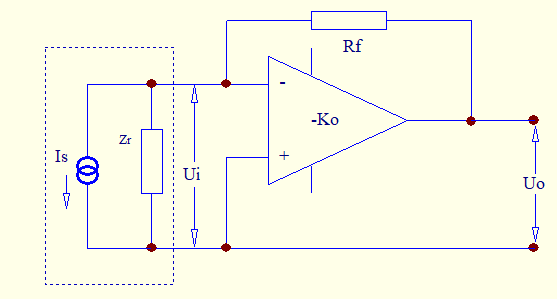
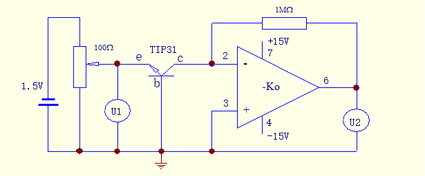
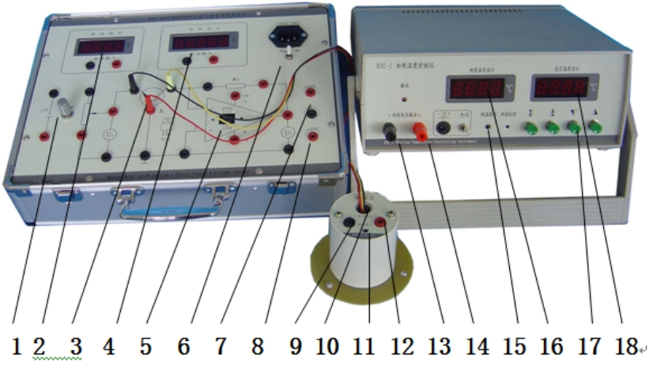
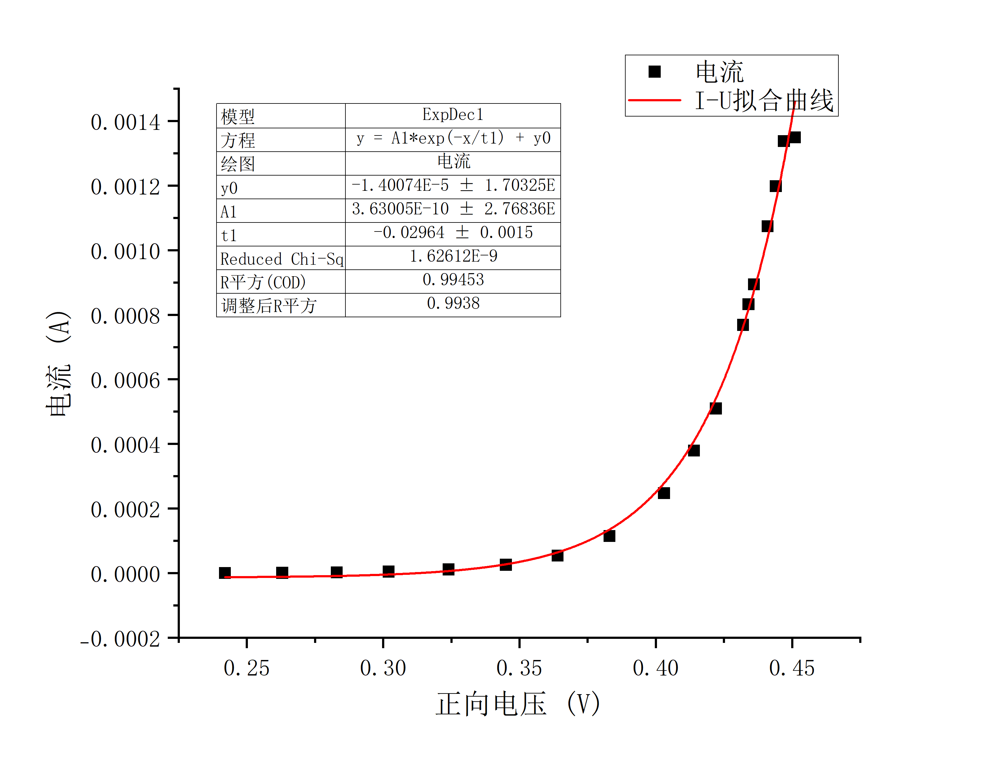
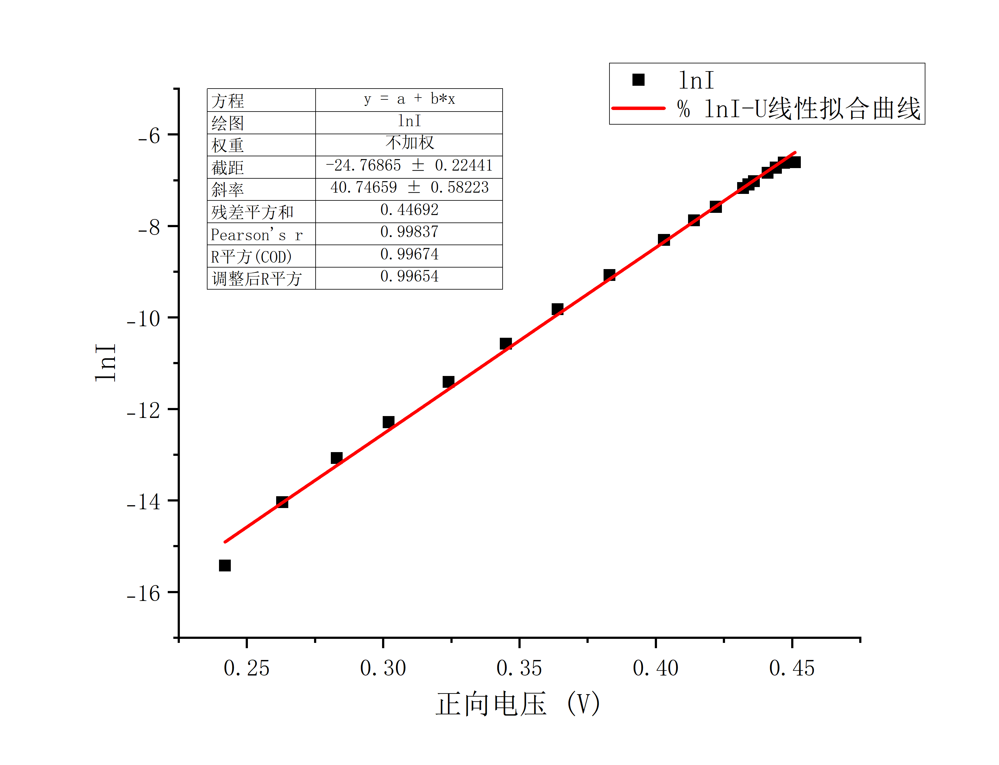
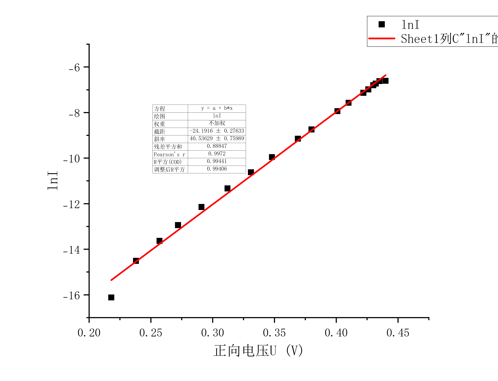

# PN结的物理特性及玻尔兹曼常数测定

2024/9/25

# 一、实验综述

## 1、实验目的

1. 了解PN结测温基本原理和应用;
2. 验证PN结正向压降随温度升高而降低的特性;
3. 学会使用PN结温度传感器测试仪。

## 2、实验背景

半导体PN结的物理特性是物理学和电子学的重要基础内容之一。本仪器用物理实验方法，测量PN结扩散电流与电压关系，证明此关系遵循指数分布规律，并较精确地测出玻尔兹曼常数,同时使学生学会测量弱电流的一种新方法。

## 3、实验原理

1. 弱电流测量

    过去物理实验中10-6A–10-11A量级弱电流值常采用光点反射式检流计测量，该仪器灵敏度较高约10－9A分度，但有许多不足之处。如十分怕震，挂丝易断；使用时稍有不慎，光标易偏出满度，瞬间过载引起张丝疲劳变形产生不回零点及指标变差大；使用和维修极不方便。近年来，集成电路和与数字化显示技术越来越普及。高输入阻抗运算放大器性能优良，价格低廉，用它组成电流－电压变换器测量弱电流信号，具有输入阻抗低，电流灵敏度高。温漂小、线性好、设计制作简单、结构牢靠等优点，因而被广泛应用于物理测量中。OP07是一个高输入阻抗集成运算放大器，用它组成电流－电压变换器如图所示。

    

    其中虚线电阻Zr为电流－电压变换器等效输入阻抗。由图1可知，运算放大器的输出电压U0为

    $U_0=-K_0U_1$                          (1)

    式中$U_1$为输入电压，$K_0$为运算放大器的开环电压增益，即图1中电阻$R_t\rightarrow\infty$时的电压增益，$R_t$称为反馈电阻。因为理想运算放大器的输入阻抗$r\rightarrow\infty$,所以信号源输入电流只流经反馈网络构成的通路。因而有

    $I_s=(U_i-U_0)/R_f=U_i(1+K_0)R_f$                 (2)

    由(2)可得电流－电压变换器等效输入阻抗$Z_r$ 即

    $Z_r=U_i/I_s=R_f/(1+K_0)\approx R_f/K_0 $               (3)

    根据(1)式和(2)式可得电流-电压变换器电流是与输出电压U0之间的关系式，即

    $I_s=-\frac{U_0}{K_0}(1+K_0)/R_f=-U_0(1+\frac1{K_0})/R_f\approx-\frac{U_0}{R_f}$       (4)

    由(4)式只要测量输出电压$U$​$0$和已知$R$​$f$的情况下，即可求得值。

    以高输入阻抗运算放大器LF356为例,其开环增益$K_0$约2×105,输入阻抗$r=10^{12}\Omega$,若$R_f$为$1.00M\Omega$,则由式(3)得,

    $Z_r=1.00\times10^6\Omega/(1+2\times 10^5)\approx5\Omega$  

    若选用四位半量程200mV的数字电压表，它最后一位变化为$0.01mV$，那么用上述 电流－电压变换器能显示最小电流值为$0.01mV/1.00\times10^6\Omega= 10^{-11}A$。从这一实例说明用集成运算放大器组成的电流－电压变换器测量弱电流，具有输入阻抗小，灵敏度高的优点。
2. PN结的物理特性测量

    由半导体物理学中有关PN结的研究，可以得出PN结的正向电流－电压关系满足

    $I=I_0(e^{\frac{eU}{KT}}-1)$                   (5)

    式中$I$是通过PN结的正向电流，$I_0$是不随电压变化的常数，$T$是热力学温度，$e$是电子的电荷量，$U$为PN结的正向压降,$K$为玻尔兹曼常数。由于在常温（300K）下，$KT／e＝0.026V$，而PN结正向压降约为十分之几伏，则$e^{\frac{eU}{KT}}>>1$，式(5)括号内－1项完全可以忽略，于是有

    $I=I_0e^{\frac{eU}{KT}}$                              (6)

    也即PN结正向电流随正向电压按指数规律变化。若测得PN结$I－U$关系值，则利用(6)式可以求出$e/KT$。在测得温度$T$后，就可以得到$e/K$常数，将电子电量作为已知值代入，即可以求得玻尔兹曼常数$K$。对(6)式两边取对数，有

    $ln I=lnI_0+\frac{eU}{KT}$                    (7)

    同样可以根据(7)式取对数后根据$ln I-U$关系值，求出$e/KT$，进而得到玻尔兹曼常数$K$。

    实验仪器如图所示。

    

## 4、注意事项

1. ±15*V*电源供运算放大器使用，请勿作其它用途。
2. 更换运算放大器必须在切断电源条件下进行，并注意引脚数字和集成电路方向。
3. 不宜使用其它型号三极管作为实验样品做实验。例TIP31三极管为NPN管，而TIP32型三极管为PNP管，所加电压极性不相同。
4. 实验结束应先关电源，再拆除接线。
5. HTC温度控制器与HTC加热附件组成干井恒温室，供实验样品放置。实验中测温探头和加热连接线不可相碰，通电前先连接好上述线路，拆去线路前须断开电源。

# 二、实验内容

## 1、实验仪器

1. 测试仪

    

    |仪器编号|仪器名称|仪器说明|
    | ----------| -----------------------| -------------------------------------------------------------------|
    |1|PN结工作电源|0-1.5V可调|
    |2|三位半数字电压表|0-2V|
    |3|实验样品接口|红线接B、黑线接E、黄线接C，实验样品（功率管）放于恒温室（干井）中|
    |4|四位半数字电压表|0-20V|
    |5|电流-电压转换集成电路|\\|
    |6|电源插座和电源开关|\\|
    |7|集成电路+15V电源|\\|
    |8|集成电路-15V电源|\\|
    |9|恒温室电压输入接线柱|\\|

    |仪器编号|仪器名称|仪器说明|
    | ----------| ----------------------------------| --------------|
    |10|恒温室（干井）用于放置实验样品|可加入导热油|
    |11|恒温室温度传感器接口|\\|
    |12|恒温室电压输入接线柱|\\|
    |13|HTC温度控制器电压输出接线柱（-）|\\|
    |14|HTC温度控制器电压输出接线柱（+）|\\|
    |15|温控器温度传感器信号输入|\\|
    |16|实测温度显示窗|\\|
    |17|设定温度按钮|\\|
    |18|设定目标温度显示窗|\\|

2. PN结样品架

    

    |仪器编号|仪器名称|仪器说明|
    | ----------| --------------| ------------------------------------------------------------------------------|
    |A|样品室|可卸的筒状金属容器，筒盖内设橡皮圈盖与筒套具相应的螺纹，可使两者旋紧保持密封|
    |B|样品座|\\|
    |D|待测PN结|采用3DG6晶体管|
    |T|测温元件|\\|
    |H|加热器|\\|
    |P1|D、T引脚线|\\|
    |P2|加热电源插座|\\|

## 2、实验操作

1. 首先检查与连接实验系统，把TIP31型三极管浸没在盛有变压器油干井槽中，在室温情况下，改变正向电压*U1*，测量相应电压*U*​2，约测10多数据点，至*U*​2值达到饱和时(*U*​2值变化较小或基本不变)，结束测量。
2. 改变干井恒温器温度，待PN结与干井温度一致时，重复测量*U*​1和*U*​2的关系数据，由*U*​*2*计算得到相应的电流*I*,并与室温测得的结果进行比较。
3. 对在同一温度测得的每组*U*​*1*​ *-I*数据进行指数拟合，对*U*​*1*-ln I进行线性拟合，分别求得相应的玻尔兹曼常数进行比较。

# 三、实验数据记录与处理

## 1、实验数据记录

1. 第一组 $T_1=297.55K$  

    |实验组数|正向电压$U_1/V$​|电压$U_2/V$​|电流$I/A$​|$ln I$​|
    | ----------| ------------| ----------| -----------| ---------------|
    |1|0.302|0.025|0.0000025|-12.89921983|
    |2|0.332|0.086|0.0000086|-11.66374835|
    |3|0.354|0.208|0.0000208|-10.78055757|
    |4|0.375|0.48|0.000048|-9.944309547|
    |5|0.387|0.786|0.0000786|-9.451138859|
    |6|0.395|1.061|0.0001061|-9.151128512|
    |7|0.404|1.494|0.0001494|-8.808883285|
    |8|0.414|2.265|0.0002265|-8.392765613|
    |9|0.419|2.734|0.0002734|-8.204574634|
    |10|0.425|3.430|0.000343|-7.977780111|
    |11|0.433|4.639|0.0004639|-7.675841546|
    |12|0.445|7.552|0.0007552|-7.188527943|
    |13|0.449|8.781|0.0008781|-7.037750076|
    |14|0.454|11.007|0.0011007|-6.811808938|
    |15|0.465|13.494|0.0013494|-6.60809523|
    |16|0.470|13.494 |0.0013494|-6.60809523|
    |17|0.475|13.494|0.0013494|-6.60809523 |
    |18|0.480|13.494|0.0013494|-6.60809523|

2. 第二组 $T_2=303.05K $  

    |实验组数|正向电压$U_1/V$​|电压$U_2/V$​|电流$I/A$​|$ln I$​|
    | ----------| ------------| --------| -------------| ----------------|
    |1|0.242|0.002|0.0000002|-15.42494847|
    |2|0.263|0.008|0.0000008|-14.03865411 |
    |3|0.283|0.021|0.0000021|-13.07357321|
    |4|0.302|0.046|0.0000046|-12.28945425|
    |5|0.324|0.111|0.0000111|-11.40856545|
    |6|0.345|0.256|0.0000256|-10.57291821|
    |7|0.364|0.543|0.0000543|-9.820986331|
    |8|0.383|1.146|0.0001146|-9.074062754|
    |9|0.403|2.473|0.0002473|-8.304908383|
    |10|0.414|3.792|0.0003792|-7.877446788|
    |11|0.422|5.099|0.0005099|-7.58129593|
    |12|0.432|7.684|0.0007684|-7.171200127|
    |13|0.434|8.324|0.0008324|-7.091197463|
    |14|0.436|8.944|0.0008944 |-7.019357456|
    |15|0.441|10.740|0.001074|-6.836365283|
    |16|0.444|11.984|0.0011984|-6.726767945|
    |17|0.447|13.378|0.0013378|-6.616728805|
    |18|0.451|13.495|0.0013495|-6.608021126|

3. 第三组$T_3=307.95K $  

    |实验组数|正向电压$U_1/V$​|电压$U_2/V$​|电流$I/A$​|$ln I$​|
    | ----------| ------------| ---------| -------------| --------------|
    |1|0.218|0.001 |0.0000001|-16.11809565|
    |2|0.238|0.005|0.0000005 |-14.50865774|
    |3|0.257|0.012|0.0000012|-13.633189|
    |4|0.272|0.024|0.0000024|-12.94004182|
    |5|0.291|0.053|0.0000053|-12.14780374|
    |6|0.312|0.12|0.000012|-11.33060391|
    |7|0.331|0.244|0.0000244|-10.62092743|
    |8|0.348|0.474|0.0000474|-9.956888329|
    |9|0.369|1.065|0.0001065|-9.147365573|
    |10|0.380|1.594|0.0001594|-8.744093792|
    |11|0.401|3.573|0.0003573|-7.936934793|
    |12|0.410|5.156|0.0005156|-7.570179287|
    |13|0.422|7.985|0.0007985|-7.13277559|
    |14|0.426|9.262|0.0009262|-6.984420364|
    |15|0.430|11.122|0.0011122|-6.801415243|
    |16|0.432|11.968|0.0011968|-6.728103951|
    |17|0.435|13.326|0.0013326|-6.620623358|
    |18|0.440|13.497|0.0013497|-6.607872933|

## 2、实验数据处理

下取$e=1.602 176 634×10^{-19}C$，$k_{文献}=1.380649×10^{-23}J/K$  

对于采用的指数拟合模型，有$-\frac1{t_1}=\frac{e}{KT}\Rightarrow k=-\frac{et_1}{T}$  

对于采用的线性拟合模型，有$b=\frac e{KT}\Rightarrow k=\frac e{bT}$  

1. $T_1=297.55K$  

    

    $k_{1}=-\frac{et_1}{T_1}=1.613214\times10^{-23}J/K$  

    $\varepsilon_1=\frac{|k_1-k_{文献}|}{k_{文献}}\times 100\%=16.84461\%$  

    ‍

    

    $k_1'=\frac e {bT_1}=1.318175\times10^{-23}J/K$  

    $\varepsilon_1'=\frac{|k_1'-k_{文献}|}{k_{文献}}\times 100\%=4.524973\%$
2. $T_2=303.05K$  

    

    $k_{2}=-\frac{et_1}{T_2}=1.567019\times10^{-23}J/K$  

    $\varepsilon_2=\frac{|k_2-k_{文献}|}{k_{文献}}\times 100\%=13.49872\%$  

    

    $k_2'=\frac e {bT_2}=1.297492\times10^{-23}J/K$  

    $\varepsilon_2'=\frac{|k_2'-k_{文献}|}{k_{文献}}\times 100\%=6.023037\%$
3. $T_3=307.95K $  

    

    $k_{3}=-\frac{et_1}{T_3}=1.567579\times10^{-23}J/K$  

    $\varepsilon_3=\frac{|k_3-k_{文献}|}{k_{文献}}\times 100\%=13.53928\%$  

    

    $k_3'=\frac e {bT_3}=1.283471\times10^{-23}J/K$  

    $\varepsilon_3'=\frac{|k_3'-k_{文献}|}{k_{文献}}\times 100\%=7.038574\%$

## 3、实验数据分析

||$k_i/J\cdot K^{-1}$​|$k_i'/J\cdot K^{-1}$​|$\varepsilon_i$​|$\varepsilon_i'$​|
| ---| ----| ----| ----| ----|
|1|$1.613214\times10^{-23}$​|$1.318175\times10^{-23}$​|$16.84461\%$​|$4.524973\%$​|
|2|$1.567019\times10^{-23}$​|$1.297492\times10^{-23}$​|$13.49872\%$​|$6.023037\%$​|
|3|$1.567579\times10^{-23}$​|$1.283471\times10^{-23}$​|$13.53928\%$​|$7.038574\%$​|

$\bar k=\frac{\sum^3 _{i=1}k_i}{3}=1.582604\times 10^{-23}J\cdot K^{-1}$  

$\varepsilon_{相对}=\frac{|k_i-\bar k|}{3\bar k}\times100\%=1.289436\%$  

$\varepsilon_{绝对}=\frac{|\bar k_i-k_{文献}|}{k_{文献}}\times100\%=14.62754\%$  

$\bar k'=\frac{\sum^3 _{i=1}k_i'}{3}=1.299713\times10^{-23}J\cdot K^{-1}$

$\varepsilon_{相对}'=\frac{|k_i'-\bar k'|}{3\bar k'}\times100\%=0.9470039\%$  

$\varepsilon_{绝对}'=\frac{|\bar k_i'-k_{文献}|}{k_{文献}}\times100\%=5.862195\%$  

# 四、实验拓展

1. 对于PN结，正向电流与与电压满足关系式$I=I_0(e^{\frac{eU}{KT}}-1)$，而在该实验条件下，我们将式子近似为$I=I_0e^{\frac{eU}{KT}}$，这样的近似为什么可以进行？

    在常温（$\approx 300K$）下，$KT／e＝0.026V$，而PN结正向压降数量级为$10^{-1}V$，则$e^{\frac{eU}{KT}}>>1$，括号内－1项相对完全可以忽略。
2. 采用的线性拟合和指数拟合方式哪种更好？

    由实验数据分析环节，三组试验后，线性拟合无论是相对误差还是绝对误差均明显优于指数拟合，得到的数据更加稳定，也更接近玻尔兹曼常数的文献值，事实上，通过对数变换，可以将指数关系线性化，减少了极端值的影响，使得误差分布更接近于正态分布。这有助于提高线性回归模型的稳定性和精度，从而降低了总体的预测误差。
3. 在测定正向电压及电流时，取点宜在初始阶段多一点还是后续阶段多一点？

    宜在后续阶段多一点，从数据和图像来看，初始阶段随正向电压变化电流变化不大，表现在图像上较平缓，上升趋势较慢，不需要过多数据点进行维护；而在后续阶段，电流随正向电压变化快速上升，图像表现出的上升趋势较为陡峭，需要较多数据点维护，用来反应该阶段函数较为精确的变化。

4. 简述PN结基本特性。

    PN结基本特性包括了单向导通性：PN结在正向偏置时导电，I-U特性呈现出指数关系，电流随电压的增加而急剧增加，而在反向偏置时，电流基本保持恒定，接近于零。同时在PN结中，由于P区和N区的载流子扩散形成的电场，导致了内建电势。这一电场阻止了更多的载流子扩散。而在PN结的交界面形成的区域，载流子被耗尽，形成耗尽区。该区域对电流的传输有重要影响。PN结还具有温度依赖性，当温度升高时，正向导通电压会下降，反向漏电流会增加。
5. 设计一个完整的输出直流5V的稳压电路，要求：画出电路，解释各个器件的工作原理、特性和作用。

    Vin ----+-----[C1]----+---- [LM7805] ---- Vout (5V)  
               |             |  
               |             |  
              [C2]         GND  
               |  
              GND

    ### 1. C1（输入电容）

    - 工作原理：输入电容C1在电源输入端并联，能够储存电能。当输入电压Vin中存在瞬时变化（如突发负载变化）时，C1能快速提供所需电流，避免电压骤降。
    - 特性：通常选择电解电容或陶瓷电容，电容值一般在10μF到100μF之间。
    - 作用：平滑输入电压，滤除高频噪声，提高电源稳定性。

    ### 2. LM7805（线性稳压器）

    - 工作原理：LM7805是一个三端稳压器，内部有一个误差放大器和一个电压分压器。当输出电压Vout（5V）变化时，反馈机制会调整内部的导通状态，通过改变传导电流来保持输出电压稳定。
    - 特性：输入电压范围通常为7V到35V，最大输出电流为1A，具有过载保护、短路保护等功能。
    - 作用：将高于5V的输入电压Vin稳定转换为5V输出电压Vout，供电给低电压电路。

    ### 3. C2（输出电容）

    - 工作原理：输出电容C2并联在输出端，能够滤除由负载变化引起的瞬时电流变化，进一步平滑输出电压。
    - 特性：通常选择电解电容或陶瓷电容，电容值在10μF到100μF之间，且要能承受输出电压（至少6.3V以上）。
    - 作用：降低输出纹波，提高输出电压的稳定性，确保供电给后续电路时电压的平稳。

‍
