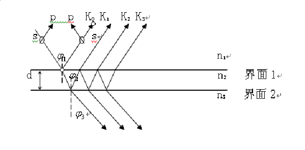
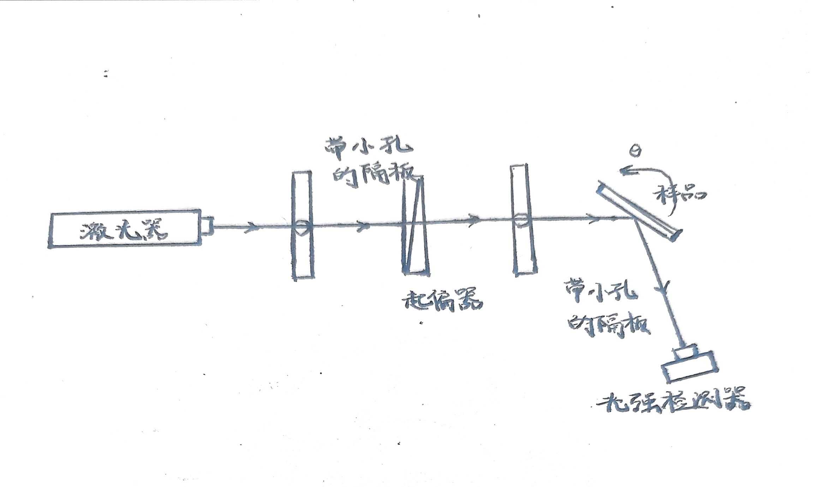

# 椭偏仪测薄膜厚度和折射率

2024/10/9

# 一、实验综述

## 1、实验目的

1. 测量透明介质薄膜厚度和折射率；
2. 掌握椭偏术的基本原理，实验方法和仪器的使用。

## 2、实验背景

现代科学中各种薄膜的研究和应用日益广泛和重要，迫切需要一种可以精确和迅速测定某一薄膜的光学参量的物理方法和手段，并且是非破坏性的。WJZ系列椭偏仪采用一种简易的装置，利用传统的**<u>消光法</u>**测量椭偏参量，使学生掌握椭偏术的基本原理，实验方法和仪器的使用。

## 3、实验原理

1. 膜的光学特性

    图中所示为一光学均匀和各向同性的单层介质膜。它有两个平行的界面。通常，上部是折射率为$n_1$的空气（或真空）。中间是一层厚度为$d$,折射率为$n_2$的介质薄膜，均匀地附在折射率为$n_3$的衬底上。当一束光射到膜面上时，在**界面1**和**界面2**上形成多次反射和折射，并且各反射光和折射光分别产生多光束干涉。其干涉结果反映了**膜的光学特性**。

    
2. 反射系数

    - p波和s波:在两个互相垂直方向上的分量波，其中p波为振动面平行入射面的线偏振光，s波为振动面垂直入射面的线偏振光
    - p波反射系数：$r_p=\frac {E_p^r}{E_p^i} e^{i\delta_p}$  

      s波反射系数：$r_s=\frac {E_s^r}{E_s^i} e^{i\delta_s}$  

      ($E $表示光波电矢量，上标$i$表示入射，$r$表示反射，下标$p$表示p波，$s$表示s波,$\delta_p$和$\delta_s$分别表示样品反射前后p波和s波的相位变化）

      ‍

3. 反射系数比

    - 反射系数比$\rho=\frac {r_p}{r_s}=\frac{\frac{E_p^r}{E_p^i}}{\frac{E_s^r}{E_s^i}}e^{i(\delta_p-\delta_s)}$  

      定义$tan\Psi=\frac{\frac{E_p^r}{E_p^i}}{\frac{E_s^r}{E_s^i}}=\frac{\frac{E_p^r}{E^r_s}}{\frac{E_p^i}{E_s^i}}$  

      $\Delta=\delta p-\delta s=(\theta_p^r-\theta_p^i) -(\theta^r_p-\theta^r_s)-(\theta^i_p-\theta^i_s)$  

      其中：$\theta$表示相位，上标$r,i$表示反射和入射，$p,s$表示p波和s波

      则反射系数比可表示为$\rho=tan \Psi e^{i\Delta}$  

      $tan\Psi$表示**p波和s波的振幅比的衰减**

      $\Delta$表示p波和s波的相位差经样品反射前后的变化
    - 反射系数比的推导

      反射系数比 $R$ 可以通过**菲涅尔方程**推导出来。设入射光线从介质 1（折射率 $n_1$）入射到介质 2（折射率 $n_2$），再到介质 3（折射率 $n_3$）。对于垂直入射，反射系数 $R$ 表示为：

      $R = \left( \frac{n_2 - n_1}{n_2 + n_1} \right)^2$  

      则只要确定$tan\Psi$和$\Delta$就可解出$n_2,d$

4. 椭偏仪测参数

    椭偏仪分为消光型和光度型两种，本实验采用**消光型**测定参数，并用计算机软件求解薄膜折射率和厚度。

    为了使实验中计算简化,将1/4波片的快轴与入射面成45度或-45度放置,经起偏器的线偏振光垂直入射1/4波片,则经过1/4波片后的光线为**等幅椭圆偏振光，** 即:$\frac{E^i_p}{E^i_s}=1$

    从1/4波片出来的光波在**p波和s波分量的相位差**为$2P-\frac\pi2$,即

    $\theta^i_p-\theta^i_s=2P-\frac\pi2$(在h和l轴分量相位差为90度）

    那么入射样品的p波和s波的相位差只要通过转动起偏器的方位角P就连续可调。

    

# 二、实验内容

## 1、实验仪器

椭偏仪平台及配件，He-Ne激光器及电源，起偏器，检偏器，$\lambda/4$玻片，待测样品，黑色反光镜

## 2、实验操作

1. 光路调节： 打开激光器，调节各光学器件使激光器与平行光管等高共轴， 载物台平行。可使用自准直镜头辅助调节，使激光束通过起偏器和检偏器中心。
2. 检偏器调整： 取下起偏器，转动望远镜66°使激光沿布儒斯特角(57°) 入射黑色平板， 旋转检偏器使接收光最暗， 此时检偏器偏振化方向平行入射面。调整检偏器位置使偏振化方向平行时的读数为90°。
3. 起偏器调整： 取下黑色平板， 安装上起偏器， 转动望远镜至原平行位置， 保持检偏器不动， 旋转起偏器使接收光最暗， 此时起偏器偏振化方向垂直入射面。调整起偏器位置使起偏器偏振化方向垂直时的读数为0°。
4. λ/4波片调整： 保持起偏器和检偏器不变， 在起偏器上安装λ/4波片， 旋转λ/4波片使接收光最暗， 此时为λ/4波片零位。
5. 消光法测量薄膜厚度d和折射率 n：在载物台上放置待测样品， 调整望远镜与入射光成140°夹角 (入射角为70°)。将λ/4波片的快轴转过45°或-45°， 此时经起偏器的线偏振光垂直入射λ/4波片后为等幅椭圆偏振光。旋转起偏器可调整反射p光与s光之间的相位差， 使得反射光为线偏振光。再调整检偏器偏振化方向与反射光偏振化方向垂直，可得到消光点。λ/4波片为45°或-45°时各有2个消光点。同时调整起偏器和检偏器，找到共4 个消光点， 并记录消光点时检偏器和起偏器的读数。
6. 软件计算： 在软件中输入各消光点检偏器和起偏器的读数， 使用作图法计算得到薄膜厚度 d和折射率n。

## 3、注意事项

1. 部分样品膜有脱落，请使用正面镀光滑膜且背面为毛玻璃的样品进行测量。
2. 测量得到的偏振片读数θ若超过180°，则软件计算时结果取(θ﹣180°)。

# 三、实验数据记录与处理

## 1、实验数据记录

|$\frac {\lambda}4$波片放置角度|45° ||-45°||
| --------------| -----------------------------------| ----------------------| ----------------------------------| ----------------------|
|n|1|2|3|4|
|起偏角|24.2°|116.8°|67.2°|78.9°|
|检偏角|87.8°|102.9°|157.1°|99.2°|

## 2、实验数据处理

经过软件计算绘图处理，得到薄膜厚度$d=121.1nm$,折射率为$n=1.98$  

样品的标记厚度为$d_0=94.0nm$，折射率为$n_0=1.97$  

$\varepsilon_d=\frac{|d-d_0|}{d_0}\times 100\%=28.8\%$​

$\varepsilon_n=\frac{|n-n_0|}{n_0}\times100\%=0.508\%$  

## 3、误差分析

根据上述实验数据，得到对于样品折射率测量较准确，误差较小；而对样品厚度测量误差较大，经分析可能有以下原因：

1. 实验采用消光法测量，在测量过程中调节起偏角及起偏角(P, A)所对应的区间内，还存在多个光强的极小值点， 由于设备光强测量精度的限制，若找到的并不是消光点，而是极小值点，会对实验造成较大的误差；
2. 实验所用薄膜受制作工艺，外界环境（油脂，指纹等）影响，表面状态（样品表面的洁净度与损伤程度）、膜层的非均匀性、吸收状态不完美，和理想状态下均一完美的薄膜存在较大差距，影响最后的实验测量结果；
3. 对于待测的样品可见光波段和近红外波段的光波对于材料的趋肤深度并不是很深，不符合实验假设的单层膜结构，导致实验中出现较大的系统误差。

# 四、实验拓展

1. 简述椭圆偏振光是怎样形成的。  

    椭圆偏振光是由两个相同频率但相位差不同的线偏振光叠加而形成的。首先，考虑两个相互垂直的线偏振光分量，分别沿 $x$ 和 $y$ 轴传播。它们具有相同的频率，但之间存在一个相位差 $\Delta \phi$（通常在 $0$ 到 $2\pi$ 之间）。当这两个分量叠加时，形成一个合成波，其电场矢量随时间变化。在不同时间点，电场的 $x$ 和 $y$ 分量的幅度和相位共同决定了电场矢量的轨迹，从而在平面上描绘出一个椭圆形的轨迹。
2. 设计一个利用光的偏振原理测量波薄膜厚度的实验系统，要求：画出系统光路图，叙述实验测量方法。

    

    对于可旋转样品，选取在30°~70°之间多个入射角，由检测器读取角度和光强，并进行曲线拟合，对于（$n_1,d$）设定进步长进行逼近拟合，得到对应的$n_1$和$d$的较精确值。

‍
