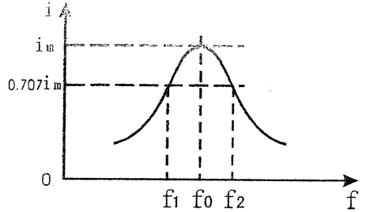
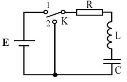
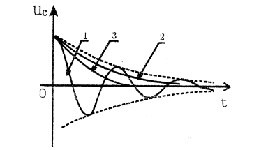
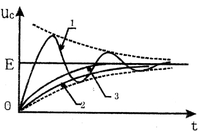
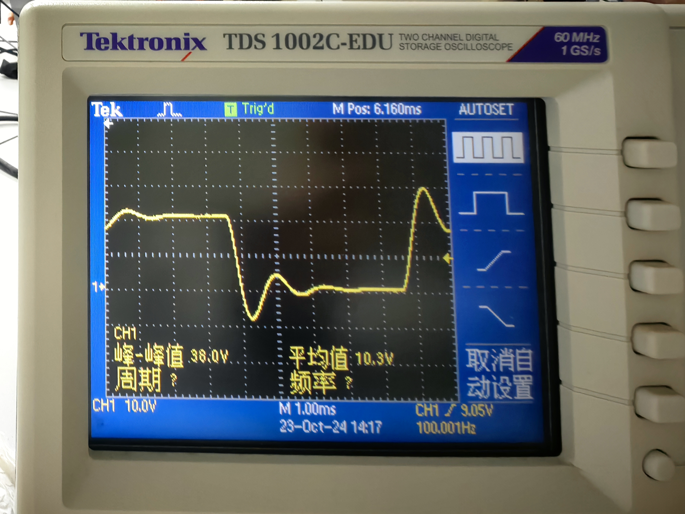
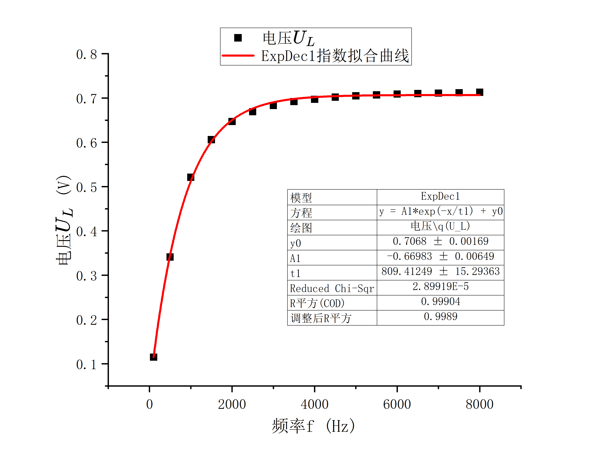

# RLC串联电路暂态、稳态过程的研究

2024/10/23

# 一、实验综述

## 1、实验目的

1、观察RC和RL串联电路的幅频特性和相频特性；

2、了解RLC串联电路的幅频特性；

3、了解RLC电路的串联谐振现象及RLC回路$Q$值的物理意义;

4、观察RLC电路的暂态过程。

## 2、实验原理

1. RC串联电路的稳态特性

    在图1所示电路中，电阻$R$，电容$C$的电压有以下关系式：

    $I=\frac{U}{\sqrt{R^2+(\frac1{\omega C})^2}}$  

    $U_R=IR $  

    $U_c=\frac{1}{\omega C}$  

    $\phi=-arctan\frac{1}{\omega CR}$  

    图1 RC串联电路

    其中$ω$为交流电源的角频率，$U$为交流U电源的电压有效值，$\phi$为电流和电源电压的相位差，它与角频率$ω$的关系见图2可见当$ω$增加时，$I$和$U_R$增加，而$U_C$减小。当$ω$很小时$ϕ→-π/2$，$ω$很大时$ϕ→0$。

    ​图2 RC串联电路的相频特性
2. RL串联电路稳态特性

    RL串联电路如图3所示，电路中$I$、$U$、$U_R$、$U_L$有以下关系：

    $I=\frac{U}{\sqrt{R^2}+(\omega L)^2}$  

    $U_R=IR,U_L=I\omega L$  

    $\phi=arctan \frac{\omega L}R$  

    可见RL电路的幅频特性与RC电路相反U_R，RC$\omega$增加时，$I$、$U_R$减小而$U_L$增大。它的相频特性见图4，由图4可知，$ω$很小时$ϕ→0$，$ω$很大时$ϕ→π/2$
3. RLC串联电路的稳态特性

    在电路中如果同时存在电感和电容元件，那么在一定条件下会产生某种特殊状态，能量会在电容和电感元件中产生交换，我们称之为谐振现象，RLC电路如图5所示。

    如图5所示电路，则阻抗$|Z|$，电压$U$、$U_R$和电流$i$之间有以下关系：

    $|Z|=\sqrt{R^2+(\omega L-\frac1{\omega C})^2}$  

    $\phi =arctan\frac{\omega L-\frac1{\omega C}}{R}$  

    $i=\frac{U}{\sqrt{R^2+(\omega L-\frac 1{\omega C})^2}}$  

    其中$\omega$为角频率，上述各物理量与频率的关系称为频响特性。

    ​图5 RLC串联电路

    图6为RLC串联电路幅频特性，由图6可知，在频率$f_0$处阻抗$Z$值最小，且此时整个电路呈纯电阻性，电流$i$达到最大值，我们称$f_0$为RLC串联电路的谐振f_2频率($ω$​$0$为谐振角频率)，在$f_1$至$f_2$的频率范围内$i$值较大，我们称为通频带；RLC串联电路的相频特性如图7所示。

    当$\omega=\omega_0=\frac{1}{\sqrt{LC}}$时，$f_0=\frac{1}{2\pi\sqrt{LC}}$，由上述三式可知：$|Z|=R$,$\phi=0$\,$i_m=\frac{U}{R}$，此时电路呈纯电阻性，而在电感和电容上的电压相等，相位相反，且为电源电压的$Q$倍。$Q$称为电路的品质因素，简称$Q$值。

    定义：$U_C$或$U_L$与$U$的比值为品质因数$Q$，$Q=\frac{U_L}{U}=\frac{U_C}{U}=\frac{\omega_0 L}{R}=\frac1{R\omega_0C}$  

    可以证明$\Delta f=\frac{f_0}{Q}$\,$Q=\frac {f_0}{\Delta f}$  

    ​图6   RLC串联电路幅频特性

    ​图7 RLC串联电路的相频特性
4. RLC串联电路的暂态过程

    在图8示的电路中，先将K打向“1”，待稳定后再将K打向“2”，这称为RLC串联电路的放电过程，其电路方程为

    $LC\frac{d^2 U_C}{dt^2}+RC\frac{dU_C}{dt}+U_c=0$

    图8

    初始条件为$t=0$，$U_C=E$,$\frac{dU_C}{dt}=0$，这样方程的解一般按$R$值的大小可分为三种情况:

    1. $R\lt 2\sqrt{L/C}$,为欠阻尼

        $U_C=\frac{1}{\sqrt{1-\frac{C}{4L}\cdot R^2}}\cdot E\cdot e^{-\frac t \tau}\cdot cos(\omega t+\phi)$​

        其中$\tau=\frac{2L}{R}$，$\omega=\frac{1}{\sqrt{LC}}\sqrt{1-\frac{C}{4L}\cdot R^2}$
    2. $R\gt 2\sqrt{L/C}$,为过阻尼

        $U_C=\frac{1}{\sqrt{\frac{C}{4L}\cdot R^2-1}}\cdot E\cdot e^{-\frac t \tau}\cdot sh(\omega t+\phi)$
    3. $R=2\sqrt{L/C}$，为临界阻尼

        $U_C=(1+\frac{t}{\tau})E\cdot e^{-\frac{t}{\tau}}$

图9这三种情况下的$U_C$变化曲线，其中1为欠阻尼，2为过阻尼，3为临界阻尼。

图9  放电时的UC曲线示意图

如果当$R<<2\sqrt{L/C}$时，则曲线1的振幅衰减很慢，能量的损耗较小。能够在$L$与$C$之间不断交换，可近似为$LC$电路的自由振荡，这时$\omega\approx\frac{1}{\sqrt{LC}}=\omega_0$，$\omega_0$为$R=0$时LC回路的固有频率。对于充电过程，与放电过程相类似，只是初始条件和最后平衡的位置不同。

图10给出了充电时不同阻尼的$U_C$变化曲线图。

图10  充电时的UC曲线示意图

# 二、实验内容

## 1、实验仪器

低频信号发生器XFD-7A；标准电阻；标准电容箱；标准电感箱；晶体管毫伏表DA-16；示波器。

## 2、实验步骤

1. RC串联电路的幅频特性：按图1连接电路，交流电源是低频信号发生器的输出端，输出电压始终保持在1V，R为十进电阻箱，取$R=500\Omega$，取$C=0.47\mu F$，首先将低频信号发生器频率调到$100Hz$，用晶体管毫伏表测量不同频率下电容、电阻两端的输出电压$U_C$，取一定间隔频率，一直测到$8kHz$（此过程中始终保持低频信号发生器输出电压为1V），表格自行设计。

2. RL串联电路的幅频特性：按图3接电路，交流电源是低频信号发生器的输出端，输出电压始终保持在1V，自行选择合理的电阻与电感值，同样取一定间隔频率，一直测到$8kHz$（此过程中始终保持低频信号发生器输出电压为1V），用晶体管毫伏表测量不同频率下电感、电阻两端的输出电压$U_L$，表格自行设计。

3. 按图5连接电路，自行选择$L$、$C$、$R$，信号发生器输出电压保持在1V，用晶体管毫伏表测量R两端的电压（用于计算回路电流），计算所选实验参数下的谐振频率$f_0$，信号发生器频率以每次间隔$100Hz$（在谐振频率$f_0$附近可增加测量点），在谐振频率$f_0$附近测量LRC电路的幅频特性(自行设计选择合理的频率范围)。表格自行设计。

4. 自行设计电路，取合适的R、L及C值，用示波器观察RLC串联电路的暂态过程。

# 三、实验数据

## 1、实验数据记录

1. RC串联电路的幅频特性

    |频率$f/Hz$​|100|500|1000|1500|2000|2500|3000|3500|4000|4500|5000|5500|6000|6500|7000|7500|8000|
    | --------| ------| -------| ------| -------| -------| -------| ------| ------| -------| -------| -------| -------| ------| -------| ------| -------| -------|
    |电压$U_C/V$​|0.71|0.561|0.38|0.278|0.217|0.178|0.15|0.13|0.116|0.104|0.094|0.087|0.08|0.075|0.07|0.066|0.063|

2. RL串联电路的幅频特性

    |频率$f/Hz$​|100|500|1000|1500|2000|2500|3000|3500|4000|4500|5000|5500|6000|6500|7000|7500|8000|
    | --------| -------| -------| -------| -------| -------| -------| -------| -------| -------| -------| -------| -------| -------| ------| -------| -------| -------|
    |电压$U_L/V$​|0.115|0.341|0.521|0.606|0.647|0.669|0.683|0.692|0.697|0.702|0.705|0.707|0.709|0.71|0.711|0.712|0.713|

3. LRC电路的幅频特性

    |频率$f/Hz$​|100|200|300|400|500|600|700|800|900|1000|1100|1200|
    | --------| ------: | ------: | ------: | ------: | ------: | ------: | ------: | ------: | ------: | ------: | ------: | ------: |
    |电压$U_R/V$​|0.106|0.215|0.321|0.421|0.504|0.561|0.586|0.583|0.561|0.531|0.498|0.465|

    取定频率$600-700Hz$为频率峰值区间，以$20Hz$为间隔进一步测量。

    |频率$f/Hz$|600|620|640|660|680|700|720|730|740|760|780|800|
    | :-----| -------| :------| ----------------------------------| ----------------------------------| -------| -------| -------| -------| -------| -------| -------| -------|
    |电压$U_R/V$|0.561|0.568|0.575|0.580|0.583|0.586|0.587|0.587|0.587|0.586|0.585|0.583|

    得到峰值$f_0=730Hz$

4. RLC串联电路的暂态过程

    |$L/H$ |$C/\mu F$​|$R/\Omega$​|状态|
    | -----| ------| ------| ----------|
    |0.1|1|1000|过阻尼|
    |0.1|0.47|100|欠阻尼|
    |0.1|0.47|900|临界阻尼|

5. 阻尼状态图

    1. 过阻尼状态图

        

    2. 欠阻尼状态图

        

    3. 临界阻尼状态图

        

## 2、实验数据处理

1. RC串联电路的幅频特性

    

    图像符合推导出的理论模型$U_C=\frac{U_{in}}{\sqrt{1+(2\pi fRC)^2}}\cdot\frac{1}{2\pi fC}$即在频率增加时，电容两端的电压 $U_C$ 会逐渐减小，最终趋近于0。
2. RL串联电路的幅频特性

    

    图像符合推导出的理论模型$U_L=\frac{U_{in}\cdot(2\pi fL)}{\sqrt{R^2+(2\pi fL)^2}}$即在频率增加时，电容两端的电压 $U_L$ 会逐渐增大，最终在高频段趋近于输入电压$U_{in}$。
3. LRC串联电路的幅频特性

    理论谐振频率$f_0'=\frac{1}{2\pi\sqrt{LC}}=734.13Hz$,相对误差$\varepsilon=\frac{|f_0'-f_0|}{f_0'}=0.56216\%$,误差较小证明测量结果准确
4. RLC串联电路的暂态特性

    采用的实验数据，欠阻尼状态与过阻尼状态$R,L,C $关系与理论相一致，即分别满足$R\lt 2 \sqrt {\frac {L}{C}}$和$R\gt 2\sqrt{\frac{L}{C}}$  

    对于临界阻尼状态，理论电阻$R_0=2\sqrt{\frac{L}{C}}=922.5\Omega$，相对误差$\varepsilon =\frac{|R_0-R|}{R_0}=2.442\%$，在误差允许范围内
5. 误差分析

    1. 实验采用的测量仪器如电压表，可变电阻由于最小刻度存在系统误差；
    2. 实验分析RLC串联电路的暂态过程中，在调节电阻$R$的过程中通过肉眼判断区分三种阻尼状态存在一定误差，尤其是欠阻尼与临界阻尼状态；
    3. 实验产生的正弦波与方波电压受环境影响不够稳定，同时受上升下降沿影响导致测量结果落在一定范围内波动，存在偶然误差；
    4. 接线元件引入额外的阻抗会影响测量结果。

# 四、实验拓展

1. 为什么串联谐振称为电压谐振而并联谐振称为电流谐振？

    在串联谐振电路中，电感和电容串联连接。当频率达到谐振频率时，电感的反应和电容的反应相互抵消，电路的总阻抗达到最小值。这时，电流达到最大值，整个电路的电压在谐振点上会增大（特别是在电感和电容两端）。强调电压的增大，所以称为电压谐振。而在并联谐振电路中，电感和电容并联连接。当频率达到谐振频率时，电流在电感和电容两端的相位相反，导致总电流最小化；而在谐振点，流过电容和电感的电流会相互抵消，电流特性更为显著，因此被称为电流谐振。
2. 在RLC电路中，若方波发生器的频率很高或很低，能观察到阻尼振荡的波形吗？如何由阻尼振荡的波形来测量RLC电路的振荡周期$T$？振荡周期$T$与角频率$\omega$的关系会因方波频率的变化而发生变化吗？

    不能，当方波频率很高时，RLC电路可能无法完全响应每个方波周期的变化，因此可能无法清晰地观察到阻尼振荡的波形，而当方波频率过低，电路可能会在方波的上升沿和下降沿之间出现较长的时间延迟，导致无法观察到连续的振荡效果，可能只会看到缓慢的上升和下降，没有明显的振荡特征。

    观察阻尼振荡的波形，测量从一个波峰（或波谷）到下一个波峰（或波谷）的时间间隔，这个时间间隔就是振荡周期 $T$。

    振荡周期 $T$与角频率 $\omega$的关系由电容$C$和电感$L$共同决定不随方波频率变化而变化。
3. RC串联电路中$\tau$的物理意义。

    在RC串联电路中，时间常数$\tau = R \cdot C$，是电路响应时间的一个重要参数，反映了电路对变化的响应速度。时间常数越大，电容充放电所需的时间就越长，电路对电压变化的响应就越慢；反之则越快。
4. 举一个实际生活中的RLC电路的应用实验，叙述RLC电路的作用。

    以收音机为例，收音机中的调谐电路通常由电感$L$和可调电容$C$构成RLC电路。对于特定频率的无线电信号，电路通过调整电容的值，使电路的谐振频率（$f_0 = \frac{1}{2\pi\sqrt{LC}}$）与所需接收的广播频率匹配，当共振频率与信号频率一致时，电路能够有效地增强该频率的信号。

‍
