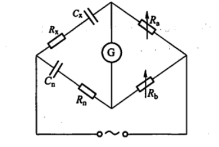

# 交流电桥

2024/10/30

# 一、实验综述

## 1、实验目的

1. 了解交流电桥平衡原理，掌握交流电桥平衡条件；
2. 掌握用交流电桥测量电容及介质损耗，电感及品质因素；
3. 学会利用交流电桥设计出相关测量方案。

## 2、实验原理

1. 交流电桥的平衡条件

    如**图6-11-1**所示，我们在正弦稳态条件下讨论交流电桥的基本原理。在交流电桥中，4个桥臂均由阻抗元件构成，在电桥的一条对角线cd中接入检流计，在另一对角线中接入交流电源。

    调节桥臂参数，使得检流计中无电流通过时，cd两点的电位相等，电桥达到平衡，这时有$Z_1\cdot Z_3=Z_2\cdot Z_4$，即相对桥臂阻抗乘积相等。

    图1

    考虑将标准元件$Z_n$和被测原件$Z_x$相邻放置或相对放置（$Z_x$为$Z_4$,$Z_n$分别为$Z_3$和$Z_2$）由电桥平衡条件分别有$Z_x=\frac{Z_1}{Z_2}\cdot Z_n$和$Z_x=\frac{Z_1Z_3}{Z_n}$。

    对于后一种情况，由于此时$Z_1,Z_3$为臂乘，又称为臂乘电桥，特点是$Z_n$和$Z_x$的阻抗性质必须相反，常用于使用标准电容测量电感。在实际测量中,为了使电桥的结构简单和调节方便,通常将其中的2个桥臂设计为纯电阻。在调节中，为了要使2个参量同时达到平衡，需要反复多次耐心 的调节，所以交流电桥的平衡要比直流电桥困难一些。
2. 电容电桥

    电容电桥主要用于测量电容的**电容量**和**损耗角**。

    电容器并非理想元件，存在着介质损耗，所以通过电容器的电流和它两端的电压之间的相位差并非90°，而是比90°要小一个角度$\delta$。这个角度$\delta$就称为**损耗角**。在等效电路中，理想电容表示实际电容的等效电容， 串联或者并联的等效电阻表示实际电容的发热损耗。为了方便起见，通常使用电容器的损耗角的正切值来表示它的介质损耗特性，用符号$D$表示，称之为**损耗因数**。

    对于损耗较小的电容的电容电桥，我们采用**串联电容电桥**，如图*6-11-4*，当电桥平衡时，$R_x=\frac{R_a}{R_b}R_n$，$C_x=\frac{R_b}{R_a}C_n$，被测电容的损耗因数为$D=tan\delta=\omega C_xR_x=\omega C_nR_n$  

    对于损耗较大的电容的电容电桥，我们采用**并联电容电桥**，如图*6-11-5*，当电桥平衡时，$R_x=\frac{R_a}{R_b}R_n$，$C_x=\frac{R_b}{R_a}C_n$，被测电容的损耗因数为$D=tan\delta=\frac{1}{\omega C_xR_x}=\frac{1}{\omega C_nR_n}$  

    
3. 电感电桥

    电感电桥是用来测量电感的，电感电桥有多种形式，通常采用的是标准电容作为与被测电感相比较的标准元件，由前面对电桥的平衡条件的分析可知，此时标准电容一定要和被测电感放置在相对的桥臂上。当然，根据实际测量的需要，也可以采用标准电感作为标准元件，此时标准电感和被测电感应放置在相邻的桥臂上。

    一般的电感线圈都不是纯电感，除了电抗外，还有等效电阻，两者之比称为电感的**品质因数**​$Q$,即$Q=\frac{\omega L}{R}$。

    对于高Q值电感，我们采用**海氏电桥**进行测量，如图*6-11-6*，电桥平衡时，根据平衡条件可得

    $(R_x+j\omega L_x)(R_n+\frac{1}{j\omega C_n})=R_aR_b$  

    整理后得$L_x=R_aR_b\frac{C_n}{1+(\omega C_nR_n)^2}$,$R_x=R_aR_b\frac{R_n\omega ^2C_n^2}{1+(\omega C_nR_n)^2}$，其品质因数$Q=\frac{\omega L_x}{R_x}=\frac{1}{\omega C_nR_n}$  

    对于低Q值电感，我们采用**麦克斯韦电桥**进行测量，如**图6-11-7**，电桥平衡时，根据平衡条件可得

    $(R_x+j\omega L_x)(\frac{1}{\frac{1}{R_n}+j\omega C_n})=R_aR_b$  

    整理后得$L_x=R_aR_bC_n$，$R_x=R_aR_b\frac{1}{R_n}$，其品质因数$Q=\frac{\omega L_x}{R_x}=\omega C_nR_n$  

    

# 二、实验内容

## 1、实验仪器

数字电桥，FB305型交流电桥实验仪

## 2、实验操作

1. 分别取一组损耗因数相差较大的电容和品质因数相差较大的电感，调节并使用数字电桥测量相应的电容/电感值及损耗因数/品质因数大小，根据所测得值给对应电容/电感选择合适的测量电路；
2. 设定实验仪输出频率为$1000$​$Hz$,电压大小为$1$​$V$根据实验原理分别搭建相应的串联电容电桥、并联电容电桥、海氏电桥和麦克斯韦电桥，首先将检流计幅度调至最小根据公式及数据范围设定合适的$R_a$，$C_n$,逐渐调大输出电压及检流计幅度，通过调节$R_n$，$R_b$使检V流计指针始终保持在零刻度线附近；当电压增大至$3V$左右时记录相应读数；
3. 根据实验得到数据分别计算电容/电感的损耗因数/品质因数，与数字电桥测得的数值进行比较分析。

## 3、注意事项

1. 桥臂尽量不要采用标准电感。由于制造工艺上的原因，标准电容的准确度要高于标准电感,并且标准电容不易受外磁场的影响。所以常用的交流电桥，无论是测量电容还是电感，除了被测元件之外，其他桥臂都采用标准电阻和标准电容。
2. 桥臂配置时尽量使平衡条件和电源频率无关。这样做才能使得平衡条件更容易实现，并且受到的影响因素更少。有些电桥的平衡条件，会含有电源频率这个参量，这样就增加了实现平衡的难度。

# 三、实验数据

## 1、数据记录与处理

$f=1000Hz\Rightarrow \omega=2\pi f=2000\pi Hz$  

1. 低D值电容的测量

    数字电桥测定值$C_0=1025.13nF$，$D_0=0.0251$  

    |$R_a/\Omega$​|$C_n/\mu F$​|$R_n/\Omega$​|$R_b/\Omega$​|
    | -------| ----| -----| ------|
    |10000|1|4.0|9956|

    $R_x=\frac{R_a}{R_b}R_n=4.018\Omega$  

    $C_x=\frac{R_b}{R_a}C_n=995.6nF$  

    $\varepsilon_C=\frac{|C_x-C_0|}{C_0}\times 100\%=2.9\%$  

    $D=\omega C_n R_n=0.002513$​

    $\varepsilon_{D}=\frac{|D-D_0|}{D_0}\times 100\%=0.12\%$​

2. 高D值电容的测量

    数字电桥测定值$C_0=9780.6nF$，$D_0=0.2356$  

    |$R_a/\Omega$​|$C_n/\mu F$​|$R_n/\Omega$​|$R_b/\Omega$​|
    | ------| ----| -------| ------|
    |1000|1|700.0|9807|

    $R_x=\frac{R_a}{R_b}R_n=71.38\Omega$  

    $C_x=\frac{R_b}{R_a}C_n=9807nF$  

    $\varepsilon_C=\frac{|C_x-C_0|}{C_0}\times 100\%=0.27\%$  

    $D=\frac{1}{\omega C_nR_n}=0.2274$  

    $\varepsilon_{D}=\frac{|D-D_0|}{D_0}\times100\%=3\%$​

3. 高Q值电感的测量

    数字电桥测定值$L_0=4.9776mH$，$Q_0=7.4487$  

    |$R_a/\Omega$|$C_n/\mu F$|$R_n/\Omega$|$R_b/\Omega$|
    | ----| ---| ------| -----|
    |10|1|20.3|523|

    $R_x=R_aR_b\frac{R_n\omega ^2C_n^2}{1+(\omega C_nR_n)^2}=4.12\Omega$  

    $L_x=R_aR_b\frac{C_n}{1+(\omega C_nR_n)^2}=5.14mH$  

    $\varepsilon_L=\frac{|L_x-L_0|}{L_0}\times 100\%=3\%$  

    $Q=\frac{1}{\omega C_nR_n}=7.84$  

    $\varepsilon_{Q}=\frac{|Q-Q_0|}{Q_0}\times100\%=5\%$

4. 低Q值电感的测量

    数字电桥测定值$L_0=9.9655mH$，$Q_0=1.08193$

    |$R_a/\Omega$|$C_n/\mu F$|$R_n/\Omega$|$R_b/\Omega$|
    | ----| ---| -------| ------|
    |10|1|172.3|1035|

    $R_x=R_aR_b\frac{1}{R_n}=60.07\Omega$  

    $L_x=R_aR_bC_n=10.35mH$  

    $\varepsilon_L=\frac{|L_x-L_0|}{L_0}\times 100\%=4\%$  

    $Q=\omega C_nR_n=1.083$  

    $\varepsilon_{Q}=\frac{|Q-Q_0|}{Q_0}\times100\%=0.06\%$

## 2、误差分析

两组测量的电容/电感及损耗因数/品质因数的相对误差均控制在$5\%$以内，其中部分数据相对误差控制在$1\%$，误差在可接受范围内，得到的测量结果较好。经分析，误差主要来自以下方面：

1. 数字电桥受工作原理（如采样频率，噪声干扰，信号传输不稳）等影响，测得电容电感及其系数的标准值实际上在一定范围内波动，存在一定误差；
2. 调节$R_n$，$R_b$时由于应用交流电源实际无法很难把电流计完全调至零点，而是在零点附近的一定范围内，存在误差；
3. 采用的可变电阻、电容、电感等受最小刻度影响，以及选定的$R_a$，$C_n$组合问题，测量存在系统误差；
4. 受检流计测量精度限制，调节$R_n$，$R_b$过程中，较低位的调节对检流计影响不大且很难用肉眼分辨，实际最后测得的$R_n$，$R_b$落在一定范围内，存在偶然误差；
5. 采用交流电源的输出频率不固定，会同时影响元件在测量过程中的阻抗特性，导致测量误差。

# 四、实验拓展

1. 简述交流电桥的基本特性。

    交流电桥采用交流电源，通过交流电桥的平衡原理，测量待测元件的阻抗特性。具体而言，当电桥电路达到平衡状态时，已知电阻和待测元件的阻抗在相位和幅值上相等，此时输出电压为零。通过调节已知电阻，直到电桥平衡，可以精确计算待测元件的阻抗值。利用这种原理，交流电桥能够同过配置不同的电桥形式，如惠斯登电桥，麦克斯韦电桥等，高效、精确地测量电阻、电容和电感等元件，广泛应用于电子测试和材料特性分析中。

2. 设计一个利用电桥方法测量微小位移的方法。（要求：画出系统框图，简述实验原理和方法）

    

    考虑采用串联电容电桥进行测量，如图，其中$C_x$接距离传感器，即可变电容，$R_x$为等效电阻，可变电阻$R_a$，$R_b$，$R_n$，标准电容$C_n$；

    具体测量方式如下，在不施加位移的初始条件下，我们固定标准臂的$C_n$,$R_a$，通过调节$R_n$和$R_b$使电桥平衡（检流计示数为0）得到初始的$C_0=\frac{R_b}{R_a}C_n$​；

    一旦发生微小位移，$C_x$值发生改变，电桥平衡状态被打破，这时重新调节$R_n$和$R_b$至电桥重新平衡，并再次通过公式$C_x=\frac{R_b}{R_a}C_n$计算对应$C_x$，与初始$C_0$进行比较得到对应微小位移值$d$（也可以绘制$C=\frac{\epsilon_rS}{d}$的$C-d$标准曲线读取）

    （其实也可以通过测定等效电阻$R_x$的变化来测量对应的位移，但考虑到在实际测量环境中，通常两极板间介质为空气这种高绝缘材料，等效电阻的实际变化相较于电容变化较不明显，测定难度更大，因此不采用）

‍
