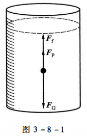
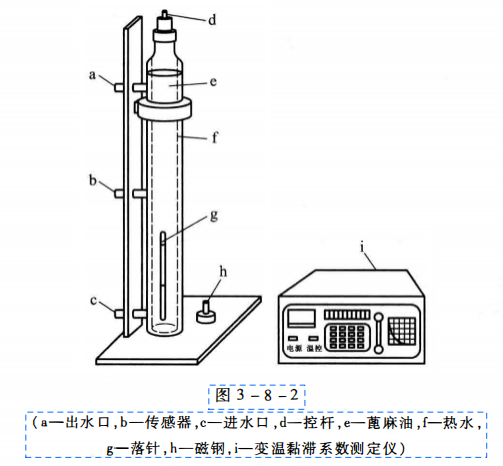
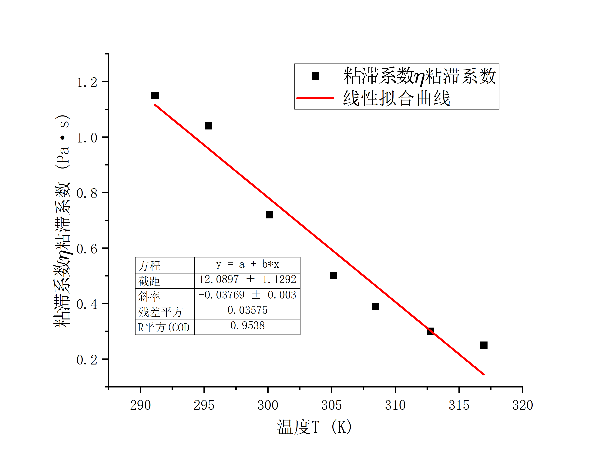
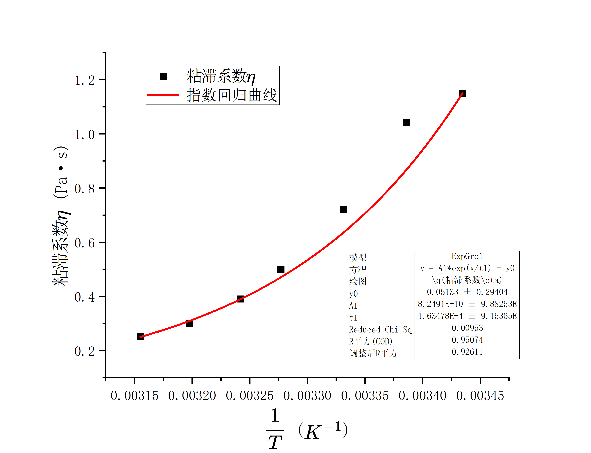

# 液体粘滞系数的测定

2024/11/6

# 一、实验综述

## 1、实验目的

1. 了解物体在液体中运动所受的粘滞阻力、并测定流体的粘滞系数$\eta$；
2. 研究液体粘滞系数随温度变化的关系。

## 2、实验背景

1. 粘滞系数

    在流动的液体中，流速不等的流体形成不同的流层，各流层之间因速度不等而存在内摩擦力，称为粘滞阻力，它会阻碍流层的相对运动。根据流体力学知识可知，粘滞阻力$f$的大小与流层间的接触面积$A$及垂直于速度方向的速度梯度$\frac{dv}{dy}$成正比，即$f=\eta A \frac{dv}{dy}$粘滞系数$\eta$的大小与液体的性质及温度有关。温度升高，液体的粘滞系数减小，而气体则相反。粘滞系数的测定在航空、造船、桥梁、化学、医学、水利工程中都有重大的实际意义。
2. 落球法黏性系数测量原理

    在一只装满静止液体的量简中，让一颗小球从液面中心开始下落，见图3-8-1。在下落过程中小球的运动方程为：$m\frac{dv}{dt}=F_G-F_P-F_f$​

    其中$F_G=\frac16\pi\rho gd^3$为小球所受重力，$F_P=\frac16\pi\rho_0gd^3$为小球所受的浮力，$F_f=3\pi\eta\beta dv$为小球所受的黏性阻力，$\beta$为修正因子，$\beta=(1+2.4\frac dD$）

    刚开始时小球在重力作用下做加速运动，下落速度不

    断增大，黏性阻力也随速度不断增大，如果从某一时刻起，小球能进入匀速运动，则这时小球的速度最大，称极限速度或收尾速度，记作$v_0$，此时满足$F=F_P+F_f$，即$\frac16\pi\rho gd^3=\frac16 \pi \rho_0 g d^3+3\pi \eta \beta d v_0 \Rightarrow \eta=\frac 1 {18}gd^2 \frac{\rho-\rho_0}{\beta v_0}\Rightarrow\eta=\frac1{18}gd^2\frac{\rho-\rho_0}{\frac Lt(1+2.4\frac d D)}$​

    

# 二、实验内容

## 1、实验仪器

变温法测量液体黏性系数的实验系统装置如图3-8-2所示，主要包括蓖麻油、量筒、螺旋测微器($0.004mm$)、游标卡尺($0.02mm$)、秒表($0.01s$)、数显温度计($1℃$)、小钢珠、镊子、控温系统。

控温系统由水泵、加热装置及控温装置组成。微型水泵运转时，水流自量筒外套筒的底部流入，自顶部流出，形成水循环，对待测液体进行水浴加热，加热功率为100W,并通过控温装置的调节，达到预定温度。待测液体的温度用数显温度计测量。

## 2、实验步骤

1. 对待测液体进行水浴加热，到达设定温度后进行保温，由于热惯性，需待一段时间后，才能达到平衡。
2. 在玻璃皿中任取六粒钢珠，用螺旋测微器测出直径取平均值。
3. 选择6个不同的温度点，使小钢珠从中间自由落下，测出室温下小钢珠匀速经过某段距离L的时间。
4. 将所有数据代入公式$\eta=\frac1{18}gd^2\frac{\rho-\rho_0}{\frac Lt(1+2.4\frac d D)}$计算粘滞系数$\eta$及不确定度（数据表格自拟）。
5. 作液体粘滞系数随温度变化的关系曲线图。

## 3、注意事项

1. 落球法时刻度线要尽量往下选取 ，最好在始末位置的旁边做个标记。
2. 控温装置上设定的是下一组实验的温度。
3. 读数时待控温装置指示灯熄灭后、温度计稳定后再读取读数。
4. 控温装置的温度只能往上设定，所以尽量不要按过头。
5. 螺旋测微计使用时要注意零位误差。

# 三、实验数据

## 1、数据记录

1. 落球法测量黏性系数

    室温$T=18.0\degree C$，小钢珠密度$\rho=7.85\times 10^3kg/m^3$，蓖麻油密度$\rho_0=0.969\times 10^3 kg/m^3$，内筒内半径$D=37.0mm$

    |实验次数|1|2|3|4|5|6|
    | ----------| -------| -------| -------| -------| -------| -------|
    |$d/mm$​|2.978|2.988|2.959|2.975|2.965|2.952|
    |$L/mm$​|80|80|80|100|100|100|
    |$t/ms$​|3320|3280|3410|4190|4120|4120|

2. 黏性系数随温度变化曲线绘制

    下落距离$L=120mm$  

    |实验温度$T/ \degree C$|下落时间$t/ms$|
    | ----------| ----------|
    |22.2|4510|
    |27|3160|
    |32|2180|
    |35.3|1700|
    |39.6|1290|
    |43.8|1090|
3. 实验数据签名

    ​

## 2、数据处理与分析

1. 室温下蓖麻油粘滞系数及其不确定度计算

    取重力加速度$g=9.79m/s^2$

    |实验次数|1|2|3|4|5|6|
    | ----------| -------| -------| -------| -------| -------| -------|
    |$d/mm$|2.978|2.988|2.959|2.975|2.965|2.952|
    |$L/mm$|80.0|80.0|80.0|100.0|100.0|100.0|
    |$t/ms$|3320|3280|3410|4190|4120|4120|

    1. $\mu_d$

        $\bar d=\frac {\sum_{i=1}^6d_i}{6}=2.970mm$

        $\mu_A=\sqrt{\frac{\sum^6_{i=1}(d_i-\bar d)^2}{6\times(6-1)}}=0.005mm$

        $\mu_B=\Delta_{仪器}/\sqrt{3}=0.003mm$

        $\mu_d=\sqrt{\mu_A^2+\mu_B^2}=0.006mm$
    2. $\mu_t$

        $\bar t=\frac {\sum_{i=1}^6t_i}{6}=3.74s$

        $\mu_A=\sqrt{\frac{\sum^6_{i=1}(t_i-\bar t)^2}{6\times(6-1)}}=0.18s$

        $\mu_B=\Delta_{仪器}/\sqrt{3}=0.09s$

        $\mu_t=\sqrt{\mu_A^2+\mu_B^2}=0.20s$
    3. $\mu_L$

        $\bar L=\frac {\sum_{i=1}^6L_i}{6}=90.0mm$

        $\mu_A=\sqrt{\frac{\sum^6_{i=1}(L_i-\bar L)}{6\times(6-1)}}=4.5mm$

        $\mu_B=\Delta_{仪器}/\sqrt{3}=0.2mm$

        $\mu_L=\sqrt{\mu_A^2+\mu_B^2}=4.5mm$
    4. $\mu_D=\Delta_{仪器}/\sqrt{3}=0.2mm$

    $\eta=\frac1{18}g{\bar d}^2\frac{\rho-\rho_0}{\bar v_0(1+2.4\frac {\bar d} D)}=1.15Pa\cdot s$

    根据计算公式$\eta=\frac1{18}g{\bar d}^2\frac{\rho-\rho_0}{\frac {L}{t}(1+2.4\frac {\bar d} D)}$

    两边取对数有$ln\eta =ln({\frac1{18}g(\rho-\rho_0)})+2lnd+lnt-lnL-ln(D+2.4 d)+ln D$  

    对各自变量求偏导数有$\frac{\partial ln \eta}{\partial d}=\frac 2d-\frac{2.4}{D+2.4d}$,$\frac{\partial ln \eta}{\partial t}=\frac 1t$,$\frac{\partial ln \eta}{\partial L}=-\frac 1L$,$\frac{\partial ln \eta}{D}=-\frac{1}{D+2.4d}+\frac 1D$

    代入不确定度公式得到$\frac {\mu_\eta}{\eta}=\sqrt{(\frac{\partial ln \eta}{\partial d})^2(\mu _d)^2+(\frac{\partial ln \eta}{\partial t})^2(\mu_t)^2+(\frac {\partial ln\eta}{\partial L})^2(\mu_L)^2+(\frac{\partial ln \eta}{D})^2(\mu_D)^2}=0.073$

    合成标准不确定度$\mu_\eta=\eta \times \frac{\mu_\eta}{\eta}=0.08Pa\cdot s$

    测量结果$\eta=1.15\pm0.08Pa\cdot s$

    查表得到蓖麻油在$18.0\degree C$下粘滞系数$\eta_标=1.17$

    $\varepsilon_\eta=\frac{|\eta-\eta_标|}{\eta_标}\times 100\%=1.71\%$

    误差较小在可接受范围内

2. 蓖麻油粘滞系数曲线与温度曲线绘制

|实验温度$T/K$|291.15|295.35|300.15|305.15|308.45|312.75|316.95|
| ----------| --------| --------| --------| --------| --------| --------| --------|
|粘滞系数$\eta/Pa\cdot s$|1.15|1.04|0.72|0.5|0.39|0.3|0.25|

我们尝试用两种模型拟合，分别是线性回归模型和阿伦尼乌斯模型（对于阿伦尼乌斯模型，我们对于温度$T$取倒数到进行指数增长拟合），以下给出两种拟合的拟合效果：

比较两模型拟合效果，可知对于阿伦尼乌斯模型，大部分数据点能比较好地落在拟合曲线上，效果更好也更符合实际理论模型，最后的拟合方程$\eta=8.2491\cdot10^{-10}e^{\frac{1}{1.63478\cdot10^{-4}T}}+0.05133$  

同样的，对于该数据段粘滞系数$\eta$的标准值采用相同模型进行拟合，给出拟合效果对比图：

可以看到，数据在室温段和较高温度段和标准数据契合地较好，在中间温度段和标准数据有较大的偏差，但总体都符合指数上升趋势,同时拟合出来的$y_0$都趋近于0，与理论模型吻合（这里可以看到标准拟合曲线和阿伦尼乌斯模型契合得很好，验证了模型的正确性）

3. 误差分析及模型解释
    实验的主要误差来自于以下方面：

    1. 实验仪器如刻度尺，螺旋测微器等受精度限制存在的系统误差；
    2. 实验采用的材料小钢珠实际受表面生锈层厚度影响，个体直径之间差异较大，后续计算中实际采用的平均值存在偶然误差；同时由于生产工艺限制，小钢球不为均匀完美球体；
    3. 由于实验中，小钢珠通过一段距离时间通过肉眼判断，实际起始时间由于反应时间存在偶然误差，尤其对于较高温度段，小钢珠的末速度较大，对于时间测定误差较大；
    4. 实验尽量选取了容器靠下端保证小钢球的匀速运动，但实际小钢球开始匀速运动的时机较难判断，对于较低温段，小钢球实际达到匀速运动的时间更长，所选取的测量段应更靠近容器下部；
    5. 实验采用的加热，测温仪器都较为粗糙，实际对于容器内液体极难控制温度的精确性以及液体在一段时间内保持不变温度，而粘滞系数对温度非常敏感，即使是微小的温度变化也会显著影响粘滞系数的测量结果，如果实验过程中温度不恒定，液体的粘度会在测量期间波动，导致不一致的测量结果。（如果假定测温仪器的准确性，那么在测定过程中由于热源持续加热，温度存在延后性，测定得到的粘滞系数$\eta$会受影响偏小）；
    6. 实验采用的测量方法理论要求液体均匀，且小钢珠应该在容器中心垂直下落（减小边壁效应影响），而实验中液体实际上下不均匀，容易产生**自然对流**。密度较小的液体会趋向于上升，而密度较大的液体则会下沉。这种对流现象会在液体中引入额外的流动，改变液体内局部的流速和流动形态，从而干扰原本的测量过程，导致粘滞系数测量结果出现误差；同时小钢珠的理想落下也很难保证。

    对于实验模型，根据热力学理论，分子具有一定的平均动能，这一能量与温度成正比，因此在更高的温度下，分子更容易获得足够的能量来克服分子间作用力，宏观表现为液体粘滞系数减小。

    根据阿伦尼乌斯假设，满足流动条件的分子分数可以用**麦克斯韦-玻尔兹曼分布**来描述。具有足够能量 $E$ 的分子分数近似与 $e^{-E/(RT)}$ 成正比，这里的 $R$ 是气体常数，$T$ 是绝对温度。因此，粘度 $\eta$ 可以表示为活化能的指数函数：$\eta \propto e^{\frac{E}{RT}}$加入一个比例常数 $\eta_0$ 后，得到完整的方程：$\eta = \eta_0 e^{\frac{E}{RT}}$，即我们上述所采用的拟合模型。

## 四、实验拓展

1. 请叙述斯托克斯公式的使用范围，及在实验中的应对措施。

    要求盛放液体容器无限大，小球半径较小，流体的粘度和密度均匀，在实验中我们尽可能使小球在容器中心垂直下落，同时采用修正因子$\beta=(1+2.4\frac{d}D)(1+3.3\frac{d}{2h})$对公式进行修正。

2. 如何确定小钢珠已经处于匀速运动状态。

    选取液体中两个已知间距的水平位置（例如两条标记线），测量小钢珠在这段距离上的下落时间。重复测量几次，如果小钢珠在相邻间隔内的下落时间基本一致，则可以判断其已达到匀速运动状态。

3. 影响液体粘滞系数的因素有哪些？

    液体的粘滞系数受温度、分子结构、压力、纯度、分子间作用力、分子量、外加电场或磁场、溶液浓度以及剪切速率（对于非牛顿流体）等因素的影响。一般来说，温度升高、分子结构简单、纯度高、分子间作用力弱的液体具有较低的粘滞系数，而复杂分子结构、较大分子量、较高溶质浓度或高压环境下的液体往往粘滞系数较高。
    
4. 设计一个不用传感器的测量液体表面粘性系数的实验方法，要求：简述实验方法和基本原理，画出系统原理框图。

查阅资料后，我们考虑用奥氏粘度计采用比较法进行测量，如下图

U形玻璃管一侧为毛细管C，其上有小玻璃泡B，在小玻璃泡B上下有指示痕$I_1$,$I_2$  

实际液体在水平细圆管中流动时，因黏性而呈分层流动状态，各流层均为同轴圆管。若细圆管半径为 $r$，长度为 $L$，细管两端的压强差为$\Delta P$，液体黏度为$\eta$，则细圆管的流量$Q=\frac {\pi r^4 \Delta P}{8\eta L}$，即泊肃叶定律，我们考虑测量一定体积液体流过毛细管的时间来计算$\eta$，即$Q=\frac {\pi r^4 \Delta P}{8\eta L}=\frac Vt$

实验时以一定体积的液体从大管口D注入 A 泡内，再由小管口 E 将液体吸入B泡中，使液面升高到 B 泡的指示痕 I1 以上。因两边液面的高度不同，B泡内液体将经毛细管C流回A泡。当液面由指示痕 I1 下降到指示痕 I2 时，测得其流动时间$t$，即为 I1，与 I2 刻痕间液体流 经毛细管所需的时间。  如果以同样体积的水和被测液体先后注入粘度计，按上述步骤测出两种液体面从 I1 降至 I2 所需时间分别为 $t_1$ 与 $t_2$ 。则$\eta_1=\frac{\pi r^4 \Delta P}{8VL}t_1,\eta_2=\frac{\pi r^4 \Delta P}{8VL}t_2\Rightarrow \frac{\eta_2}{\eta_1}=\frac{\Delta P_2t_2}{\Delta P_1t_1}=\frac{\rho_2t_2}{\rho_1t_1}\Rightarrow \eta_2=\eta_1\frac{\rho_2t_2}{\rho_1t_1}$

因此，查得作为标准液体蒸馏水的$η_1$、$ρ_1$，从实验得到 $t_1、t_2 、ρ_2$，即可求得被测液体粘滞系数$η_2$ 。

‍
