# 修正后的范德堡法测薄膜电阻

# 1 背景知识

## 1.1 理论背景

在薄膜材料的研究中，电阻是一个重要的物理量，直接影响材料的导电性和应用性能。尤其是在带有孔洞的薄膜中，电阻特性变得更加复杂，既受材料本身电子结构的影响，也与孔洞的几何形态、分布密度等因素密切相关。孔洞的存在不仅减少了薄膜中的导电区域，还可能影响电流的流动路径，进而导致测量误差。为了解决这一问题，修正后的范德堡法应运而生。

#### 1.1.1 范德堡法简介

范德堡法是一种经典的电阻测量方法，由荷兰物理学家范德堡于1958年提出。其原始形式为$e^{R_{12,34}/\lambda}+e^{R_{23,41}/\lambda}=1,\lambda=\frac{\rho}{\pi d}$​​  

该方法广泛应用于薄膜、单晶以及各种形状不规则样品的电阻测量。范德堡法的基本原理是通过在薄膜样品的四个角上施加电流并测量电压，进而计算电阻率。其最大优势在于对样品的几何形状要求较低，尤其适用于形状不规则的薄膜材料。

在传统的范德堡法中，样品通常是一个厚度均匀的二维材料，具有四个接触点（电极）。通过对电极之间施加已知电流并测量电压降，能够计算出样品的电阻率。范德堡法假设样品为均匀、各向同性的薄膜，电流在薄膜中流动时，电场和电流的分布会遵循一定的规律。典型的测量连接中，仅要求四个探针点在样片边缘，并保证整个测量过程中保持电极位置没有变化，如图1

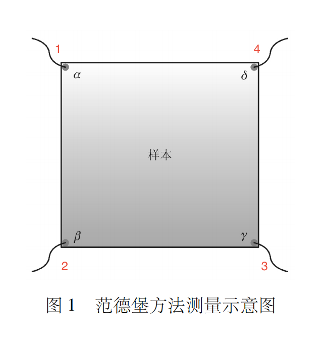

*图1.范德堡法配置*

#### 1.1.2 孔洞对薄膜电阻的影响

带孔洞的薄膜与均匀薄膜相比，其电阻特性更加复杂。孔洞的引入不仅减少了薄膜的有效导电区域，还改变了电流在薄膜内的分布路径，从而显著影响整体电阻特性。这一现象可以从以下几个方面具体分析：

1. **有效导电区域的减少**

    孔洞的存在直接削弱了薄膜的连续性，导致薄膜的实际导电面积减小。根据导体电阻的基本公式：$R=\frac{\rho \cdot L}{A_{\text{eff}}}$  

    其中，$A_{\text{eff}}$ 是薄膜的有效导电横截面积。孔洞的引入会显著降低 $A_{\text{eff}}$，从而增加电阻值。此外，由于孔洞分布的不均匀性，不同区域的导电能力可能呈现显著差异，导致薄膜整体电阻的非线性变化
2. **电流路径的改变**

    在均匀薄膜中，电流的分布通常是均匀的。然而，孔洞的存在会迫使电流绕过孔洞流动，形成弯曲的路径，从而增加了等效电阻。这种效应类似于材料内部的散射效应，孔洞越大、越密集，电流路径的偏离程度越高，薄膜的电阻越大。
3. **孔洞的形态与分布密度**

    孔洞的大小、形状和分布密度对薄膜的电阻特性有直接影响。例如：

    - 孔洞越大，其对电流路径的干扰越显著，薄膜电阻的增加幅度也越大。
    - 如果孔洞的分布是随机的，薄膜的电阻变化往往难以通过简单的几何关系预测，而需要通过统计或数值模拟的方法进行分析。
    - 当孔洞分布密度较低时，其影响可能局限于局部区域，而在孔洞密度较高时，薄膜可能表现出显著的绝缘特性。
4. **孔隙率的影响**

    孔隙率是衡量薄膜内部孔洞体积占比的重要参数。高孔隙率意味着薄膜中导电材料占比更低，导电网络的连续性受损更严重。研究表明，当孔隙率超过一定阈值时（例如30%\~40%），薄膜的导电性能可能会急剧下降，甚至表现出近似绝缘的特性。
5. **边界效应与局部场增强效应**

    孔洞的边界会引起电场分布的局部畸变，从而在薄膜局部区域产生更高的电场强度。这种效应可能导致电阻测量中出现误差，特别是在孔洞分布不规则的情况下。局部电场增强效应还可能引发非线性导电现象，进一步增加薄膜电阻的不确定性。

#### 1.1.3 修正传统范德堡法的必要性

由于孔洞的存在，传统范德堡法中假设的均匀电流分布被破坏，这会导致电阻测量结果与实际值产生偏差。具体来说，传统范德堡法基于以下重要假设：样品为均匀、各向同性的导电薄膜；且电流在薄膜中的分布是均匀且连续的。然而，孔洞的存在使上述假设不再成立，具体表现为测得的电压降不再直接反映真实的电流路径；电流绕过孔洞的行为会引入额外的几何因子，导致电阻的测量值偏离真实值。

因此，为了准确测量带孔洞薄膜的电阻率，需要在传统范德堡法的基础上进行修正。修正方法通常包括：通过几何因子补偿、数值模拟校正，以及实验标定修正因子等。这些方法的核心在于重新建立带孔洞薄膜的电流分布模型，以便更好地拟合实验数据。

## 1.2 课题概述

本课题旨在采用修正后的范德堡法对带孔洞薄膜的电阻进行精确测量。由于孔洞的存在会显著改变薄膜的电流分布，传统范德堡法在此类薄膜中的应用可能无法获得准确的电阻数据。因此，修正后的范德堡法通过引入孔洞分布和形态的修正因子，提供了一种更加准确的电阻测量方法。

对于修正后的范德堡法，我们通过实验数据拟合修正因子并与理论方程进行比较，验证理论方程的可行性，由此，可以更精确地反映带孔洞薄膜的电阻特性，从而为薄膜材料的导电性分析和实际应用提供更加可靠的数据支持。

本课题的研究将集中在以下几个方面：

1. **修正范德堡法的理论构建**：通过引入孔洞特性修正因子，改进传统范德堡法，使其能够更准确地反映带孔洞薄膜的电阻特性。
2. **实验设计与数据拟合**：在带孔洞薄膜的实验基础上，测量电阻并利用修正后的范德堡法进行数据拟合，分析孔洞率对薄膜电阻的影响。
3. **数值模拟与误差分析**：通过数值模拟进一步验证修正范德堡法的有效性，并分析可能的误差来源和修正精度。

通过本课题的研究，我们希望能够为带孔洞薄膜材料的电阻测量提供更为精确的理论方法和实验依据，推动薄膜导电性研究的发展。

# 2 原理阐述

## 2.1 基本原理阐述

根据改进后的范德堡法，我们考虑在测量过程中，在扁平的、任意形状的样品上放置四个隔离的接触点，依次在相邻电极施加电流，测量另一对电极的电压，然后反转电流，再次测量电压，两次电压测量值取平均值以消除热电动势，围绕样品进行八次测量，如图2所示

*图2 范德堡法测量过程*

其中1,2电极通电流$I$，34电极测电压$V_{3,4}$，则$R_{12,34}=\frac{V_{3,4}}{I}$2,3电极通电流$I$，41电极测电压$V_{4,1}$，则$R_{23,41}=\frac{V_{4,1}}{I}$  

则由范德堡公式$e^{R_{12,34}/\lambda}+e^{R_{23,41}/\lambda}=1,\lambda=\frac{\rho}{\pi d}$  

由上述测量过程中的12,34组得到$\rho_A=\frac{\pi}{ln2}f_At_s(\frac{V_2-V_1}{2I}+\frac{V_4-V_3}{2I})$

56，78组得到$\rho_B=\frac{\pi}{ln2}f_Bt_s(\frac{V_6-V_5}{2I}+\frac{V_8-V_7}{2I})$

薄膜电阻率$\rho=\frac{\rho_A+\rho_B}{2}$可以通过将任意形状向圆形进行保形映射来证明。

## 2.2 实验具体原理

#### 2.2.1 静电场中的重要定律和方程

静电场数值计算有限元方法的基础是静电场中的有关定律、定理和重要方程。两者之间存在因果关系。

##### 2.2.1.1 欧姆定律

导体中流过电流时，假若导体是各向同性的，也就是说电导率$σ$是一常量，这时欧姆定律可以表达为三维中的微分形式$\bold J=\sigma \bold E$；而当导体是各向异性时$\bold J=\bold \Sigma \bold E$  

电导率$Σ$为一张量，有限元方法中通常是讨论$σ$为常量的各向同性的情况，这就大大地简化了计算过程。

##### 2.2.1.2 奥-高定律

电场$E$沿封闭面$S$积分等于封闭面内的正电荷$q_A=\oiint \bold Eds$  

由欧姆定律和奥-高定律可以将电流场问题转化为静电场问题

$\begin{cases} q_A=\oiint \bold Eds \\ \bold J=\sigma \bold E \end{cases} \Rightarrow q_A=\frac{1}{\sigma}\oiint \bold Jds=\frac{I}{\sigma}$  

##### 2.2.1.3 静电场中的泊松方程

$\nabla^2\phi=-\frac{\rho}{\epsilon}$

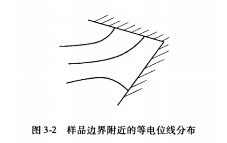

n为边界的法向单位矢量。泊松方程意味着等电位线到边界附近时必须与边界相互垂直，如图3-2所示。通常称这一边界条件为第二类边界条件。

##### 2.2.1.4 高斯定理

三维中向量场通过闭合曲面的通量与散度之间的关系$\iiint_v\nabla\cdot \bold Fdv=\iint_s\bold F\cdot \bold n ds$

$s$为空间区域，$v$为边界曲面，$n=(cosα,cosβ,cosγ)$为空间上一点法线单位矢量，$F$为空间域中某一物理量矢量。

##### 2.2.1.5 格林定理

$\iiint_v(\psi\nabla^2\phi+\nabla \psi\nabla \phi)dv=\iint_s\psi\frac{\partial \phi}{\partial n}ds$  

##### 2.2.1.6 静电场能量

电荷密度ρ在其周围产生电位分布中。取少量电荷δρ由电位为零的无穷远点移动过来便须做微小功：

$\delta U=\iiint \phi \delta \rho dv$

$\nabla \cdot \bold{D}=\rho, \bold{E}=-\nabla \bold{\phi}$

$\delta U=\iint \phi \delta D_nds+\iiint \bold{E}\cdot \bold{D}dv\ =\frac{1}{2}\epsilon \iiint|E|2 dv=\frac{1}{2}\epsilon \iiint |\nabla \phi|$​​$2dv$  

#### 2.2.3 图形变换理论

Vaughan采用镜像源法，是将电流探针流入和流出分别看作一点，分别称“源”和“汇”。为满足边界条件，找到源和汇的像，例如图2-17中对圆形边界，源M1和汇N1的镜像分别是M1′和N1′，像在圆外且和源在一直线上。

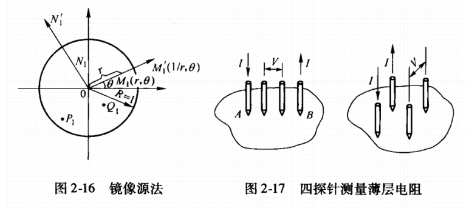

这样就将圆形边界变成一个无穷大平面的问题，源在无穷大平面上任何一点产生的电势为$\phi-\phi_0=-\frac{IR_s}{2\pi}lnr$  

式中，$\phi$中是任何一点相对于参考点的电势，$ϕ_0$是参考点的电势；$I$是源的电流；$R_s$是样品的薄层电阻；$r$是所求点到源的距离。这样可求出电压探针P和Q在任意位置的电势差。

#### 2.2.4 保形变换法推导范德堡方程

##### 2.2.4.1 半无穷大薄样品的Van der Pauw方程推导

设图4-1所示样品是半无穷大、厚度为d的平面，样品的电阻率为ρ,薄层电阻为R,即有$R_s=ρ/d$。沿样品无穷长直线边界逆时针有P、Q、R、S 4个触点，触点间的距离为$a、b、c$。当电流I从P点引入，流经样品后，又从Q点流出。由拉普拉斯方程在平面电流场中的解可得S点和R点间的电压差

$\begin{cases} V_S-V_R=\frac{IR_s}{\pi}ln\frac{(a+b)(b+c)}{b(a+b+c)}  \\ V_S-V_P=\frac{IR_s}{\pi}ln\frac{(a+b)(b+c)}{ca} \end{cases}$

$\Rightarrow \begin{cases} exp(-\frac{\pi(V_S-V_R)}{IR_s})=\frac{b(a+b+c)}{(a+b)(b+c)}  \\ exp(-\frac{\pi(V_S-V_P)}{IR_s})=\frac{ca}{(a+b)(b+c)} \end{cases}$  

将两式相加则得到半无穷大薄样品的Van der Pauw方程

$exp(-\frac{\pi(V_S-V_R)}{IR_s})+exp(-\frac{\pi(V_S-V_P)}{IR_s})=1$

同时可以得到样品的薄层电阻

$R_s=\frac{\pi}{2ln2}[(V_S-V_P)+(V_S-V_R)]f[\frac{(V_S-V_P)}{(V_S-V_R)}]$

其中$f[\frac{(VS−VP)}{(VS−VR)}]$称为Van der Pauw函数。

##### 2.2.4.2 任意形状薄样品的Van der Pauw方程推导

图4-1所示样品平面与复平面$z=x+iy$相重合，即该样品躺在复平面z上。样品的边缘上有4个触点P、Q、R、S,设其间距离为a、b、c。

引入函数$w=f(z)=u(x,y)+iv(x,y)$。函数f(z)满足：u代表样品中势场。

函数u和v满足柯西-黎曼(Cauchy-Riemann)关系，

$\frac{\partial u}{\partial x}=\frac{\partial v}{\partial y},\frac{\partial u}{\partial y}=-\frac{\partial v}{\partial x}$  

研究样品上半平面沿任意路径s的法向净电流

$I_{T_2T_1}=\frac{1}{R_s}\int_{T_1}^{T_2}E_nds\\= \frac{1}{R_s}\int_{T_1}^{T_2}(-\frac{\partial u}{\partial y}dx+\frac{\partial u}{\partial x}dx)=\frac{1}{R_s}(v_{T_2}-v_{T_1})$​​  

沿路径s从任意点$T_1$,走到点$T_2$时，从路径s法向流出的电流只与该两点虚轴v上的坐标差及薄层电阻R,有关。如果沿路径s从法向无电流流出，则v值不变。当沿路径s从法向有电流I流出时，则v值增加，其增加量为$Δv=R_sI$。如果沿样品边界实轴u从-α到+α,无电流垂直流入或流出实轴u,即就无电流流入或流出样品边界，则v=0。

现在考虑图4-2所示一躺在复平面t上任意形状的样品：$t=r+is$。

由图形变换理论，总可以找到一个分析函数t(z)使z平面的上半平面复制并映射到t平面上的样品上，而且可让$k(t)=l+im$与$f(z)=f[z(t)]=k(t)$完全一致，一一对应。此时，t平面上位于样品边缘任意位置的A、B、C、D点成为z平面位于实轴u上的P、Q、R、S点的镜像(如图4-2所示)。由图形变换理论可知，此时$t$平面上的$m$对应于$z$平面上的$v$。如果u代表z平面上的势场的话，则l代表t平面上的势场。

当沿z平面上的样品边缘逆时针走时，此时无电流从边缘流出，边缘的法向电场强度处处为零，因而v值不变。

但到达z平面的边缘的P点，若此时有电流I从P点流入，则在P点处边缘的法向电场强度不为零。设想在P点又沿里面一小的半圆走，因为在P点处边缘的法向电场强度应与边缘的电流密度矢量相平行一致，因此小半圆的法向电场强度不为零。沿此小半圆法向电场强度的积分等于从P点流入的电流I。于是在P点处$v$值增加，增加量为$Δv=R_sI$。过P点后，继续沿样品边缘走时，因为边缘无电流流入，v值保持不变。但是到达Q点时，Q点有电流I流出，在Q点处存在负的法向电场强度，又沿一小的半圆走，沿此小半圆法向电场强度的积分等于从Q点流入的电流I。因此v值又减小至零，其减小量为$Δv=−R_sI$。

现在再来研究躺在t平面上的样品，样品的薄层电阻为$Rs′$。当电流$I'$仅从样品边缘的触点A进入时，则$Δm=R_s'I'$。当仅从样品的触点B流出时，$Δm=−R_s'I'$。选择电流$I'=IR_s/R_s′$,则$I'R_s'=IR_s$，当电流I'由样品边缘A点流入并由B点流出时，$V_d−V_c=V_S−V_R$。当电流I'由样品边缘B点流入并由C点流出时，$V_d−V_a=V_S−V_p$，便有下式：

$V_d-V_c=\frac{I'R_s'}{\pi}ln\frac{(a+b)(b+c)}{b(a+b+c)}=\frac{IR_s}{\pi}ln\frac{(a+b)(b+c)}{b(a+b+c)}=Vs-V_R$

$V_d-V_a=\frac{I'R_s'}{\pi}ln\frac{(a+b)(b+c)}{ca}\ =\frac{IR_s}{\pi}ln\frac{(a+b)(b+c)}{ca)}=Vs-V_P$  

于是任意形状薄样品边缘上的A、B、C、D满足同样的Van der Pauw 方程$exp(-\frac{\pi(V_d-V_a)}{I'R_s'})+exp(-\frac{\pi(V_d-V_c)}{I'R_s'})=1$  

样品的薄层电阻$R_s'=\frac{\pi }{2ln2}\frac{V_{ad}+V_{dc}}{I'}f(\frac{V_{dc}}{V_{dc}})$

#### 2.2.5 单孔材料范德堡公式修正

类似的，考虑将有孔洞的样品向有限长度圆柱/圆筒作映射，则对于映射后得到的圆柱/圆筒

$R_{PQ,RS} = \lambda \ln \left| \frac{G(\alpha + \beta, h) G(\alpha + \gamma, h)}{G(\beta, h) G(\gamma, h)} \right|$

$R_{QR,SP} = \lambda \ln \left| \frac{G(\alpha + \beta, h) G(\alpha + \gamma, h)}{G(\alpha, h) G(\delta, h)} \right|$

$R_{PR,QS} = \lambda \ln \left| \frac{G(\alpha, h) G(\delta, h)}{G(\beta, h) G(\gamma, h)} \right|$

$G(\theta, h) = \sin \frac{\theta}{2} \prod_{n=1}^\infty \left( 1 - \frac{\cos \theta}{\cosh nh} \right)$

$\nu = \frac{G(\alpha, h) G(\delta, h) + G(\beta, h) G(\gamma, h)}{G(\alpha + \beta, h) G(\alpha + \gamma, h)} \leq 1$

虽然已知任何带孔的样品都可以保形映射到圆柱体上，但提供映射的精确数值关系仅适用于某些几何形状，例如具有相同中心的矩形样品中的矩形孔，或椭圆形状的样品和孔。因此，在一般几何中，探针之间的角度在被映射后和样品的黎曼模量*h*是未知的，导致太多的未知因素，传统的范德堡方法无法适用。

保留范德堡公式形式，修正等式右侧的常数1为$ν$

- 作出简单假设，认为$ν$仅仅是面积比的线性函数
- 用已知电阻率和厚度的相同样品，测量$ν$，验证它只是面积比的函数，而与样品使用的材料无关

本实验利用了*$ν$*的值对*$α$*​$、$​*$β$*​$、γ 、δ$值的微小变化不太敏感这一事实，在使用带有小孔的样品进行实验时，将探针彼此远离，这样*$α$*​$、$​*$β$*​$、γ 、δ$将趋向于$\frac \pi 2$,由此可以近似给出$\nu$仅作为孔面积比的线性函数的关系。

$\nu=\prod \limits ^{\infin}_{n=1}(1+\frac{1}{cosh( nh)})^{-2}$（$h=-ln\frac{A_{hole}}{A}$）

对于这个包含无穷乘积的式子，我们尝试进行一阶估算近似

$\nu=\prod \limits ^{\infin}_{n=1}(1+\frac{1}{cosh( nh)})^{-2}\approx\prod \limits ^{\infin}_{n=1}(1+\frac{1}{e^{nh}})^{-2}\approx \prod \limits ^{\infin}_{n=1}(1-\frac{4}{e^{nh}})\approx e^{\sum^\infin_{n=1}-\frac4{e^{nh}}}\approx e^{{{-\frac{4}{e^h}}}}$

很容易做出它的一阶近似估算$\nu=1-\frac4{e^h}$,在图像上表现为一条直线

此外，本实验假定给定样本的*ν*值仅取决于几何形状，而不取决于制作样本的材料类型。因此实验使用不同材料的样品进行实验获得v，来验证孔洞面积较小时ν仅取决于几何性质。

#### 2.2.6 实验原理

为研究在样本有孔的情况下，范德堡法的应用情况，本实验用范德堡法对同种材料无孔条件，有不同孔径的孔洞条件下电阻率分别进行了测量． 实验中使用厚度为 0．000 1 m 的单孔圆环状铜材料样本和银材料样本。

取规则位置放置探针，将 4 个电极1，2，3，4如图 2 所示焊接在样本表面，所用电源为单路稳压电源，1,2电极通电流$I_{1,2}$，34电极测电压$V_{3,4}$，则$R_{12,34}=\frac{V_{3,4}}{I_{1,2}}$；2,3电极通电流$I_{2,3}$，41电极测电压$V_{4,1}$，则$R_{23,41}=\frac{V_{41}}{I_{23}}$。探针取不同位置时，测得多组$R_{12,34}$,$R_{23,41}$的值。基于此分别做出有孔条件下和无孔条件下样本$R_{12,34}-R_{23,41}$图像

本实验首先通过制作不同孔洞面积比的样品并进行多次测量，来对范德堡公式进行孔洞修正，并对孔洞形状、位置对于修正因子的影响作定性分析。此外，本实验假设修正后的$\nu$与样品的材质无关，通过采用不同材质（铜和银）进行实验研究，来对猜想进行验证。

# 3 实验装置

## 3.1 硬件架构

实验硬件主要包括薄膜制备仪器、测量设备以及数据采集与传输模块，具体如下：

1. **薄膜制备仪器**

    - **真空镀膜机**：用于薄膜样品的制备，能够控制沉积材料（铜、铝）的厚度和均匀性。
    - **胶带和载玻片**：用于在载玻片表面形成孔洞模板。将胶带按照设计的形状贴在载玻片上，完成镀膜后撕去胶带，得到带孔洞的薄膜。
2. **电极焊接设备**

    - **纳米银胶**：用于将金线焊接到薄膜样品的四个电极点上，确保接触良好，减小接触电阻。
    - **金线**：作为电极连接薄膜和测量设备。
    - **真空脂** ：用于简单固定载玻片。
    - **乙酸丁酯**：溶解纳米银颗粒。
3. **电学测量设备**

    - **数字万用表**：用于简单验证电极之间导通性。
    - **6221 型交流/直流电流源**：提供稳定的电流输入，用于激励薄膜样品。
    - **双通道2182型纳伏表**：作为测量系统的核心，提供多通道电极切换和控制功能，支持范德堡法的测量。
4. **其他辅助设备**

    - **光学显微镜**：用于观察薄膜表面的孔洞形态，拍摄图像并为后续图像分析提供数据。
    - **计算机**：用于测量系统控制、数据采集、图像处理与分析。

通过以上硬件设备的协同工作，能够完成薄膜制备、电极连接、数据采集及电阻率的精确测量。

## 3.2 软件架构

实验的软件架构分为测量控制软件和数据分析软件两部分，具体如下：

1. **测量控制软件**

    - Keithley 测量系统软件  
      实验使用 Keithley 提供的测量系统软件与 ：

      - **设备控制**：设置电流源的输出参数、切换开关系统中的电极通道。
      - **数据采集**：实时记录电压和电流测量值，并将数据以标准格式保存至计算机。
      - **误差校准**：支持对测量误差进行校准，确保测量结果准确。
2. **数据分析软件**

    - **ImageView 图像处理模块**ImageView 软件主要用于对孔洞形态的图像处理与特征提取，具体功能包括：

      - 图像预处理：对光学显微镜拍摄的孔洞图像进行去噪和增强。
      - 特征提取：提取孔洞的几何尺寸、分布密度和孔隙率等特性。
      - 修正因子计算：根据提取的孔洞参数，计算修正因子$\nu$，为后续电阻率的计算提供输入参数。
    - **数据分析与可视化模块**使用Origin处理实验采集的数据，完成以下功能：

      - 计算修正因子$\nu$：代入修正后的范德堡公式，计算不同空洞率下孔洞修正因子$\nu$，计算带孔洞薄膜的电阻率。
      - 理论曲线拟合：将实验结果与理论曲线进行对比分析，验证实验的准确性和修正因子的合理性。

# 4 实验操作

### **4.1 实验方法**

本实验采用修正后的范德堡法测量带孔洞薄膜的电阻率，主要包括薄膜制备、电极焊接、测量与数据修正四个环节。

1. **薄膜制备**

    - 在清洁的载玻片表面粘贴设计好的胶带模板，以形成不同形状和大小的孔洞；
    - 使用真空镀膜法制备薄膜，分别以铜和铝为材料，控制镀膜厚度达到设计值；
    - 镀膜完成后撕去胶带，得到带孔洞的薄膜样品。
2. **电极焊接**

    - 在显微镜下使用纳米银胶将金线焊接至薄膜的四个电极点，确保电极与薄膜表面接触良好，减小接触电阻。
3. **测量与修正**

    - 利用范德堡法进行测量，通过注入高精度电流并记录多个电极间的电压值，结合薄膜厚度和实验修正因子计算电阻率；
    - 修正因子 $\nu$根据薄膜孔洞的几何特性（孔隙率、分布密度等）计算，具体参数由光学显微镜采集的图像经过 ImageView 图像分析模块提取。
4. **数据分析**

    - 将实验测量结果与理论曲线进行对比，评估修正因子的有效性，分析孔洞对薄膜电阻率的影响并验证实验的准确性。

#### 4.2 实验步骤

1. **薄膜制备**

    1. 清洁载玻片，并使用粘性良好的胶带在载玻片表面贴出设计好的孔洞形状（包括不同大小和分布）。
    2. 在真空镀膜机中放置载玻片，分别采用铜和铝材料进行镀膜，控制镀膜厚度达到设计要求。
    3. 镀膜完成后撕去胶带，形成带有孔洞的薄膜样品。
2. **电极焊接**

    1. 在显微镜下使用纳米银胶将金线焊接到样品薄膜的四个角上，形成良好的电极接触点。

    2. 确保焊接位置与测量设备接线端子匹配，避免接触电阻过大或电极脱落。
3. **测量装置搭建**

    1. 将样品固定在绝缘基底上，连接至 7065 型霍尔效应卡的测量接口。

    2. 依次连接测量系统中的 2000 型数字万用表、6220 型电流源、6485 型皮安计和 7001 型开关系统。(3) 启动系统，检查硬件连接状态，确保设备正常运行。
4. **实验测量**

    1. 通过开关系统切换电极连接，注入高精度电流$I_{AB}$和$I_{BC}$。

    2. 使用数字万用表分别测量电压$U_{CD}$和 $U_{DA}$，记录数据。

    3. 重复测量三次，计算平均值以减少随机误差。
5. **图像采集与修正因子计算**

    1.  使用光学显微镜拍摄样品的孔洞图像，导入 ImageView 模块进行处理。
    2. 提取孔洞的几何形状、分布密度和孔隙率等参数。
    3. 根据提取数据计算修正因子$\nu$，将其导入电阻率计算公式。
6. **数据处理与分析**

    1. 将实验得到的修正因子$\nu$与理论曲线进行比较
    2. 通过对比分析验证实验结果的准确性，并评估修正因子的有效性。

## 4.3 实验数据

原始数据如下，在同等比例尺下定标$1cm=1519.49px$

|样品编号|样品材质|薄膜像素面积/$px^2$|孔洞像素面积/$px^2$|孔洞面积占比$\frac{S_{hole}}{S}$|$R_{12,34}/m\Omega$ |$R_{23,41}/m\Omega$|孔洞形状|薄膜图像|
| ----------| ----------| ---------------| ---------------| ---------------| -------| -------| ------------| -----------------------------------------------------------------------------|
|1|铜|2238100|229824|0.102687101 |35.12|44.23|平行四边形|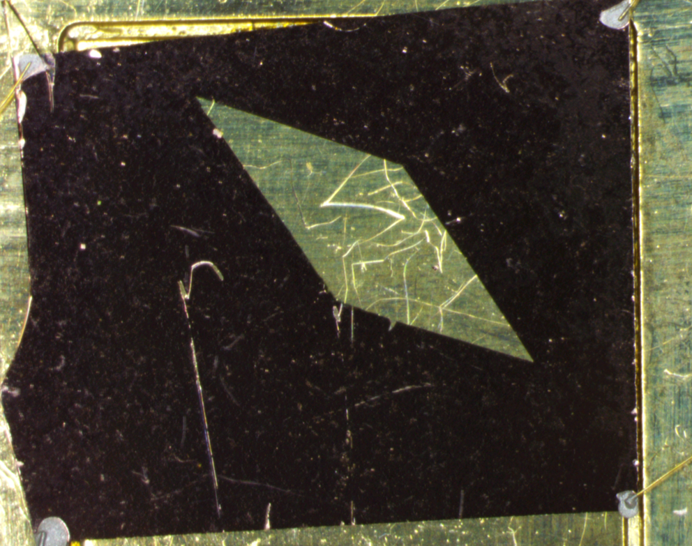​|
|2|铜|2070316.5|134410.5|0.064922682|24.67|36.24|三角形|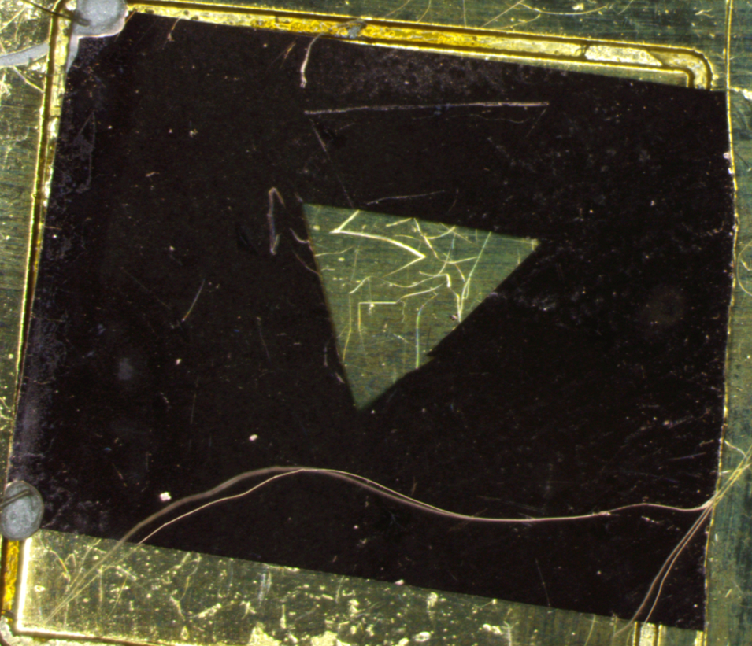​|
|3|铜|2208470|233450|0.105706666|38.45|45.67|正方形|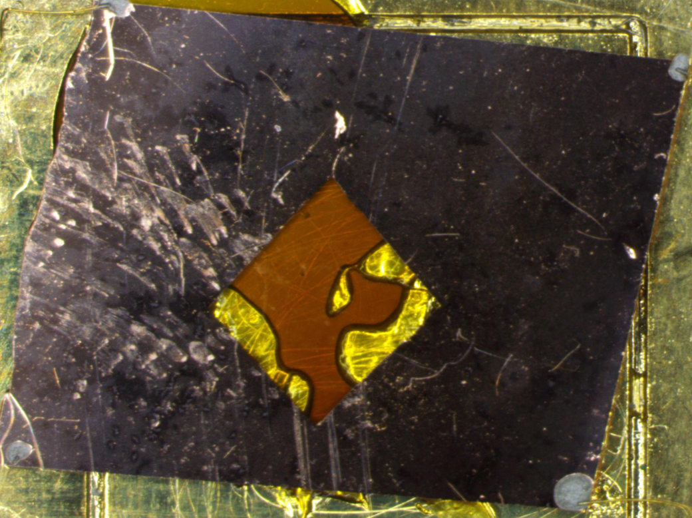​|
|4|铜|1876286|239248|0.127511477|42.34|47.89|矩形|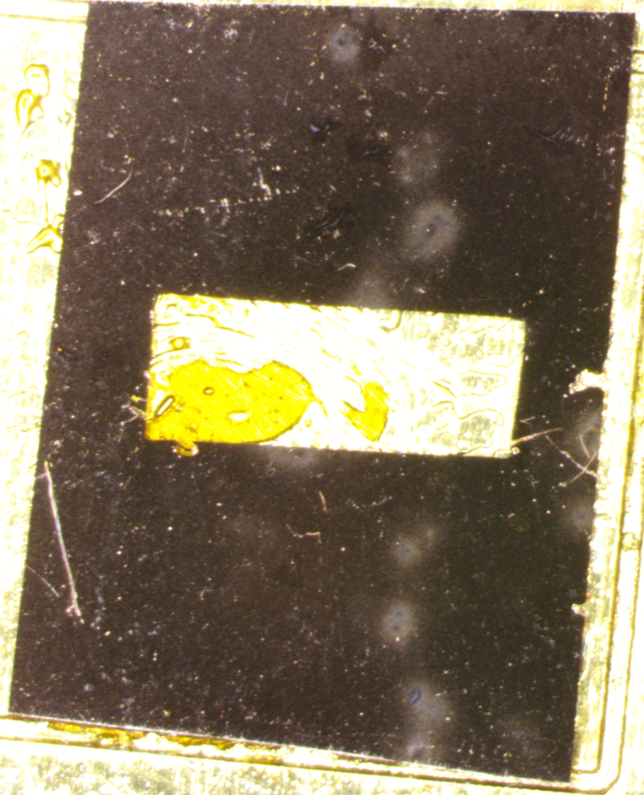​|
|5|铜|2202103.5|149517.5|0.067897581|26.45|37.89|矩形|​|
|6|银|2844448|224535.5|0.078938163|28.55|39.45|三角形|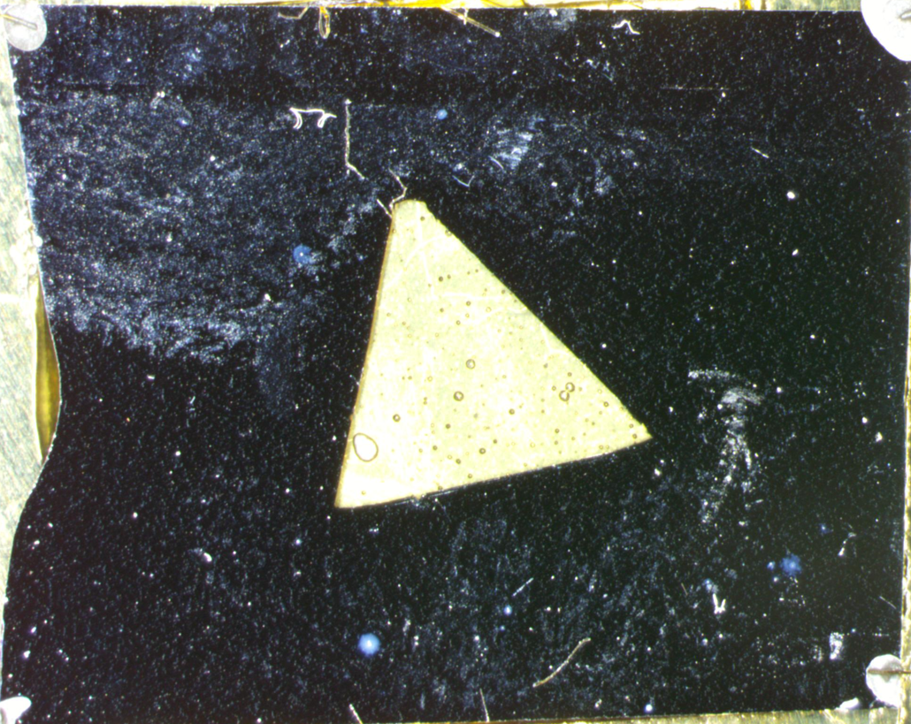​|
|7|银|1860474|160936|0.086502687|31.23|41.12|三角形|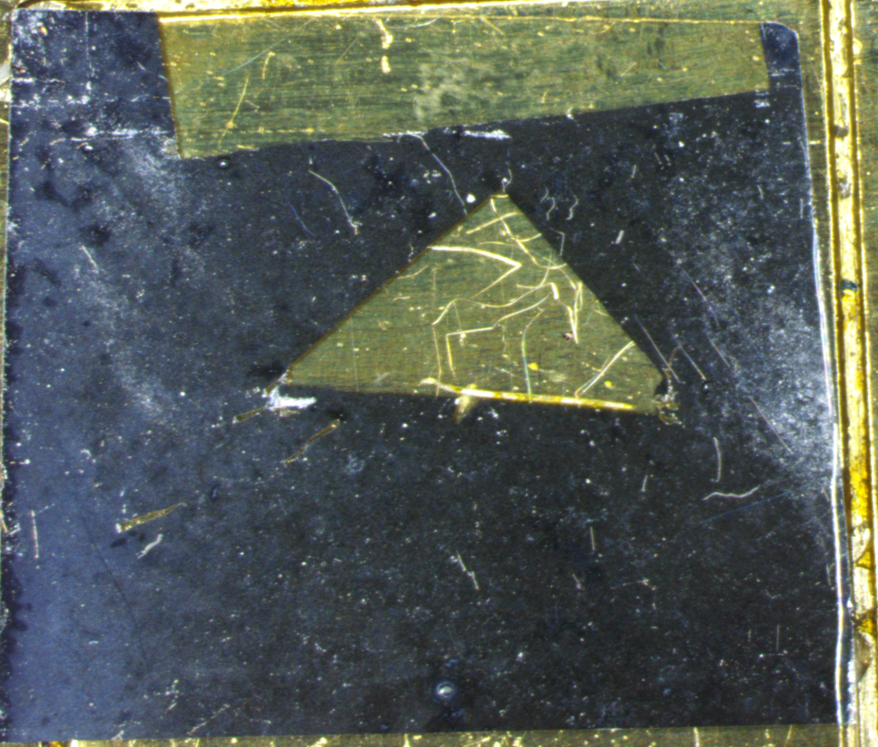​|
|8|银|2443601.5|383621|0.15699 |48.12|50.00|正方形|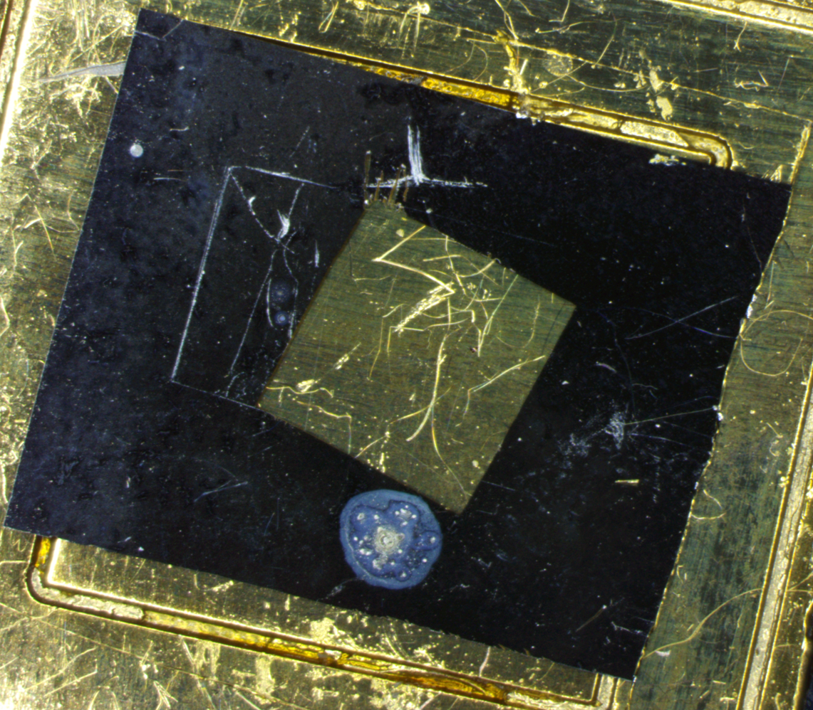​|
|9|银|1974287.5|93440.5|0.04732872|22.34|34.12|平行四边形|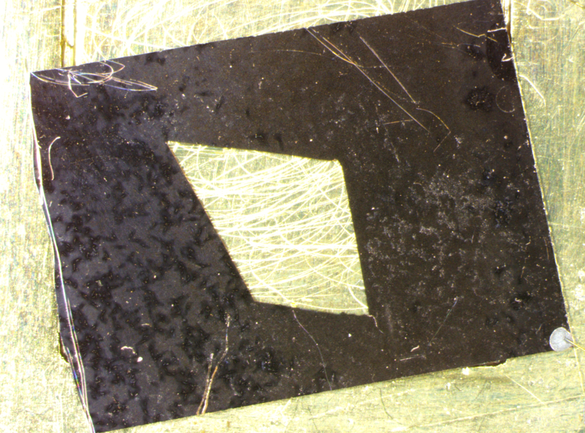​|
|10|银|2357142|0|0|20.12|32.78|/|/|

## 4.4 实验结果

我们采用修正后的范德堡方程计算修正因子$\nu$，即$\nu=e^{-\frac{R_{12,34}}{\lambda}}+e^{-\frac{R_{23,41}}{\lambda}}$，其中$\lambda=\frac{\rho}{\pi d}$

其中银的电阻率为$1.59\cdot 10^{-8}\Omega\cdot m$，铜的电阻率为$1.69\cdot 10^{-8}\Omega\cdot m$

得到的相应修正因子数据表格如下

|样品编号|样品材质|孔洞面积占比$\frac{S_{hole}}{S}$|修正因子v|
| ----------| ----------| ---------------| -----------|
|1|铜|0.102687101 |0.832|
|2|铜|0.064922682|0.943|
|3|铜|0.105706666|0.802|
|4|铜|0.127511477|0.751|
|5|铜|0.067897581|0.924|
|6|银|0.078938163|0.903|
|7|银|0.086502687|0.876|
|8|银|0.15699 |0.685|
|9|银|0.04732872|0.962|
|10|银|0|0.985|

我们对于理论中推出的修正因子$\nu$的理论曲线及其一阶近似方程进行图像拟合

两条理论曲线方程分别是标准理论曲线$\nu=\prod \limits ^{\infin}_{n=1}(1+\frac{1}{cosh( -n\cdot ln\frac{A_{hole}}{A})})^{-2}$​

一阶近似曲线方程为$\nu=1-4e^{-h}\approx=1-4\frac{A_{hole}}{A}$  

对于两种材质的拟合效果如下

可以看到拟合对于实验中制造的带孔洞薄膜样品表现出了较好的效果，我们可以认为在孔洞面积占比不大（<0.2）时理论方程是可行的；而尽管采用一阶线性近似精确程度不如标准理论曲线方程，但是考虑到计算效率在孔洞面积占比不大时仍然可以考虑，并能给出相对好的计算效果；在计算量允许的前提下同样可以做更高阶的估算，得到更加精确的理论方程近似值。

# 5 分析与讨论

## 5.1 误差来源

在使用修正后的范德堡法测量薄膜电阻时，误差的来源可能来自以下几个方面：

- **仪器精度误差**  
  测量过程中使用的仪器（如恒流源、微伏表、电压源等）均存在一定的测量精度限制。例如，恒流源可能存在输出电流的波动或偏差，微伏表的分辨率和线性度可能不足，电压源的输出可能存在不稳定性。这些仪器的精度限制在测量非常低或非常高的电阻值时尤为显著，会对最终的电阻计算结果造成直接影响。因此，实验所用仪器的标定精度和性能稳定性是影响测量结果的重要因素。
- **接触电阻**  
  在薄膜电阻测量中，电极与薄膜表面之间的接触质量对测量结果有显著影响。由于接触表面可能存在氧化、污染或表面粗糙度等问题，接触电阻会显著增大。接触电阻的大小与电极材料、接触压力以及薄膜表面的平整性密切相关。接触电阻的存在会导致总电阻值偏离真实值，尤其当接触电阻与薄膜电阻值相当时，其影响将更加明显。
- **环境因素**  
  环境条件（如温度、湿度和空气质量等）会显著影响测量结果。温度变化会导致薄膜材料电阻的波动，具体表现为电阻值随温度升高而增加或减小，其变化率可通过材料的温度系数描述。此外，湿度可能改变薄膜表面的电导特性，而空气质量（如尘埃颗粒）可能在薄膜表面形成附着层，进一步影响测量结果。环境因素还可能间接影响测量仪器的稳定性，从而对数据精度产生影响。
- **薄膜不均匀性**  
  薄膜的厚度、材料成分和结构分布可能在不同区域存在不均匀性。这种不均匀性会导致薄膜不同位置的电阻值存在差异，进而影响测量的重复性和准确性。薄膜不均匀性主要源于制备工艺的波动或局部缺陷，例如厚度梯度、成分偏析或孔洞的存在。这种误差在薄膜面积较大或测量点选择随机时尤为突出。
- **计算误差**  
  修正后的范德堡法依赖于一系列理论模型和数学公式，这些模型通常建立在特定假设的基础上。例如，薄膜被假定为均匀连续的各向同性导体，接触电阻被认为可忽略，或边界效应对电阻的影响被简化处理。当实验条件与理论模型的假设不符时，例如薄膜的非均匀性或接触电阻不可忽略时，计算结果可能偏离真实值。此外，数值计算中的舍入误差或拟合误差也会影响最终结果。
- **电流方向与电场效应**  
  在薄膜材料中，电流的流动方向可能会受到电场分布或材料内局部电场效应的影响。例如，薄膜可能存在非线性导电特性，或者局部的电荷积累改变了电场分布，使得实际电流路径发生偏移。这种偏移可能导致测量电阻值偏离预期值，尤其当薄膜具有复杂的电导特性时，其影响尤为明显。

## 5.2 误差分析

根据实验过程中的数据，分析不同误差源对测量结果的具体影响。

1. **仪器精度误差**  
    仪器的精度对测量结果有直接影响，其标定误差和测量误差可以量化。例如，在测量电压时，若使用的微伏表精度为 ±0.1 mV，则每次测量可能会带来最高 0.1 mV 的电压误差。若施加的电流为 1 mA，根据 $R = V/I$ 的关系，这一电压误差将导致电阻值出现最高 $\Delta R = \Delta V/I = 0.1 \, \Omega$ 的误差。此外，若电流源本身存在波动（例如 ±0.5% 的精度），也会导致额外的误差累积。因此，在实验中，应尽量选用高精度仪器，并对仪器进行充分标定，以减小此类误差的影响。
2. **接触电阻的影响**  
    接触电阻是薄膜电阻测量中的关键误差源之一，尤其是在电流通过薄膜电阻的接触端时。由于接触界面可能存在不良导电性（例如氧化、污染或表面粗糙度的影响），导致接触电阻值偏高。这种附加电阻直接增大了测量的总电阻值，使得测量结果偏离真实值。尤其当接触电阻与薄膜电阻值处于同一量级时，这种影响尤为显著。通过优化电极接触、增加接触压力或采用四端测量法，可以有效减小接触电阻的影响。此外，多次测量并调整接触点的位置也能减少由接触电阻引入的误差。
3. **环境因素**  
    环境条件（如温度、湿度等）会显著影响薄膜电阻的测量。温度变化通过材料的温度系数（$\alpha$）对电阻值产生影响。具体而言，电阻值 $R$ 随温度变化的关系可表示为：

$$
R = R_0 [1 + \alpha (T - T_0)],
$$

其中 $R_0$ 为参考温度 $T_0$ 下的电阻值，$\alpha$ 为材料的温度系数。当环境温度波动较大时，电阻值的变化将随之增加，导致测量结果的不稳定性。因此，应尽量在恒温环境下进行实验，或通过温度补偿电路和修正公式对温度引起的误差进行校正。

4. **薄膜不均匀性**  
    薄膜的物理性质（如厚度、成分分布等）可能在不同位置存在不均匀性，导致薄膜电阻值随位置不同而变化。尤其是在微小区域内，薄膜厚度或材料成分的局部波动可能使测量结果偏离理论值。为减小此类误差，应在薄膜不同位置进行多次测量，并取平均值作为最终结果。此外，结合表面形貌分析仪（如 AFM 或 SEM）测量薄膜厚度和均匀性，可以进一步校准实验结果并验证不均匀性对电阻值的影响。
5. **计算误差**  
    范德堡法在理论推导中假设了理想实验条件（例如薄膜材料为均匀连续的各向同性导体、接触电阻可忽略不计等），但在实际实验中，这些假设与真实情况可能存在偏差。特别是当薄膜材料存在非均匀性或接触电阻不可忽略时，理论公式与实际测量值之间可能产生系统性误差。此外，在数据处理和计算过程中，由于数值精度限制（如舍入误差或数据拟合误差），也会引入额外的计算误差。因此，应严格验证理论模型的适用性，必要时对模型进行修正，并通过与实际测量结果的对比来评估计算误差的影响。同时，建议使用高精度计算工具并采用多组数据的统计分析方法，以减小随机误差对最终结果的影响。

## 5.3 实验分析

在实验过程中，通过对修正后的范德堡法进行一系列测量，可以得到多个薄膜电阻的实验数据。结合误差来源和误差分析，以下是对实验结果的分析。

1. **实验数据的稳定性**  
    实验数据整体表现出一定的稳定性，但同时受到接触电阻、温度波动及薄膜本身不均匀性的影响。多次重复测量并对数据取平均值能够有效减小单次测量的偶然误差，同时提高实验结果的可靠性。此外，通过对比不同时间点的测量结果，可以评估实验系统的长期稳定性，进一步验证仪器和测量方法的稳定性能。
2. **与理论值的比较**  
    将修正后的范德堡法测得的薄膜电阻值与理论模型计算值或文献中的参考数据进行对比，能够直观地反映实验误差的大小和来源。如果实验结果与理论值存在显著偏差，需要重点分析模型假设（如薄膜的各向同性假设或接触电阻的忽略处理）与实际实验条件的匹配程度，识别偏差的可能来源。同时，可以结合误差分析结果评估具体误差源的贡献。
3. **影响因素的定量分析**  
    通过系统地改变实验条件（如温度、湿度、薄膜厚度、电极接触压力等），测量不同条件下的薄膜电阻，并分析这些变化对测量结果的影响。利用多变量统计分析或敏感性分析方法，可以定量评估各误差源对实验结果的贡献程度。这不仅有助于优化实验设计，还可以为修正测量结果提供依据，进一步提升结果的精度。
4. **修正后的范德堡法的有效性**  
    实验结果表明，修正后的范德堡法在提高薄膜电阻测量精度方面具有显著优势。尽管接触电阻、薄膜不均匀性和环境因素仍会对测量结果产生一定影响，但通过合理的实验设计（如增加测量点数量、优化电极接触条件等）和后续数据处理，修正后的方法能够有效减少误差，保证测量结果的准确性。此外，该方法对非理想薄膜结构的适应性也得到了验证，证明了其在实际应用中的广泛性和可靠性。

# 6 实验总结

## 6.1 实验总述

本实验通过研究薄膜孔洞对修正后的范德堡方程的影响，旨在探索孔洞形状、位置以及面积占比等因素对薄膜电阻测量结果的具体影响。实验主要集中在薄膜孔洞面积占比的测量与修正后的范德堡方程的适配性上，结果表明，薄膜孔洞的存在对电阻测量具有一定的影响，尤其是孔洞的面积占比增大时，薄膜的电阻呈现出明显的变化。在实验过程中，我们通过优化孔洞的分布和薄膜面积占比的测量方法，取得了一定的实验数据，并对其影响进行了初步分析。

修正后的范德堡方程在处理薄膜孔洞影响方面展现了较好的效果，但仍然存在一定的适应性限制，尤其是在孔洞形状和位置等更多因素的考虑上，尚未进行深入探讨。实验表明，薄膜的孔洞占比与电阻变化之间存在一定的关系，但对于孔洞的具体形状和分布对电阻影响的定量分析仍有待进一步研究。

## 6.2 不足之处

尽管实验取得了一定的进展，但仍存在一些不足，主要包括以下几个方面：

1. **未考虑孔洞形状与位置的影响**：本实验主要关注薄膜孔洞的面积占比对电阻的影响，而未进一步研究孔洞的具体形状（如圆形、椭圆形、不规则形状等）和位置（如分布均匀性与不均匀性）对范德堡方程的适配性。孔洞形状和位置的不同可能对电阻值产生不同的影响，因此未能考虑这些因素可能导致实验结果的适应性不足。
2. **薄膜面积占比测量的准确性**：尽管我们在实验中通过显微镜等技术测量了薄膜孔洞的面积占比，但该方法在精确度上仍有提升空间。孔洞的分布和形态的变化可能导致面积占比的测量存在一定的误差，进而影响薄膜电阻的准确计算。未来可以通过更高分辨率的影像处理技术或者利用数字图像分析方法来提高测量精度。
3. **样本量的不足**：由于实验资源和时间的限制，当前实验仅对少数几种薄膜样本，实验也仅仅对铜，银两种材质的样品进行了测试，且孔洞的面积占比范围也较为有限。因此，在不同孔洞占比和孔洞分布条件下的电阻测量结果仍不够全面，难以全面反映孔洞对电阻的系统性影响。
4. **忽视其他因素的影响**：除了孔洞占比，薄膜的其他物理特性（如表面粗糙度、材料的导电性变化等）以及外界环境因素（如温度、湿度等）对电阻的影响也未被充分考虑。这些因素可能会对薄膜电阻的测量产生干扰，从而影响修正后的范德堡方程的准确性。
5. **理论方程的推导：** 考虑到铜，银两种材质在导电率上的近似性以及最后呈现结果，我们对于两种材质的修正因子方程采用了相同的估算，实际上应根据两种材质特性对于方程进行进一步修正；同时对于得出的修正因子，也应在更多精确制备的样本材料下评估其准确性，受限于实验资源我们未能完成。

## 6.3 未来展望

未来的研究可以从以下几个方面改进和扩展：

1. **研究孔洞形状和位置的影响**：未来的研究应深入探讨薄膜孔洞的形状和分布对电阻测量的影响。孔洞的几何形状、分布的均匀性以及与薄膜的其他物理特性（如厚度、导电性）相互作用的影响均值得进一步研究。这些因素可能会显著影响薄膜电阻的测量结果和范德堡方程的适用性。
2. **提高薄膜面积占比的测量精度**：为了提高薄膜孔洞占比测量的精度，未来可以采用更先进的成像和分析技术，如扫描电子显微镜（SEM）、计算机视觉技术以及数字图像处理方法，以更精确地获取孔洞的形状、位置和分布情况。这些技术的引入能够减少测量误差，提高实验数据的可靠性。
3. **扩展实验样本范围**：为了更全面地验证修正后的范德堡方程在薄膜电阻测量中的适用性，未来的实验应扩展样本范围，增加更多不同类型和不同孔洞占比的薄膜样本。此外，可以通过改进实验设计，研究不同工作条件下孔洞对薄膜电阻的影响，如在高温、高湿等环境下的变化。
4. **多因素综合建模**：未来研究可以引入更多因素进行综合建模，考虑薄膜孔洞、温度、湿度等多个因素对电阻的共同作用。通过多元回归分析或机器学习方法，能够更精确地预测薄膜电阻变化规律，优化修正后的范德堡方程，使其更具普适性和适应性。
5. **探索其他测量方法与修正模型结合**：除了范德堡方程外，未来可以探讨其他电阻测量方法（如四探针法、微波测量法等）与修正后的范德堡方程的结合，以进一步提高电阻测量的精度和可靠性。

# 7 课题总结

## 7.1 仪器系统照片

图1 真空镀膜机

图2 6221 型交流/直流电流源 双通道2182型纳伏表​

图3 数字万用表

图4 超声波清洗机

图5 显微镜

图6 实验测试装置

## 7.2 实验过程记录

图1 得到的银薄膜样品

图2 制备薄膜过程

## 7.3 个人小结与感想

在历时八周的“修正范德堡法测量薄膜电阻”这一物理小课题探究实验里，我仿佛经历了一场知识与意志的双重磨砺，收获了诸多宝贵的感悟。 经过时长八周的小课题探究实验，我收获颇丰。作为一名化学专业的学生，在初次看到电极焊接的时候，总不可避免地和电化学方向科研所用到的制作电极联系起来。听闻师兄师姐的电极都是“批量生产”的，总觉得这并不是一个很难的项目。直到我在老师演示过后亲自操作，才深切感受到摆在我面前的是怎样一道需经数以百计的练习和失败才有机会成功的工序。把细若悬丝的微米级金线作为导线，再用银胶将其粘在电极板上，这样的操作精度好似和我不在一个数量级，在显微镜下操作更是格外地困难。组里的其他同学在攻克这一道难关上下了极大的心思——那一天天地加班加点，那时常亮着灯的东4-115，那冬日里一边受着刺骨寒风一边尽力稳住力道的有力的手，都让我十分敬佩。原以为实验部分是这个小课题最大的困难，然而在最后汇报前负责做PPT的阶段，我清楚地感受到理论推导部分那如天书一般的过程，也震撼于最后范德堡法修正方案中那一步步精妙的保形变换、近似过程……回望整个实验，这部分的理论推导是基于前人诸多文献得到的，也感叹于前期收集工作中大家齐心协力、最终完成一份让我们自己满意的课题探究。回首整个短学期的小课题研究过程，我们克服了重重困难，从实验操作的实践困境到理论推导的思维挑战，每一步都走得不易。但也正是在这个过程中，我收获了坚持精神、探究精神和创新精神，它们宛如璀璨星辰，照亮我未来学习与科研的道路，我深知这将是我最宝贵的财富，会伴随我在自然科学的知识海洋里继续勇敢前行。

——张亦瞳

当初选“修正范德堡法测量薄膜电阻率”这个实验时，我对这个实验是什么都还没有基本的认识，对于从来没有接触过科研的我来说，这是一次我为自己选择的尝试。随着冬学期的到来，小课题的研究在老师的带领下逐步开展。由于我的专业是物理学，专业背景更强，相较于实验我也更加擅长理论部分，在小组分工时，我选择了承担理论方面的工作，同时也参与和帮助一些具体的实验操作。在实验的过程中面对几乎完全陌生的课题，我们学会自己上网查找参考文献和书籍；四位不同专业背景的同学聚在一起，我们逐渐学会沟通合作，合理分工；我们一点一点通过老师的教导和自主翻阅实验手册来学会操作复杂仪器的操作，完成实验数据的采集；也在数据处理的过程当中学习和探索新的数据处理方法。由于电极制作设备出现故障，我们不得不采用手动的方式完成电极的制作，刚开始制作时困难极大，我们找不到合适的材料来蘸取银胶，不能够制造出一个接触电阻小且又能导通的合格电极。在许多次的失败和组员们加班加点的努力下，我们对这一操作逐渐熟练，也终于在最后制作出足够多的样品，收集到足够多的数据来支撑我们的课题研究。总之，这是一次宝贵的经历，给了我第一次接触物理学实验科研过程的机会，也感谢老师和同组同学的帮助和支持。

——叶馨宁

作为一名生物专业的大二学生，本次普物自主课题于我而言无疑是一次困难与惊喜相交织的全新体验。

坦白说，对于尚未学习过的理论应用与推导对我而言是弱项中的弱项，但当我了解到其余同学中有擅长于物理理论的同学时我无比庆幸，于是我在分工时毫不犹豫地选择了实验。项目开始时，我们都懵懵懂懂，都不知道应该去怎样改进范德堡法。最后在老师的提示下，我们确定了要通过改变薄膜孔洞面积比来进行修正，大体确定方向后，我们便开始了我们的实验。前期实验比较简单，进行的较为顺利，但后期我们遇到了一个大难题，电极制备的仪器坏了，我们需要手工制作电极，但电极的制作极为麻烦，但通过老师的教导，和不断地尝试，终于才勉勉强强做出了几块符合条件的样品，勉强满足我们理论所需的样品数量。虽然我们的实验工作并不算好，但最终结果好在有惊无险。在最后答辩时，老师对我们的实验方向给予肯定，认为我们继续下去可能会有更好的发现，但遗憾的是，我们没有那么多的时间去继续实验。但无论如何我认为此次实验是非常圆满的。

此外，十分感谢我的三位组员——他们负责、认真、积极，与他们一起共事，我没有任何的疲惫和不适，因而这一个冬学期的合作对我而言收获颇丰。最后感谢陈老师能够给予我们进行小课题的机会，感谢杨老师给我们实验的指导与帮助。

——罗永浩

从学期末回顾这次实验，对整次实验还是感触颇深且获益匪浅的。

作为非物理专业的学生，在学期初选择这个小课题实验还是比较忐忑的；而在实验初期随着对实验理解的加深，逐步认识到这个实验的难度可能更多在自己并不擅长的理论推导领域，还是给了当时的自己不小压力的，所幸组里还是有理论物理专业的同学，在分工时暂时解决了第一个困难。

第二个困难是在操作上的，总体上我们的实验还是一个动手要求比较高的实验，尤其是实验用的仪器或多或少有一些问题，给我们的实验造成了极大的困难。尤其是电极的焊接操作，由于要求精度较高而且大家都没有类似的操作经验，最后消耗了我们大量课内及课外的时间做出最后的结果。这里要感谢我的组员在困难的时候都没有选择逃避责任，而是都自愿地牺牲课余时间来完成我们的课题实验。

最后的困难也就是期末答辩了，由于我们做出数据消耗的大量时间，最后的数据分析以及误差处理部分时间非常紧迫；而这一部分主要由我负责，且还要与制作ppt的同学进行对接。尽管是计算机专业，但还是在一些函数图像绘制的问题上消耗了比较多的时间，所幸最后是熬夜和组员把最后结果制作出来，答辩过程也经受住了考验，相对完成的比较顺利。

这次实验的给我的收获还是挺多的，最重要的肯定是团队合作能力以及动手操作实践能力的提升；而在后期和负责理论的同学沟通交流的环节，也让我提升了自己较为薄弱的理论能力，自己独立承担一部分工作无形中也提升了自己的责任感。

最后的最后还是要再次感谢我的组员们，大家都在这次为期不长的课题实验中各司其职，最后的成功展示离不开大家共同的努力；还要感谢我们实验的指导老师杨瀚城老师，尽管带了多个课题组实验，但他全程都相当耐心温和地指导了我们实验中的具体步骤，在我们碰到困难时也总是鼓励我们，并对我们提出的实验上的需求有应必答，让我们得以顺利地完成这次实验。

——宋明德

# 8 参考文献

1. D. Oh, C. Ahn, M. Kim, E.-K. Park, and Y.-S. Kim, "Application of the van der Pauw method for samples with holes," Measurement Science and Technology, vol. 27, no. 12, p. 125001, Oct. 2016, doi: 10.1088/0957-0233/27/12/125001.
2.  孙以材, 汪鹏, 孟庆浩, 电阻率测试理论与实践. 北京: 冶金工业出版社, 2011
3. A. Jakubas and P. Jabłoński, "The influence of electrode size on resistance measurement in the modified four-electrodes method," Measurement,108 (2017) 34-40
4. W. K. Chan, "On the calculation of the geometric factor in a van der Pauw sheet resistance measurement," Review of Scientific Instruments, vol. 71, no. 10, pp. 3666-3670, Oct. 2000.
5. X. Zhang, J. Ren, J. Zhang, and J. Zhu, "用改进的 Rymaszewski 公式及方形四探针法测定微区的方块电阻," Acta Physica Sinica, vol. 53, no. 8, pp. 2461-2466, Aug. 2004.
6. Philips’Gloeilampenfabrieken, O. (1958). A method of measuring specific resistivity and Hall effect of discs of arbitrary shape. Philips Res. Rep, 13(1), 1-9.
7. De Boor, J., & Schmidt, V. (2010). Complete characterization of thermoelectric materials by a combined van der Pauw approach. Advanced Materials, 22(38), 4303-4307.
8. De Boor, J., & Schmidt, V. (2011). Efficient thermoelectric van der Pauw measurements. Applied Physics Letters, 99(2).

‍
