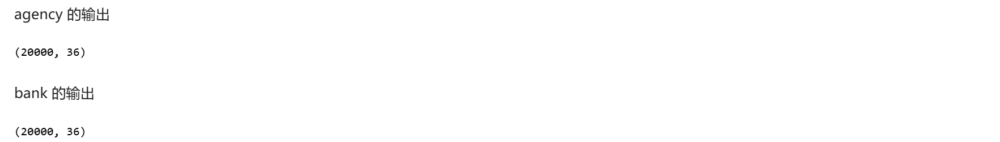
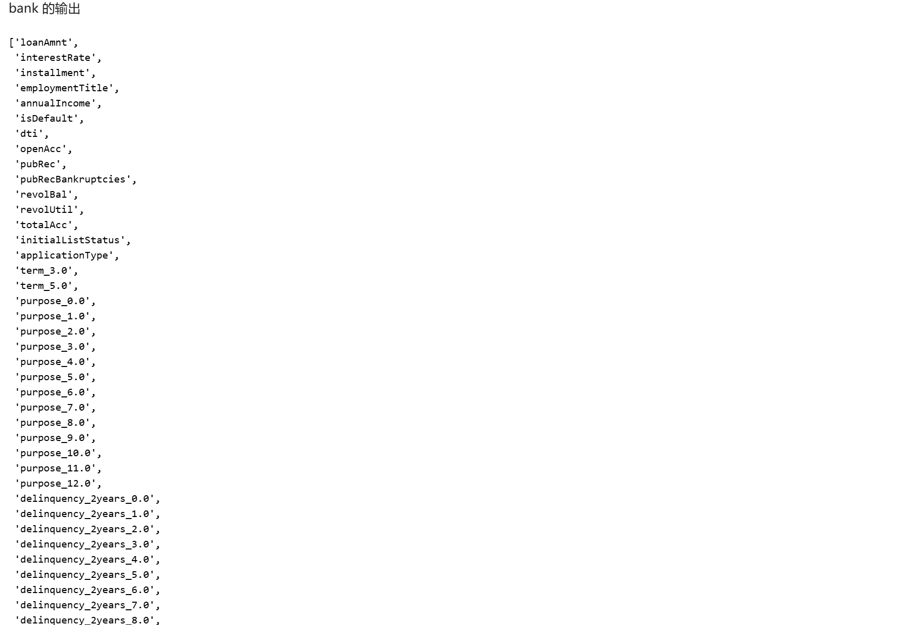

# 实验一：金融风险预测（HE应用）

## 一、实验准备

#### 1.1 实验背景

随着农村经济的蓬勃发展，金融服务在推动农村全面进步中扮演着日益重要的角色。小额信贷服务为农村地区的商业活动和个人消费者带来了前所未有的机遇。然而，随之而来的是风险控制和信用评估难度的显著增加，这在一定程度上制约了金融服务的普及范围和创新步伐。因此，如何在有效保护用户隐私的前提下，对信贷风险进行精准预测，已成为当前农村经济发展面临的一项关键挑战。

本实验模拟了银行（`bank`​）与第三方支付平台（`agency`​）之间的合作场景。银行拥有部分风险特征和信贷标签数据，但样本规模相对较小；而支付平台则掌握着海量的用户数据，包括消费行为特征以及丰富的用户间交互关系。双方希望在不泄露各自原始数据的情况下，联合这些数据资源，构建一个更强大的风险预测模型。

#### 1.2 技术介绍

同态加密 (HE - Homomorphic Encryption)

- **概念**: 同态加密是一种特殊的加密技术，它允许对密文进行直接计算，而计算结果解密后与对明文进行相同计算的结果一致。 这被称为密码学的“圣杯”。
- **原理**: 根据支持的运算类型和次数，HE 分为半同态（支持无限次的一种运算，如加法或乘法）和全同态（支持无限次的加法和乘法）。 本实验中使用的 `PHEU`​ (Partial HEU) 模式，可能基于 Paillier（加法同态）或 OU 等方案，允许在密文上执行特定的运算（如加法和标量乘法），这对于实现逻辑回归中的梯度计算至关重要。
- **应用场景**: 隐私保护的云存储和计算、联邦学习参数聚合、密态数据分析等。 在本实验中，`HESSLogisticRegression`​ 利用同态加密来保护梯度和模型参数，使得模型可以在不解密中间结果的情况下进行迭代更新。

---

## 二、实验目标

本次实验的主要目标是：

1. **熟悉隐语 SecretNote 平台**: 掌握在 SecretNote 平台上配置多方节点、管理数据和执行隐私计算任务的基本操作。
2. **应用多方安全计算技术**: 学习并实践隐私集合求交（PSI）、同态加密（HE）和安全多方计算（MPC）等核心隐私计算技术。
3. **构建安全联合模型**: 利用银行和支付平台的数据，通过隐语提供的 HESS（Hessian-based Secure Logistic Regression）逻辑回归模型，构建一个能够在保护数据隐私的同时，有效预测金融风险的模型。
4. **实现隐私保护下的联合建模**: 验证在不共享原始数据的前提下，通过多方安全计算技术完成数据对齐、特征工程、模型训练和预测的可行性与效果。

---

## 三、实验步骤

本实验在隐语 SecretNote 平台进行，涉及 `bank`​ 和 `agency`​ 两个参与方。

### 1. 实验配置

#### 1.1 添加节点与获取端口

- **操作**: 在 SecretNote 平台中，首先需要添加 `bank`​ 和 `agency`​ 两个节点，并获取它们各自的 IP 地址。
- **说明**: 由于 `ray-fed`​ 和 `SPU`​ 需要在节点间建立网络连接，我们需要为它们分配未被占用的端口。
- **运行**: 分别为 `bank`​ 和 `agency`​ 运行以下代码块，获取可用端口号。**注意**：每次运行结果可能不同，需记录下实际输出的端口号。


#### 1.2 配置并初始化 Ray-Fed

- **操作**: 使用上一步获取的 IP 地址和端口号，配置 `cluster_config`​。**注意**：需要将示例 IP 和端口替换为实际值。
- **说明**: Ray-Fed 是隐语的底层通信框架，用于协调不同参与方之间的任务执行。`sf.init`​ 函数用于初始化 SecretFlow 环境并建立 Ray-Fed 连接。
- **运行**: 分别为 `bank`​ 和 `agency`​ 运行对应的代码块。两个代码块需要**同时选中两个参与方**一起执行，以确保双方能成功建立连接。

  - **Bank 端**:

    ```python
    import secretflow as sf

    cluster_config = {
        "parties": {
            "bank": {
                # 替换为 bank 的实际 IP 和端口
                "address": "172.16.0.73:56531",
                "listen_addr": "0.0.0.0:56531"
            },
            "agency": {
                # 替换为 agency 的实际 IP 和端口
                "address": "172.16.0.74:57357",
                "listen_addr": "0.0.0.0:57357"
            },
        },
        'self_party': 'bank'
    }
    sf.init(address="127.0.0.1:6379", cluster_config=cluster_config)
    ```
  - **Agency 端**:

    ```python
    import secretflow as sf

    cluster_config = {
        "parties": {
            "bank": {
                # 替换为 bank 的实际 IP 和端口
                "address": "172.16.0.73:56531",
                "listen_addr": "0.0.0.0:56531"
            },
            "agency": {
                # 替换为 agency 的实际 IP 和端口
                "address": "172.16.0.74:57357",
                "listen_addr": "0.0.0.0:57357"
            },
        },
        'self_party': 'agency'
    }
    sf.init(address="127.0.0.1:6379", cluster_config=cluster_config)
    ```

#### 1.3 配置并初始化 SPU

- **操作**: 再次运行 `unused_tcp_port`​ 获取新的端口号，用于 SPU (Secure Processing Unit) 的配置。
- **说明**: SPU 是隐语的密态计算设备，它允许多方在加密数据上进行计算，是实现 MPC 的核心组件。 本实验使用 `SEMI2K`​ 协议在 `FM128`​ 域上进行计算。
- **运行**:

  1. 获取 SPU 端口（双方运行）：

      ```
      print(unused_tcp_port())
      ```

      
  2. 配置并创建 SPU 实例（**同时选中两个参与方**运行）：

      ```python
      import spu
      import secretflow as sf

      spu_conf = {
          "nodes": [
              {
                  "party": "bank",
                  # 替换为 bank 的实际 IP 和 SPU 端口
                  "address": "172.16.0.2:45297"
              },
              {
                  "party": "agency",
                  # 替换为 agency 的实际 IP 和 SPU 端口
                  "address": "172.16.0.4:59481"
              },
          ],
          "runtime_config": {
              "protocol": spu.spu_pb2.SEMI2K,
              "field": spu.spu_pb2.FM128,
              "sigmoid_mode": spu.spu_pb2.RuntimeConfig.SIGMOID_REAL,
          },
      }
      spu = sf.SPU(
          cluster_def=spu_conf,
          link_desc={
              "connect_retry_times": 60,
              "connect_retry_interval_ms": 1000
          },
      )
      ```

### 2. 数据集加载与对齐

- **操作**: 指定 `bank.csv`​ 和 `behavior.csv`​ 的文件路径，并创建 `PYU`​ 实例（明文计算单元）。
- **说明**: 使用 `secretflow.data.vertical.read_csv`​ 函数加载数据。该函数会自动调用 SPU 执行 **隐私集合求交 (PSI)** ，根据指定的 `keys="id"`​ 字段对齐双方数据，确保只有共同的用户 ID 被保留下来，并且双方数据顺序一致，同时不泄露各自的非交集 ID。
- **运行**: **同时选中两个参与方**运行以下代码块。

```python
import os
import secretflow as sf
from secretflow.data.vertical import read_csv

# 获取当前工作目录
current_dir = os.getcwd()
print(f"当前目录: {current_dir}")

# 配置输入文件路径
bank_input = f"{current_dir}/bank.csv"
agency_input = f"{current_dir}/behavior.csv"

# 创建 PYU 实例
bank = sf.PYU("bank")
agency = sf.PYU("agency")

# 定义文件路径字典
path_dict = {
    bank: bank_input,
    agency: agency_input,
}

# 加载数据并进行 PSI 对齐
vdf = read_csv(path_dict, spu=spu, keys="id", drop_keys="id")

# 查看数据形状和列名
print(f"数据形状: {vdf.shape}")
print(f"数据列名: {vdf.columns}")
```




### 3. 特征工程

- **操作**: 对加载的 `vdf`​ (Vertical DataFrame) 进行特征编码和标准化。
- **说明**:

  - **特征编码**: 对于类别型特征（如 `term`​, `purpose`​ 等），使用 `OneHotEncoder`​ 将其转换为数值型特征，以便模型可以处理。
  - **特征标准化**: 对于数值型特征（如 `loanAmnt`​, `interestRate`​ 等），使用 `StandardScaler`​ 进行标准化，消除量纲影响，有助于模型收敛和提高性能。这些操作都在隐语的 VDF 框架下完成，保持了数据的垂直分区特性。
- **运行**: **同时选中两个参与方**运行以下代码块。

```python
from secretflow.preprocessing.encoder import OneHotEncoder
from secretflow.preprocessing import StandardScaler

encoder = OneHotEncoder()

# 逐个对类别特征进行 OneHot 编码
cols_to_encode = ["term", "purpose", "delinquency_2years", "verificationStatus", "homeOwnership", "grade"]
for col in cols_to_encode:
    transformed_df = encoder.fit_transform(vdf[col])
    vdf[transformed_df.columns] = transformed_df

# 删除原始类别列
vdf = vdf.drop(columns=cols_to_encode)

# 定义需要标准化的数值特征列
scaler_cols = ["loanAmnt", "interestRate", "installment", "employmentTitle", "annualIncome", "dti", "openAcc", "revolBal",
               "revolUtil", "totalAcc", "n0", "n1", "n2", "n3", "n4", "n5", "n6", "n7", "n8",
               "n9", "n10", "n11", "n12", "n13", "n14"]

# 提取需要标准化的数据
need_scaler_vdf = vdf[scaler_cols]

# 进行标准化
scaler = StandardScaler()
scalered_vdf = scaler.fit_transform(need_scaler_vdf)

# 将标准化后的数据写回 vdf (注意：这里会覆盖原始列，但保留了列名)
# 更好的做法可能是创建新列或使用 scaler.transform 直接替换
vdf[scalered_vdf.columns] = scalered_vdf

print(f"特征工程后列名: {vdf.columns}")
```




### 4. 模型训练与评估

- **操作**: 划分特征和标签，配置 HEU (Homomorphic Encryption Unit)，训练 HESS 逻辑回归模型，并进行预测和评估。
- **说明**:

  - **划分**: 将 `isDefault`​ 作为标签 `y`​，其余作为特征 `X_vdf`​。
  - **HEU 配置**: HEU 是隐语的同态加密计算单元。 这里配置了 `PHEU`​ (半同态) 模式，并指定 `bank`​ 为密钥持有者。 `agency`​ 也需要相应的配置。
  - **HESS 模型**: `HESSLogisticRegression`​ 是一个基于同态加密和 SPU 实现的安全逻辑回归模型。它允许在加密状态下计算梯度和 Hessian 矩阵，从而实现隐私保护下的模型训练。
  - **预测与评估**: 使用训练好的模型对 `X_vdf`​ 进行预测，得到加密的预测结果 `y_pred`​。使用 `sf.reveal`​ 将预测结果和真实标签 `y`​ 解密到明文环境，然后计算 AUC (Area Under the Curve) 指标来评估模型性能。
- **运行**: **同时选中两个参与方**运行以下代码块。**注意**: 模型训练过程 (`model.fit`​) 可能需要较长时间。

```python
import copy
from secretflow.ml.linear.hess_sgd import HESSLogisticRegression
from sklearn.metrics import roc_auc_score

# 划分特征与标签
y = vdf["isDefault"]
X_vdf = vdf.drop(columns=["isDefault"])

# 配置 HEU
heu_config = {
    "sk_keeper": {"party": "bank"},
    "evaluators": [{"party": "agency"}],
    "mode": "PHEU",
    "he_parameters": {
        "schema": "ou",
        "key_pair": {"generate": {"bit_size": 2048}},
    },
    'encoding': {
        'cleartext_type': 'DT_I32',
        'encoder': "IntegerEncoder",
        'encoder_args': {"scale": 1},
    }
}

# 创建 bank 的 HEU 实例
heu_bank = sf.HEU(heu_config, spu.cluster_def['runtime_config']['field'])

# 创建 agency 的 HEU 实例 (交换 sk_keeper 和 evaluators)
config_agency = copy.deepcopy(heu_config)
sk_keeper = config_agency["sk_keeper"]
evaluator = config_agency["evaluators"][0]
config_agency["sk_keeper"] = evaluator
config_agency["evaluators"][0] = sk_keeper
heu_agency = sf.HEU(config_agency, spu.cluster_def['runtime_config']['field'])

# 初始化 HESS 模型
model = HESSLogisticRegression(spu, heu_agency, heu_bank)

# 训练模型 (耗时较长)
print("开始模型训练...")
model.fit(X_vdf, y, epochs=4, batch_size=5096)
print("模型训练完成。")

# 进行预测
print("开始模型预测...")
y_pred = model.predict(X_vdf)
print("模型预测完成。")

# 揭露结果
y_pred_plain = sf.reveal(y_pred)
y_true_plain = sf.reveal(y.partitions[bank].data) # 假设标签在 bank 方

# 计算并打印 AUC
auc = roc_auc_score(y_true_plain, y_pred_plain)
print(f"模型的 AUC 值为: {auc}")
```


## 四、实验结果与分析

### 1. 实验输出

根据实验步骤中的代码执行，我们可以得到以下关键输出：

- **数据形状**: (20000, 36) - 这表明经过 PSI 对齐后，双方共有 20000 条匹配的用户记录，原始特征共有 36 列。
- **特征工程后列数**: 经过 OneHot 编码后，列数会增加，具体数量取决于类别特征的取值种类。
- **AUC 值**: 0.61794638 - 这是模型在整个数据集上的 AUC 得分。

### 2. 结果分析

- **模型性能**: 得到的 AUC 值为 **0.6179**。AUC 是衡量二分类模型性能的常用指标，其值范围在 0.5 到 1 之间。0.5 表示模型无预测能力（相当于随机猜测），1 表示完美预测。0.6179 这个值表明，我们构建的模型具有一定的预测能力，优于随机猜测，但性能不算非常高。这可能受限于原始特征的质量、模型选择、参数设置或训练轮数等因素。然而，考虑到这是在**完全保护数据隐私**的前提下，通过多方安全计算实现的联合建模，这个结果证明了该技术路线的可行性。
- **隐私保护**: 整个实验过程中，银行和支付平台的原始数据始终保留在各自本地，没有发生明文交换。ID 对齐通过 PSI 完成，模型训练通过 HE 和 SPU 在密态下进行。这确保了在合作过程中满足数据安全和隐私合规的要求。
- **可行性**: 实验成功地走通了从环境配置、数据加载对齐、特征工程到安全模型训练和评估的全流程，证明了使用隐语 SecretFlow 进行多方安全联合建模是可行的。

- **性能考量**: 多方安全计算（尤其是基于同态加密的）通常会比明文计算带来显著的性能开销（计算时间和通信开销）。 本实验中的模型训练耗时较长，这是隐私保护的代价。在实际应用中，需要根据业务需求和可接受的成本，在安全性和性能之间进行权衡。

---

## 五、实验总结

本次实验成功地利用隐语 SecretNote 平台和 SecretFlow 框架，模拟了银行与支付平台之间的合作场景，通过多方安全计算技术（PSI, HE, MPC），在保护双方数据隐私的前提下，联合构建并评估了一个金融风险预测模型。实验结果（AUC\=0.6179）表明，该方法是可行的，并能产生具有一定预测能力的模型。

本实验不仅展示了隐私计算技术在解决金融领域实际问题中的应用潜力，也为参与者提供了实践和理解这些前沿技术的宝贵经验。未来，可以通过优化特征工程、调整模型参数、尝试更复杂的模型或采用更高效的 MPC/HE 协议来进一步提升模型的性能和效率。

‍
