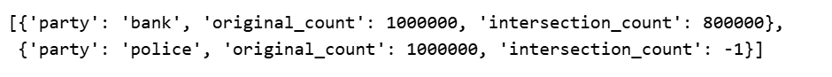
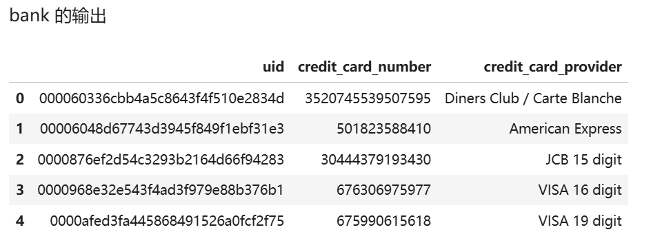

# 实验二：黑名单求交（PSI应用）

## 一、实验准备

### 1.1 实验背景

随着在线金融服务的普及，银行和金融机构面临着日益严峻的开户欺诈挑战。欺诈者通过提交虚假信息、伪造或盗用身份证明等方式申请银行账户，以牟取非法利益，给金融系统带来了巨大的风险。

为了有效应对这一挑战，银行与公安部门需要进行合作，共享信息以识别潜在的欺诈行为。然而，银行的客户数据和公安的身份信息都属于高度敏感数据，直接共享会带来严重的隐私泄露风险。

本案例模拟了银行（`bank`​）与公安（`police`​）之间的合作场景。银行拥有银行卡数据，公安拥有身份证（或可疑人员名单）数据。双方希望在不泄露各自数据的前提下，找出同时存在于双方名单中的用户（即求交集），以便进行进一步的风险排查。隐语（SecretFlow）及其 SecretNote 平台提供的隐私集合求交（PSI）技术，为实现这一目标提供了安全的解决方案。

### 1.2 技术介绍

本次实验的核心技术是**隐私集合求交 (PSI)** 。

- **概念**: PSI 是一种特殊的多方安全计算（MPC）协议，它允许持有各自数据集合的两个或多个参与方，共同计算出他们集合的交集，而在此过程中不泄露任何关于非交集元素的信息。在某些协议下，连交集本身也可以只对指定方可见。
- **原理**: PSI 协议有多种实现方式，本实验使用的是基于 **ECDH (Elliptic Curve Diffie-Hellman)**  的协议。其基本思想是：

  1. 双方约定一个椭圆曲线和一个基点。
  2. 每一方都生成一个私钥（一个随机数）和一个公钥（私钥乘以基点）。
  3. 双方交换公钥。
  4. 每一方用自己的私钥和对方的公钥计算出一个共享密钥。根据 DH 密钥交换原理，如果双方输入相同，计算出的共享密钥也相同。
  5. 每一方将自己的 `uid`​ 进行哈希（或直接使用）并乘以自己的私钥，再乘以对方的公钥（或者说，将 `uid`​ 进行哈希后，用共享密钥对其进行加密或盲化）。
  6. 双方交换这些处理过的 `uid`​。
  7. 接收方（`bank`​）比较收到的列表和自己计算的列表，相同的即为交集。 由于没有私钥就无法从交换的信息中反推出原始 `uid`​，因此保证了隐私性。

---

## 二、实验目标

本次实验的主要目标是：

1. **掌握 SecretNote 环境配置**: 学会在 SecretNote 平台上配置涉及银行和公安两个参与方的隐私计算环境。
2. **理解并应用 PSI 技术**: 学习隐私集合求交（PSI）的基本概念和原理，并掌握如何使用隐语 SPU 来执行 PSI 任务。
3. **实现安全求交**: 利用银行卡数据（`payment.csv`​）和身份证数据（`record.csv`​），以 `uid`​ 为关联键，执行 PSI 操作，找出双方共有的用户。
4. **验证隐私保护效果**: 在完成求交任务的同时，确保只有指定的参与方（银行）能获取到完整的交集结果，另一方（公安）无法获取具体交集内容，从而验证 PSI 的隐私保护特性。
5. **计算并输出交集**: 准确计算出交集的大小，并将交集数据输出到指定文件，供后续分析使用。

---

## 三、实验步骤

本实验在隐语 SecretNote 平台进行，涉及 `bank`​ 和 `police`​ 两个参与方。

### 1. 实验配置

配置步骤与上一个实验（金融风险预测）类似，主要包括获取端口、配置 Ray-Fed 和配置 SPU。

#### 1.1 添加节点与获取端口

- **操作**: 在 SecretNote 平台添加 `bank`​ 和 `police`​ 节点，并获取 IP 地址。
- **运行**: 分别为 `bank`​ 和 `police`​ 运行以下代码块，获取未使用的端口号，并记录下来。


#### 1.2 配置并初始化 Ray-Fed

- **操作**: 使用获取到的 IP 地址和端口号，配置 `cluster_config`​。
- **运行**: 分别为 `bank`​ 和 `police`​ 运行对应的代码块。**重要**: 两个代码块需要**同时选中两个参与方**一起执行。

  - **Bank 端**:

    ```python
    import secretflow as sf

    cluster_config = {
        "parties": {
            "bank": {
                # 替换为 bank 的实际 IP 和端口
                "address": "172.16.0.3:48025",
                "listen_addr": "0.0.0.0:48025"
            },
            "police": {
                # 替换为 police 的实际 IP 和端口
                "address": "172.16.0.21:33065",
                "listen_addr": "0.0.0.0:33065"
            },
        },
        'self_party': 'bank'
    }
    sf.init(address="127.0.0.1:6379", cluster_config=cluster_config)
    ```
  - **Police 端**:

    ```python
    import secretflow as sf

    cluster_config = {
        "parties": {
            "bank": {
                # 替换为 bank 的实际 IP 和端口
                "address": "172.16.0.3:48025",
                "listen_addr": "0.0.0.0:48025"
            },
            "police": {
                # 替换为 police 的实际 IP 和端口
                "address": "172.16.0.21:33065",
                "listen_addr": "0.0.0.0:33065"
            },
        },
        'self_party': 'police'
    }
    sf.init(address="127.0.0.1:6379", cluster_config=cluster_config)
    ```

#### 1.3 配置并初始化 SPU

- **操作**: 再次运行 `unused_tcp_port`​ 获取新的端口号，用于 SPU 配置。
- **运行**:

  1. 获取 SPU 端口（双方运行）：

      ```python
      print(unused_tcp_port())
      ```

      
  2. 配置并创建 SPU 实例（**同时选中两个参与方**运行）：Python

      ```python
      import spu

      spu_conf = {
          "nodes": [
              {
                  "party": "bank",
                  # 替换为 bank 的实际 IP 和 SPU 端口
                  "address": "172.16.0.3:38685"
              },
              {
                  "party": "police",
                  # 替换为 police 的实际 IP 和 SPU 端口
                  "address": "172.16.0.21:52719"
              },
          ],
          "runtime_config": {
              "protocol": spu.spu_pb2.SEMI2K,
              "field": spu.spu_pb2.FM128,
              "sigmoid_mode": spu.spu_pb2.RuntimeConfig.SIGMOID_REAL,
          },
      }
      spu_device = sf.SPU(
          cluster_def=spu_conf,
          link_desc={
              "connect_retry_times": 60,
              "connect_retry_interval_ms": 1000
          },
      )
      ```

### 2. PSI 任务执行

#### 2.1 配置输入输出路径

- **操作**: 获取当前工作目录，并定义银行和公安的输入文件路径以及双方（但实际只有银行会生成有效文件）的输出文件路径。
- **运行**: **同时选中两个参与方**运行。

```python
import os

current_dir = os.getcwd()
print(current_dir)

bank_input = f"{current_dir}/payment.csv"
police_input = f"{current_dir}/record.csv"

# 输出路径通常设为一致，但只有 receiver 方会产生有效结果
bank_output = f"{current_dir}/payment_intersect.csv"
police_output = f"{current_dir}/payment_intersect.csv"
```

#### 2.2 执行 PSI 任务

- **操作**: 调用 `spu.psi`​ 函数执行隐私集合求交。
- **说明**:

  - ​`keys`​: 指定双方用于求交的列名，这里都是 `uid`​。
  - ​`input_path`​: 指定双方的输入文件。
  - ​`output_path`​: 指定双方的输出文件。
  - ​`receiver`​: 指定接收交集结果的一方，这里是 `bank`​。
  - ​`broadcast_result`​: 设置为 `False`​，表示只有 `receiver`​ (银行) 能看到交集结果和大小。如果设为 `True`​，则双方都能看到。
  - ​`protocol`​: 指定 PSI 协议，这里使用 `ECDH`​ (Elliptic Curve Diffie-Hellman)，这是一种基于公钥密码学的 PSI 协议，通常具有较好的性能。
  - ​`ecdh_curve`​: 指定 `ECDH`​ 协议使用的椭圆曲线，这里是 `CURVE_25519`​。
- **运行**: **同时选中两个参与方**运行。这个过程会比较耗时，因为它涉及到大量的数据读取、加密和网络通信。

```python
# 确保 SPU 实例已创建并命名为 spu_device 或 spu
# spu_device.psi( # 或者 spu.psi(...)
spu.psi(
    keys = {"bank": ["uid"], "police": ["uid"]},
    input_path = {"bank": bank_input, "police": police_input},
    output_path = {"bank": bank_output, "police": police_output},
    receiver = "bank",
    broadcast_result = False,
    protocol="PROTOCOL_ECDH",
    ecdh_curve="CURVE_25519"
)
```



### 3. 查看 PSI 结果

- **操作**: 由于 `receiver`​ 被指定为 `bank`​ 且 `broadcast_result`​ 为 `False`​，只有 `bank`​ 方才能读取到有效的交集文件。
- **运行**: **只选中** **​`bank`​**​ **参与方**运行以下代码块，使用 `pandas`​ 读取输出文件并查看前几行。

```python
import pandas as pd

intersect_data = pd.read_csv(bank_output)
print(intersect_data.head())
```



## 四、实验结果与分析

### 1. 实验输出

- **PSI 任务输出**:

  ```
  [{'party': 'bank', 'original_count': 1000000, 'intersection_count': 800000},
   {'party': 'police', 'original_count': 1000000, 'intersection_count': -1}]
  ```

  这个输出是一个列表，包含了每个参与方的信息。对于 `bank`​（接收方），它显示了原始数据有 1,000,000 条，交集数据有 **800,000** 条。对于 `police`​（发送方），由于 `broadcast_result`​ 为 `False`​，它只知道自己的原始数据量，而交集数量显示为 `-1`​，表示它没有收到这个信息。
- **交集文件内容 (Bank 端查看)** :

  ```
                                   uid  credit_card_number       credit_card_provider
  0  000060336cbb4a5c8643f4f510e2834d    3520745539507595  Diners Club / Carte Blanche
  1  00006048d67743d3945f849f1ebf31e3        501823588410             American Express
  2  0000876ef2d54c3293b2164d66f94283      30444379193430                 JCB 15 digit
  3  0000968e32e543f4ad3f979e88b376b1        676306975977                VISA 16 digit
  4  0000afed3fa445868491526a0fcf2f75        675990615618                VISA 19 digit
  ```

  这显示了 `payment_intersect.csv`​ 文件的内容，包含了交集用户的 `uid`​ 以及银行方原始数据中的其他列。

### 2. 结果分析

- **正确性**: 实验成功计算出了银行和公安双方共有的用户数量为 800,000。并且，`bank`​ 方成功获取了这些交集用户的详细信息（来自银行自身的数据），而 `police`​ 方没有获取到这些信息，符合 `broadcast_result = False`​ 的预期，证明了 PSI 结果的正确性和隐私保护设置的有效性。
- **隐私保护**: 在整个求交过程中，双方的 `uid`​ 都没有以明文形式传输给对方。SPU 利用 `ECDH`​ 协议，通过交换经过椭圆曲线加密处理后的信息来完成匹配，有效保护了双方数据的隐私性，尤其是那些不在交集中的用户 ID。
- **性能**: `ECDH`​ 是一种相对高效的 PSI 协议。对于百万级别的数据量，实验需要一定的时间来完成（根据日志大约 2 分钟）。这比明文求交要慢得多，但这是为了实现隐私保护所必需的开销。与基于同态加密或混淆电路的复杂计算相比，PSI 通常性能更好。

## 五、实验总结

本实验通过一个具体的银行与公安合作反欺诈场景，成功演示了如何使用隐语 SecretNote 和 SPU 的 PSI 功能，安全、高效地完成了黑名单求交任务。实验不仅验证了 PSI 技术在保护数据隐私方面的有效性，也展示了其在金融风控等实际业务中的应用价值。通过设置 `receiver`​ 和 `broadcast_result`​ 参数，实验还体现了 PSI 协议在结果分发上的灵活性和安全性控制能力。
