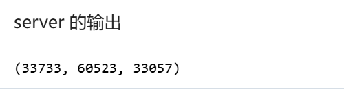

# 课程项目：学校心理健康风险

## 一、实验简介

### 1.1 案例描述

当前，青少年心理健康问题日益受到社会关注。许多中学和高校开始尝试建立心理健康评估机制，以尽早发现心理风险高的学生，并提供及时干预。然而，受限于数据隐私法规与实际操作中学校之间信息孤岛的限制，不同学校之间的数据难以直接整合。

为解决这一问题，学校A（alice）与学校B（bob）希望在不共享原始数据的前提下，通过横向联邦学习技术，建立一个联合心理健康风险预测模型。模型根据学生的基本信息、日常行为表现、心理问卷结果等特征，预测其心理健康风险水平，从而辅助心理干预资源的科学配置。

### 1.2 任务描述

本项目基于隐语平台SecretFlow，利用横向联邦学习（HFL）框架，在模拟的两个学校节点（alice与bob）和一个协调服务器（server）之间建立联邦模型，完成学生心理健康风险的二分类建模。

### 1.3 案例数据集

- 学校A提供的数据：`School_Alice.csv`​
- 学校B提供的数据：`School_Bob.csv`​
- 数据特征模拟自全国高校心理健康普查常用问卷（如PHQ-9, GAD-7）及校内行为记录
- 标签字段：`y`​，0 表示心理健康，1 表示存在心理健康风险

### 1.4 特征说明

|特征名|含义说明|
| ---------------------| --------------------------------------|
|GENDER|性别，1\=女，2\=男|
|AGE|年龄|
|SLEEP\_QUALITY|睡眠质量评分（1-5）|
|SCREEN\_TIME|每日使用电子设备时长（小时）|
|SOCIAL\_ACTIVITY|社交频率评分（1-5）|
|PHQ9\_SCORE|抑郁量表PHQ-9得分|
|GAD7\_SCORE|焦虑量表GAD-7得分|
|EXERCISE\_FREQ|每周运动次数|
|FAMILY\_SUPPORT|家庭支持评分（1-5）|
|PEER\_RELATION|同伴关系评分（1-5）|
|y|标签：0\=心理健康，1\=心理风险|

说明：所有评分字段越高表示情况越积极。

## 二、实验技术说明

### 2.1 核心技术

本次实验的核心技术是**横向联邦学习 (Horizontal Federated Learning, HFL)** ，并利用了**安全聚合 (Secure Aggregation)**  和 **SPU (Secure Processing Unit)**  进行隐私保护。

#### 2.1.1 横向联邦学习 (HFL)

- **概念**: 横向联邦学习（也称按样本划分的联邦学习）适用于多个参与方拥有**相同或相似的特征空间，但样本ID不同**的场景。例如，两家不同的医院（`alice`​ 和 `bob`​）都拥有各自的患者病历数据，这些病历的特征字段（如年龄、性别、症状、检查结果等）是相同的，但患者群体不重叠。HFL的目标是联合这些分散的数据共同训练一个全局模型，而各方的原始数据不出本地。
- **原理**:

  1. **模型初始化**: 协调方（`server`​）初始化一个全局模型参数，并分发给所有参与方（`alice`​, `bob`​）。
  2. **本地训练**: 每个参与方使用其本地数据和当前的全局模型参数进行若干轮次的本地模型训练（例如，计算本地梯度和Hessian矩阵，或者训练本地的树结构）。
  3. **安全上传更新**: 各参与方将其本地模型更新信息（如梯度、Hessian和、或者部分模型参数）通过加密或其他隐私保护技术（如差分隐私、同态加密、安全多方计算）发送给协调方。**关键在于不发送原始数据。**
  4. **安全聚合**: 协调方（`server`​）使用**安全聚合协议**（如 `SecureAggregator`​ 利用同态加密或MPC）将收集到的各方模型更新聚合成全局更新。在此过程中，`server`​ 无法获知任何单个参与方的具体更新值。
  5. **全局模型更新**: 协调方根据聚合后的全局更新来更新全局模型参数。
  6. **模型分发与迭代**: 协调方将更新后的全局模型参数再次分发给各参与方，重复步骤2-5，直到模型收敛或达到预设的训练轮数。
- **应用场景**: 智能手机用户个性化模型训练（如输入法预测）、跨银行的风险评估模型、跨医院的疾病诊断模型（如本案例）等。

#### 2.1.2 安全聚合 (Secure Aggregation)

- **概念**: 安全聚合是 HFL 中的核心隐私技术之一。它允许协调方（`server`​）计算多个客户端（`alice`​, `bob`​）提供的数值型更新（如梯度、模型权重）的总和、平均值或其他聚合统计量，而在此过程中，协调方无法得知任何单个客户端贡献的具体数值。
- **原理**:

  - **基于同态加密 (HE)** : 客户端用一个公共的同态加密密钥加密它们的本地更新，然后发送给服务器。服务器在密文上执行加法运算得到加密的聚合结果，然后可能由一个或多个可信方（或客户端协作）解密。
  - **基于安全多方计算 (MPC)** : 客户端将它们的本地更新秘密分享给多个计算节点（在本例中，SPU可以扮演这样的角色，或者`server`​与`clients`​通过特定的MPC协议交互）。这些节点协同计算聚合结果，而任何单个节点都无法恢复原始的单个更新。隐语中的 `SecureAggregator`​ 可以利用 SPU 实现基于 MPC 的安全聚合。
  - **基于差分隐私 (DP)** : 在上传更新前，客户端可以在其本地更新中加入适量的噪声，以满足差分隐私的要求，从而保护个体数据不被精确推断。 本实验中的 `SecureAggregator(server, [alice, bob])`​ 表明 `server`​ 负责聚合 `alice`​ 和 `bob`​ 的信息。
- **SFXgboost 中的应用**: 在横向联邦 XGBoost (`SFXgboost`​) 中，`alice`​ 和 `bob`​ 在本地计算其样本的梯度和 Hessian 矩阵。这些值需要被安全地加总以评估分裂质量和计算叶节点值。`server`​ 通过安全聚合来完成这个求和过程。

### 2.2 数据集说明

Python 脚本 `generate_psych_data.py`​ 的主要功能是模拟生成与青少年心理健康相关的特征数据，并包含一个基于这些特征生成的目标变量（疑似心理问题标签）。脚本允许用户通过命令行参数控制生成数据的学校名称、样本数量以及输出目录。生成的数据旨在模仿类似 `School_Alice.csv`​ 和 `School_Bob.csv`​ 这样的数据集结构和数据分布。

**数据生成流程详解**

脚本的核心是 `generate_psych_data`​ 函数 ，以下是该函数中各个特征及目标变量的生成方式：

1. **基本信息与行为特征生成** ：

    - ​**​`GENDER`​**​  **(性别)** : 从 `[1, 2]`​ 中随机选择，代表两种性别。
    - ​**​`AGE`​**​  **(年龄)** : 在 15 到 25 岁之间随机生成整数 。
    - ​**​`SLEEP_QUALITY`​**​  **(睡眠质量)** : 随机生成 1 到 5 之间的整数，代表不同的睡眠质量等级 。
    - ​**​`SCREEN_TIME`​**​  **(屏幕使用时间)** :

      - 首先从均值为 6、标准差为 2 的正态分布中抽取样本 。
      - 然后将数值四舍五入到小数点后一位 。
      - 最后，将结果限制在 -1 到 12 的范围内，以确保其处于一个合理区间 ，这个值通常在 0-10+ 范围，但允许负值出现（尽管在实际场景中，屏幕时间通常为非负）。
    - ​**​`SOCIAL_ACTIVITY`​**​  **(社交活动频率)** : 随机生成 1 到 5 之间的整数，代表不同的社交活动参与度 。
    - ​**​`EXERCISE_FREQ`​**​  **(锻炼频率)** : 随机生成 0 到 7 之间的整数，代表每周锻炼的天数 。
    - ​**​`FAMILY_SUPPORT`​**​  **(家庭支持度)** : 随机生成 1 到 5 之间的整数 。
    - ​**​`PEER_RELATION`​**​  **(同伴关系质量)** : 随机生成 1 到 5 之间的整数 。
2. **心理量表得分生成** ：

    - ​**​`PHQ9_SCORE`​**​  **(PHQ-9抑郁症状群量表得分)** : 随机生成 0 到 27 之间的整数，这是PHQ-9量表的典型得分范围 。
    - ​**​`GAD7_SCORE`​**​  **(GAD-7广泛性焦虑障碍量表得分)** : 随机生成 0 到 20 之间的整数，这是GAD-7量表的典型得分范围 。
3. **目标变量** **​`y`​**​  **(心理问题标签) 生成** ：

    - 目标变量 `y`​ 是基于一个简化的概率模型生成的，其中 `1`​ 可能代表存在某种心理风险或问题，`0`​ 代表没有。
    - **概率计算**: 变量 `y`​ 取值为 1 的基础概率 `prob_y`​ 通过以下公式计算：`prob_y = (0.02 * PHQ9_SCORE + 0.02 * GAD7_SCORE - 0.05 * SLEEP_QUALITY - 0.05 * FAMILY_SUPPORT - 0.05 * PEER_RELATION + 0.5)`​ ^^这个公式的含义是：

      - 较高的 `PHQ9_SCORE`​ 和 `GAD7_SCORE`​会增加 `y=1`​ 的概率（系数为正）。
      - 较高的 `SLEEP_QUALITY`​、`FAMILY_SUPPORT`​ 和 `PEER_RELATION`​ 会降低 `y=1`​ 的概率（系数为负。
      - 基础概率加上了 0.5 的偏移量。
    - **概率修正**: 计算出的 `prob_y`​ 会被限制在 0.1 到 0.9 之间，以确保概率值在一个合理的范围内 。
    - **二项分布采样**: 最终的 `y`​ 值是根据修正后的 `prob_y`​，通过二项分布（`np.random.binomial(1, prob_y)`​）随机生成的。这意味着每个样本的 `y`​ 值是基于其特征计算出的个体化概率来决定的 。
4. **数据整合与输出** ：

    - 所有生成的特征和目标变量被整合到一个 Pandas DataFrame 中 。
    - 脚本会创建指定的输出目录（如果不存在）。
    - 生成的 DataFrame 会被保存为一个 CSV 文件，文件名格式为 `School_{school_name}_Generated.csv`​，例如 `School_Alice_Generated.csv`​  或 `School_Bob_Generated.csv`​ 。
    - 脚本会打印生成样本的数量和保存文件的路径信息 。

**命令行参数与执行**

脚本通过 `argparse`​ 模块支持命令行参数 ：

- ​`school_name`​ (位置参数): 学校的名称，例如 "Alice", "Bob"。
- ​`--num_samples`​ (可选参数): 指定生成的样本数量。
- ​`--output_dir`​ (可选参数): 指定保存生成数据的目录。

当脚本通过 `if __name__ == "__main__":`​ ^执行时，它会解析这些命令行参数，并调用 `generate_psych_data`​ 函数来生成并保存数据。例如，在命令行中运行 `python generate_psych_data.py Alice --num_samples 200`​ 将会为名为 "Alice" 的学校生成 200 个样本，并保存在默认的 "data" 目录下，脚本详细代码及注释在文件夹中给出。

```python
import numpy as np
import pandas as pd
import os
import argparse

def generate_psych_data(school_name, num_samples=100, output_dir="data"):
    """
    Generate psychological data similar to School_Alice.csv and School_Bob.csv
    but with a controllable sample size.
    
    Parameters:
    -----------
    school_name : str
        Name of the school (e.g., "Alice", "Bob")
    num_samples : int
        Number of samples to generate
    output_dir : str
        Directory to save the generated data
    
    Returns:
    --------
    pandas.DataFrame
        Generated data
    """
    # Create random data with similar distributions to the original datasets
    gender = np.random.choice([1, 2], size=num_samples)  # 1 or 2
    age = np.random.randint(15, 26, size=num_samples)  # 15-25
    sleep_quality = np.random.randint(1, 6, size=num_samples)  # 1-5
    
    # Screen time with similar distribution (can be negative but typically 0-10+)
    screen_time = np.random.normal(6, 2, size=num_samples)
    screen_time = np.round(screen_time, 1)
    screen_time = np.clip(screen_time, -1, 12)  # Limit to reasonable range
    
    social_activity = np.random.randint(1, 6, size=num_samples)  # 1-5
    
    # PHQ9 score (typically 0-27)
    phq9_score = np.random.randint(0, 28, size=num_samples)
    
    # GAD7 score (typically 0-20)
    gad7_score = np.random.randint(0, 21, size=num_samples)
    
    # Exercise frequency (0-7 days per week)
    exercise_freq = np.random.randint(0, 8, size=num_samples)
    
    # Family support and peer relation (1-5)
    family_support = np.random.randint(1, 6, size=num_samples)
    peer_relation = np.random.randint(1, 6, size=num_samples)
    
    # Generate target variable (y) based on a simple model
    # Higher PHQ9 and GAD7 scores increase probability of y=1
    # Higher sleep quality, family support, and peer relation decrease probability of y=1
    prob_y = (0.02 * phq9_score + 0.02 * gad7_score - 
              0.05 * sleep_quality - 0.05 * family_support - 0.05 * peer_relation + 0.5)
    prob_y = np.clip(prob_y, 0.1, 0.9)  # Ensure reasonable probabilities
    y = np.random.binomial(1, prob_y)
    
    # Create DataFrame
    data = pd.DataFrame({
        'GENDER': gender,
        'AGE': age,
        'SLEEP_QUALITY': sleep_quality,
        'SCREEN_TIME': screen_time,
        'SOCIAL_ACTIVITY': social_activity,
        'PHQ9_SCORE': phq9_score,
        'GAD7_SCORE': gad7_score,
        'EXERCISE_FREQ': exercise_freq,
        'FAMILY_SUPPORT': family_support,
        'PEER_RELATION': peer_relation,
        'y': y
    })
    
    # Save to CSV
    os.makedirs(output_dir, exist_ok=True)
    output_file = os.path.join(output_dir, f"School_{school_name}_Generated.csv")
    data.to_csv(output_file, index=False)
    
    print(f"Generated {num_samples} samples for School_{school_name}")
    print(f"Data saved to {output_file}")
    
    return data

def main():
    parser = argparse.ArgumentParser(description='Generate psychological data with controllable sample size')
    parser.add_argument('school_name', type=str, help='Name of the school (e.g., "Alice", "Bob")')
    parser.add_argument('--num_samples', type=int, default=100, help='Number of samples to generate (default: 100)')
    parser.add_argument('--output_dir', type=str, default="data", help='Directory to save the generated data (default: "data")')
    
    args = parser.parse_args()
    
    generate_psych_data(args.school_name, args.num_samples, args.output_dir)

if __name__ == "__main__":
    main()
```

## 三、实验流程

### 3.1 实验配置

#### 3.1.1  输入对应的集群配置信息

由于是在单机上模拟多方环境，使用 `sf.init(parties=['alice', 'bob', 'server'], address='local')`​ 来初始化 SecretFlow 环境。这会在本地启动一个 Ray 集群来模拟多方。

```python
import secretflow as sf
import spu

# 初始化 SecretFlow，指定参与方和本地仿真地址
sf.init(parties=['alice', 'bob', 'server'], address='local'，_system_config={
        'max_concurrency': 2,  # 减少并发数
        'task_retry_delay_ms': 5000  # 任务重试间隔
    })
```

#### 3.1.2 SPU配置

虽然横向联邦学习的核心在于安全聚合，但某些高级操作或与 SPU 配合的组件可能需要 SPU 环境。此实验中，SPU 用于后续的 `SPUComparator`​。首先获取三个未使用的端口，然后配置并创建 SPU 实例。

```python
import socket
from contextlib import closing
from typing import cast

def unused_tcp_port() -> int:
    """返回一个未使用的端口"""
    with closing(socket.socket(socket.AF_INET, socket.SOCK_STREAM)) as sock:
        sock.bind(("", 0))
        sock.setsockopt(socket.SOL_SOCKET, socket.SO_REUSEADDR, 1)
        return cast(int, sock.getsockname()[1])

alice_port, bob_port, server_port = unused_tcp_port(), unused_tcp_port(), unused_tcp_port()
```

```python
# 配置 SPU
# 注意：由于是本地模拟，所有节点的 address 都指向本机 IP (示例中为 172.16.0.6，实际应为本机回环或Ray分配的IP)
# 在 SecretNote 仿真环境中，通常使用 localhost 或 Ray 节点 IP
# 假设 ray.nodes()[0]['NodeManagerAddress'] 是当前节点 IP

spu_conf = {
    "nodes": [
        {"party": "alice", "address": f"127.16.0.251:{alice_port}"},
        {"party": "bob", "address": f"127.16.0.251:{bob_port}"},
        {"party": "server", "address": f"127.16.0.251:{server_port}"},
    ]
}

spu_obj = sf.SPU(spu_conf)
alice, bob, server = sf.PYU('alice'), sf.PYU('bob'), sf.PYU('server')
```




### 3.2 加载并划分数据集

#### 3.2.1 加载数据集

- 使用 `secretflow.data.horizontal.read_csv`​ 加载水平切分的数据集。在横向联邦学习中，数据加载需要 `SecureAggregator`​（用于安全地聚合来自各方的数据统计信息，如求和、计数）和 `SPUComparator`​（用于需要比较操作的场景，如排序、分割，依赖 SPU）。
- ​`School_Alice.csv`​ 和 `School_Bob.csv`​ 分别代表两个学校的学生数据。

```python
from secretflow.security.aggregation import SecureAggregator
from secretflow.security.compare import SPUComparator
from secretflow.data.horizontal import read_csv
# 创建 SPU 比较器
comp = SPUComparator(spu_obj)
# 创建安全聚合器，指定 server 为聚合方，alice 和 bob 为数据提供方
aggr = SecureAggregator(server, [alice, bob])
# 定义各方数据路径
path_dict = {
    alice: "School_Alice.csv",
    bob: "School_Bob.csv"
}
# 加载横向数据，形成 HDataFrame (hdf)
hdf = read_csv(filepath=path_dict, aggregator=aggr, comparator=comp)
```

```python
hdf.shape
hdf.columns
```


根据案例描述，数据集包含 2000 条样本和 11 个特征（包括目标变量 `y`​）

#### 3.2.2 数据集划分

将加载的 HDF 数据集按照 8:2 的比例划分为训练集 (`train_hdf`​) 和测试集 (`test_hdf`​)

```python
from secretflow.data.split import train_test_split

train_hdf, test_hdf = train_test_split(hdf, train_size=0.8, random_state=42)
```

### 3.3 水平XGBoost建模

利用划分好的训练集和测试集进行横向联邦 XGBoost 模型训练和验证。

#### 3.3.1 设置超参数

定义 XGBoost 模型的超参数。

```python
params = {
    'max_depth': 3,          # 树的最大深度
    'eta': 0.1,              # 学习率
    'objective': 'binary:logistic', # 目标函数：二分类逻辑回归
    'lambda': 0.1,           # L2 正则化系数
    'alpha': 0,              # L1 正则化系数
    'max_bin': 5,            # 特征分桶的最大数量
    'gamma': 0,              # 节点分裂的最小损失降低阈值
    'subsample': 0.3,        # 训练样本的采样比例
    'colsample_bytree': 0.7, # 每棵树的特征采样比例
    'colsample_bylevel': 1.0,# 每层分裂的特征采样比例
    'eval_metric': 'logloss',# 评估指标
    'hess_key': 'hess',      # HDF 中存储 Hessian 值的键名 (SFXgboost 内部使用)
    'grad_key': 'grad',      # HDF 中存储梯度值的键名 (SFXgboost 内部使用)
    'label_key': 'y'         # HDF 中标签列的名称
}
```

#### 3.3.2  实例化并训练 `SFXgboost`​ 模型

1. 从 `secretflow.ml.boost.homo_boost`​ 导入 `SFXgboost`​。
2. 实例化 `SFXgboost`​，指定 `server`​ 为协调和聚合模型更新的服务方，`clients`​ 为数据持有和本地训练的参与方 `alice`​ 和 `bob`​。
3. 调用 `bst.train()`​ 方法进行模型训练，传入训练集 `train_hdf`​、验证集 `test_hdf`​（用于在每个 boosting 轮次后评估模型）、超参数 `params`​ 和 boosting 轮数 `num_boost_round`​。

```python
from secretflow.ml.boost.homo_boost import SFXgboost

# 实例化 SFXgboost
bst = SFXgboost(server=server, clients=[alice, bob])

print("开始横向 XGBoost 模型训练...")
# 训练模型，并在每个轮次后在测试集上验证
bst.train(train_hdf, test_hdf, params=params, num_boost_round=3)
print("模型训练完成。")
```

## 四、实验结果与分析

### 4.1  实验主要输出

- **环境配置**:

  - 成功初始化本地 Ray 集群模拟三方（alice, bob, server）。
  - 为 SPU 的各节点分配了可用端口，Alice - 33733, Bob - 60523, Server - 33057
  - 显示了 Ray 集群的资源情况，如 CPU 核数、内存等。
- **数据加载与划分**:

  - 加载的 HDF 形状为 `(2000, 11)`​，符合预期。
  - 列名包括 `USMER`​, `SEX`​, `AGE`​, `DIABETES`​, `ICU`​, `y`​ 等 20 个特征。
  - 训练集和测试集按 8:2 比例划分后，形状分别为 `(1600, 20)`​ 和 `(400, 20)`​。
- **横向 XGBoost 模型训练日志**: 输出了每个 boosting 轮次的训练集和验证集（测试集）的 `logloss`​，这里的 `logloss`​（对数损失）是评估二分类问题（如此案例中的心理问题高风险预测）模型性能的常用指标。Logloss 的值越小，代表模型的预测结果越接近真实标签，性能越好。

  ```
  (HomoBooster pid=5642) [0]    train-logloss:0.62694    valid-logloss:0.62995
  (HomoBooster pid=5642) [1]    train-logloss:0.57265    valid-logloss:0.57830
  (HomoBooster pid=5642) [2]    train-logloss:0.53585    valid-logloss:0.54256
  ```

### 4.2 结果分析

- **模型训练过程**: 从训练日志可以看出，`SFXgboost`​ 模型成功地在横向联邦的设定下，跨越 `alice`​ 和 `bob`​ 两个数据源进行了 3 个轮次的 boosting 训练。每一轮迭代后，都在训练集和作为验证集的测试集上报告了 `logloss`​。
- **学习效果**:

  - **初始状态 (第 0 轮迭代后):**

    - ​`train-logloss: 0.62694`​
    - ​`valid-logloss: 0.62995`​
    - 在第一棵树构建完成后（通常 XGBoost 的第 0 轮指第一棵树的效果），训练集和验证集上的 logloss 都相对较高。一个未经训练或随机猜测的模型，其 logloss 通常在 0.693 左右（对于类别均衡的二分类问题，`-ln(0.5)`​）。这里的初始值略低于此，表明模型已经开始捕捉到一些数据中的基本模式。训练集和验证集的损失非常接近，说明此时模型尚未出现过拟合。
  - **中期状态 (第 1 轮迭代后):**

    - ​`train-logloss: 0.57265`​
    - ​`valid-logloss: 0.57830`​
    - 经过第二棵树的拟合（总共两棵树），训练集和验证集上的 logloss 均有显著下降。训练集 logloss 下降了约 `0.62694 - 0.57265 = 0.05429`​，验证集 logloss 下降了约 `0.62995 - 0.57830 = 0.05165`​。这表明模型通过增加新的决策树，进一步学习到了数据中的有效信息，提升了预测能力。两个损失值仍然比较接近，过拟合风险较低。
  - **最终状态 (第 2 轮迭代后，总共 3 棵树):**

    - ​`train-logloss: 0.53585`​
    - ​`valid-logloss: 0.54256`​
    - 在完成三棵树的训练后，logloss 进一步降低。训练集 logloss 相比上一轮下降了 `0.57265 - 0.53585 = 0.0368`​，验证集 logloss 下降了 `0.57830 - 0.54256 = 0.03574`​。这显示模型仍在持续学习和改进。
    - 此时，训练集损失（0.53585）略低于验证集损失（0.54256）。这是正常的现象，模型在训练数据上的表现通常会略优于在未见过的数据（验证集）上的表现。两者差距不大（`0.54256 - 0.53585 = 0.00671`​），表明模型目前为止的泛化能力良好，没有出现明显的过拟合。

  训练集和验证集的 `logloss`​ 均随迭代轮次增加而显著下降（从第0轮的约0.62-0.63下降到第2轮的约0.53-0.54）。这表明模型在学习数据中的模式，并且在未见过的数据（验证集）上表现出一定的泛化能力。
- **隐私保护**: 横向联邦学习的核心在于保护各参与方的数据隐私：

  - ​`alice`​ 和 `bob`​ 的原始患者数据始终保留在各自本地，不会发送给对方或 `server`​。
  - 在 XGBoost 的每一轮迭代中，`alice`​ 和 `bob`​ 在本地数据上计算梯度和 Hessian 矩阵（或其安全聚合所需的部分）。
  - 这些本地计算的中间结果（例如加密的梯度和 Hessian）被发送给 `server`​。
  - ​`server`​ 利用 `SecureAggregator`​（可能结合 SPU 的 MPC 功能或同态加密）对这些来自多方的中间结果进行安全聚合，得到全局的梯度和 Hessian 统计。
  - 基于聚合后的统计信息，`server`​ 更新模型（如确定树的分裂节点、计算叶节点权重），并将更新后的模型参数或树结构安全地分发给 `alice`​ 和 `bob`​，用于下一轮的本地计算。 整个过程确保了除了最终共享的模型外，个体数据和本地模型的细节不被泄露。
- **性能**: 横向联邦学习由于涉及到多轮次的安全聚合和通信，其训练时间通常长于传统的单机训练。但相对于其带来的数据隐私保护和合规性，这种开销在许多场景下是可以接受的。本实验中，3轮的训练在几秒到几十秒内完成（根据日志约5秒），表明对于此规模的数据和模型复杂度，效率尚可。

### 4.3 遇到的问题与解决方案

实验遇到的最大问题是由于采用模型的复杂性和生成数据集时没有考虑实际的拟合效果，计算规模过大导致了平台分配的4GB内存明显不够，最后的解决方案是尽可能在保证样本数量的基础上减小了数据集规模，同时更改了初始化配置来减少并发任务数，如果有更大的内存分配和更好的数据集模型会有更好的运行效果。

# 五、实验总结

本实验以“学校心理健康风险评估”为应用背景，通过模拟两所学校在隐私保护下开展心理风险建模的过程，实践了横向联邦学习的完整流程。项目充分展示了SecretFlow平台在实际教育场景下的隐私计算能力，既保证了学生数据的保密性，又提高了预测模型的泛化能力。未来，该模型可扩展至更多学校，助力心理危机的早期预警与干预。

‍
