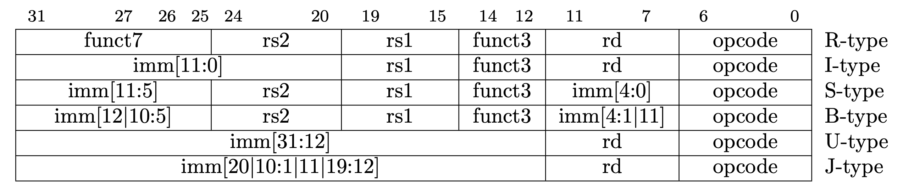
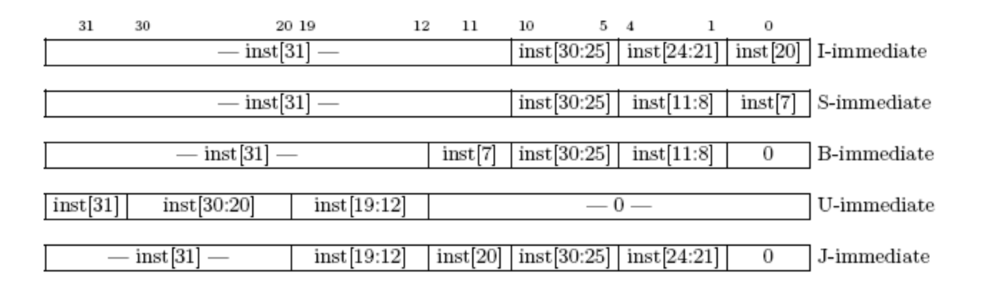
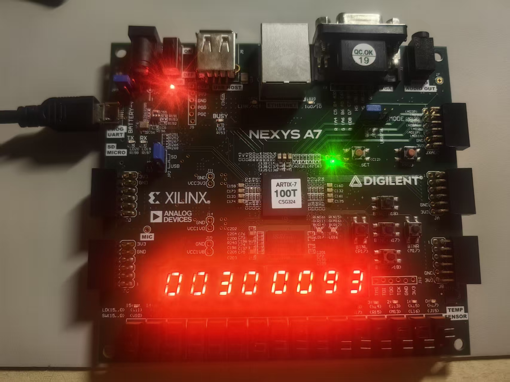

# Lab0：单周期CPU设计

# **1 实验目的**

- 了解 CPU 设计的基本原理
- 设计 CPU 数据通路和控制单元模块
- 搭建单周期CPU

# **2 实验环境**

- 操作系统：Windows 10+ 22H2，Ubuntu 22.04+
- VHDL：Verilog，SystemVerilog

# **3 背景知识**

## **3.1 单周期 CPU**

单周期 CPU 主要特征是在一个周期内完成一条指令，也就意味着其 CPI (cycle per instruction) 是 1。 考虑到不同的指令都需要在一个周期内完成，因而单周期 CPU 时钟频率是以执行最慢的那条指令作为基准，这也是单周期 CPU 最大的缺陷之一。 我们可以把单周期 CPU 分成数据通路和控制单元两个模块，本次实验将完成数据通路模块。

## **3.2 数据通路设计**

为了之后能和流水线 CPU 进行衔接，我们把单周期 CPU 数据通路划分成 5 个阶段（stage）:

- Instruction Fetch (IF)
- Instruction Decode (ID)
- EXecution (EX)
- MEMory access (MEM)
- register Write Back (WB)

## **3.3 数据通路图**


我们会按照 CPU 的五个运行阶段来介绍我们设计的 CPU 数据通路中的各个功能部件。

## 3.4 **RV64I指令集架构**

RV64I 指令集包括 R、I、S、B、U、J 6 个类型的指令格式，如下图所示。 指令的类型基本是由 Opcode，Funct7(如果存在的话)和 Funct3(如果存在的话)决定的。 通过这 3 个字段判断得到了指令的类型之后，就可以为控制信号赋值，控制 Datapath 中的数据流。



对于需要生成立即数的架构，可以参照下图：



# **4 实验步骤**

## **4.1 IF 阶段**

### **4.1.1 Instruction Selection**

由于我们设计的是 64 位 CPU，因此 imem 读回的数据为是 64 位，但 RISC-V 规定的指令长度只有 32 位，因此需要根据 PC 来进一步判断需要执行的是高 32 位指令还是低 32 位指令，后续再通过控制单元进行指令译码。

```verilog
CorePack::inst_t inst;
assign inst=pc[2]?imem_ift.r_reply_bits.rdata[63:32]:imem_ift.r_reply_bits.rdata[31:0];
```

### **4.1.2 PC**

我们使用 PC 来从 imem 中取指令，而 PC 也需要随着指令流动进行更新。在正常情况下 PC 只需要不断 +4（但是在 B 型指令跳转条件满足以及 J 型指令来临时，PC 需要根据后续阶段的计算结果进行更新，我们放在最后部分说明）

```verilog
	  CorePack::addr_t pc, next_pc, pc_4;
		assign pc_4 = pc + 64'd4;
```

## **4.2 ID 阶段**

### **4.2.1 控制单元 Controller**

控制单元负责解码指令中的各字段，首先对于各状态寄存器进行默认赋值，随后根据`opcode` 进行相应解码，我们大致参照测试指令的类型顺序对于各类指令进行说明：

1. REG_OPCODE —— R 型 64 位算术/逻辑

覆盖的指令包括：ADD / SUB / SLL / SLT / SLTU / XOR / SRL / SRA / OR / AND，

调节以下控制信号`we_reg=1`（计算结果写回寄存器堆）   `wb_sel=ALU`  （写回数据为ALU结果） A、B 默认均为寄存器（开头已设），随后按 `funct3`/`funct7[5]` 选 `alu_op` ，具体实现如下:

```verilog
            REG_OPCODE: begin
                we_reg   = 1'b1;
                wb_sel   = WB_SEL_ALU;
                case (funct3)
                    ADD_FUNCT3:  alu_op = (funct7[5]) ? ALU_SUB : ALU_ADD;
                    SLL_FUNCT3:  alu_op = ALU_SLL;
                    SLT_FUNCT3:  alu_op = ALU_SLT;
                    SLTU_FUNCT3: alu_op = ALU_SLTU;
                    XOR_FUNCT3:  alu_op = ALU_XOR;
                    SRL_FUNCT3:  alu_op = (funct7[5]) ? ALU_SRA : ALU_SRL;
                    OR_FUNCT3:   alu_op = ALU_OR;
                    AND_FUNCT3:  alu_op = ALU_AND;
                    default:     alu_op = ALU_DEFAULT;
                endcase
            end
```

1. IMM_OPCODE —— I 型 64 位立即数算术/逻辑

覆盖的指令包括：ADDI / SLLI / SLTI / SLTIU / XORI / SRLI / SRAI / ORI / ANDI

调节以下控制信号 `we_reg=1`（计算结果写回寄存器堆），`immgen_op=I_IMM`（生成I型立即数），`alu_bsel=IMM`（A端为rs1，B端为生成的立即数），随后按 `funct3`/`funct7[5]` 选 `alu_op` 具体实现如下：

```verilog
            IMM_OPCODE: begin
                we_reg   = 1'b1;
                immgen_op= I_IMM;
                alu_bsel = BSEL_IMM;
                case (funct3)
                    ADD_FUNCT3:  alu_op = ALU_ADD;
                    SLL_FUNCT3:  alu_op = ALU_SLL;
                    SLT_FUNCT3:  alu_op = ALU_SLT;
                    SLTU_FUNCT3: alu_op = ALU_SLTU;
                    XOR_FUNCT3:  alu_op = ALU_XOR;
                    SRL_FUNCT3:  alu_op = (funct7[5]) ? ALU_SRA : ALU_SRL; // SRLI/SRAI use imm[11:5]
                    OR_FUNCT3:   alu_op = ALU_OR;
                    AND_FUNCT3:  alu_op = ALU_AND;
                    default:     alu_op = ALU_DEFAULT;
                endcase
            end
```

1.  STORE_OPCODE —— 各类存储

覆盖的指令包括：SB / SH / SW / SD

调节以下控制信号，`we_mem=1`（写内存），`immgen_op=S_IMM`（生成S型立即数）ALU 做ADD `rs1 + imm` 形成有效地址（`alu_asel=REG, alu_bsel=IMM, alu_op=ADD`），`mem_op` 决定写宽度，具体实现如下：

```verilog
            STORE_OPCODE: begin
                we_mem   = 1'b1;
                immgen_op= S_IMM;
                alu_op   = ALU_ADD;
                alu_asel = ASEL_REG;
                alu_bsel = BSEL_IMM;
                case (funct3)
                    SB_FUNCT3: mem_op = MEM_B;
                    SH_FUNCT3: mem_op = MEM_H;
                    SW_FUNCT3: mem_op = MEM_W;
                    SD_FUNCT3: mem_op = MEM_D;
                    default:   mem_op = MEM_NO;
                endcase
            end
```

1. BRANCH_OPCODE —— 条件分支

覆盖的指令包括：BEQ / BNE / BLT / BGE / BLTU / BGEU

根据 `funct3` 仅设置 `cmp_op`（EQ/NE/LT/GE/LTU/GEU），`immgen_op=B_IMM`（生成B型立即数）；同时 `alu_asel=PC`，`alu_bsel=IMM`，`alu_op=ADD` 计算候选分支目标 `pc + imm_b` ，具体实现如下：

```verilog
            BRANCH_OPCODE: begin
                cmp_op = CMP_NO;
                case (funct3)
                    BEQ_FUNCT3:  cmp_op = CMP_EQ;
                    BNE_FUNCT3:  cmp_op = CMP_NE;
                    BLT_FUNCT3:  cmp_op = CMP_LT;
                    BGE_FUNCT3:  cmp_op = CMP_GE;
                    BLTU_FUNCT3: cmp_op = CMP_LTU;
                    BGEU_FUNCT3: cmp_op = CMP_GEU;
                    default:     cmp_op = CMP_NO;
                endcase
                immgen_op= B_IMM;
                alu_asel = ASEL_PC;
                alu_bsel = BSEL_IMM;
                alu_op   = ALU_ADD;
            end
```

1.  LUI_OPCODE —— 取高立即数

对于LUI指令，控制`we_reg=1`（打开写使能信号，将结果写回），`immgen_op=U_IMM`（生成U类型立即数，这儿U类型立即数的原理是将立即数左移12位，低12位清零）`alu_asel=ASEL0`，`alu_bsel=IMM`，`alu_op=ADD` 最后的实现效果 `rd = imm_u`（因为 A 端为 0，加上 U-imm），具体实现如下：

```verilog
            LUI_OPCODE: begin
                we_reg   = 1'b1;
                immgen_op= U_IMM;
                alu_asel = ASEL0;
                alu_bsel = BSEL_IMM;
                alu_op   = ALU_ADD;
            end
```

1.  AUIPC_OPCODE —— PC 相对取高立即数

对于AUIPC指令,控制`we_reg=1`（打开写使能信号，将结果写回），`immgen_op=U_IMM`（生成U类型立即数）`alu_asel=ASEL_PC`，

`alu_bsel=IMM`，`alu_op=ADD`，`wb_sel=ALU`

最后的实现效果 `rd = pc + imm_u` ，具体的实现如下：

```verilog
            AUIPC_OPCODE: begin
                we_reg   = 1'b1;
                immgen_op= U_IMM;
                alu_asel = ASEL_PC;
                alu_bsel = BSEL_IMM;
                alu_op   = ALU_ADD;
                wb_sel   = WB_SEL_ALU;
            end
```

1. JAL_OPCODE —— 非寄存器间接跳转

对于JAL指令，控制：`we_reg=1`（写回返回地址），`npc_sel=1`（走跳转），`immgen_op=UJ_IMM`（生成UJ型立即数），

`alu_asel=PC`，`alu_bsel=IMM`，`alu_op=ADD`（ALU 执行 `pc + imm_uj`，得到跳转目标地址），`wb_sel=PC`（写回 `pc+4`，作为返回地址）

具体实现如下：

```verilog
            JAL_OPCODE: begin
                we_reg   = 1'b1;
                npc_sel  = 1'b1;
                immgen_op= UJ_IMM;
                alu_asel = ASEL_PC;
                alu_bsel = BSEL_IMM;
                alu_op   = ALU_ADD;
                wb_sel   = WB_SEL_PC; 
            end
```

1.  JALR_OPCODE —— 寄存器间接跳转

对于JALR指令控制：`we_reg=1`，`npc_sel=1`（走跳转），`immgen_op=I_IMM`（生成I型立即数），`alu_asel=REG`，`alu_bsel=IMM`，`alu_op=ADD`（ALU 执行 `rs1 + imm`，并强制清零最低位
），`wb_sel=PC`（写回 `pc+4`，作为返回地址）

```verilog
            JALR_OPCODE: begin
                we_reg   = 1'b1;
                npc_sel  = 1'b1;
                immgen_op= I_IMM;
                alu_asel = ASEL_REG;
                alu_bsel = BSEL_IMM;
                alu_op   = ALU_ADD;
                wb_sel   = WB_SEL_PC; // write pc+4
            end
```

1. LOAD_OPCODE —— 各类加载

覆盖的指令包括：LB / LH / LW / LD / LBU / LHU / LWU

调节以下控制信号：`we_reg=1`（写 rd），`re_mem=1`（读内存），`immgen_op=I_IMM`（生成I型立即数），ALU 做 `rs1 + imm` 形成有效地址（`alu_asel=REG, alu_bsel=IMM, alu_op=ADD`），写回选 `WB_SEL_MEM` ，表示写回的结果来自于数据存储器，并由`funct3` → `mem_op`（决定宽度/符号扩展），具体实现如下：

```verilog
            LOAD_OPCODE: begin
                we_reg   = 1'b1;
                re_mem   = 1'b1;
                immgen_op= I_IMM;
                alu_op   = ALU_ADD;
                alu_asel = ASEL_REG;
                alu_bsel = BSEL_IMM;
                wb_sel   = WB_SEL_MEM;
                case (funct3)
                    LB_FUNCT3:  mem_op = MEM_B;
                    LH_FUNCT3:  mem_op = MEM_H;
                    LW_FUNCT3:  mem_op = MEM_W;
                    LD_FUNCT3:  mem_op = MEM_D;
                    LBU_FUNCT3: mem_op = MEM_UB;
                    LHU_FUNCT3: mem_op = MEM_UH;
                    LWU_FUNCT3: mem_op = MEM_UW;
                    default:    mem_op = MEM_NO;
                endcase
            end
```

1. REGW_OPCODE —— R 型 *W（32 位结果，RV64）

覆盖的指令包括：ADDW / SUBW / SLLW / SRLW / SRAW（结果需下游按 RV64 规则对 32 位结果做符号扩展），由于这儿的实现和上文REG_OPCODE是相似的，不做赘述，仅给出实现：

```verilog
            REGW_OPCODE: begin
                we_reg   = 1'b1;
                wb_sel   = WB_SEL_ALU;
                case (funct3)
                    ADDW_FUNCT3: alu_op = (funct7[5]) ? ALU_SUBW : ALU_ADDW;
                    SLLW_FUNCT3: alu_op = ALU_SLLW;
                    SRLW_FUNCT3: alu_op = (funct7[5]) ? ALU_SRAW : ALU_SRLW;
                    default:     alu_op = ALU_DEFAULT;
                endcase
            end
```

1.  IMMW_OPCODE —— I 型 *IW（RV64 的 32 位立即数算术/移位）

覆盖的指令包括：ADDIW / SLLIW / SRLIW / SRAIW（同样 32 位结果再符号扩展）由于这儿的实现和上文IMM_OPCODE是相似的，不做赘述，仅给出实现：

```verilog
            IMMW_OPCODE: begin
                we_reg   = 1'b1;
                immgen_op= I_IMM;
                alu_bsel = BSEL_IMM;
                case (funct3)
                    ADDW_FUNCT3: alu_op = ALU_ADDW;
                    SLLW_FUNCT3: alu_op = ALU_SLLW;
                    SRLW_FUNCT3: alu_op = ALU_SRLW; // SRAW via funct7
                    default:     alu_op = ALU_DEFAULT;
                endcase
                if (funct3 == SRLW_FUNCT3 && funct7[5]) begin
                    alu_op = ALU_SRAW;
                end
            end
```

### **4.2.2 寄存器堆 Register File**

在寄存器堆 Register File 中我们会维护 32 个 64 位寄存器来供 CPU 使用，在 ID 阶段中我们会使用解码得到的 rs1, rs2 寄存器号来从寄存器堆中获取寄存器值，电路图如下：


参考DRAM实现，核心代码如下

```verilog
  integer i;
  data_t register [1:31]; // x1 - x31, x0 keeps zero

  always @(posedge clk or posedge rst) begin
    if (rst) 
      for (i=1;i<32;i=i+1) 
        register[i] <= '0;
    else if (we && (write_addr != 5'd0)) 
      register[write_addr] <= write_data;
  end

  assign read_data_1=(read_addr_1 == 5'd0)?'0:register[read_addr_1];
  assign read_data_2=(read_addr_2 == 5'd0)?'0:register[read_addr_2];
```

## **4.3 EXE 阶段**

在 EXE 阶段我们需要根据指令译码结果进行计算，最主要的部件是算术逻辑单元ALU和比较器CMP。

### **4.3.1 ALU**

ALU 会根据运算类型对数据进行算术和逻辑运算，具体实现如下：

```verilog
  wire [63:0] b_neg = ~b + 64'd1;
  wire [63:0] add64 = a + b;
  wire [63:0] sub64 = a + b_neg;

  assign add_sub   = (alu_op == ALU_SUB || alu_op == ALU_SUBW) ? sub64 : add64;
  assign sll_res   = a << b[5:0];
  assign srl_res   = a >> b[5:0];
  assign sra_res   = $signed(a) >>> b[5:0];
  assign slt_res   = $signed(a) < $signed(b) ? 64'd1 : 64'd0;
  assign sltu_res  = a < b ? 64'd1 : 64'd0;
  assign logic_and = a & b;
  assign logic_or  = a | b;
  assign logic_xor = a ^ b;

  wire [31:0] a_w = a[31:0];
  wire [31:0] b_w = b[31:0];
  wire [31:0] add32 = a_w + b_w;
  wire [31:0] sub32 = a_w - b_w;
  wire [31:0] sll32 = a_w << b_w[4:0];
  wire [31:0] srl32 = a_w >> b_w[4:0];
  wire [31:0] sra32 = $signed(a_w) >>> b_w[4:0];

  assign w_add_sub = {{32{add32[31]}}, add32};
  wire [63:0] subw_ext = {{32{sub32[31]}}, sub32};
  assign w_sll     = {{32{sll32[31]}}, sll32};
  assign w_srl     = {{32{srl32[31]}}, srl32};
  assign w_sra     = {{32{sra32[31]}}, sra32};

  always @(*) begin
    unique case (alu_op)
      ALU_ADD:   res = add_sub;
      ALU_SUB:   res = add_sub;
      ALU_AND:   res = logic_and;
      ALU_OR:    res = logic_or;
      ALU_XOR:   res = logic_xor;
      ALU_SLT:   res = slt_res;
      ALU_SLTU:  res = sltu_res;
      ALU_SLL:   res = sll_res;
      ALU_SRL:   res = srl_res;
      ALU_SRA:   res = sra_res;
      ALU_ADDW:  res = w_add_sub;
      ALU_SUBW:  res = subw_ext;
      ALU_SLLW:  res = w_sll;
      ALU_SRLW:  res = w_srl;
      ALU_SRAW:  res = w_sra;
      default:   res = '0;
    endcase
  end
```

### **4.3.2 Cmp**

Cmp 会通过逻辑和算术运算来判断 B 型指令是否满足跳转条件，与 ALU 不同，Cmp 的操作数总是来自寄存器堆（参考 B 型指令的指令结构），具体实现如下：

```verilog
    assign eq  = (a == b);
    assign lt  = ($signed(a) < $signed(b));
    assign ltu = (a < b);

    always @(*) begin
        unique case (cmp_op)
            CMP_EQ:  cmp_res = eq;
            CMP_NE:  cmp_res = ~eq;
            CMP_LT:  cmp_res = lt;
            CMP_GE:  cmp_res = ~lt;
            CMP_LTU: cmp_res = ltu;
            CMP_GEU: cmp_res = ~ltu;
            default: cmp_res = 1'b0;
        endcase
    end
```

## **4.4 MEM 阶段**

MEM 阶段我们需要对计算得到的数据进行加工，并与 dmem 交互完成内存数据的读写工作。

### **4.4.1 Data Package**

在我们实现的 CPU 中，所有写回内存的数据都是 64 位的，但是 RISC-V 中 S 型指令有多种数据类型，本次实验中我们需要支持的类型包括`sb` (8-bit),`sh` (16-bit),`sw` (32-bit),`sd` (64-bit)，显然我们需要写回的数据并不一定能完全占据 64 位空间，因此我们需要根据数据位宽和写回地址来进行移位准备写回的数据，具体实现如下：

```verilog
  always @(*) begin
    unique case (mem_op)
      MEM_B, MEM_UB: begin
        case (dmem_waddr[2:0])
          3'd0: dmem_wdata = {reg_data[63:8],  reg_data[7:0]};
          3'd1: dmem_wdata = {reg_data[63:16], reg_data[7:0], 8'h00};
          3'd2: dmem_wdata = {reg_data[63:24], reg_data[7:0], 16'h0000};
          3'd3: dmem_wdata = {reg_data[63:32], reg_data[7:0], 24'h0};
          3'd4: dmem_wdata = {reg_data[63:40], reg_data[7:0], 32'h0};
          3'd5: dmem_wdata = {reg_data[63:48], reg_data[7:0], 40'h0};
          3'd6: dmem_wdata = {reg_data[63:56], reg_data[7:0], 48'h0};
          default: dmem_wdata = {reg_data[7:0], 56'h0};
        endcase
      end
      MEM_H, MEM_UH: begin
        case (dmem_waddr[2:1])
          2'd0: dmem_wdata = {reg_data[63:16], reg_data[15:0]};
          2'd1: dmem_wdata = {reg_data[63:32], reg_data[15:0], 16'h0};
          2'd2: dmem_wdata = {reg_data[63:48], reg_data[15:0], 32'h0};
          default: dmem_wdata = {reg_data[15:0], 48'h0};
        endcase
      end
      MEM_W, MEM_UW: begin
        case (dmem_waddr[2])
          1'b0: dmem_wdata = {reg_data[63:32], reg_data[31:0]};
          default: dmem_wdata = {reg_data[31:0], 32'h0};
        endcase
      end
      MEM_D: begin
        dmem_wdata = reg_data;
      end
      default: begin
        dmem_wdata = '0;
      end
    endcase
  end
```

### **4.4.2 Data Mask Generation**

在进行 Data Package 后，我们传回的数据中可能包含大量无意义仅用于占位的 0 ，而我们不希望这些数据被内存错误地写入，因此我们需要使用掩码 (Mask) 来告知内存哪些位是有意义的，只有掩码中为 1 的**字节**才会被载入内存。

```verilog
  always @(*) begin
    unique case (mem_op)
      MEM_B, MEM_UB: begin
        case (dmem_waddr[2:0])
          3'd0: dmem_wmask = 8'b0000_0001;
          3'd1: dmem_wmask = 8'b0000_0010;
          3'd2: dmem_wmask = 8'b0000_0100;
          3'd3: dmem_wmask = 8'b0000_1000;
          3'd4: dmem_wmask = 8'b0001_0000;
          3'd5: dmem_wmask = 8'b0010_0000;
          3'd6: dmem_wmask = 8'b0100_0000;
          default: dmem_wmask = 8'b1000_0000;
        endcase
      end
      MEM_H, MEM_UH: begin
        case (dmem_waddr[2:1])
          2'd0: dmem_wmask = 8'b0000_0011;
          2'd1: dmem_wmask = 8'b0000_1100;
          2'd2: dmem_wmask = 8'b0011_0000;
          default: dmem_wmask = 8'b1100_0000;
        endcase
      end
      MEM_W, MEM_UW: begin
        case (dmem_waddr[2])
          1'b0: dmem_wmask = 8'b0000_1111;
          default: dmem_wmask = 8'b1111_0000;
        endcase
      end
      MEM_D: begin
        dmem_wmask = 8'hFF;
      end
      default: begin
        dmem_wmask = 8'h00;
      end
    endcase
  end

```

### **4.4.3 Data Truncation**

与写内存类似，在 Load 指令读内存时，我们也只需要读到的 64 位数据中的一部分，因此需要根据读内存的地址来从中进行截取。此外需要注意由于我们的寄存器是 64 位的，因此仍然需要对截取的数据进行一定加工，你需要注意有无符号数符号扩展和零扩展的差异。

```verilog
  logic [63:0] shifted;
  always @(*) begin
    shifted = '0;
    read_data = '0;
    case (mem_op)
      MEM_B, MEM_UB: begin
        shifted = dmem_rdata >> (dmem_raddr[2:0] * 8);
        if (mem_op == MEM_B) begin
          read_data = {{56{shifted[7]}}, shifted[7:0]};
        end else begin
          read_data = {56'h0, shifted[7:0]};
        end
      end
      MEM_H, MEM_UH: begin
        shifted = dmem_rdata >> (dmem_raddr[2:1] * 16);
        if (mem_op == MEM_H) begin
          read_data = {{48{shifted[15]}}, shifted[15:0]};
        end else begin
          read_data = {48'h0, shifted[15:0]};
        end
      end
      MEM_W, MEM_UW: begin
        shifted = dmem_rdata >> (dmem_raddr[2] * 32);
        if (mem_op == MEM_W) begin
          read_data = {{32{shifted[31]}}, shifted[31:0]};
        end else begin
          read_data = {32'h0, shifted[31:0]};
        end
      end
      MEM_D: begin
        read_data = dmem_rdata;
      end
      default: begin
        read_data = '0;
      end
    endcase
  end
```

## **4.5 WB 阶段**

在该阶段需要将根据指令选择数据写回寄存器堆，我们根据`wb_sel` 的状态来决定写回的内容，是否写回根据写使能信号和目的寄存器`rd` 不为零来决定，这里给出判断代码，具体的写回在寄存器堆已经实现：

```verilog
    CorePack::data_t wb_val;
    always @(*) begin
        unique case (wb_sel)
            WB_SEL_ALU: wb_val = alu_res;
            WB_SEL_MEM: wb_val = data_trunc;
            WB_SEL_PC:  wb_val = pc_4;
            default:    wb_val = '0;
        endcase
    end

    wire do_write = we_reg & (rd != 5'd0);
```

## **4.6 数据通路 Core**

在控制通路中集成上面实现的这些功能模块，声明为 Core 模块。Core 模块有两个 mem_ift 的内存接口和 DRAM 连接，其中 imem_ift 仅使用读请求和读响应通道，向 DRAM 请求指令；dmem_ift 使用四个通道分别进行 DRAM 的读写操作。其中在具体实现上，对于上述没有涉及但必要的模块进行说明：

### 4.6.1 IMM

IMM模块的作用是根据指令类型提取出对应的立即数字段并进行符号扩展，以统一输出 64 位立即数供后续运算使用。

对于 **I 型指令**，立即数取自 `inst[31:20]`，用于算术立即数、加载和 JALR 等指令；

对于 **S 型指令**，立即数由 `inst[31:25]` 与 `inst[11:7]` 拼接而成，主要用于存储指令的偏移；

对于 **B 型指令**，立即数来自 `inst[31]、inst[7]、inst[30:25]、inst[11:8]` 并在低位补零，用于条件分支的跳转目标；

对于 **U 型指令**，立即数取自 `inst[31:12]` 并左移 12 位，用于 LUI 和 AUIPC 指令；

对于 **UJ 型指令**，立即数由 `inst[31]、inst[19:12]、inst[20]、inst[30:21]` 拼接并低位补零，用于 JAL 跳转指令。

```verilog
    CorePack::data_t imm;
    always @(*) begin
        unique case (immgen_op)
            I_IMM:   imm = {{52{inst[31]}}, inst[31:20]};
            S_IMM:   imm = {{52{inst[31]}}, inst[31:25], inst[11:7]};
            B_IMM:   imm = {{52{inst[31]}}, inst[7], inst[30:25], inst[11:8], 1'b0};
            U_IMM:   imm = { {32{inst[31]}}, inst[31:12], 12'b0 };
            UJ_IMM:  imm = {{44{inst[31]}}, inst[19:12], inst[20], inst[30:21], 1'b0};
            default: imm = '0;
        endcase
    end
```

### 4.6.2 ALU Operand Select

ALU 输入选择模块通过 `alu_asel` 和`alu_bsel`控制 `src_a` 和`src_b`的来源，具体实现如下：

```verilog
    CorePack::data_t src_a, src_b;
    always @(*) begin
        unique case (alu_asel)
            ASEL_REG: src_a = read_data_1;
            ASEL_PC:  src_a = pc;
            default:  src_a = '0;
        endcase
        unique case (alu_bsel)
            BSEL_REG: src_b = read_data_2;
            BSEL_IMM: src_b = imm;
            default:  src_b = '0;
        endcase
    end
```

### 4.6.3 JALR LSB Clear

在 RISC-V 中，JAL指令的目标地址 为 `pc + imm`，天然对齐，不需要额外处理。而JALR指令目标地址 =为`rs1 + imm`，可能不是偶数地址，注意规范要求跳转地址的 `bit[0]`必须为 0（因为指令至少 2 字节对齐），所以需要手动清零，实现如下：

```verilog
    logic is_jalr;
    assign is_jalr = (inst[6:0] == JALR_OPCODE);
    CorePack::data_t alu_res;
    assign alu_res = is_jalr ? {alu_res_raw[63:1], 1'b0} : alu_res_raw;
```

### 4.6.4 Branch/Jump Decison

分支决策模块，用于判断当前指令是否会改变 PC 的正常顺序流。在该模块中，首先判断指令是否是分支类（`BRANCH_OPCODE`）：如果是，则根据比较器输出 `cmp_res` 决定是否跳转，只有当条件成立时 `br_taken=1`，表示分支被采纳；如果指令是无条件跳转类（`JAL_OPCODE` 或 `JALR_OPCODE`），则无条件跳转，直接令 `br_taken=1`；其他指令则保持顺序执行，`br_taken=0` 

```verilog
    logic br_taken;
    always @(*) begin
        if (inst[6:0] == BRANCH_OPCODE) begin
            br_taken = cmp_res;
        end else if (inst[6:0] == JAL_OPCODE || inst[6:0] == JALR_OPCODE) begin
            br_taken = 1'b1;
        end else begin
            br_taken = 1'b0;
        end
    end
```

### 4.6.5 NPC

NPC模块和上一个模块是息息相关的，它的功能是根据当前指令的类型和分支判断结果来生成下一条指令的 PC 值。在设计中，如果检测到 `end_of_test` 信号，则保持 PC 不变，用于程序运行结束后的停机状态（对于`end_of_test`信号设计作以下说明：为了使用例结束后，停止向 cosim 提交，并保持 PC 不再前进，避免参考端重启对齐时出现首条提交不一致，引入了这个信号，并根据这个信号将`cosim_valid` 拉低来停止提交，这个信号根据指令的反汇编结果是否为`unimp` 来实现）

若分支/跳转被采纳（`br_taken=1`），则需要区分是 JALR 还是其他跳转：对于 JALR 指令，下一条 PC 由 ALU 计算的寄存器+立即数结果（并清零最低位）提供；而对于 JAL 或分支类指令，下一条 PC 则是 `pc + imm`，即当前 PC 加上分支偏移量。

如果既不是分支也不是跳转，则说明指令顺序执行，下一条 PC 等于 `pc+4`。在时钟上升沿（或复位有效时），PC 会被更新为 `next_pc`，从而驱动取指单元进入下一个执行周期。通过这种设计，NPC 模块与分支决策模块配合，实现了单周期 CPU 的完整控制流。

```verilog
    always @(*) begin
        if (end_of_test) begin
            next_pc = pc;
        end else if (br_taken) begin
            next_pc = (inst[6:0] == JALR_OPCODE) ? alu_res : (pc + imm);
        end else begin
            next_pc = pc_4;
        end
    end
    always @(posedge clk or posedge rst) begin
        if (rst) begin
            pc <= '0;
        end else begin
            pc <= next_pc;
        end
    end
```

# 5 验证阶段

## 5.1 仿真测试（80’）

执行代码`make verilate TESTCASE=full` 来运行全部样例，得到结果如下：


可以看到日志已到“>>>> pass”，各项校验都完成且正确，说明程序在功能上已完整通过80个测试。（后续的unimp/对齐问题没有出现在上面`end_of_res` 信号引入时已经做了说明，同时由于结束后拉低了cosim_valid也不会出现0 Commit Failed的报错）

## 5.2 上板验证（20’）

在vivado中进行了综合，构建，验证，下板得到结果，示例如下（具体细节在验收展示）：



单步运行，通过观察 pc、inst、寄存器值等信号确定上板得到的结果与仿真测试一致，实现了单周期CPU的完整搭建。