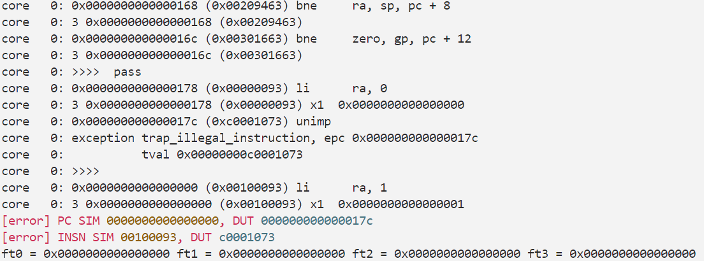

# Lab2：竞争处理及 AXI4-lite 总线内存模型

---

# 1 实验目的

- 理解数据竞争、控制竞争、结构竞争的原理和解决方法
- 完善流水线的基本功能，实现 Forwarding 机制
- 加入冲突检测模块和 stall 执行模块解决竞争问题
- 实现 AXI 总线接口的转换，学习 AXI 总线协议和真实的内存模型

# **2 实验环境**

- **HDL**：Verilog SystemVerilog
- **IDE**：Vivado
- **开发板**：Nexys A7

# 3 实验步骤

## 4.1 Forwarding机制实现

在该步，我们需要实现的`forwarding` 有以下三种，即将EXE段，MEM段和WB段的结果前递到ID阶段，使得当前位于ID段的指令在流入下一段前拿到正确的操作数，我们引入两个额外的寄存器`forward_data_1_id` ,`forward_data_2_id`来储存下一级传入EXE段的操作数

操作数的来源取决于是否进行了`forwarding`和进行了何种`forwarding`，首先实现对于`forwarding`条件的判断，三种`forwarding`的判断我们通过比对当前所需寄存器号和前递阶段的目标寄存器号一致来实现，同时保证写使能信号以及目标地址不为0

```verilog
    wire forward_exe_to_id_rs1 = idexe_r.we_reg & idexe_r.rd != 5'd0 & idexe_r.rd == rs1_id;
    wire forward_exe_to_id_rs2 = idexe_r.we_reg & idexe_r.rd != 5'd0 & idexe_r.rd == rs2_id;
    wire forward_mem_to_id_rs1 = exemem_r.we_reg & exemem_r.rd != 5'd0 & exemem_r.rd == rs1_id;
    wire forward_mem_to_id_rs2 = exemem_r.we_reg & exemem_r.rd != 5'd0 & exemem_r.rd == rs2_id;
    wire forward_wb_to_id_rs1 = memwb_r.we_reg & memwb_r.rd != 5'd0 & memwb_r.rd == rs1_id;
    wire forward_wb_to_id_rs2 = memwb_r.we_reg & memwb_r.rd != 5'd0 & memwb_r.rd == rs2_id;
```

随后根据判断出来的`forwarding`条件决定寄存器的值并传入下一级流水，这里需要注意的是我们的判断需要严格执行EXE、MEM、WB的顺序，从而保证寄存器拿到的值是最新最正确的

```verilog
    always @(*) begin
        if (forward_exe_to_id_rs1) 
            forward_data_1_id = alu_res_ex;
        else if (forward_mem_to_id_rs1) 
            forward_data_1_id = exemem_r.alu_res;
        else if (forward_wb_to_id_rs1) 
            forward_data_1_id = wb_val;
        else 
            forward_data_1_id = read_data_1;
    end
    
    always @(*) begin
        if (forward_exe_to_id_rs2) 
            forward_data_2_id = alu_res_ex;
        else if (forward_mem_to_id_rs2) 
            forward_data_2_id = exemem_r.alu_res;
        else if (forward_wb_to_id_rs2) 
            forward_data_2_id = wb_val;
        else 
            forward_data_2_id = read_data_2;
    end
    
```

理论上来讲这一个part的要求已经完成了，但是实际测试过程中会报错，查看测试文件对应的汇编代码，报错发生在这一段`bne zero,tp,c <fibonacci>`涉及到分支指令的跳转逻辑，在这里发现lab1之前设计存在的一个问题，即在发生跳转后由于需要重新取指，仅在当拍实现flush是不够的，这会使得后一拍读入`IF/ID`段的错误指令进入流水线并提交报错

在lab1中由于插入了大量气泡，使得这个设计是可以接受的，那么在新的测试样例中我们需要多flush一拍直至`pc`完成跳转并取到正确指令，具体在设计上引入了`br_flush`信号，当检测到`br_taken_ex`被拉起时在下一拍被拉起，在两拍内都进行flush，从而避免报错

```verilog
if (br_taken_ex) 
	br_flush <= 1'b1;
else 
	br_flush <= 1'b0;
```

执行指令`make verilate TESTCASE=syn CUSTOM_OPTS=-DFORWARD` ，成功通过测试，证明完成的`forwarding` 机制是正确的



## 4.2 取指访存状态机

出于设计上模块化的考虑，我们将取值访存状态机的实现放在新的模块`AxiFSM`中,模块的接口定义如下

```verilog
module AxiFSM (
    input clk,
    input rst,
    Mem_ift.Master imem_ift,
    Mem_ift.Master dmem_ift,
    input CorePack::addr_t pc,
    input CorePack::addr_t alu_res,
    input CorePack::data_t data_package,
    input CorePack::mask_t mask_package,
    input re_mem,
    input we_mem,
    output logic if_stall,
    output logic mem_stall,
    output CorePack::inst_t inst_out
);
```

我们采用实验文档中的设计将状态机划分为`IDLE,IF1,IF2,WAITFOR1,WAITFOR2,MEM1,MEM2`七个状态，定义了枚举类`axi_state_t` ,并在该类型下定义`axi_state`,`axi_state_next`分别用来表示当前状态以及下一步将转移到的状态，根据握手信号条件，定义各状态下读写两个内存的握手信号；为了简化代码，我们额外定义了四个表述请求相应握手成功的信号，其中对于数据内存需要读写握手都完成

```verilog
    assign i_request_handshake = imem_ift.r_request_valid & imem_ift.r_request_ready;
    assign i_reply_handshake = imem_ift.r_reply_valid & imem_ift.r_reply_ready;
    assign d_request_handshake = (dmem_ift.r_request_valid & dmem_ift.r_request_ready) | 
                                (dmem_ift.w_request_valid & dmem_ift.w_request_ready);
    assign d_reply_handshake = (dmem_ift.r_reply_valid & dmem_ift.r_reply_ready) | 
                              (dmem_ift.w_reply_valid & dmem_ift.w_reply_ready);
```

接下来就是状态跳转的实现，各个状态的跳转只要判断上述的握手以及是否存在访存请求即可，分为IDLE→IF1→IF2→IDLE和IDLE→IF1→WAITFOR1→WAITFOR2→MEM1→MEM2→IDLE，这里我们在设计上把`if_stall`信号常置为1，只有在IF2或WAITFOR2阶段完成取指时才短暂置0，以实现在当拍传出正确的指令，而`mem_stall`信号则在IF1检测到存在访存请求即拉起，直到MEM2阶段完成访存才拉低，从而确保流水线的正确流动

## 4.3 采用AXI总线的数据通路

由于引入了新的总线机制，我们的core模块并不是简单加入状态机模块接口这么简单，对于一些已经实现的机制需要重新考虑新的取指访存模式带来的影响

### 4.3.1 五级流水线

我们先讲一个最重要的变化，在AXI总线机制引入后，由于失去了一拍实现取指访存的保证，我们在lab1中采用的妥协机制得以取消，从而恢复到标准的五级流水线设计，那么我们删除了之前为了合并IF/ID段额外延迟了一拍的`pc_if`（实际上已经不存在if段，但从时钟周期来讲是if段的pc），保留正常流动的`pc`进行取指并流动即可；类似的，我们之前弃用的IF/ID段间寄存器也恢复它的正常功能,其中的`valid`信号根据`if_stall`决定是否把取出的指令流入下一级

```verilog
    inst_t inst_if;
    assign inst_if = inst_from_axi;

    always @(*) begin
        ifid_n.pc    = pc;
        ifid_n.pc_4  = pc + 64'd4;
        ifid_n.inst  = inst_if;
        ifid_n.valid = ~if_stall;
    end
```

同时，MEM阶段的访存请求不再需要前提，这个更改不复杂，只需要下移数据的打包和掩码生成，并使用MEM阶段的当拍寄存器值即可，这样的设计是更符合直觉并具有一致性的

```verilog
    MaskGen u_mask (
        .mem_op(exemem_r.mem_op),
        .dmem_waddr(exemem_r.alu_res),
        .dmem_wmask(mask_package_ex)
    );

    DataPkg u_datapkg (
        .mem_op(exemem_r.mem_op),
        .reg_data(exemem_r.reg_data_2),  
        .dmem_waddr(exemem_r.alu_res),
        .dmem_wdata(data_package_ex)
    );
```

### 4.3.2 取指访存状态机

在引入取指访存状态机后，我们需要对于额外导出的两个信号if_stall和mem_stall进行处理。这儿设计上我们把if信号和取指这一过程紧紧绑定，即取指不应该受到mem_stall的影响，但需要注意的一点是，在WAITFOR2阶段取到指令时尽管要使取到的指令被正确流出，但是pc还是应该拉停的从而保证不开始新的取指

```verilog
            if (br_taken_ex)
                pc     <= next_pc;
            else if (if_stall || mem_stall) 
                pc     <= pc;      
            else 
                pc     <= next_pc;
```

那么对于IF以外的阶段，就是mem_stall信号负责控制的了，具体来说其实是堵住流水线使它不再流动，那么我们只要让几个段间寄存器继承现阶段的值就可以了。但是mem_stall的作用不止于此，它做到了预料外的更多事，我们在下一章节来讲

### 4.3.3 STALL机制

STALL机制其实并不是我们引入新总线后的产物，面对前递无法解决的数据冲突，stall机制就应该是被实现的，但是看过第一个测试的样例就会发现样例仍然保留了相当数量的气泡来我们拿到只正确实现forwarding即可的分数

我们针对余下冲突的stall分为两种情况，第一种，load导致的数据冲突，对于它的检测我们采用和forwarding检测类似的思路，即判断即将进入EXE段需要的寄存器号是否和后面段要用到的相同，以及是否存在读写请求。需要注意的是，如果在当拍WB段已经在写相应的寄存器，那么stall是不需要发生的，在下一拍该条流入EXE段的指令是可以拿到正确最新的值的

```verilog
    assign rs1_dep_exe_load = idexe_r.re_mem && rs1_id != 5'd0 && rs1_id == idexe_r.rd;
    assign rs2_dep_exe_load = idexe_r.re_mem && rs2_id != 5'd0 && rs2_id == idexe_r.rd;
    assign rs1_dep_mem_load = exemem_r.re_mem && rs1_id != 5'd0 && rs1_id == exemem_r.rd;
    assign rs2_dep_mem_load = exemem_r.re_mem && rs2_id != 5'd0 && rs2_id == exemem_r.rd;
    assign load_stall  = ((rs1_dep_exe_load || rs1_dep_mem_load) )|| ((rs2_dep_exe_load || rs2_dep_mem_load));
```

由于我们在这里没有实现内存数据的前递，在这里stall的应该是stall住EXE阶段之前的过程，到冲突指令在WB阶段写回正确的内存值后才解除，但是这里我们发现一个很有意思的事情，就是load_stall**实际上并不需实现**

我们回顾上阶段的mem_stall信号会发现，如果发生load引起的数据冲突，那么冲突指令必定是会访存的，而一旦发生访存会在MEM当拍使得状态机拉起mem_stall信号等到访存正确发生，这样确保了流入EXE的当前指令必定能拿到正确的值。

但是如果上阶段mem_stall信号等到访存请求握手成功后再拉起，就会导致等待的周期数里出现数据冲突发生报错，这样就必须实现这个机制；我们通过一个无意的设计很巧妙地解决了这个问题，并大大优化了代码量和硬件复杂度。

第二种是由于分支跳转导致的控制竞争，我们的做法是检测到分支跳转指令时，首先要保证pc的流转使其不被if_stall信号暂停，其次是flush掉当前拍的IFID和IDEXE的值，那么在下一拍pc就可以拿到正确的新的信号并重新开始取指。需要注意的是，由于无法对当前的取指进程进行直接控制，在下一拍要保证原先的取指不恰恰好完成，否则在下一拍也要进行flush确保不会有错误指令流入。当然这是小概率事件，实际测试下来由于我们每一段消耗的周期数都是相对固定的，并不会发生这样的偶然情况，因此我们又可以实现简化

```verilog
            if (if_stall || br_taken_ex) 
                ifid_r  <= '{default:'0};
            else 
                ifid_r <= ifid_n;  
            if (br_taken_ex) begin
                idexe_r <= '{
                    we_reg:1'b0,
                    we_mem:1'b0,
                    re_mem:1'b0,
                    npc_sel:1'b0,
                    imm:'0,
                    alu_op:ALU_DEFAULT,
                    cmp_op:CMP_NO,
                    alu_a_sel:ASEL_REG,
                    alu_b_sel:BSEL_REG,
                    reg_data_1:'0,
                    reg_data_2:'0,
                    wb_sel:WB_SEL_ALU,
                    mem_op:MEM_NO,
                    rd:'0,
                    rs1:'0,
                    rs2:'0,
                    pc:'0,
                    pc_4:'0,
                    inst:'0,
                    valid:1'b0
                };
            end else if (stall_idexe)
                idexe_r <= idexe_r;  
            else 
                idexe_r <= idexe_n;
```

### 4.3.4 仿真下板

执行指令`make verilate TESTCASE=full` ，仿真测试通过


执行指令`make board_sim TESTCASE=full` ，程序死循环在`9a8`处通过下板仿真


构建比特流，综合构建后下板，计数器停留在`9a8`处，下板成功


# 5 思考题

1. 分析 `forward` 和 `stall` 两种技术各自的优缺点，可以从 CPI、时钟频率、元器件开销等角度进行分析；10%
    - CPI：forwarding机制通过前递数据，有效减少了流水线中的无效气泡，可以使得CPI逼近1；但是stall机制会使CPI迅速上升，造成性能损失
    - 时钟频率：stall机制由于增加的逻辑不复杂且不位于关键数据路径上，引入stall机制几乎不会导致最高时钟频率下降；但是forwarding由于在EX阶段加入了两个大型多路选择器，会增加该阶段的延迟，如果这个延迟足够长会使最高时钟频率下降
    - 元器件开销：stall机制的实现只需要一个冒险检测单元，并调节控制信号进行冻结即可，开销较少；而forwarding出了检测单元，海需要拉出额外的数据线，并在rs1和rs2增加一个大型的多路选择器，增加了元器件开销
2. 请你对数据竞争、控制竞争、结构竞争情况进行分析归纳，试着将他们分类列出，我们的 CPU 目前可能碰到哪种竞争，为什么不会碰到其他的竞争？10%
    
    数据竞争：指令间存在数据依赖（读写同一寄存器或内存），前一条指令结果尚未产生就需要被读取
    
    控制竞争：分支/跳转指令导致PC更新路径不确定，CPU不知道下一条取指的正确指令
    
    结构竞争：多条指令同时访问同一硬件资源（如内存、寄存器堆、ALU 等），由于资源冲突导致停顿
    
    我们当前实现的CPU可能碰到控制竞争和结构竞争，其中对于控制竞争，尽管实现了forwarding，但由于尚未实现分支预测，PC的控制流仍会改变导致取指路径冲突，流水线需要flush掉2条指令来保证跳转正确性。对于结构竞争，由于无法对于指令内存和数据内存进行同时读写，必需使得取指结束后再进行访存同时拉停流水线
    
    对于数据竞争，我们通过forwarding和stall机制的实现已经解决，所以不会碰到
    
3. 如果数据竞争和控制竞争同时发生应该如何处理呢？10%
    
    由于控制决策的是否跳转会依赖于数据的值，所以数据竞争的优先级高于控制竞争。那么这个时候要确保数据可用后（通过stall或者forwarding）再判断分支跳转，保证执行的正确性
    
4. 过去的实验是不使用 `mem_ift` 总线或者 `axi` 总线的，通过这些实验对总线的实验，你认为总线的引入对实验开发、内存访问、外设管理、代码调试等带来了那些好处和坏处？10%
    - 实验开发：总线的引入使得设计变得模块化、标准化，不需要为新设计重写接口逻辑，同时接入的两端也仅需要遵守总线协议而不需要了解对方的内部实现，大大提升了开发效率，坏处是一个完整的总线接口的开销是很大的，对于要求较低的实验不必要
    - 内存访问：总线允许CPU使用同一个接口去访问所有东西，实现了内存映射，且具有更高的传输性能和并发执行效率，坏处是会增加额外的时钟周期延迟
    - 外设管理：总线的引入有更好的可扩展性，CPU可以不更改设计的前提下挂载更多的外设，但是需要管理系统的地址空间，且由于共享性成为整个系统的性能瓶颈
    - 代码调试：调试可以直接监视通过总线的事务而不再需要关心CPU的内不状态，但是增加了维护总线握手本身时序的难度