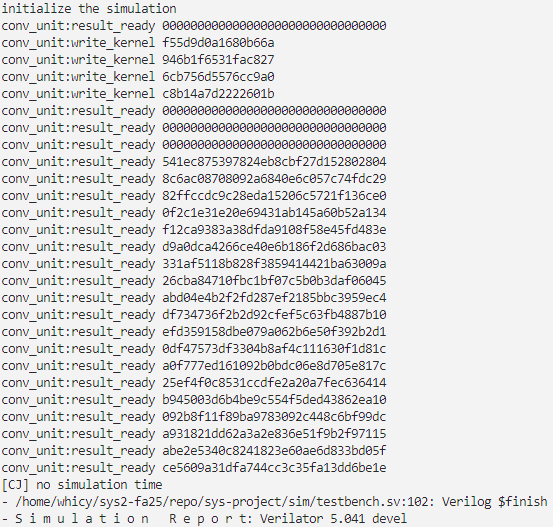

# Lab 3：卷积加速器
---

# 1 实验目的

- 理解和掌握 MMIO 的外设控制方式
- 理解加速器的原理与意义
- 体会硬件实现和软件编程实现的区别

# 2 实验环境

- **HDL**：Verilog SystemVerilog
- **IDE**：Vivado
- **开发板**：Nexys A7

# 3 实验步骤

## 3.1 卷积函数实现

卷积函数的原理并不复杂，我们根据实验文档中的划分，将其分为三个部分：conv_kernel_init,conv_compute_one_byte和conv_compute，同时实现的mul_compute函数作为纯整数指令的软件实现

conv_kenel_init模块，我们需要将kernel向量顺序写入卷积核，每写入一次触发一次硬件的移位操作，从而完成初始化

```c
    for (size_t i = 0; i < kernel_len; i++) 
        CONV_BASE[CONV_KERNEL_OFFSET] = kernel_array[i];
```

在conv_compute模块，由于我们需要保证数据对齐，在输入数据的头尾端都需要填充0作为padding，padding的长度为kernal_len-1；另外由于接口的卷积模块帮助我们完成了计算工作，这里我们需要做的就是根据状态寄存器的最低位来读取结果

```c
while ((CONV_BASE[CONV_STATE_OFFSET]&READY_MASK)==0) {}
```

相应的获取高位和低位即可

```c
dest[result_idx*2+1]=CONV_BASE[CONV_RESULT_LO_OFFSET];
dest[result_idx*2]=CONV_BASE[CONV_RESULT_HI_OFFSET];
```

为了验证正确性和计算加速比，我们给出的mul_compute函数完全不依赖硬件加速器，而是执行大数乘法的基本移位累加逻辑，这里仅给出实现

```c
void mul_compute(const uint64_t* data_array, size_t data_len, const uint64_t* kernel_array, size_t kernel_len, uint64_t* dest){
    size_t padding=kernel_len-1;
    
    for(size_t i=0;i<data_len+padding;i++)
    {
        uint64_t result_hi=0,result_lo=0;
        for(size_t j=0; j<kernel_len;j++)
        {
            size_t idx=i+j;
            uint64_t data_val=(idx<padding||idx>=padding+data_len)?0:data_array[idx-padding];
            uint64_t product_hi=0,product_lo=0,multiplicand_hi=0,multiplicand_lo=kernel_array[j];
            
            for(size_t k=0; k<64; k++) {
                if (data_val&1) {
                    uint64_t old=product_lo;
                    product_lo+=multiplicand_lo;
                    product_hi+=(product_lo<old)+multiplicand_hi;
                }
                multiplicand_hi=(multiplicand_hi<<1)|(multiplicand_lo>>63);
                multiplicand_lo<<=1;
                if(!(data_val>>=1)) break;  
            }
            uint64_t old=result_lo;
            result_lo+=product_lo;
            result_hi+=(result_lo<old)+product_hi;
        }
        size_t idx=i*2;
        dest[idx]=result_hi;      
        dest[idx+1]=result_lo;  
    }
}
```

## 3.2 仿真下板

执行命令`make conv 2>/dev/null` ，可以看到仿真程序输出卷积结果与参考结果一致，通过仿真



## 3.3 综合下板

执行`make conv`之后进行编译下板，输出如下，输出经过验证是正确的


## 4 思考题

1. 分别给出使用卷积加速器和整数指令执行测试的执行时间，计算得到卷积加速器相对于整数指令的加速比。
    
    根据下板结果，卷积加速器消耗了9315个时钟周期，整数指令实现消耗了1333370个时钟周期，加速比$speedup=\frac{1333370}{9315}\approx143.14\times$
    
2. 试分析卷积加速器相对于整数指令运算存在的优缺点，列举卷积加速器可以被使用的实际应用场景。
    
    卷积加速器通过其高并行性，可以极大提高卷积运算的速度，同时由于加速器的硬件逻辑是专门为卷积操作设计的，每个操作的能量利用效率也更高；缺点是灵活性较差，仅针对固定运算模式，同时对于简单的操作硬件开销也更大。
    
    适用于与深度学习推理、图像视频处理（本质为二维卷积）等领域
    
3. 如何用卷积加速器实现**乘法**运算？

对于单次乘法，只要设置kernel_len=1,在卷积核放入一个系数，同时输入数据也是一个数即可完成普通乘法；对于多位乘法，我们把其中一个多位整数展开为输入序列，同时另一个展开按**对应权重**展开为卷积核，这样可以通过类似移位加法的方式实现大数相乘。

1. 经过对软件上的代码优化，得到的卷积加速器最好执行时间为0x2463 cycles(9315个时钟周期)