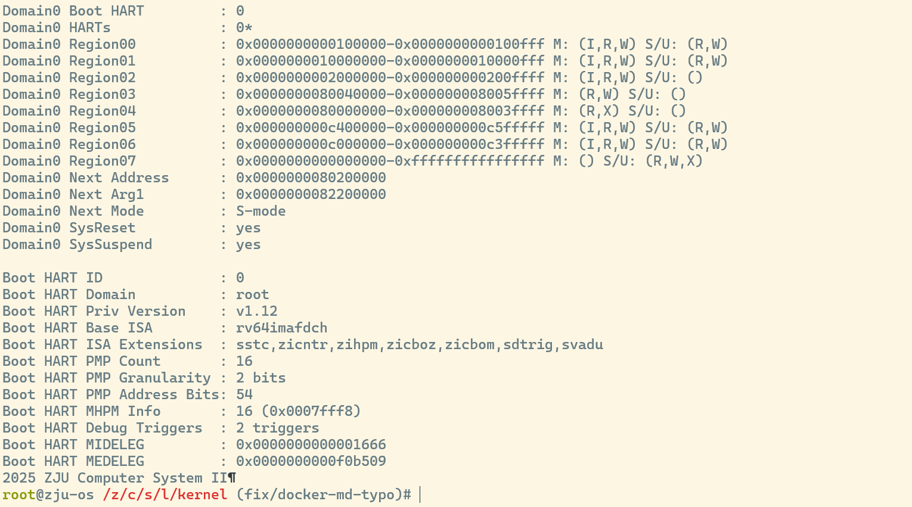

# Lab 4：RV64内核引导

# **1 实验目的**

- 学习 RISC-V 汇编， 编写 `head.S` 实现跳转到内核运行的第一个 C 函数。
- 学习 OpenSBI，理解 OpenSBI 在实验中所起到的作用，并调用 OpenSBI 提供的接口完成字符的输出。
- 学习 Makefile 相关知识，补充项目中的 Makefile 文件，来完成对整个工程的管理。
- 学习 docker 的基本命令与使用，来进行整个实验的测试

# **2 实验环境**

- Ubuntu 22.04 / Ubuntu 24.04 / Debian 12

# 3 实验步骤

## 3.1 完善Makefile脚本

参考了`kernel/lib`下Makefile文件的编写，相较来说该目录下只是多了C文件，只要收集所有C文件将其加入目标，并添加有关C文件的编译规则即可，完整文件如下

```makefile
C_SRC := $(wildcard *.c)
ASM_SRC := $(wildcard *.S)
OBJ := $(C_SRC:.c=.o) $(ASM_SRC:.S=.o)

.PHONY: all clean

all: $(OBJ)

%.o: %.c
	$(GCC) $(CPPFLAGS) $(CFLAGS) $(LDFLAGS) -c $<

%.o: %.S
	$(GCC) $(CPPFLAGS) $(CFLAGS) $(LDFLAGS) -c $<

clean:
	rm -f *.o
```

## 3.2 编写`head.S`

`head.S`的汇编代码编写并不复杂，我们利用`la`伪指令使`sp`加载`_ekenel`的地址，再加上一个立即数即可成功设置程序栈，随后`call`完指令完成跳转即可

```nasm
_start:
    # 0. 设置 sp 为 _ekernel 之后 4 KiB 的位置
    la sp, _ekernel
    li t0, 4096
    add sp, sp, t0

    # 1. 跳转到 start_kernel
    call start_kernel
```

## 3.3 补充`sbi.c`

`sbi.c`的汇编实现部分已经相当清楚，按照内联汇编的写法告知编译器输入输出操作数即可，最后通过已定义的结构体`ret`返回即可，实现如下

```c
struct sbiret sbi_ecall(uint64_t eid, uint64_t fid,
                        uint64_t arg0, uint64_t arg1, uint64_t arg2,
                        uint64_t arg3, uint64_t arg4, uint64_t arg5) {
  struct sbiret ret;
  asm volatile(
    "mv a7, %[eid]\n"
    "mv a6, %[fid]\n"
    "mv a0, %[arg0]\n"
    "mv a1, %[arg1]\n"
    "mv a2, %[arg2]\n"
    "mv a3, %[arg3]\n"
    "mv a4, %[arg4]\n"
    "mv a5, %[arg5]\n"
    "ecall\n"
    "mv %[error], a0\n"
    "mv %[value], a1\n"
    : [error] "=r"(ret.error), [value] "=r"(ret.value)
    : [eid] "r"(eid), [fid] "r"(fid),
      [arg0] "r"(arg0), [arg1] "r"(arg1), [arg2] "r"(arg2),
      [arg3] "r"(arg3), [arg4] "r"(arg4), [arg5] "r"(arg5)
    : "a0", "a1", "a2", "a3", "a4", "a5", "a6", "a7", "memory"
  );
  return ret;
}
```

## 3.4 完善`puts`和`puti`函数

puts函数用于输出字符串，我们参考sbi_ecall的调用规则逐字输出直至`\0`即可，实现如下

```c
void puts(const char *s) {
  while (*s!='\0') 
  {
    sbi_ecall(SBI_DEBUG_CONSOLE_EXT_ID, SBI_DEBUG_CONSOLE_WRITE_BYTE,
              (uint64_t)(*s), 0, 0, 0, 0, 0);
    s++;
  }
}
```

puti函数用于输出一般整数，这里我们为了调用方便，对于i≤0的情况单独处理，如果等于0直接调用输出，小于0则先调用输出负号在转化成正数逐位输出即可，实现也不复杂

```c
void puti(int i) {
  if (i==0) {
    sbi_ecall(SBI_DEBUG_CONSOLE_EXT_ID, SBI_DEBUG_CONSOLE_WRITE_BYTE,
              (uint64_t)'0', 0, 0, 0, 0, 0);
    return;
  }

  if (i<0) {
    sbi_ecall(SBI_DEBUG_CONSOLE_EXT_ID, SBI_DEBUG_CONSOLE_WRITE_BYTE,
              (uint64_t)'-', 0, 0, 0, 0, 0);
    i=-i;
  }

  char buf[32];
  int idx = 0;
  while (i>0) 
  {
    buf[idx++]='0'+(i%10);
    i/=10;
  }

  for (int j=idx-1;j>=0;j--) 
    sbi_ecall(SBI_DEBUG_CONSOLE_EXT_ID, SBI_DEBUG_CONSOLE_WRITE_BYTE,
              (uint64_t)buf[j], 0, 0, 0, 0, 0);
}
```

## 3.5 修改`sbi.h`

对照参考了csr_write的写法，先定义一个临时变量_v来接csr的结果，随后用内敛汇编语句`asm volatile("csrr %0, " #csr : "=r"(__v) : :);` 完成只读操作，并返回_v的值

```cpp
#define csr_read(csr)                                    \
  ({                                                     \
    uint64_t __v;                                        \
    asm volatile("csrr %0, " #csr : "=r"(__v) : :);     \
    __v;                                                 \
  })

```

## 3.6 编译及测试

执行`make run`，在docker环境下成功打印出`2025 ZJU Computer System II`并正常退出，截图如下



## 4 思考题

1. 我们的 vmlinux 文件由哪些文件编译而成？
    
    在学习Makefile相关规则后，我们可以通过查看Makefile文件来查看其依赖
    
    ```makefile
    all:
    	$(MAKE) -C lib all
    	$(MAKE) -C arch/riscv all
    	$(LD) -T arch/riscv/kernel/vmlinux.lds arch/riscv/kernel/*.o lib/*.o -o vmlinux
    ```
    
    可以看到参与编译的文件包括`arch/riscv/kernel`目录下的`head.o`（启动汇编）、`main.o`（内核入口 C 代码）、`print.o`（SBI 输出）、`sbi.o`（SBI 调用封装）以及lib 下的通用算术库：`div.o`、`muldi3.o`这 6 个 .o 文件再加上链接脚本 `arch/riscv/kernel/vmlinux.lds`，共同组成了最终的 vmlinux文件
    
2. 使用 riscv64-linux-gnu-objdump 反汇编 vmlinux，你发现了什么？
    
    我们的Makefile文件在make过程中帮我们生成了带源码的汇编文件`vmlinux.asm`
    
    _start 里先通过 auipc/ld + add 把 sp 设到 _ekernel+4KiB，随后 jal start_kernel，说明入口就是 head.S；start_kernel 中先 csr_write sscratch, 0x7e9，再用 puti/puts 打印 “2025 ZJU Computer System II”，最后调用 ecall_test()
    
    puts、puti 的反汇编显示它们逐字符调用 sbi_ecall，使用的 EID/FID 为 Debug Console Extension (0x4442434e, FID=2)，证明输出路径依赖 SBI
    
    sbi_ecall 汇编展示了参数如何搬运到 a0–a7 并执行 ecall，和我们在`sbi.c`中写的内联汇编一致，还包含 musl 移植的 __divdi3/__moddi3/__muldi3 等函数，可见 lib/div.S、lib/muldi3.S 被链接进来了
    
3. 编译的过程是什么？
    
    首先进入 lib，把 div.S、muldi3.S 等通用库文件用 riscv64-linux-gnu-gcc 编译成目标文件（.o）；再进入 arch/riscv，用相同的交叉编译器把 head.S、main.c、print.c、sbi.c 等源码分别编译成对应的 .o，随后回到根目录后，使用自定义链接脚本 vmlinux.lds 把所有 .o 文件按设定的段布局合成为 vmlinux ELF可执行镜像文件
    
4. 编译之后，通过 `System.map` 查看 `vmlinux.lds` 中自定义符号的值，比较它们的地址是否符合你的预期。
    
    vmlinux.lds 中自定义的符号与 System.map 给出的地址完全一致，符合我们对段布局的预期：
    
    - _skernel/_start/_stext：都为 0x80200000，对应链接脚本里把 . 设为 BASE_ADDR 并立即记录 _skernel，随后进入 .text 段前也对齐到 4 KiB，所以首地址即为BASE_ADDR。
    - _etext：0x80200374，落在 .text 段末尾，说明 text 代码大小约 0x374 字节
    - _srodata / _erodata：分别为 0x80201000 和 0x80201018，也就是 .rodata 段被对齐到下一个 4 KiB 起始地址，内容只有 0x18 字节左右。
    - _sdata / _edata：0x80202000，说明 .data 段为空，但仍按 4 KiB 对齐，这与 Lab4 没有已初始化全局变量一致。
    - _sbss / _ebss / _ekernel：都在 0x80203000，表示 .bss 同样为空，但链接脚本依旧强制对齐到下一个页边界，并把 _ekernel 设为 .bss 结束后的地址。
5. 在你的第一条指令处添加断点，观察你的程序开始执行时的特权态是多少，中断的开启情况是怎么样的？
    
    启动调试后，在_start处下断点，并打印mstatus和sstatus两个寄存器的值
    
    ```nasm
    (gdb) print/x $mstatus
    $2 = 0x8000000a00006080
    (gdb) print/x $sstatus
    $3 = 0x8000000200006000
    ```
    
     查看mstatus的MPP字段为01，表明特权态为S-mode,同时MIE字段为1代表M-mode中断已开启，SIE字段为0表示S-mode中断未开启
    
6. 在你的第一条指令处添加断点，观察内存中 `.text`、`.data`、`.bss` 段的内容是怎样的？
    
    `.text`段包含了可执行机器码，包含了`_start`，`start_kernel`，`puts`等函数的指令，`.data`段为全空（由于没有已初始化的全局变量），`.bss`段也为全空，`.rodata`段可以看到`ZJU Computer System II`这个字符串
    
7. 观察 `vmlinux.asm` 中 `sbi_ecall` 编译得到的汇编代码。这段代码是如何实现正确地将参数 `arg[0-5]` 放置在寄存器 `a[0-5]` 中的？
    
    编译器先将参数从 a0-a7 保存到临时寄存器，避免被内联汇编覆；随后按 SBI 规范重新排列到目标寄存器，最后执行ecall并将返回值存储到栈上
    
8. 尝试从汇编代码中给 C 函数 `start_kernel` 传递参数。
    
    按 RISC-V ABI 约定，我们直接在 head.S 里对 a0/a1/... 赋值，再 call start_kernel。我们尝试传两个参数：一个整数计数、一个指针地址：
    
    ```nasm
    .section .text.init
    .globl _start
    _start:
    	la      sp, _ekernel
    	li      t0, 4096
    	add     sp, sp, t0
    	li      a0, 0x1234          # 第一个参数：立即数
    	la      a1, welcome_str     # 第二个参数：字符串地址
    	call    start_kernel
    welcome_str:
    	.asciz  "Boot from head.S\n"
    ```
    
    对应地，把 start_kernel 改成带两个参数的函数即可完成传递
    
    ```c
    *// arch/riscv/kernel/main.c
    _Noreturn void start_kernel(uint64_t arg0, const char *msg) {
    		...
    }*
    ```
    
9. 了解 C 语言中“有宿主环境”（hosted）和“自立环境”（freestanding）的概念，我们的内核运行在哪种环境下？
    
    宿主环境有完整的标准库和操作系统支持；而自立环境没有操作系统，运行在裸机或内核态，只能依赖极少量、实现方自定义的运行时支持。我们的RISC-V 内核，直接在裸机上跑，没有标准 libc，也没有 OS 提供的服务属于自立环境。
    
10. 解释为什么 RV64 中没有 idiv 指令，但是在我们的 c 代码中可以使用`/`和`%`
    
    编译器会自动调用软件实现，在反汇编的 vmlinux.asm 里可以看到 __divdi3、__moddi3 等函数，它们提供了 64 位的除法/取模运算，这些函数由编译器自动链接进来，在需要 /、% 时生成相应的调用。