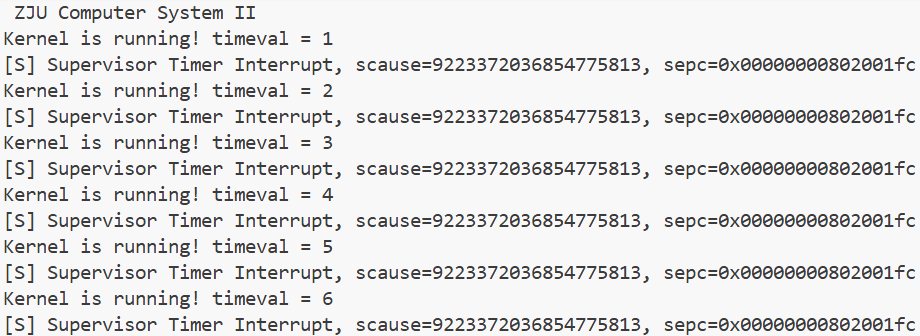

# Lab5：RV64时钟中断处理
# **1 实验目的**

- 学习 RISC-V 的 trap 处理相关寄存器与指令，完成对 trap 处理的初始化
- 理解 CPU 上下文切换机制，并正确实现上下文切换功能
- 编写 trap 处理函数，完成对特定 trap 的处理
- 调用 OpenSBI 提供的接口，完成对时钟中断事件的设置

# **2 实验环境**

- Ubuntu 22.04 / Ubuntu 24.04 / Debian 12

# 3 实验步骤

## 3.1 `printk`周边工作

memset函数用于将一段连续的内存块按字节设置为某个值，strnlen函数则用于安全计算字符串长度，实现如下：

```c
void *memset(void *restrict dst, int c, size_t n) {
	unsigned char *p = dst;
	for (size_t i = 0; i < n; ++i) 
		p[i] = (unsigned char)c;
	return dst;
}

size_t strnlen(const char *restrict s, size_t maxlen) {
	size_t len = 0;
	while (len < maxlen && s[len] != '\0') 
		++len;
	return len;
}
```

修改了Makefile文件，加入了对于.c的编译

```makefile
ASM_SRC := $(wildcard *.S)
C_SRC := $(wildcard *.c)
OBJ := $(ASM_SRC:.S=.o) $(C_SRC:.c=.o)
.PHONY: all clean
all: $(OBJ)
clean:
	rm -f *.o
%.o: %.S
	$(GCC) $(CPPFLAGS) $(CFLAGS) -c $<
%.o: %.c
	$(GCC) $(CPPFLAGS) $(CFLAGS) -c $<
```

实现的printk_sbi_write参考了lab4文档，不做赘述

## 3.2 开启trap处理

我们对于CSR按照要求进行初始化

```bash
_start:
    # 0. 设置 sp 为 _ekernel 之后 4 KiB 的位置
    la      t0, _ekernel
    li      t1, 4096
    add     t0, t0, t1
    mv      sp, t0

    # 1. 将 stvec 设置为 _traps
    la      t0, _traps
    csrw    stvec, t0

    # 2. 设置 sie[STIE]
    li      t0, (1 << 5)          # STIE bit
    csrs    sie, t0

    # 3. 设置第一次时钟中断的时间
    rdtime  t0
    li      t1, TIMECLOCK
    add     t0, t0, t1            # t0 = 当前时间 + TIMECLOCK
    mv      a0, t0
    mv      a1, zero
    mv      a2, zero
    mv      a3, zero
    mv      a4, zero
    mv      a5, zero
    li      a6, 0                 # Function ID
    li      a7, 0x54494d45        # SBI_EXT_TIME
    ecall

    # 4. 设置 sstatus[SIE]
    li      t0, (1 << 1)          # SSTATUS.SIE
    csrs    sstatus, t0

    # 5. 跳转到 start_kernel
    call start_kernel
```

## 3.4 实现上下文切换

上下文切换机制的实现，特别注意的点已经被列出了，仅给出实现

```bash
_traps:
    # 1. 将寄存器和 sepc 保存到栈上
    addi    sp, sp, -CTX_SIZE
    sd      ra, 0(sp)
    sd      gp, 8(sp)
    sd      tp, 16(sp)
    sd      t0, 24(sp)
    sd      t1, 32(sp)
    sd      t2, 40(sp)
    sd      s0, 48(sp)
    sd      s1, 56(sp)
    sd      a0, 64(sp)
    sd      a1, 72(sp)
    sd      a2, 80(sp)
    sd      a3, 88(sp)
    sd      a4, 96(sp)
    sd      a5, 104(sp)
    sd      a6, 112(sp)
    sd      a7, 120(sp)
    sd      s2, 128(sp)
    sd      s3, 136(sp)
    sd      s4, 144(sp)
    sd      s5, 152(sp)
    sd      s6, 160(sp)
    sd      s7, 168(sp)
    sd      s8, 176(sp)
    sd      s9, 184(sp)
    sd      s10, 192(sp)
    sd      s11, 200(sp)
    sd      t3, 208(sp)
    sd      t4, 216(sp)
    sd      t5, 224(sp)
    sd      t6, 232(sp)

    csrr    t0, sepc
    sd      t0, 240(sp)
    csrr    t1, scause

    # 2. 调用 trap_handler
    mv      a0, t1
    mv      a1, t0
    call    trap_handler

    # 3. 恢复寄存器和 sepc
    ld      t0, 240(sp)
    csrw    sepc, t0

    ld      ra, 0(sp)
    ld      gp, 8(sp)
    ld      tp, 16(sp)
    ld      t0, 24(sp)
    ld      t1, 32(sp)
    ld      t2, 40(sp)
    ld      s0, 48(sp)
    ld      s1, 56(sp)
    ld      a0, 64(sp)
    ld      a1, 72(sp)
    ld      a2, 80(sp)
    ld      a3, 88(sp)
    ld      a4, 96(sp)
    ld      a5, 104(sp)
    ld      a6, 112(sp)
    ld      a7, 120(sp)
    ld      s2, 128(sp)
    ld      s3, 136(sp)
    ld      s4, 144(sp)
    ld      s5, 152(sp)
    ld      s6, 160(sp)
    ld      s7, 168(sp)
    ld      s8, 176(sp)
    ld      s9, 184(sp)
    ld      s10, 192(sp)
    ld      s11, 200(sp)
    ld      t3, 208(sp)
    ld      t4, 216(sp)
    ld      t5, 224(sp)
    ld      t6, 232(sp)

    #    特别注意 sp 寄存器的恢复
    addi    sp, sp, CTX_SIZE

    # 4. 返回
    sret
```

## 3.5 实现trap处理函数

实现 trap 处理函数 trap_handler，我们通过 scause 判断 trap 类型。如果是 Supervisor Timer Interrupt，则打印输出相关信息，并调用 clock_set_next_event设置下一次时钟中断，给出实现

```c
void trap_handler(uint64_t scause, uint64_t sepc) {
  const uint64_t SCAUSE_INTERRUPT_BIT = 1ULL << 63;
  const uint64_t SCAUSE_CODE_MASK = ~(1ULL << 63);
  const uint64_t SCAUSE_SUPERVISOR_TIMER = 5;

  uint64_t is_interrupt = scause & SCAUSE_INTERRUPT_BIT;
  uint64_t cause_code = scause & SCAUSE_CODE_MASK;

  if (is_interrupt && cause_code == SCAUSE_SUPERVISOR_TIMER) {
    printk("[S] Supervisor Timer Interrupt, scause=%" PRIu64 ", sepc=0x%016" PRIx64 "\n", scause, sepc);
    clock_set_next_event();
  } else {
    printk("[S] Unknown trap, scause=%" PRIu64 ", sepc=0x%016" PRIx64 "\n", scause, sepc);
  }
}
```

## 3.6 实现时钟中断相关函数

实现clock_set_next_event函数，使用asm rdtime指令获取当前时间，并计算下一次时钟中断的时间点，最后调用 SBI 接口设置下一次时钟中断，实现如下

```bash
void clock_set_next_event(void) {
  uint64_t time;

  // 1. 使用 rdtime 指令读取当前时间
  asm volatile("rdtime %0" : "=r"(time));

  // 2. 计算下一次中断的时间
  uint64_t next = time + TIMECLOCK;

  // 3. 调用 sbi_set_timer 设置下一次时钟中断
  sbi_set_timer(next);
}
```

## 3.7 编译及测试

在docker中实现正确输出截图



# 4 思考题

1. 在实现上下文切换部分，我们需要保存寄存器，谈谈为什么需要保存寄存器和 sepc，其他的特权寄存器则不需要，以及为什么要保存在栈上
    
    <aside>
    💡
    
    要求：请通过 gdb 调试截图来分别回答如果不保存寄存器和 sepc 会有什么后果
    
    </aside>
    
    在上下文切换时，通用寄存器保存计算数据与调用上下文，防止 trap 期间调用的 C 函数改乱原有通用寄存器，导致返回后被中断代码的执行状态被破坏；而`sepc`决定`sret`返回到哪条指令，不保存/错误修改会导致重复触发异常或跳到错误地址。其他特权级寄存器属于执行环境的系统状态，多数在当前trap使用，由硬件写入，不需要恢复，`stvec/sie`等在初始化后不在 trap 中频繁改动，也不需要保存。保存在栈上是因为需要保存的寄存器很多（几乎所有通用寄存器 + sepc），而寄存器本身数量有限，且每次 trap 都需要独立的保存空间并可能会出现嵌套trap，栈支持这些特点。
    
    我们手动注释掉寄存器，并在traps和test处都打下断点，运行至第一次停在test
    
    
    
    继续运行，等到下一次中断
    
    
    
    可以看到在 `_traps` 里，a0 已经被用来装 scause、a1 装 sepc，`call trap_handler`又进一步改了更多寄存器，继续运行几次
    
    
    
    发现中断回来后 a0/a1/s0/s1 中的值完全变了，test 的逻辑读到的也是乱的，timeval 计算、循环判断都开始出错
    
    再手动注释掉sepc，在_traps和sret处下断点，sret 后 pc 跳回同一条触发中断的指令 ，导致 立刻再次触发同样的 trap，从而陷入死循环
    
    
    
2. 在我们使用 `make run` 时，OpenSBI 会产生如下输出 :查阅 The RISC-V Instruction Set Manual: Volume II - Privileged Architecture，解释**你的** OpenSBI 给出的 `MIDELEG` 和 `MEDELEG` 值的含义。如果实验中 `mideleg` 和`medeleg` CSR 没有被正确设定，会有什么影响？
    
    ```bash
    Boot HART MIDELEG         : 0x0000000000001666
    Boot HART MEDELEG         : 0x0000000000f0b509
    ```
    
    查阅对应章节，**mideleg**意为中断委托寄存器，**medeleg**意为异常委托寄存器，分别决定将哪些中断/异常从M-mode委托给S-mode处理；如果没有被设置正确，出现的中断和异常都会陷入M-mode，S-mode内核将收不到时钟中断，`clock_set_next_event /trap_handler` 永远不会被调起，周期性输出、定时相关逻辑都不会工作，调度/时钟实不再有预期结果。
    
3. 如何在不支持 M 扩展的处理器上执行 M 扩展指令？提示：请查阅 The RISC-V Instruction Set Manual: Volume I - Unprivileged Architecture 第 1.2 节。
    
    1.2节有这样一句话
    
    > The implementation of a RISC-V execution environment can be pure hardware, pure software, or a combination of hardware and software. For example, **opcode traps and software emulation** can be used to implement functionality not provided in hardware.
    > 
    
    当程序执行到某条 M 扩展指令，而硬件不支持：处理器触发非法指令异常，将异常移交给执行环境（如操作系统或SBI）处理，然后由执行环境的软件模拟器完成该指令的功能，模拟完成后把结果写回对应目的寄存器，恢复程序执行。
    
4. 如果是完全按照我们的实验指导实现的，那么在运行一段时间后，你应当会看到 `test` 函数的输出和时钟中断的输出出现失去同步的情况：请分析这种现象的原因，问题出在 `test` 函数还是时钟中断上？请通过gdb调试截图来说明问题。请修改代码，来保持两者的同步
    
    <aside>
    💡
    
    请备份修改前的代码，这个修改在完成思考题5之后可以复原，便于后续实验的进行
    
    </aside>
    
    问题出在时钟中断上，其中断策略是将当前时间 + TIMECLOCK作为下一次中断的时间点。但由于trap 进入 + printk 输出本身就会消耗不少时间（SBI 调用串口很慢）；并且是在中断处理函数里才读 rdtime 再加 TIMECLOCK；所以下一轮中断的绝对时间会不断漂移，不再严格对齐到时间轴上的整数秒边界，一旦发生越界，则会出现不同步现象
    我们修改了代码使其在中断时打印中断触发时的timeval，和实际设定时钟中断的时间，我们找到其中的一次失去同步情况
    
    
    
    可以看到，在第165次timeval时，由于当前的时间漂移已经出现越界，导致下一次的时钟中断设定出错，连续两次打印test函数输出
    
    要解决这个问题，只需要更改中断策略去做更严格的对齐，使下一次的时钟中断触发总是在（n+1）*TIMECLOCK处，需要注意的是，我们没有去解决真实时间的偏移问题，但是这样可以使发生的偏移不被累加导致异步出现，在一般情况下每次随机的偏移量是不会超过TIMECLOCK的
    
    ```c
      uint64_t ticks = time / TIMECLOCK;         // 当前已经过去了多少"秒"
      uint64_t next  = (ticks + 1) * TIMECLOCK;  // 对齐到下一个整数秒边界
    ```
    
    我们再次运行测试，可以看到现在两者应该是完全同步的，不会出现失去同步的问题
    
    
    
5. 请自行设计方案，测试 `test` 函数中的 `printk` 输出信息需要的时间。假定时钟频率为 10 MHz，在确保每次 `timeval` 变化时，信息都能被完整输出的情况下，每秒最多可以发生多少次时钟中断？请尝试修改 `TIMECLOCK` 和其他可能需要修改的地方，验证这个值。只需近似计算即可。
    
    我们修改了`main.c` 通过rdtime打印cost输出
    
    ```c
    uint64_t t0, t1;
    asm volatile("rdtime %0" : "=r"(t0));
    printk("Kernel is running! timeval = %" PRIu64 "\n", timeval);
    asm volatile("rdtime %0" : "=r"(t1));
    int64_t cost=t1-t0;
    printk("[measure] printk cost = %" PRIu64 " ticks\n", cost);
    ```
    
    我们挑选前几次范围内的打印值进行简单的估计，上界在2500ticks左右
    
    
    
    我们按2500ticks估计，一次`printk`的时间大约为$T_{printk}\approx\frac {2500}{10^7}s=0.25ms$，对应的最大频率$f_{max}\approx \frac {10^7}{2500}=4000$次/秒，对应地，我们修改TIMECLOCK进行验证，那么在实际测试中，为了保证输出完整，这个值是达不到的，要预留更多的缓冲时间，我们增大TIMECLOCK到3-5倍左右，对应缩小打印次数。