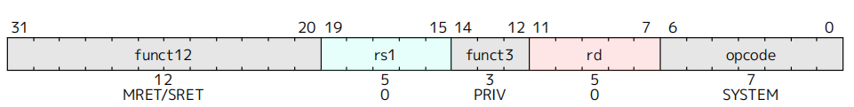

# Lab 7：综合实验
| Course| 计算机系统II|
|------|------|
|Lesson Date| 2025年12月4日|
|Status|Complete|
|Type|Lab|

---

# **1 实验目的**

- 学习 OS 在硬件层面的抽象
- 完善自己的 CPU Core，并运行起自己编写的 Mini Kernel

# **2 实验环境**

- **HDL**：Verilog & SystemVerilog
- **IDE**：Vivado
- **开发板**：Nexys A7
- **软件辅助环境**：Ubuntu 22.04 / Ubuntu 24.04 / Debian 12

# 3 实验步骤

## 3.1 Core的改造

### 3.1.1 CSR流水线

我们首先对于Controller模块进行改造，确保其识别特权态指令，其中由于`ControllerSignals` 结构体已经引入了对于CSR的控制变量，我们只需要加入对`CsrPack`的调用，只要对于进行相应的解码即可，对于相应指令的解码参考了两本手册，规则如下





我们由此补充了对于`csr_opcode` 的解码，根据FUNT3识别对应的特权态指令，其中特权级指令由于不对CSR和通用寄存器进行写操作，只要调整`csr_ret`并保持默认即可

```verilog
CSR_OPCODE: begin
                ctrl_signals.csr_addr = inst[31:20];
                ctrl_signals.csr_alu_asel = ASEL_CSRREG;  
                ctrl_signals.we_reg = (rd != 5'b0);  
                ctrl_signals.wb_sel = WB_SEL_ALU;
                case (funct3)
                    CSRRW_FUNCT3: begin  
                        ctrl_signals.we_csr = 1'b1;
                        ctrl_signals.csr_alu_op = CsrPack::CSR_ALU_ADD;  
                        ctrl_signals.csr_alu_bsel = BSEL_GPREG;  
                    end
                    CSRRS_FUNCT3: begin  
                        ctrl_signals.we_csr = (rs1 != 5'b0);  
                        ctrl_signals.csr_alu_op = CsrPack::CSR_ALU_OR;
                        ctrl_signals.csr_alu_bsel = BSEL_GPREG;  
                    end
                    CSRRC_FUNCT3: begin 
                        ctrl_signals.we_csr = (rs1 != 5'b0);  
                        ctrl_signals.csr_alu_op = CsrPack::CSR_ALU_ANDNOT;
                        ctrl_signals.csr_alu_bsel = BSEL_GPREG;  
                    end
                    CSRRWI_FUNCT3: begin 
                        ctrl_signals.we_csr = 1'b1;
                        ctrl_signals.csr_alu_op = CsrPack::CSR_ALU_ADD;  
                        ctrl_signals.csr_alu_bsel = BSEL_CSRIMM;  
                    end
                    CSRRSI_FUNCT3: begin  
                        ctrl_signals.we_csr = (rs1 != 5'b0);  
                        ctrl_signals.csr_alu_op = CsrPack::CSR_ALU_OR;
                        ctrl_signals.csr_alu_bsel = BSEL_CSRIMM;  
                    end
                    CSRRCI_FUNCT3: begin  
                        ctrl_signals.we_csr = (rs1 != 5'b0);  
                        ctrl_signals.csr_alu_op = CsrPack::CSR_ALU_ANDNOT;
                        ctrl_signals.csr_alu_bsel = BSEL_CSRIMM; 
                    end
                    default: begin  
                        if (inst == SRET) begin
                            ctrl_signals.csr_ret = 2'b01; 
                        end else if (inst == MRET) begin
                            ctrl_signals.csr_ret = 2'b10;
                        end
                        ctrl_signals.we_csr = 1'b0;
                        ctrl_signals.csr_alu_op = CsrPack::CSR_ALU_ADD;  
                        ctrl_signals.csr_alu_bsel = BSEL_CSR0;
                    end
                endcase
            end
```

同时为了避免流水线冲突、简化数据通路、降低控制复杂度，并保证主 ALU 不被 CSR 指令占用，我们要为CSR流水线添加一个新的ALU，这个ALU要对CSR文件进行操作，并从CSR恢复状态，我们单独写了CSRALU模块来处理，对应添加数据通路

```verilog
`include "core_struct.vh"
`include "csr_struct.vh"

module CSRALU (
    input CsrPack::csr_alu_asel_op_enum csr_alu_asel,
    input CsrPack::csr_alu_bsel_op_enum csr_alu_bsel,
    input CsrPack::csr_alu_op_enmu csr_alu_op,
    input CorePack::data_t csr_val,
    input CorePack::data_t reg_data_1,
    input CorePack::reg_ind_t rs1,
    output CorePack::data_t csr_alu_res
);

    import CorePack::*;
    import CsrPack::*;

    data_t csr_alu_a, csr_alu_b;

    always @(*) begin
        unique case (csr_alu_asel)
            ASEL_CSR0: csr_alu_a = 64'b0;
            ASEL_CSRREG: csr_alu_a = csr_val;
            default: csr_alu_a = 64'b0;
        endcase
    end

    always @(*) begin
        unique case (csr_alu_bsel)
            BSEL_CSR0: csr_alu_b = 64'b0;
            BSEL_GPREG: csr_alu_b = reg_data_1;
            BSEL_CSRIMM: csr_alu_b = {59'b0, rs1};
            default: csr_alu_b = 64'b0;
        endcase
    end

    always @(*) begin
        unique case (csr_alu_op)
            CSR_ALU_ADD: csr_alu_res = csr_alu_a + csr_alu_b;
            CSR_ALU_OR: csr_alu_res = csr_alu_a | csr_alu_b;
            CSR_ALU_ANDNOT: csr_alu_res = csr_alu_a & ~csr_alu_b;
            default: csr_alu_res = csr_alu_a;  
        endcase
    end

endmodule

```

随后我们将`CSRModule` 接入流水线，定义相关的信号并进行对应的接线

```verilog
    CSRModule u_csr (
        .clk(clk),
        .rst(rst),
        .csr_we_wb(csr_we_wb),
        .csr_addr_wb(csr_addr_wb),
        .csr_val_wb(csr_val_wb),
        .csr_addr_id(csr_addr_id),
        .csr_val_id(csr_val_id),
        .pc_ret(pc_ret),
        .valid_wb(memwb_r.valid),
        .time_int(time_int),
        .csr_ret(csr_ret_wb),
        .except_commit(except_wb),
        .priv(priv),
        .switch_mode(switch_mode),
        .pc_csr(pc_csr),
        .cosim_interrupt(csr_interrupt),
        .cosim_cause(csr_cause),
        .cosim_csr_info(csr_info)
    );
```

### 3.1.2 陷入检测与处理

对于异常检测，我们将异常处理模块接入流水线中的`ID`段后，对于异常信息，我们定义了四个结构体对应EX1-4进行相应存储，传出的的`except_exe` 作为EX2逐级往下传递，并最后接回`CSRModule`

```verilog
    ExceptPack except_id, except_exe, except_mem, except_wb;
    assign except_id = '{except: 1'b0, epc: 64'b0, ecause: 64'b0, etval: 64'b0};
    logic except_happen_id;
    IDExceptExamine u_except_examine (
        .clk(clk),
        .rst(rst),
        .stall(mem_stall),
        .flush(switch_mode||br_taken_ex),
        .pc_id(ifid_r.pc),
        .priv(priv),
        .inst_id(inst_id),
        .valid_id(ifid_r.valid),
        .except_id(except_id),
        .except_exe(except_exe),
        .except_happen_id(except_happen_id)
    );
```

我们补充对于`CSRModule`的接线，主要是从`CSRModule`导出接回到`WB`段的线，这儿要重点说明的是对于`pc_ret`，从逻辑上来看我们应该采用的是`WB`阶段执行完成指令的下一条指令，在实际过程中我们加入了一个对于跳转逻辑的判断来决定使用`pc_4` 还是`npc` ；另一个值得说明的是`csr_val_wb` ，要注意区分于`csr_alu_res` 是用于写回`rd` 的旧值，此时应该是写入`csr`寄存器的新值

```verilog
    assign csr_we_wb = memwb_r.we_csr & memwb_r.valid;
    assign csr_addr_wb = memwb_r.csr_addr;
    always @(*) begin
        if (memwb_r.we_csr && memwb_r.valid) begin
            if (memwb_r.inst[14:12] == CSRRW_FUNCT3)  
                csr_val_wb = memwb_r.read_data_1;
            else if (memwb_r.inst[14:12] == CSRRWI_FUNCT3)
                csr_val_wb = {59'b0, memwb_r.rs1};
            else              
                csr_val_wb = memwb_r.read_data_2;
        end else 
            csr_val_wb = 64'b0;
    end
    assign csr_addr_id = ctrl_signals.csr_addr;
    logic npc_sel;
    assign npc_sel = (memwb_r.inst[6:0] == JAL_OPCODE) || 
                     (memwb_r.inst[6:0] == JALR_OPCODE) || 
                     (memwb_r.inst[6:0] == BRANCH_OPCODE && memwb_r.br_taken);
    assign pc_ret = npc_sel?memwb_r.npc:memwb_r.pc_4;  
    assign csr_ret_wb = memwb_r.csr_ret;
```

最后添加的是`swtich_mode`对于流水线的控制，首先是IF段，我们在lab2引入取指访存状态机时，我们希望它是独立于控制模块外的，即不停的进行取指访存操作，通过控制模块中的`if_stall` 和`mem_stall`来决定取指访存是否有效（也就是flush操作），那么当时我们讲到分支跳转时提到，若仅仅延一拍，需要保证延的当拍没有指令被取出，否则会导致错误指令进入流水线；这儿我们添加`switch_mode`时发现这个问题仍会出现，因此对于`IF`阶段的寄存器相应进行多延了一拍，同时`pc` 在`switch_mode`被拉起的当拍完成跳转后下一拍保持不变

```verilog
            switch_mode_delay <= switch_mode;
            if (switch_mode||br_taken_ex) 
                pc <= next_pc;
            else if (if_stall ||mem_stall||switch_mode_delay) 
                pc <= pc;      
            else 
                pc <= next_pc;

            if (switch_mode || switch_mode_delay || if_stall || br_taken_ex) 
                ifid_r <= '{default:'0};
            else 
                ifid_r <= ifid_n;
```

对于其他段，`switch_mode`的控制是相对简单的，直接flush段间寄存器即可，这儿不进行赘述，需要注意的是，我们处理异常的寄存器也需要对应进行flush，给出示例

```verilog
    always_ff @(posedge clk) begin
        if (rst || switch_mode) begin
            except_mem <= '{except: 1'b0, epc: 64'b0, ecause: 64'b0, etval: 64'b0};
        end else if (~mem_stall) begin
            except_mem <= except_exe;
        end
    end
```

# 4 仿真

我们在目录下执行`make kernel 2>log` ，将`printk`函数的输出进行打印，得到结果如下（为了较完整的展示延长了仿真时间）可以看到与预期的结果是一致的，且没有出现不匹配报错


同样的，对于`make kernel_board_sim 2>log` 测试下板仿真，结果也是正确的，完成实验   

# 5 思考题

1. 使用 `printk` 函数输出一个字符 `a` 的过程中需要发生几次特权态切换？请将切换前后的特权态和切换的原因一一列举出来。
    
    在最简情况下，使用 `printk` 输出一个字符 `a` 的过程中会发生 2 次特权态切换；在某些实现中，如果第一次 SBI 控制台写调用未能一次性完成输出，则可能发生 4 次特权态切换。
    
    首先，`printk` 在 S 态 下运行。当内核调用 `printk` 进行字符输出时，会进一步调用基于 SBI 的控制台输出接口。该接口通过执行 `ecall` 指令向下请求更高特权级的服务。由于 `ecall` 在 S 态执行会触发 supervisor ecall 异常，处理器陷入 M 态，这是第一次特权态切换。进入 M 态后，SBI 处理程序负责完成实际的字符输出。
    
    当 M 态下的 SBI 处理程序完成输出操作后，会执行 `mret` 指令返回。`mret` 会根据 将处理器恢复到S 态，从而完成第二次特权态切换。至此，在最简路径下，一个字符的 `printk` 输出已经完成，共发生两次特权态切换。
    
    在某些情况下，如果第一次 SBI 控制台写操作返回值为 0（表示需要退化为逐字节输出），内核会再次在 S 态执行新的 `ecall` 请求进行单字节写入。这会再次触发从 S 态到 M 态 的陷入，构成第三次特权态切换；随后，SBI 处理完成后再通过 `mret` 返回到 S 态，形成第四次特权态切换。
    
2. 如果流水线的 IF、ID、MEM 阶段都检测到了异常发生，应该选择哪个流水级的异常作为 trap_handler 处理的异常 ? 请说说为什么这么选择。
当多个流水级同时检测到异常时，应选择程序顺序上最早发生的异常作为最终处理的异常。在我们采用的流水线中对应 MEM 阶段的异常，因为它代表最早执行的指令，能够保证精确异常语义，确保异常之前的指令全部完成、之后的指令全部不生效，从而维持CPU状态的一致性与可恢复性。
3. 现在你能够在你自己设计的 CPU 上运行你自己编写的操作系统内核了，这给你带来了很大的自由度，你可以做到很多你直接在自己的电脑上编程可能做不到的事情。你想挑战在你的最小系统上实现什么？无需真的实现，给出大致思路即可。
    
    我希望实现一套软件可见的软件性能计数器系统。在自制 CPU 上实现 PMC 可以从硬件微结构层面完整观察指令执行与流水线行为。整体思路是在 CPU 硬件层对关键运行事件进行实时统计，并通过内存映射接口向操作系统内核暴露这些计数器。硬件层在流水线各阶段对指令提交、周期推进、流水线停顿、分支行为、内存访问、数据前递以及异常中断等事件进行计数；软件层则在内核中提供统一的访问与分析接口，读取并解析这些计数结果，计算 CPI、流水线效率、分支预测准确率等关键性能指标。
    
    通过这套机制，操作系统可以在运行时直接感知底层 CPU 的真实行为，从而用于性能分析、瓶颈定位与设计验证。例如，可以判断性能受限于取指、访存还是控制相关；分析不同工作负载的指令与内存访问特征；以及在修改硬件结构（如分支预测或缓存策略）后，对比优化前后的效果。
    

# 6 写在最后

自己在大二本该修读时由于个人原因弃修了这门课，虽然时间尺度来讲只有短短一年，但再修这门课的时候却也感受到了很多的变化，也见证了这门课第一次得到这么大范围的曝光。对于个人而言，还是能以一个相对完整一些的视角来看待这门课；应该说，写这些可有可无的内容才是一学期以来真正想说的话。

从最浅显的变化来讲，选这门课的人更多了，板子变成了两人共享，助教数量也在逐年增长，学院有意地想推动这场教改去涵盖更多的计院人 ，但对我来说最显著的变化，其实是学生之间的信息差变大了。从课程实验的角度，很明显的比对是好的ai对于构思一个完整系统的代码能力提升太多了，自己也可以毫不避讳地说这是自己这学期在实验部分走的很顺利的重要原因，我相信这也是这门课实验通过率逐年提高的重要原因。除了对于硬件来说大部分机械性重复的代码，ai对于模块间的接线以及流程设计已经精进很多了，写一个简单的硬件系统（比如单周期cpu）包括逻辑和调试更简单的软件代码已经是易如反掌的事情，这对于一年前的我是不敢想象的。

回顾这一学期，自己在更好的的ai帮助下获得了什么呢？我花了很多时间的地方是硬件调试、阅读代码，并想办法优化出风格更好的代码上，而不是再堆叠史山。我觉得这个经验是弥足珍贵的，并暂时还不会被ai所取代（同样我不认同硬件无用论），也让我看到这门课在现在的环境下得到保留的价值。同时一年里计院其他鱼龙混杂课程的经历，也让自己意识到系统课改，至少想探索的方向是正向的。因此我对系统课保留了原始的信心，也看到其他课程在向这个方向靠近、并做的更好。

但是自己也不希望抱着ai高高在上，一年前也曾经历过对于系统实验毫无头绪的至暗时刻，也因此无比理解系统课冲上风口浪尖时那些对于系统课的吐槽。对于无法因为ai或者其他途径获得有效信息、帮助的同学，这门课的难度注定他们要付出比其他人更多的努力，一旦缺少了一点动力和一点运气，就更容易发出质疑这条路的声音；只是在这个学期，声音的基数变大，让更多的人听见了而已。我由衷希望这种争议能带来更好的结果，让课改听到更多不一样的声音；试想一门课（这里没有影射任何计院课）如果秉持着一套圣遗物系统代代相传，考试也是八股之风，那么关于课程合理性的讨论必然在论坛掀不起什么浪花，只会在垂垂老矣中走向衰落。

我记得上系统I时，助教为实验指导加入了verilog语言的示范教学，初衷是不希望我们因为对于硬件语言理解不够从而丧失对于硬件的热情。对于硬件的理解其实贯穿了系统实验的始终，那么这也是一种信息差。如果外部环境（助教、老师、同学的交流）对于抹平这种信息差没有做足够多的努力，就只能靠学生自身的努力。从经历过灰暗的自己的角度来说，谴责这些同学都不够努力是不公正的（无法苟同一些同专业人的观点），要想让这门课常青，还是应该从外部去下更多努力减小这种信息差，在信息尽可能公平的基础下，让这门课去筛选考核真正有意义、有价值的东西。

应该说自己因为这门课接触的老师助教们都在干这样一件事，对于实验架构、实验指导的优化一直在做（今年重写了综合实验，对于很多不合适的思考题也不再继承了）也花费了很多时间精力帮助我们少踩前人留下的坑。自己很感激这些看得见的努力，也始终觉得，如果一门课在浙大都成了高高在上，只有能力高者准入的精英课程，那么这种固步自封必将导致它的积尘落灰和淘汰。但是还是有更多可以做的更好的事，课程内，实验课和理论课一直以来的割裂感需要更多设计；课程外，学院开设的课程能在教ai使用这些方面下更多功夫，而不是开一堆文科特供人基课。

现在的实验指导虽然从学生视角来看还是有颇多瑕疵（可以列举一些：cpu相关lab对于仿真测试的架构始终缺少一个完善完整的说明，基本只能靠助教努力和实验指导东写一点西写一点自己参悟；lab2的任务流程写的很差，加入forwarding机制和axi总线的引入其实还是存在很多差异的，即便出于任务量的考虑也还是划分成一大一小两个part更好而不是吃大锅饭），但改变总归是正向的（最初版的系统实验没有差分是在可怕）应该说这门课在现在的技术水平下的难度是合适的，给的分数也是对得起大家的付出的，那么当前要做的是思考如何让大家对这门课难度的认知回到合理的水平。作为一个“为数不多”上过这门课的人，还是希望自己能为这门年龄并不大、正在经历风雨的课尽一些谏言的责任，而不只是混一个好看的分数。

再次感谢这学期陪伴自己学习这门课的助教们和老师们，希望系统课越来越好！