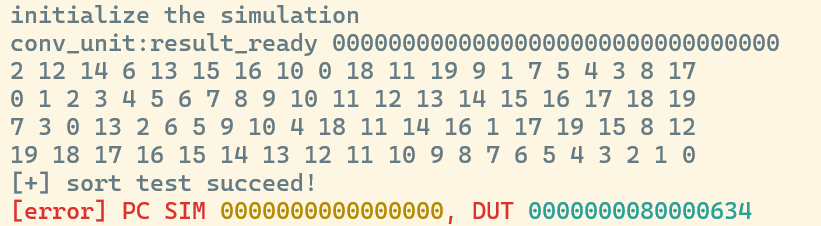

# Lab 1：动态分支预测

---

# **1 实验目的**

- 了解分支预测原理
- 实现以 BHT 和 BTB 为基础的动态分支预测

# **2 实验环境**

- **HDL**：Verilog、SystemVerilog
- **IDE**：Vivado
- **开发板**：NEXYS A7 (XC7A100T-1CSG324C)

# **3 实验内容**

## **3.1 BHT**

我们参照实验框架的设定，以`PC[6:2]` 作为index选择BTB表项，以`PC[63:7]` 作为tag进行匹配，我们定义`hit_if` 通过确认索引到的BTB表项有效以及tag一致来记录是否BTB命中，随后`jump_pred_if`通过判断`hit_if`和`btb_if.state[1]`来确认是否跳转，同时`pc_target_if`进行相应的取指，完成我们的BHT部分

```verilog
    wire hit_if = btb_if.valid && (btb_if.tag == tag_if);
    assign jump_pred_if = hit_if && btb_if.state[1];
    assign pc_target_if = btb_if.target;
```

## 3.2 BTB

在EXE阶段，我们需要根据预测的准确与否对于BTB表已有表项进行维护，维护核心是一个2 bit的状态机，逻辑并不复杂；还有一件事是对于新表项的加入，记录需要跳转指令的`tag`，`target`以及初始化`state`以及`valid` ，给出完整的时序逻辑实现

```verilog
    always_ff @(posedge clk) begin
        if (rst) begin
            for (int i = 0; i < DEPTH; i++) begin
                btb[i].valid <= 1'b0;
            end
        end else if (inst_is_jump_exe) begin
            if (btb_exe.valid && (btb_exe.tag == tag_exe)) begin
                if (is_jump_exe) begin
                    btb[index_exe].target <= pc_target_exe;
                    case (btb_exe.state)
                        2'b00: btb[index_exe].state <= 2'b01;
                        default: btb[index_exe].state <= 2'b11;
                    endcase
                end else begin
                    case (btb_exe.state)
                        2'b11: btb[index_exe].state <= 2'b10;
                        default: btb[index_exe].state <= 2'b00;
                    endcase
                end
            end else if (is_jump_exe) begin
                btb[index_exe].tag    <= tag_exe;
                btb[index_exe].target <= pc_target_exe;
                btb[index_exe].state  <= 2'b00;
                btb[index_exe].valid  <= 1'b1;
            end
        end
    end
```

## 3.3 Core模块的修改

现在我们可以将分支预测模块接入我们的数据通路了。为了方便流水间继承预测结果，我们在`core_struct.vh` 中对于`IFID`和`IDEXE`段间寄存器进行修改，加入了`pred_taken` 用于保存对于是否跳转的预测，随后即可将模块接入流水线；

这里我们要补充的是对于三类不同性质跳转的处理，`branch`指令毫无疑问是我们分支预测的核心，然而对于`jal/jalr`指令，它们的跳转是无条件跳转，通过分支预测可以优化这部分指令的性能，但是对于间接跳转指令`jalr` ，由于其目标地址受到寄存器的影响，导致其记录的目标地址大概率是错误的，从而需要额外的纠错，在这里我们出于统一性考虑还是将其加入分支预测，并在后续进行处理

```verilog
    logic jump_pred_if;
    addr_t pc_target_if;
    logic inst_is_jump_exe;
    assign inst_is_jump_exe = (idexe_r.inst[6:0] == BRANCH_OPCODE) ||
                              (idexe_r.inst[6:0] == JAL_OPCODE) ||
                              (idexe_r.inst[6:0] == JALR_OPCODE);

    BranchPrediction u_bp (
        .clk(clk),
        .rst(rst),
        .pc_if(pc),
        .jump_pred_if(jump_pred_if),
        .pc_target_if(pc_target_if),
        .pc_exe(idexe_r.pc),
        .pc_target_exe(alu_res_ex),
        .is_jump_exe(br_taken_ex),
        .inst_is_jump_exe(inst_is_jump_exe)
    );
```

我们在上一步加入的`pred_taken`寄存器由于在完成判断后需要流过`ID`段，因此要加入相关的继承逻辑

```verilog
ifid_n.pred_taken = jump_pred_if;
...
idexe_n.pred_taken = ifid_r.pred_taken;    
```

随后来到`EX`段，我们完成了跳转与否的计算结果，在原本的流水线设计中我们用`br_taken_ex` 记录了它。结合拿到的预测结果我们将预测错误分为`bp_mispredict` 和`target_mismatch` 两者。前者表示预测结果失败，即指令为跳转指令但是预测结果与实际跳转执行情况不一致；后者针对目标地址错误的`jalr`指令，通过比较当前`if`段的`pc`和取到的目标地址来判断

```verilog
    assign target_mismatch = br_taken_ex && pc != alu_res_ex;
    assign bp_mispredict = inst_is_jump_exe && idexe_r.pred_taken != br_taken_ex;
```

随后为我们的`pc`更新逻辑，原本的`switch_mode` 更新逻辑保持不变，随后区分跳转指令和非跳转指令，对于非跳转指令，采用接入BTB的正常预测取指即可`next_pc = jump_pred_if ? pc_target_if : pc_4` 对于跳转指令，我们判断如果是误预测了，那么根据实际的跳转结果进行修正：实际跳转的，拿到`alu`的计算地址结果；实际不跳转的，拿到跳转指令的下一条指令恢复流动`next_pc = br_taken_ex ? alu_res_ex : idexe_r.pc_4` 如果是预测地址有误，也同样拿到`alu` 的计算结果，如果预测本身没有问题，那么按照对于非跳转指令的处理正常流动即可，给出完整的实现

```verilog
    always @(*) begin
        if (switch_mode)
            next_pc = pc_csr;
        else if (inst_is_jump_exe)
            if (bp_mispredict)
                next_pc = br_taken_ex ? alu_res_ex : idexe_r.pc_4;
            else if (target_mismatch)
                next_pc=alu_res_ex;
            else
                next_pc = jump_pred_if ? pc_target_if : pc_4;
        else 
            next_pc = jump_pred_if ? pc_target_if : pc_4;
    end
```

这里还要声明的是flush逻辑，我们把原本的`br_taken_ex`一律需要跳转优化成了出现上面两种情况的预测错误才需要flush，从而达到优化流水线性能的作用

```verilog
    assign need_flush = switch_mode || bp_mispredict || target_mismatch;
```

还有一个对于提交逻辑的改动也做一下说明，主要是`exe`段后`npc`的逻辑，由于在中断时它会被写入`epc`，所以不调整很可能出现奇怪的CSR UNMATCH以及错误。原本的更新逻辑里我们用了`next_pc` ，由于原先只有跳转和正常流动两种情况，其作为返回后执行的下一条指令没什么问题；但是现在由于加入了分支预测，`next_pc`很有可能来自`if`段的预测结果。如果我们还是希望它能保存被中断指令的地址，这里就应该修改掉，进行一个简单的判断即可

```verilog
exemem_n.npc=br_taken_ex?alu_res_ex:idexe_r.pc_4;
```

# 4 测试结果

执行`make verilate_sort 2>/dev/null` ，排序测试正确运行



执行`make kernel 2>/dev/null` ，成功运行kernel，完成实验


# **5 思考题**

1. 分析排序测试中分支预测成功和预测失败时的相关波形
    
    如波形图，`pc`为20的这条指令，在经过两次预测失败后在BTB中state修改为11，在IF阶段做出跳转预测，jump_pred_if置为1（红圈处），随后该指令流入EXE阶段（绿圈处），预测正确且target正确，此时IF段已经在进行该指令取指，没有因为flush损失性能
    
    
    
    随后同样是该条指令，此时在`IF`阶段预测为跳转（红圈处），但是在`EXE`阶段发现预测错误，实际为不跳转`bp_mispredict`置为1（绿圈处），此时将`need_flush`置为1并进行重新取指（`exe`段`pc`的下一条）
    
    
    
2. 分析并呈现自己的 Core 中 pc 相关更新逻辑
    
    **3.3 Core模块的修改**中已给出，不做赘述
    
3. 修改分支预测器中状态预测的比特数，比如从 2 比特改为 1 比特，或者 3 比特。然后修改相应的分支预测逻辑，计算分支预测的成功率。尝试探讨分支预测成功率和分支预测状态比特数的关系，并给出你的结论。
    
    我们对BranchPrediciton模块进行了一点小修改，现在它可以通过编译宏来选择版本了，这儿重申一下1bit和3bit跳转的逻辑，对于1bit实际跳转则置为1，未跳转则置为0；对于3bit根据`state[2]`判断是否跳转，实际跳转加一，未跳转减一；同时在Core中我们保留了`target_mismatch`和`br_mistaken`，以两者有一者为高电平来判断是否预测错误，我们改动后的代码核心部分如下
    
    ```verilog
        // ========== 1-bit 状态预测版本 ==========
        // 1-bit: 0=不跳转, 1=跳转，直接用 state[0] 预测
        `ifdef BHT_1BIT
        assign jump_pred_if = hit_if && btb_if.state[0];
        `endif

        // ========== 3-bit 状态预测版本 ==========
        // 3-bit: 饱和计数器 000~011 预测不跳转, 100~111 预测跳转，用 state[2] 判断
        `ifdef BHT_3BIT
        assign jump_pred_if = hit_if && btb_if.state[2];
        `endif

        // ========== 2-bit 状态预测版本 (默认) ==========
        `ifndef BHT_1BIT
        `ifndef BHT_3BIT
        assign jump_pred_if = hit_if && btb_if.state[1];
        `endif
        `endif

        always_ff @(posedge clk) begin
            if (rst) begin
                for (int i = 0; i < DEPTH; i++) begin
                    btb[i].valid <= 1'b0;
                end
            end else if (inst_is_jump_exe) begin
                if (btb_exe.valid && (btb_exe.tag == tag_exe)) begin
                    if (is_jump_exe) begin
                        btb[index_exe].target <= pc_target_exe;
                        `ifdef BHT_1BIT
                        btb[index_exe].state <= 1'b1;
                        `elsif BHT_3BIT
                        btb[index_exe].state <= (btb_exe.state == 3'b111) ? 3'b111 : (btb_exe.state + 1);
                        `else
                        case (btb_exe.state)
                            2'b00: btb[index_exe].state <= 2'b01;
                            default: btb[index_exe].state <= 2'b11;
                        endcase
                        `endif
                    end else begin
                        `ifdef BHT_1BIT
                        btb[index_exe].state <= 1'b0;
                        `elsif BHT_3BIT
                        btb[index_exe].state <= (btb_exe.state == 3'b000) ? 3'b000 : (btb_exe.state - 1);
                        `else
                        case (btb_exe.state)
                            2'b11: btb[index_exe].state <= 2'b10;
                            default: btb[index_exe].state <= 2'b00;
                        endcase
                        `endif
                    end
                end else if (is_jump_exe) begin
                    btb[index_exe].tag    <= tag_exe;
                    btb[index_exe].target <= pc_target_exe;
                    `ifdef BHT_1BIT
                    btb[index_exe].state  <= 1'b1;
                    `elsif BHT_3BIT
                    btb[index_exe].state  <= 3'b100;
                    `else
                    btb[index_exe].state  <= 2'b10;
                    `endif
                    btb[index_exe].valid  <= 1'b1;
                end
            end
        end

    ```
    
    以下分别展示1bit，2bit，3bit的预测结果
    
    
    
    
    
    
    
    我们分别计算准确率为63.86%，67.24%，66.88%，可以看到1-bit predictor 由于缺乏历史惯性，对循环退出等情况容易产生两次误预测，因此准确率最低；而3-bit predictor 虽然进一步增加了状态数量，但预测器惯性过强，对短周期或变化较快的分支模式适应性下降，因此整体准确率反而略低于 2-bit predictor。我们实际采用的2-bit predictor是一种折中的做法，使预测具有适度惯性的同时，也能适应短周期分支模式，因此准确率最高
    
4. 考虑如下一段程序，函数 `foo` 在三处不同位置被调用：
    
    ```cpp
    0x100: JAL  x1, foo      # call site A，返回地址 = 0x104
    ...
    0x200: JAL  x1, foo      # call site B，返回地址 = 0x204
    ...
    0x300: JAL  x1, foo      # call site C，返回地址 = 0x304
    ...
    foo:
        ...
    0x500: JALR x0, x1, 0   # ret
    ```
    
    ---
    
    请回答以下问题：
    
    1. 分析上述 `ret` 指令（`JALR x0, x1, 0`）在 BTB 中对应几个表项？程序按 A→B→C 顺序依次调用 foo 每次 ret 的 BTB 预测结果分别是什么？预测准确率如何？
        
        一个表项，预测结果分别为miss，0x104，0x204，预测准确率为0
        
    2.  对比 `JAL x1, foo` 这类直接跳转指令，说明为什么 BTB 对 ret 的预测效果存在结构性局限，其根本原因是什么？
        
        根本原因是对于JALR指令，由于跳转地址需要通过寄存器计算，导致函数返回地址是动态的，并依赖调用路径，一个PC对应多个target；而我们的BTB设计假设了PC对应唯一target，因此存在局限性
        
    3. 针对上述局限性，工业界在微架构层面提出了一种专用硬件结构 Return Address Stack 来解决此问题。请描述该结构的工作原理（push/pop 时机、存储内容），并分析其相比 BTB 预测 ret 的优势，以及该结构自身的局限性。
        
        RAS用在取指阶段，当进行call函数调用时，会将cal指令的下一个地址也就是调用的返回地址压入栈中；而当ret返回时，则执行出栈取出返回地址。这样的方法天然适合函数返回预测（比如对于上述相同的程序可完美预测），但是由于需要额外的栈，因此预测会受到栈深度的影响；同时对于异常的控制流，一旦call-return的对称性受到破坏，也无法保证同步和正确率
